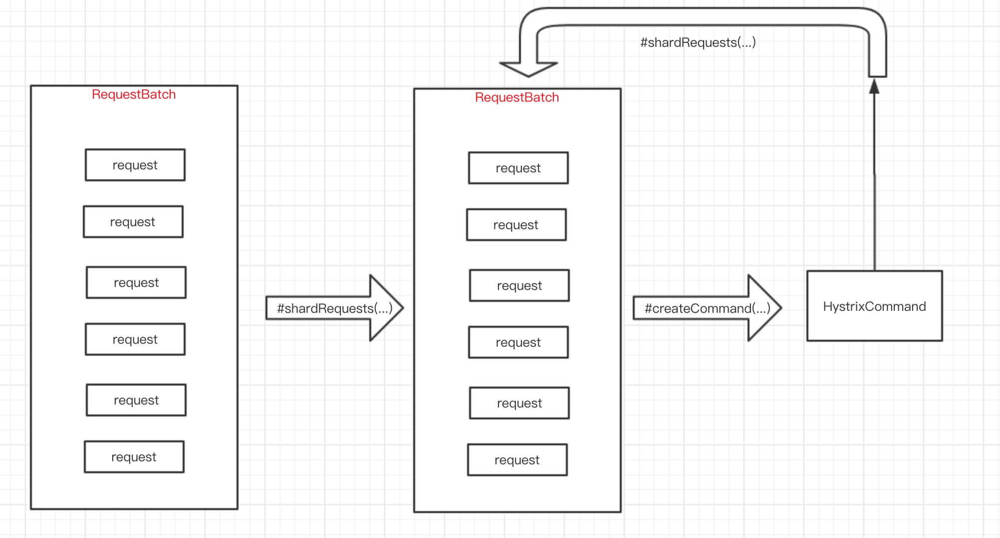
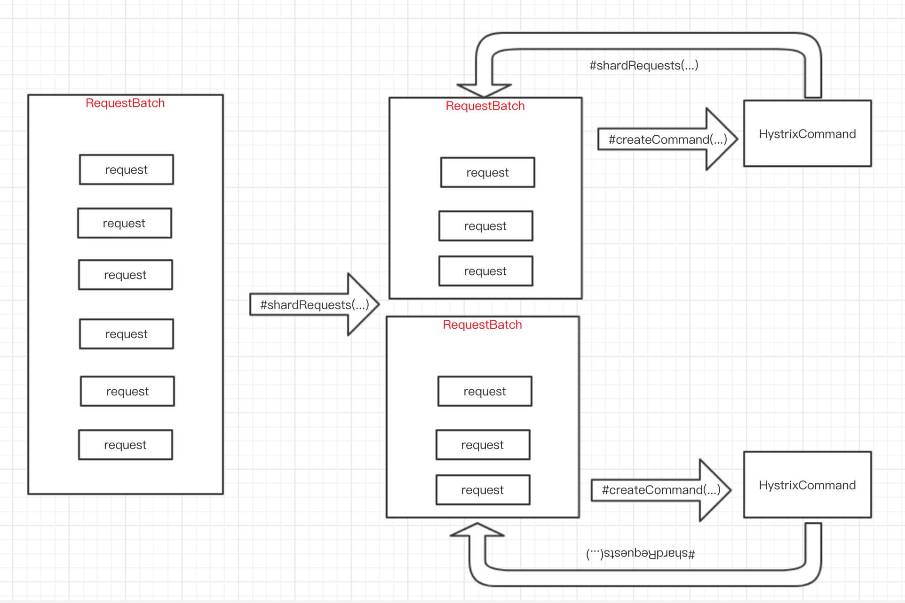
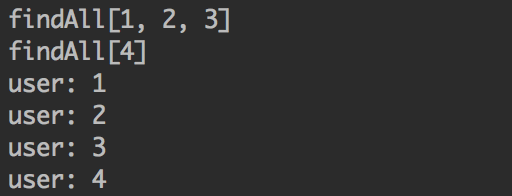

# 请求合并

你可以在`HystrixCommand`之前放置一个`请求合并器`（`HystrixCollapser`为请求合并器的抽象父类），该合并器可以将多个发往同一个后端依赖服务的请求合并成一个。
<!-- more -->
下图展示了在两种场景下（未增加`请求合并器`和增加`请求合并器`），线程和网络连接数量（假设所有请求在很小的时间窗口，例如10ms，是`并发`的）：


## 为什么要使用请求合并

在并发执行`HystrixCommand`时，利用请求合并能减少线程和网络连接数量。通过使用`HystrixCollapser`，Hystrix能自动完成请求的合并，开发者不需要对现有代码做批量化的开发。

### 全局上下文（适用于所有Tomcat线程）

理想情况下，合并过程应该发生在系统全局层面，这样用户发起的，由Tomcat线程执行的所有请求都能被执行合并操作。

例如，有这样一个需求，用户需要获取电影评级，而这些数据需要系统请求依赖服务来获取，对依赖服务的请求使用`HystrixCommand`进行包装，并增加了请求合并的配置，这样，当同一个JVM中其他线程需要执行同样的请求时，Hystrix会将这个请求同其他同样的请求合并，只产生一个网络请求。

注意，合并器会传递一个`HystrixRequestContext`对象到合并的网络请求中，因此，下游系统需要支持批量化，以使请求合并发挥其高效的特点。

### 用户请求上下文（适用于单个Tomcat线程）

如果给`HystrixCommand`只配置成针对单个用户请求合并，则Hystrix只会在单个Tomcat线程（即请求）中进行请求合并。

例如，如果用户想加载300个视频对象的书签，请求合并后，Hystrix会将原本需要发起的300个网络请求合并到一个。

### 对象模型和代码复杂度

很多时候，当你创建一个对象模型，适用于对象的消费者逻辑，结果发现这个模型会导致生产者无法充分利用其拥有的资源。

例如，这里有一个包含300个视频对象的列表，需要遍历这个列表，并对每个对象调用`getSomeAttribute()`方法，这是一个显而易见的对象模型，但如果简单处理的话，可能会导致300次的网络请求（假设`getSomeAttribute()`方法内需要发出网络请求），每一个网络请求可能都会花上几毫秒（显然，这样方式非常容易拖慢系统）。

当然，你也可以要求用户在调用`getSomeAttribute()`之前，先判断一下哪些视频对象真正需要请求其属性。

或者，你可以将对象模型进行拆分，从一个地方获取视频列表，然后从另一个地方获取视频的属性。

但这些实现会导致API非常丑陋，且实现的对象模型无法满足用户使用模式。并且在企业级开发时，很容易因为开发者的疏忽导致错误或者不够高效，因为不同的开发者可能有不同的请求方式，这样一个地方的优化不足以保证在所有地方都会有优化。

通过将合并逻辑下沉到Hystrix层，不管你如何设计对象模型，或者以何种方式去调用依赖服务，又或者开发者是否意识到这些逻辑需不需要优化，这些都不需要考虑，因为Hystrix能统一处理。

`getSomeAttribute()`方法能放在它最适合的位置，并且能以最适合的方式被调用，Hystrix的请求合并器会自动将请求合并到合并时间窗口内。

### 请求合并带来的额外开销

请求合并会导致依赖服务的请求延迟增高（该延迟为等待请求的延迟），延迟的最大值为合并时间窗口大小。

若某个请求耗时的中位数是5ms，合并时间窗口为10ms，那么在最坏情况下（注：合并时间窗口开启时发起请求），请求需要消耗15ms才能完成。通常情况下，请求不太可能恰好在合并时间窗口开启时发起，因此，请求合并带来的额外开销应该是合并时间窗口一个半，在此例中是5ms。

请求合并带来的额外开销是否值得，取决于将要执行的命令，高延迟的命令相比较而言不会有太大的影响。同时，缓存Key的选择也决定了在一个合并时间窗口内能`并发`执行的命令数量：如果一个合并时间窗口内只有1-2个请求，将请求合并显然不是明智的选择。事实上，如果单线程循环调用同一个依赖服务的情况下，如果将请求合并，会导致整个循环成为系统性能的瓶颈，因为每一个请求都需要等待10ms的合并时间周期。

然而，如果一个命令具有高并发度，并且能批量处理多个，甚至上百个的话，请求合并带来的性能开销会因为吞吐量的极大提升而基本可以忽略，因为Hystrix会减少这些请求所需的线程和网络连接数量。

**请求合并器的执行流程**


1. 提交单个命令请求到请求队列（`RequestQueue`）
2. 定时任务（`TimerTask`）固定周期从请求队列获取多个命令执行，合并执行。

# HystrixCollapser

`com.netflix.hystrix.HystrixCollapser`是命令合并器抽象父类。

`com.netflix.hystrix.HystrixObservableCollapser`，另一种命令合并器抽象父类，本文暂不解析。

查看它的属性：

```java
private final RequestCollapserFactory<BatchReturnType, ResponseType, RequestArgumentType> collapserFactory;
private final HystrixRequestCache requestCache;
private final HystrixCollapserBridge<BatchReturnType, ResponseType, RequestArgumentType> collapserInstanceWrapper;
private final HystrixCollapserMetrics metrics;
```

- BatchReturnType泛型，多个命令合并执行返回结果类型
- ResponseType泛型，单个命令执行返回结果类型
- RequestArgumentType泛型，单个命令参数类型
- collapserFactory属性，RequestCollapser工厂，在RequestCollapserFactory详细解析。
- requestCache属性
- collapserInstanceWrapper属性，命令合并器包装器。

    HystrixCollapserBridge接口为RequestBatch透明调用HystrixCollapser或HystrixObservableCollapser的方法不同的实现

- metrics属性

# 执行命令方式

在[Hystrix(二)——命令执行方式][1]中，我们已经看到HystrixCommand提供的四种执行命令方式

HystrixCollapser类似于HystrixCommand，也提供了四种相同的执行命令方式，其中如下三种方式代码基本相同，我们就不重复啰嗦了：

- observe()
- queue()
- execute()

下面一起来看看`toObservable()`方法的实现。

```java
public Observable<ResponseType> toObservable() {
    // when we callback with the data we want to do the work
    // on a separate thread than the one giving us the callback
    return toObservable(Schedulers.computation());
}

public Observable<ResponseType> toObservable(Scheduler observeOn) {
    return Observable.defer(new Func0<Observable<ResponseType>>() {
        @Override
        public Observable<ResponseType> call() {
            // 缓存开关
            final boolean isRequestCacheEnabled = getProperties().requestCacheEnabled().get();
            // 缓存KEY
            final String cacheKey = getCacheKey();
            // 优先从缓存中获取
            /* try from cache first */
            if (isRequestCacheEnabled) {
                HystrixCachedObservable<ResponseType> fromCache = requestCache.get(cacheKey);
                if (fromCache != null) {
                    metrics.markResponseFromCache();
                    return fromCache.toObservable();
                }
            }
            // 获得RequestCollapser
            RequestCollapser<BatchReturnType, ResponseType, RequestArgumentType> requestCollapser = collapserFactory.getRequestCollapser(collapserInstanceWrapper);
            // 提交命令请求
            Observable<ResponseType> response = requestCollapser.submitRequest(getRequestArgument());
            // 获得缓存Observable
            if (isRequestCacheEnabled && cacheKey != null) {
                HystrixCachedObservable<ResponseType> toCache = HystrixCachedObservable.from(response);
                HystrixCachedObservable<ResponseType> fromCache = requestCache.putIfAbsent(cacheKey, toCache);
                if (fromCache == null) {
                    return toCache.toObservable();
                } else {
                    toCache.unsubscribe();
                    return fromCache.toObservable();
                }
            }
            // 获得非缓存Observable
            return response;
        }
    });
}
```

1. 获取缓存开关和缓存KEY
2. 尝试从缓存中获取，如果缓存命中则直接返回缓存中保存的Observable
3. 调用`RequestCollapserFactory.getRequestCollapser`获取`RequestCollapser`
4. 提交单个命令请求到请求队列（RequestQueue），即命令合并执行整体流程第一步
5. 如果缓存开启且缓存KEY不为null，将命令请求的Observable保存到缓存中，然后返回缓存Observable；否则返回非缓存Observable

# 核心方法

## getRequestArgument

获得单个命令参数

```java
protected abstract HystrixCommand<BatchReturnType> createCommand(Collection<CollapsedRequest<ResponseType, RequestArgumentType>> requests);
```

## createCommand

将多个命令请求合并，创建一个HystrixCommand

```java
protected abstract HystrixCommand<BatchReturnType> createCommand(Collection<CollapsedRequest<ResponseType, RequestArgumentType>> requests);
```

## mapResponseToRequests

将一个HystrixCommand的执行结果，映射回对应的命令请求们

```java
protected abstract void mapResponseToRequests(BatchReturnType batchResponse, Collection<CollapsedRequest<ResponseType, RequestArgumentType>> requests);
```

## shardRequests

将多个命令请求分片成N个"多个命令请求"。默认实现下，不进行分片

```java
protected Collection<Collection<CollapsedRequest<ResponseType, RequestArgumentType>>> shardRequests(Collection<CollapsedRequest<ResponseType, RequestArgumentType>> requests) {
    return Collections.singletonList(requests);
}
```

在未重写`shardRequests`的情况下，整体方法流程如下：



在重写`shardRequests`的情况下，整体方法流程如下：



# RequestCollapserFactory

`com.netflix.hystrix.collapser.RequestCollapserFactory`是RequestCollapser工厂

```java
public class RequestCollapserFactory<BatchReturnType, ResponseType, RequestArgumentType> {
    private final CollapserTimer timer;
    private final HystrixCollapserKey collapserKey;
    private final HystrixCollapserProperties properties;
    private final HystrixConcurrencyStrategy concurrencyStrategy;
    private final Scope scope;
    
    public RequestCollapserFactory(HystrixCollapserKey collapserKey, Scope scope, CollapserTimer timer, HystrixCollapserProperties properties) {
         /* strategy: ConcurrencyStrategy */
        this.concurrencyStrategy = HystrixPlugins.getInstance().getConcurrencyStrategy();
        this.timer = timer;
        this.scope = scope;
        this.collapserKey = collapserKey;
        this.properties = properties;
    }
}
```

- `timer`属性，命令合并器的定时器
- `collapserKey`属性，命令合并器标识
- `properties`属性，命令合并器属性配置
- `concurrencyStrategy`属性，并发策略
- `scope`属性，命令请求作用域。

    目前有两种作用域：
    
    - REQUEST。请求上下文
    - GLOBAL。全局

`getRequestCollapser()`方法获得`RequestCollapser`。代码如下：

```java
public RequestCollapser<BatchReturnType, ResponseType, RequestArgumentType> getRequestCollapser(HystrixCollapserBridge<BatchReturnType, ResponseType, RequestArgumentType> commandCollapser) {
    if (Scopes.REQUEST == Scopes.valueOf(getScope().name())) {
        return getCollapserForUserRequest(commandCollapser);
    } else if (Scopes.GLOBAL == Scopes.valueOf(getScope().name())) {
        return getCollapserForGlobalScope(commandCollapser);
    } else {
        logger.warn("Invalid Scope: {}  Defaulting to REQUEST scope.", getScope());
        return getCollapserForUserRequest(commandCollapser);
    }
}
```

根据scope不同，调用两个不同方法，获得RequestCollapser。

## getCollapserForUserRequest

```java
private RequestCollapser<BatchReturnType, ResponseType, RequestArgumentType> getCollapserForUserRequest(HystrixCollapserBridge<BatchReturnType, ResponseType, RequestArgumentType> commandCollapser) {
    return (RequestCollapser<BatchReturnType, ResponseType, RequestArgumentType>) getRequestVariableForCommand(commandCollapser).get(concurrencyStrategy);
}
```

## getCollapserForGlobalScope

```java
private RequestCollapser<BatchReturnType, ResponseType, RequestArgumentType> getCollapserForGlobalScope(HystrixCollapserBridge<BatchReturnType, ResponseType, RequestArgumentType> commandCollapser) {
    RequestCollapser<?, ?, ?> collapser = globalScopedCollapsers.get(collapserKey.name());
    if (collapser != null) {
        return (RequestCollapser<BatchReturnType, ResponseType, RequestArgumentType>) collapser;
    }
    // create new collapser using 'this' first instance as the one that will get cached for future executions ('this' is stateless so we can do that)
    RequestCollapser<BatchReturnType, ResponseType, RequestArgumentType> newCollapser = new RequestCollapser<BatchReturnType, ResponseType, RequestArgumentType>(commandCollapser, properties, timer, concurrencyStrategy);
    RequestCollapser<?, ?, ?> existing = globalScopedCollapsers.putIfAbsent(collapserKey.name(), newCollapser);
    if (existing == null) {
        // we won
        return newCollapser;
    } else {
        // we lost ... another thread beat us
        // shutdown the one we created but didn't get stored
        newCollapser.shutdown();
        // return the existing one
        return (RequestCollapser<BatchReturnType, ResponseType, RequestArgumentType>) existing;
    }
}
```

# RequestCollapser

`com.netflix.hystrix.collapser.RequestCollapser`是命令请求合并器。主要用于：

- 提交单个命令请求到请求队列（RequestQueue）
- 接收来自定时任务提交的多个命令，合并执行

RequestCollapser构造方法如下：

```java
public class RequestCollapser<BatchReturnType, ResponseType, RequestArgumentType> {
    private final HystrixCollapserBridge<BatchReturnType, ResponseType, RequestArgumentType> commandCollapser;
    // batch can be null once shutdown
    private final AtomicReference<RequestBatch<BatchReturnType, ResponseType, RequestArgumentType>> batch = new AtomicReference<RequestBatch<BatchReturnType, ResponseType, RequestArgumentType>>();
    private final AtomicReference<Reference<TimerListener>> timerListenerReference = new AtomicReference<Reference<TimerListener>>();
    private final AtomicBoolean timerListenerRegistered = new AtomicBoolean();
    private final CollapserTimer timer;
    private final HystrixCollapserProperties properties;
    private final HystrixConcurrencyStrategy concurrencyStrategy;
    
    RequestCollapser(HystrixCollapserBridge<BatchReturnType, ResponseType, RequestArgumentType> commandCollapser, HystrixCollapserProperties properties, CollapserTimer timer, HystrixConcurrencyStrategy concurrencyStrategy) {
        this.commandCollapser = commandCollapser; // the command with implementation of abstract methods we need 
        this.concurrencyStrategy = concurrencyStrategy;
        this.properties = properties;
        this.timer = timer;
        batch.set(new RequestBatch<BatchReturnType, ResponseType, RequestArgumentType>(properties, commandCollapser, properties.maxRequestsInBatch().get()));
    }
}
```

- `commandCollapser`属性，命令合并器包装器
- `batch`属性，RequestBatch，即本文说的请求队列
- `timerListenerReference`属性，注册在命令合并器的定时器的监听器。每个RequestCollapser独有一个监听器。该监听器（实际上会使用该监听器创建定时任务）固定周期从请求队列获取多个命令执行，提交RequestCollapser合并执行
- `timerListenerRegistered`属性，表示`timerListenerReference`是否已经注册
- `timer`属性，命令合并器属性配置
- `properties`属性，命令合并器属性配置
- `concurrencyStrategy`属性，并发策略

## RequestBatch

`com.netflix.hystrix.collapser.RequestBatch`是命令请求队列。提供如下功能：

- 命令请求的添加
- 命令请求的移除
- 命令请求的批量执行

RequestBatch构造方法如下：

```java
public class RequestBatch<BatchReturnType, ResponseType, RequestArgumentType> {
    private final HystrixCollapserBridge<BatchReturnType, ResponseType, RequestArgumentType> commandCollapser;
    private final int maxBatchSize;
    private final AtomicBoolean batchStarted = new AtomicBoolean();

    private final ConcurrentMap<RequestArgumentType, CollapsedRequest<ResponseType, RequestArgumentType>> argumentMap =
            new ConcurrentHashMap<RequestArgumentType, CollapsedRequest<ResponseType, RequestArgumentType>>();
    private final HystrixCollapserProperties properties;

    private ReentrantReadWriteLock batchLock = new ReentrantReadWriteLock();
    
    public RequestBatch(HystrixCollapserProperties properties, HystrixCollapserBridge<BatchReturnType, ResponseType, RequestArgumentType> commandCollapser, int maxBatchSize) {
        this.properties = properties;
        this.commandCollapser = commandCollapser;
        this.maxBatchSize = maxBatchSize;
    }
}
```

- `commandCollapser`属性，命令合并器包装器
- `maxBatchSize`属性，队列最大长度
- `batchStarted`属性，执行是否开始
- `argumentMap`属性，命令请求参数映射（队列）
- `properties`属性，命令合并器属性配置
- `batchLock`属性，`argumentMap`操作的读写锁

## submitRequest(arg)

在`toObservable()`方法里，调用`submitRequest(arg)`方法，提交单个命令请求到RequestBatch。

```java
public Observable<ResponseType> submitRequest(final RequestArgumentType arg) {
    /*
     * We only want the timer ticking if there are actually things to do so we register it the first time something is added.
     */
    if (!timerListenerRegistered.get() && timerListenerRegistered.compareAndSet(false, true)) {
        /* schedule the collapsing task to be executed every x milliseconds (x defined inside CollapsedTask) */
        timerListenerReference.set(timer.addListener(new CollapsedTask()));
    }

    // loop until succeed (compare-and-set spin-loop)
    while (true) {
        // 获得RequestBatch
        final RequestBatch<BatchReturnType, ResponseType, RequestArgumentType> b = batch.get();
        if (b == null) {
            return Observable.error(new IllegalStateException("Submitting requests after collapser is shutdown"));
        }
        // 添加到RequestBatch
        final Observable<ResponseType> response;
        if (arg != null) {
            response = b.offer(arg);
        } else {
            response = b.offer( (RequestArgumentType) NULL_SENTINEL);
        }
        // it will always get an Observable unless we hit the max batch size
        if (response != null) {
            // 添加成功，返回Observable
            return response;
        } else {
            // 添加失败，执行RequestBatch，并创建新的RequestBatch
            // this batch can't accept requests so create a new one and set it if another thread doesn't beat us
            createNewBatchAndExecutePreviousIfNeeded(b);
        }
    }
}
```

1. 当RequestCollapser的监听任务（CollapsedTask）还未创建，进行初始化
2. 死循环，直到提交单个命令请求到RequestBatch成功

    1. 获得RequestBatch。从目前代码来看，除非RequestCollapser被`shutdown()`后才会出现为`null`的情况
    2. 调用`RequestBatch.offer`方法，提交单个命令请求到RequestBatch，并获得Observable。这里对`arg == null`做了特殊处理，因为`RequestBatch.argumentMap`是ConcurrentHashMap，不允许值为null。
    3. 添加成功，返回Observable
    4. 添加失败，执行当前RequestBatch的多个命令合并执行，并创建新的RequestBatch

## RequestBatch.offer

`RequestBatch.offer`方法提交单个命令请求到RequestBatch，代码如下：

```java
public Observable<ResponseType> offer(RequestArgumentType arg) {
    // 执行已经开始，添加失败
    /* short-cut - if the batch is started we reject the offer */
    if (batchStarted.get()) {
        return null;
    }

    /*
     * The 'read' just means non-exclusive even though we are writing.
     */
    if (batchLock.readLock().tryLock()) {
        try {
            // 执行已经开始，添加失败
            /* double-check now that we have the lock - if the batch is started we reject the offer */
            if (batchStarted.get()) {
                return null;
            }
            // 超过队列最大长度，添加失败
            if (argumentMap.size() >= maxBatchSize) {
                return null;
            } else {
                // 创建CollapsedRequestSubject
                CollapsedRequestSubject<ResponseType, RequestArgumentType> collapsedRequest =
                        new CollapsedRequestSubject<ResponseType, RequestArgumentType>(arg, this);
                final CollapsedRequestSubject<ResponseType, RequestArgumentType> existing = (CollapsedRequestSubject<ResponseType, RequestArgumentType>) argumentMap.putIfAbsent(arg, collapsedRequest);
                /**
                 * If the argument already exists in the batch, then there are 2 options:
                 * A) If request caching is ON (the default): only keep 1 argument in the batch and let all responses
                 * be hooked up to that argument
                 * B) If request caching is OFF: return an error to all duplicate argument requests
                 *
                 * This maintains the invariant that each batch has no duplicate arguments.  This prevents the impossible
                 * logic (in a user-provided mapResponseToRequests for HystrixCollapser and the internals of HystrixObservableCollapser)
                 * of trying to figure out which argument of a set of duplicates should get attached to a response.
                 *
                 * See https://github.com/Netflix/Hystrix/pull/1176 for further discussion.
                 */
                if (existing != null) {
                    boolean requestCachingEnabled = properties.requestCacheEnabled().get();
                    if (requestCachingEnabled) {
                        return existing.toObservable();
                    } else {
                        return Observable.error(new IllegalArgumentException("Duplicate argument in collapser batch : [" + arg + "]  This is not supported.  Please turn request-caching on for HystrixCollapser:" + commandCollapser.getCollapserKey().name() + " or prevent duplicates from making it into the batch!"));
                    }
                } else {
                    return collapsedRequest.toObservable();
                }

            }
        } finally {
            batchLock.readLock().unlock();
        }
    } else {
        return null;
    }
}
```

1. 获取`batchStarted`，检查是否已经开始执行。如果已经开始执行，则添加失败。在`RequestBatch.executeBatchIfNotAlreadyStarted`方法的开头，优先使用CAS将`batchStarted`设置为`true`
2. 获得**读锁**
3. `double-check`，如果执行已经开始，则添加失败。在`RequestBatch.executeBatchIfNotAlreadyStarted`方法的开头，优先使用CAS将`batchStarted`设置为`true`，再获取写锁，所以会出现该情况。
4. 超过队列最大长度，则添加失败
5. 创建`com.netflix.hystrix.collapser.CollapsedRequestSubject`，并将它添加到队列（`argumentMap`）

    CollapsedRequestSubject实现`com.netflix.hystrix.HystrixCollapser.CollapsedRequest`接口，定义了批量命令执行的请求，不仅限于获得请求参数（`getArgument()`方法），也包括对批量命令执行结束后，每个请求的结果设置（`setResponse`、`emitResponse`、`setException`、`setComplete`方法）

6. 返回Observable

    - 当`argumentMap`已经存在`arg`对应的Observable时，必须开启缓存（`HystrixCollapserProperties.requestCachingEnabled = true`）功能。原因是，如果存在相同的`arg`，并且未开启缓存，且执行的是`collapsedRequest.toObservable`，那么相同的`arg`将有多个Observable执行命令，此时`HystrixCollapserBridge.mapResponseToRequests`方法无法将执行结果（Response）赋值到`arg`对应的命令请求（CollapsedRequestSubject）
    - 回头看`HystrixCollapser.toObservable`方法，也有缓存的功能，是不是重复了呢？`argumentMap`针对的是`ReuqestBatch`级的缓存，HystrixCollapser:RequestCollapser:RequestBatch是`1:1:N`的关系，通过`HystrixCollapser.toObservable`对缓存的处理逻辑，保证RequestBatch切换后，依然有缓存

### CollapsedRequestSubject

`CollapsedRequestSubject`的构造方法如下：

```java
class CollapsedRequestSubject<T, R> implements CollapsedRequest<T, R> {
    //参数
    private final R argument;
    // 结果是否设置
    private AtomicBoolean valueSet = new AtomicBoolean(false);
    // 可回放的ReplaySubject
    private final ReplaySubject<T> subject = ReplaySubject.create();
    // 带订阅数量的ReplaySubject
    private final Observable<T> subjectWithAccounting;
    // 订阅数量
    private volatile int outstandingSubscriptions = 0;
    
    public CollapsedRequestSubject(final R arg, final RequestBatch<?, T, R> containingBatch) {
        // 设置argument
        if (arg == RequestCollapser.NULL_SENTINEL) {
            this.argument = null;
        } else {
            this.argument = arg;
        }
        // 设置带订阅数量的ReplaySubject
        this.subjectWithAccounting = subject
                .doOnSubscribe(new Action0() {
                    @Override
                    public void call() {
                        outstandingSubscriptions++;
                    }
                })
                .doOnUnsubscribe(new Action0() {
                    @Override
                    public void call() {
                        outstandingSubscriptions--;
                        if (outstandingSubscriptions == 0) {
                            containingBatch.remove(arg);
                        }
                    }
                });
    }
}
```

- `argument`属性，单个命令请求参数
- `valueSet`属性，结果(Response)是否设置，通过`setResponse`/`emitResponse`方法设置
- `subject`属性，可回放执行结果的Subject。此处使用ReplaySubject的主要目的，当HystrixCollapser开启缓存功能时，通过回放执行结果。在`HystrixCachedObservable`也有相同的实现。另外，这里有一点要注意下，ReplaySubject并没有向任何Observable订阅结果，而是通过`setResponse`/`emitResponse`方法这是结果
- `outstandingSubscriptions`属性，订阅数量
- `subjectWithAccounting`属性，带订阅数量的ReplaySubject。调用`RequestBatch.remove`方法，移除单个命令请求

### RequestBatch.remove

```java
void remove(RequestArgumentType arg) {
    if (batchStarted.get()) {
        //nothing we can do
        return;
    }

    if (batchLock.readLock().tryLock()) {
        try {
            /* double-check now that we have the lock - if the batch is started, deleting is useless */
            if (batchStarted.get()) {
                return;
            }

            argumentMap.remove(arg);
        } finally {
            batchLock.readLock().unlock();
        }
    }
}
```

当RequestBatch开始执行，不允许移除单个命令请求

## createNewBatchAndExecutePreviousIfNeeded

```java
private void createNewBatchAndExecutePreviousIfNeeded(RequestBatch<BatchReturnType, ResponseType, RequestArgumentType> previousBatch) {
    if (previousBatch == null) {
        throw new IllegalStateException("Trying to start null batch which means it was shutdown already.");
    }
    if (batch.compareAndSet(previousBatch, new RequestBatch<BatchReturnType, ResponseType, RequestArgumentType>(properties, commandCollapser, properties.maxRequestsInBatch().get()))) {
        // this thread won so trigger the previous batch
        previousBatch.executeBatchIfNotAlreadyStarted();
    }
}
```

1. 通过CAS修改`batch`，保证并发情况下的线程安全。同时注意，此处也新建了RequestBatch，替换到老的RequestBatch
2. 使用老的RequestBatch，调用`executeBatchIfNotAlreadyStarted`方法，命令合并执行

```java
public void executeBatchIfNotAlreadyStarted() {
    /*
     * - check that we only execute once since there's multiple paths to do so (timer, waiting thread or max batch size hit)
     * - close the gate so 'offer' can no longer be invoked and we turn those threads away so they create a new batch
     */
    // 设置执行已经开始
    if (batchStarted.compareAndSet(false, true)) {
        /* wait for 'offer'/'remove' threads to finish before executing the batch so 'requests' is complete */
        // 获得写锁
        batchLock.writeLock().lock();

        try {
            // 将多个命令请求分片成N个多个命令请求
            // shard batches
            Collection<Collection<CollapsedRequest<ResponseType, RequestArgumentType>>> shards = commandCollapser.shardRequests(argumentMap.values());
            // for each shard execute its requests 
            for (final Collection<CollapsedRequest<ResponseType, RequestArgumentType>> shardRequests : shards) {
                try {
                    // 将多个命令请求合并，创建一个HystrixCommand
                    // create a new command to handle this batch of requests
                    Observable<BatchReturnType> o = commandCollapser.createObservableCommand(shardRequests);
                    // 将一个HystrixCommand的执行结果，映射回对应的命令请求们
                    commandCollapser.mapResponseToRequests(o, shardRequests).doOnError(new Action1<Throwable>() {

                        /**
                         * This handles failed completions
                         */
                        @Override
                        public void call(Throwable e) {
                            // handle Throwable in case anything is thrown so we don't block Observers waiting for onError/onCompleted
                            Exception ee;
                            if (e instanceof Exception) {
                                ee = (Exception) e;
                            } else {
                                ee = new RuntimeException("Throwable caught while executing batch and mapping responses.", e);
                            }
                            logger.debug("Exception mapping responses to requests.", e);
                            // if a failure occurs we want to pass that exception to all of the Futures that we've returned
                            for (CollapsedRequest<ResponseType, RequestArgumentType> request : argumentMap.values()) {
                                try {
                                    ((CollapsedRequestSubject<ResponseType, RequestArgumentType>) request).setExceptionIfResponseNotReceived(ee);
                                } catch (IllegalStateException e2) {
                                    // if we have partial responses set in mapResponseToRequests
                                    // then we may get IllegalStateException as we loop over them
                                    // so we'll log but continue to the rest
                                    logger.error("Partial success of 'mapResponseToRequests' resulted in IllegalStateException while setting Exception. Continuing ... ", e2);
                                }
                            }
                        }

                    }).doOnCompleted(new Action0() {

                        /**
                         * This handles successful completions
                         */
                        @Override
                        public void call() {
                            // check that all requests had setResponse or setException invoked in case 'mapResponseToRequests' was implemented poorly
                            Exception e = null;
                            for (CollapsedRequest<ResponseType, RequestArgumentType> request : shardRequests) {
                                try {
                                   e = ((CollapsedRequestSubject<ResponseType, RequestArgumentType>) request).setExceptionIfResponseNotReceived(e,"No response set by " + commandCollapser.getCollapserKey().name() + " 'mapResponseToRequests' implementation.");
                                } catch (IllegalStateException e2) {
                                    logger.debug("Partial success of 'mapResponseToRequests' resulted in IllegalStateException while setting 'No response set' Exception. Continuing ... ", e2);
                                }
                            }
                        }

                    }).subscribe();
                    
                } catch (Exception e) {
                    logger.error("Exception while creating and queueing command with batch.", e);
                    // if a failure occurs we want to pass that exception to all of the Futures that we've returned
                    for (CollapsedRequest<ResponseType, RequestArgumentType> request : shardRequests) {
                        try {
                            request.setException(e);
                        } catch (IllegalStateException e2) {
                            logger.debug("Failed trying to setException on CollapsedRequest", e2);
                        }
                    }
                }
            }

        } catch (Exception e) {
            logger.error("Exception while sharding requests.", e);
            // same error handling as we do around the shards, but this is a wider net in case the shardRequest method fails
            for (CollapsedRequest<ResponseType, RequestArgumentType> request : argumentMap.values()) {
                try {
                    request.setException(e);
                } catch (IllegalStateException e2) {
                    logger.debug("Failed trying to setException on CollapsedRequest", e2);
                }
            }
        } finally {
            batchLock.writeLock().unlock();
        }
    }
}
```

1. 通过CAS修改`batchStarted`，保证并发情况下的线程安全
2. 获得写锁。等待调用`offer/remove`方法的线程执行完成，以保证命令合并执行时，不再有新的请求添加或移除
3. 调用`HystrixCollapserBridge.shardRequests`方法，将多个命令请求分片成N个`多个命令请求`。默认实现下，不进行分片
4. 循环N个`多个命令请求`
5. 调用`HystrixCollapserBridge.createObservableCommand`方法，将多个命令请求合并，创建一个HystrixCommand。
6. 调用`HystrixCollapserBridge.mapResponseToRequests`方法，将一个HystrixCommand的执行结果，映射回对应的命令请求们
7. 调用`Observable.doError`方法，当命令合并执行发生异常时，设置每个`CollapsedRequestSubject`的执行结果为异常
8. 调用`Observable.doOnCompleted`方法，当命令合并执行完成时，检查每个`CollapsedRequestSubject`是否都有返回结果。一般情况下，是用户实现`HystrixCollapser.mapResponseToRequests`方法存在bug。另外，如果不设置，将导致无结果的单个命令请求无线阻塞。
9. 调用`Observable.subscribe`方法，触发HystrixCommand执行
10. 如果前面的执行有异常，设置每个`CollapsedRequestSubject`的执行结果为异常
11. 释放写锁

# CollapserTimer

`com.netflix.hystrix.collapser.CollapserTimer`是命令合并器的定时器接口，定义了提交定时监听器，生成定时任务的接口方法

```java
public interface CollapserTimer {
    public Reference<TimerListener> addListener(TimerListener collapseTask);
}
```

## RealCollapserTimer

`com.netflix.hystrix.collapser.RealCollapserTimer`，命令合并器的定时器实现类，代码如下：

```java
public class RealCollapserTimer implements CollapserTimer {
    /* single global timer that all collapsers will schedule their tasks on */
    private final static HystrixTimer timer = HystrixTimer.getInstance();

    @Override
    public Reference<TimerListener> addListener(TimerListener collapseTask) {
        return timer.addTimerListener(collapseTask);
    }

}
```

实际上使用的是`HystrixTimer`提供的单例

## CollapsedTask

`com.netflix.hystrix.collapser.RequestCollapser.CollapsedTask`，定时任务，固定周期（可配，默认`HystrixCollapserProperties.timerDelayInMilliseconds = 10ms`）轮询其对应的一个RequestCollapser当前RequestBatch。若有命令需要执行，则提交RequestCollapser合并执行。

代码如下：

```java
private class CollapsedTask implements TimerListener {
    final Callable<Void> callableWithContextOfParent;

    CollapsedTask() {
        // this gets executed from the context of a HystrixCommand parent thread (such as a Tomcat thread)
        // so we create the callable now where we can capture the thread context
        callableWithContextOfParent = new HystrixContextCallable<Void>(concurrencyStrategy, new Callable<Void>() {
            // the wrapCallable call allows a strategy to capture thread-context if desired

            @Override
            public Void call() throws Exception {
                try {
                    // we fetch current so that when multiple threads race
                    // we can do compareAndSet with the expected/new to ensure only one happens
                    RequestBatch<BatchReturnType, ResponseType, RequestArgumentType> currentBatch = batch.get();
                    // 1) it can be null if it got shutdown
                    // 2) we don't execute this batch if it has no requests and let it wait until next tick to be executed
                    if (currentBatch != null && currentBatch.getSize() > 0) {
                        // do execution within context of wrapped Callable
                        createNewBatchAndExecutePreviousIfNeeded(currentBatch);
                    }
                } catch (Throwable t) {
                    logger.error("Error occurred trying to execute the batch.", t);
                    t.printStackTrace();
                    // ignore error so we don't kill the Timer mainLoop and prevent further items from being scheduled
                }
                return null;
            }

        });
    }

    @Override
    public void tick() {
        try {
            callableWithContextOfParent.call();
        } catch (Exception e) {
            logger.error("Error occurred trying to execute callable inside CollapsedTask from Timer.", e);
            e.printStackTrace();
        }
    }

    @Override
    public int getIntervalTimeInMilliseconds() {
        return properties.timerDelayInMilliseconds().get();
    }

}
```

可以看到，`CollapsedTask`会以`IntervalTimeInMilliseconds`的时间间隔为周期调用`tick()`方法，`tick()`方法会调用`callableWithContextOfParent.call()`，在其中调用`createNewBatchAndExecutePreviousIfNeeded`来执行命令合并的请求

# 请求合并的使用

前面我们学习了Hystrix请求合并的原理，现在来看看如何在Hystrix中使用请求合并功能。

首先我们在eureka-client中增加一个获取批量信息的接口：

```java
@GetMapping("/users")
public List<String> getUsers(@RequestParam("ids") String ids) {
    System.out.println("getUsers: " + ids);
    return Arrays.stream(ids.split(",")).map(id -> "user: " + id).collect(Collectors.toList());
}
```

简单起见，这个接口仅仅返回了一个里面保存`user: {id}`的列表。

## 继承HystrixCollapser实现请求合并

### HystrixCollapser的实现类

```java
public class UserCommandCollapser extends HystrixCollapser<List<String>, String, String> {
    private UserService userService;
    private final String userId;

    public UserCommandCollapser(UserService userService, String userId) {
        super(Setter.withCollapserKey(HystrixCollapserKey.Factory.asKey("UserCommandCollapser"))
            .andCollapserPropertiesDefaults(HystrixCollapserProperties.Setter().withTimerDelayInMilliseconds(100)));
        this.userService = userService;
        this.userId = userId;
    }

    /**
     * 获取请求参数
     * @return
     */
    @Override
    public String getRequestArgument() {
        return userId;
    }

    /**
     * 合并请求产生批量命令的具体实现
     * @param collapsedRequests
     * @return
     */
    @Override
    protected HystrixCommand<List<String>> createCommand(Collection<CollapsedRequest<String, String>> collapsedRequests) {
        List<String> userIds = new ArrayList<>(collapsedRequests.size());
        userIds.addAll(collapsedRequests.stream().map(CollapsedRequest::getArgument).collect(Collectors.toList()));
        return new UserBatchCommand(userService, userIds);
    }

    /**
     * 批量命令结果返回后的处理，需要实现将批量结果拆分并传递给合并前的各原子请求命令的逻辑中
     * @param batchResponse
     * @param collapsedRequests
     */
    @Override
    protected void mapResponseToRequests(List<String> batchResponse, Collection<CollapsedRequest<String, String>> collapsedRequests) {
        int count = 0;
        for (CollapsedRequest<String, String> collapsedRequest : collapsedRequests) {
            String user = batchResponse.get(count++);
            collapsedRequest.setResponse(user);
        }
    }
}
```

### UserService批量查询接口

只需要实现批量查询接口，单个查询也是走批量查询

```java
@Service
public class UserService {
    @LoadBalanced
    @Autowired
    private RestTemplate restTemplate;

    public List<String> findAll(List<String> ids) {
        System.out.println("findAll" + ids);
        return restTemplate.getForObject("http://eureka-client/users?ids={1}", List.class, StringUtils.join(ids, ","));
    }
}
```

### UserBatchCommand批量查询命令

```java
public class UserBatchCommand extends HystrixCommand<List<String>> {
    private UserService userService;
    private List<String> ids;

    public UserBatchCommand(UserService userService, List<String> ids) {
        super(Setter.withGroupKey(HystrixCommandGroupKey.Factory.asKey("UserBatchCommand"))
            .andCommandKey(HystrixCommandKey.Factory.asKey("findAll")));
        this.userService = userService;
        this.ids = ids;
    }

    @Override
    protected List<String> run() throws Exception {
        if (ids != null && !ids.isEmpty()) {
            return userService.findAll(ids);
        }
        return new ArrayList<>();
    }
}
```

### 测试

我们在服务消费者端创建访问接口，来测试合并请求：

```java
@Autowired
    UserService userService;

@GetMapping("/users")
public void users() throws ExecutionException, InterruptedException {
    HystrixRequestContext context = HystrixRequestContext.initializeContext();
    UserCommandCollapser userCommandCollapser1 = new UserCommandCollapser(userService, "1");
    UserCommandCollapser userCommandCollapser2 = new UserCommandCollapser(userService, "2");
    UserCommandCollapser userCommandCollapser3 = new UserCommandCollapser(userService, "3");
    UserCommandCollapser userCommandCollapser4 = new UserCommandCollapser(userService, "4");

    Future<String> f1 = userCommandCollapser1.queue();
    Future<String> f2 = userCommandCollapser2.queue();
    Future<String> f3 = userCommandCollapser3.queue();
    Thread.sleep(300);
    Future<String> f4 = userCommandCollapser4.queue();

    String s1 = f1.get();
    String s2 = f2.get();
    String s3 = f3.get();
    String s4 = f4.get();

    System.out.println(s1);
    System.out.println(s2);
    System.out.println(s3);
    System.out.println(s4);
    context.close();
}
```

1. 首先要初始化`HystrixRequestContext`
2. 创建`UserCommandCollapser`类的实例来发起请求，先发送3个请求，然后睡眠300毫秒，再发起1个请求，这样，前3个请求就会被合并为1个请求，第4个请求因为间隔的时间比较久，所以不会被合并，而是单独创建一个线程去处理。


服务提供方的输出结果：


服务消费方的输出结果：



可以看到，前三个请求被合并成一个请求，第四个请求被单独处理


## 使用注解方式来实现请求合并

上面这种请求合并方式写起来稍微有点麻烦，我们可以使用注解来更优雅地实现这一功能。

首先在UserService中添加两个方法，如下：

```java
@Service
class UserService {
    @Autowired
    RestTemplate restTemplate;

    @HystrixCollapser(batchMethod = "findAll"
            , scope = com.netflix.hystrix.HystrixCollapser.Scope.REQUEST
            , collapserProperties = {@HystrixProperty(name = "timerDelayInMilliseconds", value = "300")}
            )
    public Future<String> find(String id) {
        return null;
    }

    @HystrixCommand
    public List<String> findAll(List<String> ids) {
        System.out.println("findAll" + ids);
        return restTemplate.getForObject("http://eureka-client/users?ids={1}", List.class, StringUtils.join(ids, ","));
    }
}
```

在`find`方法上添加`@HystrixCollapser`注解实现请求合并。用`batchMethod`属性指定请求合并后的处理方法，`scope`属性指定命令合并的范围（`REQUEST`表示单个请求，`GLOBAL`表示全局请求），`collapserProperties`属性指定其他属性。

在UserService写好之后，直接调用就可以：

```java
@GetMapping("/users")
public void users() throws ExecutionException, InterruptedException {
    HystrixRequestContext context = HystrixRequestContext.initializeContext();
    Future<String> future1 = userService.find("1");
    Future<String> future2 = userService.find("2");
    Future<String> future3 = userService.find("3");
    Thread.sleep(30);
    Future<String> future4 = userService.find("4");

    System.out.println(future1.get());
    System.out.println(future2.get());
    System.out.println(future3.get());
    System.out.println(future4.get());
    context.close();
}
```

和前面一样，前三个请求会进行合并，第四个请求会单独执行。


[1]: /articles/Spring-Cloud/Hystrix(二)——命令执行方式.html

> http://youdang.github.io/2016/02/05/translate-hystrix-wiki-how-it-works/#%E8%AF%B7%E6%B1%82%E5%90%88%E5%B9%B6
> https://github.com/YunaiV/Blog/blob/master/Hystrix/2018_11_04_Hystrix%20%E6%BA%90%E7%A0%81%E8%A7%A3%E6%9E%90%20%E2%80%94%E2%80%94%20%E5%91%BD%E4%BB%A4%E5%90%88%E5%B9%B6%E6%89%A7%E8%A1%8C.md
> https://blog.csdn.net/u012702547/article/details/78213270
> https://segmentfault.com/a/1190000012256788
> https://blog.csdn.net/zhuchuangang/article/details/74663755


