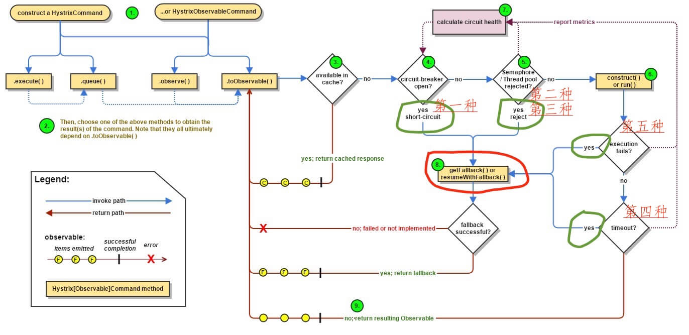

当命令执行失败时，Hystrix将会执行失败回退逻辑，失败的原因可能是：

1. `construct()`或`run`方法抛出异常
2. 当线路是开路，导致命令被短路时
3. 当命令对应的线程池或信号量被占满
4. 超时

<!-- more -->

Hystrix执行命令整体流程如下图：



- 红圈：Hystrix命令执行失败，执行回退逻辑。也就是大家经常在文章中看到的"服务降级"
- 绿圈：四种情况会触发失败回退逻辑(fallback)

    - 第一种：`short-circuit`。处理链路处于熔断的回退逻辑，在`handleShortCircuitViaFallback()`详细解析。
    - 第二种：`semaphore-rejection`。处理信号量获得失败的回退逻辑，在`handleSemaphoreRejectionViaFallback()`详细解析。
    - 第三种：`thread-pool-rejection`。处理线程池提交任务拒绝的回退逻辑，在`handleThreadPoolRejectionViaFallback()`详细解析。
    - 第四种：`execution-timeout`。处理命令执行超时的回退逻辑，在`handleTimeoutViaFallback()`详细解析。
    - 第五种：`execution-failure`。处理命令执行异常的回退逻辑，在`handleFailureViaFallback()`详细解析。
    - 第六种：`bad-request`。`HystrixBadRequestException`和`hystrix-javanica`子项目相关。

    另外，`handleXXXX()`方法，整体代码比较类似，最终都是调用`getFallbackOrThrowException()`方法，获得"回退逻辑"或者"异常Observable"。在`getFallbackOrThrowException`详细解析。

# handleFallback

在`AbstractCommand.executeCommandAndObserve()`方法中，首先调用`executeCommandWithSpecifiedIsolation`方法获取`命令执行Observable`，然后在Observable中加入回调函数：

```java
return execution.doOnNext(markEmits)
        .doOnCompleted(markOnCompleted)
        .onErrorResumeNext(handleFallback)
        .doOnEach(setRequestContext);
```

可以看到，通过调用`Observable.onErrorResumeNext`方法实现`命令执行Observable`执行异常时，返回`回退逻辑Observable`，执行失败回退逻辑。

`handleFallback`变量的代码如下：

```java
final Func1<Throwable, Observable<R>> handleFallback = new Func1<Throwable, Observable<R>>() {
    @Override
    public Observable<R> call(Throwable t) {
        circuitBreaker.markNonSuccess();
        // 标记executionResult执行异常
        Exception e = getExceptionFromThrowable(t);
        executionResult = executionResult.setExecutionException(e);
        // 返回回退逻辑Observable
        if (e instanceof RejectedExecutionException) {      // 线程池提交任务拒绝异常
            return handleThreadPoolRejectionViaFallback(e);
        } else if (t instanceof HystrixTimeoutException) {  // 执行命令超时异常
            return handleTimeoutViaFallback();
        } else if (t instanceof HystrixBadRequestException) {
            return handleBadRequestByEmittingError(e);
        } else {
            /*
             * Treat HystrixBadRequestException from ExecutionHook like a plain HystrixBadRequestException.
             */
            if (e instanceof HystrixBadRequestException) {
                eventNotifier.markEvent(HystrixEventType.BAD_REQUEST, commandKey);
                return Observable.error(e);
            }

            return handleFailureViaFallback(e);
        }
    }
};
```

1. 标记断路器尝试成功
2. 标记`executionResult`执行异常
3. `thread-pool-rejection`，处理线程池提交任务拒绝的回退逻辑，在`handleThreadPoolRejectionViaFallback`详细解析
4. `execution-timeout`，处理命令执行超时的回退逻辑，在`handleTimeoutViaFallback`详细解析
5. `bad-request`，和`hystrix-javanica`子项目相关
6. `execution-failure`处理命令执行异常的回退逻辑，在`handleFailureViaFallback`详细解析

# handleShortCircuitViaFallback

`AbstractCommand.applyHystrixSemantics`方法在执行过程中会调用`circuitBreaker.attemptExecution()`判断熔断器的状态。如果链路处于熔断状态，则调用`handleShortCircuitViaFallback()`方法处理回退逻辑。

```java
private Observable<R> handleShortCircuitViaFallback() {
    // record that we are returning a short-circuited fallback
    eventNotifier.markEvent(HystrixEventType.SHORT_CIRCUITED, commandKey);
    // short-circuit and go directly to fallback (or throw an exception if no fallback implemented)
    Exception shortCircuitException = new RuntimeException("Hystrix circuit short-circuited and is OPEN");
    executionResult = executionResult.setExecutionException(shortCircuitException);
    try {
        return getFallbackOrThrowException(this, HystrixEventType.SHORT_CIRCUITED, FailureType.SHORTCIRCUIT,
                "short-circuited", shortCircuitException);
    } catch (Exception e) {
        return Observable.error(e);
    }
}
```

1. 发送`SHORT_CIRCUITED`Hystrix事件
2. 标记executionResult执行异常
3. 调用`getFallbackOrThrowException`获得回退逻辑Observable，并返回

# handleSemaphoreRejectionViaFallback

`AbstractCommand.applyHystrixSemantics`方法在执行过程中会调用`executionSemaphore.tryAcquire()`尝试获取信号量。如果信号量获取失败调用`handleSemaphoreRejectionViaFallback`处理信号量获取失败的回退逻辑。

```java
private Observable<R> handleSemaphoreRejectionViaFallback() {
    Exception semaphoreRejectionException = new RuntimeException("could not acquire a semaphore for execution");
    executionResult = executionResult.setExecutionException(semaphoreRejectionException);
    eventNotifier.markEvent(HystrixEventType.SEMAPHORE_REJECTED, commandKey);
    logger.debug("HystrixCommand Execution Rejection by Semaphore."); // debug only since we're throwing the exception and someone higher will do something with it
    // retrieve a fallback or throw an exception if no fallback available
    return getFallbackOrThrowException(this, HystrixEventType.SEMAPHORE_REJECTED, FailureType.REJECTED_SEMAPHORE_EXECUTION,
            "could not acquire a semaphore for execution", semaphoreRejectionException);
}
```

1. 标记executionResult执行异常
2. 发送`SEMAPHORE_REJECTED`Hystrix事件
3. 调用`getFallbackOrThrowException`获得回退逻辑Observable，并返回

# handleThreadPoolRejectionViaFallback

`handleThreadPoolRejectionViaFallback`方法处理线程池提交任务拒绝的回退逻辑，前文提到在`handleFallback`方法中被调用。

```java
private Observable<R> handleThreadPoolRejectionViaFallback(Exception underlying) {
    eventNotifier.markEvent(HystrixEventType.THREAD_POOL_REJECTED, commandKey);
    threadPool.markThreadRejection();
    // use a fallback instead (or throw exception if not implemented)
    return getFallbackOrThrowException(this, HystrixEventType.THREAD_POOL_REJECTED, FailureType.REJECTED_THREAD_EXECUTION, "could not be queued for execution", underlying);
}
```

1. 发送`THREAD_POOL_REJECTED`Hystrix事件
2. 标记`threadPool`拒绝执行
3. 调用`getFallbackOrThrowException`获得回退逻辑Observable，并返回

# handleTimeoutViaFallback

`handleThreadPoolRejectionViaFallback`方法处理命令执行超时的回退逻辑，前文提到在`handleFallback`方法中被调用。

```java
private Observable<R> handleTimeoutViaFallback() {
    return getFallbackOrThrowException(this, HystrixEventType.TIMEOUT, FailureType.TIMEOUT, "timed-out", new TimeoutException());
}
```

1. 调用`getFallbackOrThrowException`获得回退逻辑Observable，并返回

# handleFailureViaFallback

`handleThreadPoolRejectionViaFallback`方法处理命令执行异常的回退逻辑，前文提到在`handleFallback`方法中被调用。

```java
private Observable<R> handleFailureViaFallback(Exception underlying) {
    /**
     * All other error handling
     */
    logger.debug("Error executing HystrixCommand.run(). Proceeding to fallback logic ...", underlying);

    // report failure
    eventNotifier.markEvent(HystrixEventType.FAILURE, commandKey);

    // record the exception
    executionResult = executionResult.setException(underlying);
    return getFallbackOrThrowException(this, HystrixEventType.FAILURE, FailureType.COMMAND_EXCEPTION, "failed", underlying);
}
```

1. 发送`FAILURE`Hystrix事件
2. 标记executionResult执行异常
3. 调用`getFallbackOrThrowException`获得回退逻辑Observable，并返回

# getFallbackOrThrowException

`getFallbackOrThrowException`获取`回退逻辑Observable`或者`异常Observabel`。

```java
private Observable<R> getFallbackOrThrowException(final AbstractCommand<R> _cmd, final HystrixEventType eventType, final FailureType failureType, final String message, final Exception originalException) {
    // 记录HystrixRequestContext
    final HystrixRequestContext requestContext = HystrixRequestContext.getContextForCurrentThread();
    // 标记executionResult，添加事件
    long latency = System.currentTimeMillis() - executionResult.getStartTimestamp();
    // record the executionResult
    // do this before executing fallback so it can be queried from within getFallback (see See https://github.com/Netflix/Hystrix/pull/144)
    executionResult = executionResult.addEvent((int) latency, eventType);

    if (isUnrecoverable(originalException)) {   // 无法恢复的异常
        logger.error("Unrecoverable Error for HystrixCommand so will throw HystrixRuntimeException and not apply fallback. ", originalException);

        /* executionHook for all errors */
        Exception e = wrapWithOnErrorHook(failureType, originalException);
        // 返回异常Observable
        return Observable.error(new HystrixRuntimeException(failureType, this.getClass(), getLogMessagePrefix() + " " + message + " and encountered unrecoverable error.", e, null));
    } else {
        if (isRecoverableError(originalException)) {    // 可恢复的异常
            logger.warn("Recovered from java.lang.Error by serving Hystrix fallback", originalException);
        }

        if (properties.fallbackEnabled().get()) {
            /* fallback behavior is permitted so attempt */
            // 设置HystrixRequestContext的Action
            final Action1<Notification<? super R>> setRequestContext = new Action1<Notification<? super R>>() {
                @Override
                public void call(Notification<? super R> rNotification) {
                    setRequestContextIfNeeded(requestContext);
                }
            };

            final Action1<R> markFallbackEmit = new Action1<R>() {
                @Override
                public void call(R r) {
                    if (shouldOutputOnNextEvents()) {
                        executionResult = executionResult.addEvent(HystrixEventType.FALLBACK_EMIT);
                        eventNotifier.markEvent(HystrixEventType.FALLBACK_EMIT, commandKey);
                    }
                }
            };

            final Action0 markFallbackCompleted = new Action0() {
                @Override
                public void call() {
                    long latency = System.currentTimeMillis() - executionResult.getStartTimestamp();
                    eventNotifier.markEvent(HystrixEventType.FALLBACK_SUCCESS, commandKey);
                    executionResult = executionResult.addEvent((int) latency, HystrixEventType.FALLBACK_SUCCESS);
                }
            };
            // 处理异常的Func
            final Func1<Throwable, Observable<R>> handleFallbackError = new Func1<Throwable, Observable<R>>() {
                @Override
                public Observable<R> call(Throwable t) {
                    /* executionHook for all errors */
                    Exception e = wrapWithOnErrorHook(failureType, originalException);
                    // 获得Exception
                    Exception fe = getExceptionFromThrowable(t);

                    long latency = System.currentTimeMillis() - executionResult.getStartTimestamp();
                    Exception toEmit;

                    if (fe instanceof UnsupportedOperationException) {
                        logger.debug("No fallback for HystrixCommand. ", fe); // debug only since we're throwing the exception and someone higher will do something with it
                        eventNotifier.markEvent(HystrixEventType.FALLBACK_MISSING, commandKey);
                        // 标记executionResult，添加事件HystrixEventType.FALLBACK_MISSING
                        executionResult = executionResult.addEvent((int) latency, HystrixEventType.FALLBACK_MISSING);
                        // 创建HystrixRuntimeException
                        toEmit = new HystrixRuntimeException(failureType, _cmd.getClass(), getLogMessagePrefix() + " " + message + " and no fallback available.", e, fe);
                    } else {
                        logger.debug("HystrixCommand execution " + failureType.name() + " and fallback failed.", fe);
                        eventNotifier.markEvent(HystrixEventType.FALLBACK_FAILURE, commandKey);
                        // 标记executionResult，添加事件HystrixEventType.FALLBACK_FAILURE
                        executionResult = executionResult.addEvent((int) latency, HystrixEventType.FALLBACK_FAILURE);
                        // 创建HystrixRuntimeException
                        toEmit = new HystrixRuntimeException(failureType, _cmd.getClass(), getLogMessagePrefix() + " " + message + " and fallback failed.", e, fe);
                    }

                    // NOTE: we're suppressing fallback exception here
                    if (shouldNotBeWrapped(originalException)) {
                        return Observable.error(e);
                    }

                    return Observable.error(toEmit);
                }
            };
            
            // 获得TryableSemaphore
            final TryableSemaphore fallbackSemaphore = getFallbackSemaphore();
            // 信号量释放Action
            final AtomicBoolean semaphoreHasBeenReleased = new AtomicBoolean(false);
            final Action0 singleSemaphoreRelease = new Action0() {
                @Override
                public void call() {
                    if (semaphoreHasBeenReleased.compareAndSet(false, true)) {
                        fallbackSemaphore.release();
                    }
                }
            };

            Observable<R> fallbackExecutionChain;

            // acquire a permit
            if (fallbackSemaphore.tryAcquire()) {
                try {
                    if (isFallbackUserDefined()) {
                        executionHook.onFallbackStart(this);
                        fallbackExecutionChain = getFallbackObservable();
                    } else {
                        //same logic as above without the hook invocation
                        fallbackExecutionChain = getFallbackObservable();
                    }
                } catch (Throwable ex) {
                    //If hook or user-fallback throws, then use that as the result of the fallback lookup
                    fallbackExecutionChain = Observable.error(ex);
                }

                return fallbackExecutionChain
                        .doOnEach(setRequestContext)
                        .lift(new FallbackHookApplication(_cmd))
                        .lift(new DeprecatedOnFallbackHookApplication(_cmd))
                        .doOnNext(markFallbackEmit)
                        .doOnCompleted(markFallbackCompleted)
                        .onErrorResumeNext(handleFallbackError)
                        .doOnTerminate(singleSemaphoreRelease)
                        .doOnUnsubscribe(singleSemaphoreRelease);
            } else {
               return handleFallbackRejectionByEmittingError();
            }
        } else {
            return handleFallbackDisabledByEmittingError(originalException, failureType, message);
        }
    }
}
```

1. 记录`HystrixRequestContext`
2. 标记executionResult添加事件
3. 调用`isUnrecoverable(Exception)`方法，若异常不可恢复，直接返回`异常Observable`
4. 调用`isRecoverableError(Exception)`方法，若异常可恢复，打印WARN日志
5. 调用`properties.fallbackEnabled().get()`判断失败回退功能是否开启。如果失败回退功能关闭，调用`handleFallbackDisabledByEmittingError`返回`异常Observable`
6. 新建`setRequestContext`。设置`RequesgtContext`的Action
7. 新建`markFallbackEmit`。标记回退发射的Action
8. 新建`markFallbackCompleted`。回退完成的Action
9. 新建`handleFallbackError`。处理回退逻辑执行发射异常的Func1，返回`异常Observable`

    1. 调用`getExceptionFromThrowable`方法，获得`Exception`。若`t`的类型为Throwable时，包装成`Exception`。
    2. 当`fe`的类型为`UnsupportedOperationException`时，使用`e` + `fe`创建HystrixRuntimeException。该异常发生于`HystrixCommand.getFallback()`抽象方法未被覆写
    3. 当`fe`的类型为其他异常时，使用`e` + `fe`创建HystrixRuntimeException。该异常发生于`HystrixCommand.getFallback()`执行发生异常。
    4. 调用`shouldNotBeWrapped`方法，判断`originalException`是`ExceptionNotWrappedByHystrix`的实现时，即要求返回的`异常Observable`不使用`HystrixRuntimeException`包装。
    5. 返回`异常Observable`，异常为`toEmit`

10. 调用`getFallbackSemaphore`方法，获得失败回退信号量(TryableSemaphore)对象
11. 创建`singleSemaphoreRelease`，信号量释放Action
12. 调用`fallbackSemaphore.tryAcquire()`获取信号量。如果失败，调用`handleFallbackRejectionByEmittingError`返回`异常Observable`
13. 调用`getFallbackObservable()`方法，创建`回退逻辑Observable`：fallbackExecutionChain。
14. 为`fallbackExecutionChain`设置各种回调函数，然后返回

# 回退逻辑

## getFallbackObservable

调用`AbstractCommand.getFallbackObservable`获得`回退逻辑Observable`：

它的实现在`HystrixCommand`中：

```java
final protected Observable<R> getFallbackObservable() {
    return Observable.defer(new Func0<Observable<R>>() {
        @Override
        public Observable<R> call() {
            try {
                return Observable.just(getFallback());
            } catch (Throwable ex) {
                return Observable.error(ex);
            }
        }
    });
}
```

调用`getFallback()`方法获取`回退逻辑Observable`，它的实现在`GenericCommand`中：

```java
protected Object getFallback() {
    final CommandAction commandAction = getFallbackAction();
    if (commandAction != null) {
        try {
            return process(new Action() {
                @Override
                Object execute() {
                    MetaHolder metaHolder = commandAction.getMetaHolder();
                    Object[] args = createArgsForFallback(metaHolder, getExecutionException());
                    return commandAction.executeWithArgs(metaHolder.getFallbackExecutionType(), args);
                }
            });
        } catch (Throwable e) {
            LOGGER.error(FallbackErrorMessageBuilder.create()
                    .append(commandAction, e).build());
            throw new FallbackInvocationException(unwrapCause(e));
        }
    } else {
        return super.getFallback();
    }
}
```

1. 调用`getFallbackAction`方法获取回退的`CommandAction`，在本示例中获取到的是`ConsumerService.fallback()`方法，类型为`MethodExecutionAction`
2. 和正常执行逻辑一样，我们看到最终在`MethodExecutionAction.execute`方法中通过反射调用其中的`Method`，返回执行结果。


> http://youdang.github.io/2016/02/05/translate-hystrix-wiki-how-it-works/#%E4%BE%9D%E8%B5%96%E9%9A%94%E7%A6%BB 
> https://github.com/YunaiV/Blog/blob/master/Hystrix/2018_10_31_Hystrix%20%E6%BA%90%E7%A0%81%E8%A7%A3%E6%9E%90%20%E2%80%94%E2%80%94%20%E5%91%BD%E4%BB%A4%E6%89%A7%E8%A1%8C%EF%BC%88%E5%9B%9B%EF%BC%89%E4%B9%8B%E5%A4%B1%E8%B4%A5%E5%9B%9E%E9%80%80%E9%80%BB%E8%BE%91.md

