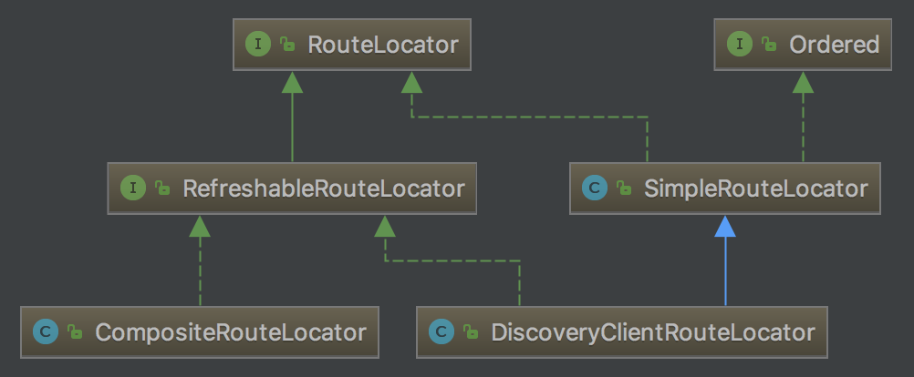

上一篇文章中，我们学习了如何配置使用Zuul。可以看到，Zuul的配置非常简单。这篇文章我们进入代码看看Zuul是如何做到路由、转发的。

<!-- more -->

## 配置

我们知道在SpringBoot中，第三方库在`META-INF/spring.factories`文件中指定自动配置文件。于是我们从`spring-cloud-netflix-zuul-2.0.0.RC1.jar`的`spring.factories`文件入手：

```
org.springframework.boot.autoconfigure.EnableAutoConfiguration=\
org.springframework.cloud.netflix.zuul.ZuulServerAutoConfiguration,\
org.springframework.cloud.netflix.zuul.ZuulProxyAutoConfiguration
```

可以看到`spring.factories`文件中指定了两个类：`ZuulServerAutoConfiguration`、`ZuulProxyAutoConfiguration`用于自动配置。我们来看看`ZuulServerAutoConfiguration`类中配置了哪些相关的bean。

- CompositeRouteLocator

    ```java
    @Bean
    @Primary
    public CompositeRouteLocator primaryRouteLocator(
            Collection<RouteLocator> routeLocators) {
        return new CompositeRouteLocator(routeLocators);
    }
    ```

    首先定义了`CompositeRouteLocator`，它是核心的路由定位器。路由定位器用于寻找特定路径映射的路由。它有一个统一的接口`RouteLocator`：
    
    ```java
    public interface RouteLocator {
        // 获取忽略的路径
        Collection<String> getIgnoredPaths();
        // 获取路由的列表
        List<Route> getRoutes();
        // 获取指定路径对应的路由
        Route getMatchingRoute(String path);
    }
    ```

    `RouteLocator`有三个实现类：`SimpleRouteLocator`、`DiscoveryClientRouteLocator`、`CompositeRouteLocator`。它们的关系图如下：

      

    `CompositeRouteLocator`是一个综合的路由定位器，它将所有的路由定位器的功能集合起来。因此新建`CompositeRouteLocator`时需要传入当前定义的所有路由定位器。默认情况下传入的是`DiscoveryClientRouteLocator`。

- ZuulHandlerMapping

    ```java
    @Bean
    public ZuulController zuulController() {
        return new ZuulController();
    }
    
    @Bean
    public ZuulHandlerMapping zuulHandlerMapping(RouteLocator routes) {
        ZuulHandlerMapping mapping = new ZuulHandlerMapping(routes, zuulController());
        mapping.setErrorController(this.errorController);
        return mapping;
    }
    ```

    `ZuulHandlerMapping`是一个用于MVC处理的`HandlerMapping`，它用于根据请求的path映射处理请求的Handler。

- ZuulServlet

    ```java
    @Bean
    @ConditionalOnMissingBean(name = "zuulServlet")
    public ServletRegistrationBean zuulServlet() {
        ServletRegistrationBean<ZuulServlet> servlet = new ServletRegistrationBean<>(new ZuulServlet(),
                this.zuulProperties.getServletPattern());
        // The whole point of exposing this servlet is to provide a route that doesn't
        // buffer requests.
        servlet.addInitParameter("buffer-requests", "false");
        return servlet;
    }
    ```

    这里新建了一个`ServletRegistrationBean`——Servlet的注册器。通过这个`ServletRegistrationBean`，向servlet容器中注册了一个ZuulServlet。

- ZuulRefreshListener

    ```java
    @Bean
    public ApplicationListener<ApplicationEvent> zuulRefreshRoutesListener() {
        return new ZuulRefreshListener();
    }
    ```

    这里注册了一个事件监听器，用于监听事件来刷新路由。
    
- 各种过滤器

    `ZuulProxyAutoConfiguration`类中还配置了一系列默认的过滤器：
    
    ```java
    // pre filters
    @Bean
    public ServletDetectionFilter servletDetectionFilter() {
        return new ServletDetectionFilter();
    }
    
    ...
        
    // post filters
    @Bean
    public SendResponseFilter sendResponseFilter(ZuulProperties properties) {
        return new SendResponseFilter(zuulProperties);
    }
    
    ...
    ```
    
## 路由的初始化
    
前文我们看到`ZuulProxyAutoConfiguration`配置文件中配置了一个事件监听器`ZuulRefreshListener`来刷新路由。

当Spring启动完成或者Eureka中的服务发生变化时都会发出事件，`ZuulRefreshListener`收到事件之后进行路由的刷新。调用流程如下：

1. ZuulRefreshListener.onApplicationEvent
2. ZuulRefreshListener.reset
3. ZuulHandlerMapping.setDirty
4. CompositeRouteLocator.refresh
5. DiscoveryClientRouteLocator.refresh
6. SimpleRouteLocator.doRefresh
7. DiscoveryClientRouteLocator.locateRoutes

`DiscoveryClientRouteLocator.locateRoutes`方法是初始化路由的核心，主要分为两步：

1. 调用`SimpleRouteLocator.locateRoutes`加载配置文件中的路由
2. 将Eureka中注册的service加载为路由

## 注册ZuulHandlerMapping

ZuulHandlerMapping在注册发生在第一次请求发生的时候，在`ZuulHandlerMapping.lookupHandler`方法中执行。调用流程如下：

1. ZuulHandlerMapping.lookupHandler
2. ZuulHandlerMapping.registerHandlers

在`ZuulHandlerMapping.registerHandlers`方法中首先获取所有的路由，然后调用`AbstractUrlHandlerMapping.registerHandler`将路由中的路径和`ZuulHandlerMapping`相关联。

### ZuulHandlerMapping的工作原理

当接收到一个请求后，处理请求的过程统一在`DispatcherServlet.doDispatch`中进行。

在`DispatcherServlet.doDispatch`方法中调用`DispatcherServlet.getHandler`方法获取handler，在该方法中遍历所有的HandlerMapping，调用其`getHandler`方法获得HandlerExecutionChain，如果不为null说明正是我们要找的handler。

#### ZuulHandlerMapping的获取

对于ZuulHandlerMapping的`getHandler`方法的调用流程如下：

1. AbstractUrlHandlerMapping.getHandlerInternal：根据request的path查找匹配的handler

    `getHandlerInternal`方法根据`lookupPath`(请求路径)、`request`(请求)调用`ZuulHandlerMapping.lookupHandler`方法查找匹配的handler。
    
    `ZuulHandlerMapping.lookupHandler`的调用流程如下：
    
    1. 判断是否在请求errorPath
    2. 请求的路径是否处于routeLocator被忽略的路径中
    3. 请求上下文中是否包含`forward.to`
    4. 调用`AbstractUrlHandlerMapping.lookupHandler`

    `AbstractUrlHandlerMapping.lookupHandler`的调用流程如下：
    
    1. 检查`handlerMap`中是否包含了请求路径对应的Handler。（`handlerMap`是在ZuulHandlerMapping执行`registerHandlers()`方法是注册的。将所有Route的路径映射为ZuulController）
    2. 将请求路径与`handlerMap`中的路径进行匹配，将`handlerMap`中匹配的路径添加到`matchingPatterns`列表中
    3. 从`matchingPatterns`列表中取得第一个路径作为最佳匹配的路径bestMatch
    4. 从`handlerMap`中获取bestMatch对应的Handler，即ZuulController
    5. 将handler、bestMatch等包装成HandlerExecutionChain返回
    
2. 因为返回的handler不为null，调用`getHandlerExecutionChain`将其包装成HandlerExecutionChain，加入拦截器信息。返回`executionChain`。

#### ZuulHandlerMapping的调用

ZuulHandlerMapping的调用发生在`DispatcherServlet.doDispatch`执行时。调用流程如下：

1. SimpleControllerHandlerAdapter.handle
2. ZuulController.handleRequest
3. ServletWrappingController.handleRequestInternal
4. ZuulServlet.service

可以看到ZuulHandlerMapping最终调用了`ZuulServlet.service`方法。
    
## ZuulServlet
    
Zuul的主要流程发生在ZuulServlet中，它的调用流程如下：

1. DispatcherServlet.doService
2. DispatcherServlet.doDispatch
3. SimpleControllerHandlerAdapter.handle
4. ZuulController.handleRequest
5. ServletWrappingController.handleRequestInternal
6. ZuulServlet.service

在`ZuulServlet.service`方法中，调用各个过滤器对请求进行处理，再将结果设置到response中返回:

```java
public void service(javax.servlet.ServletRequest servletRequest, javax.servlet.ServletResponse servletResponse) throws ServletException, IOException {
    try {
        init((HttpServletRequest) servletRequest, (HttpServletResponse) servletResponse);

        // Marks this request as having passed through the "Zuul engine", as opposed to servlets
        // explicitly bound in web.xml, for which requests will not have the same data attached
        RequestContext context = RequestContext.getCurrentContext();
        context.setZuulEngineRan();

        try {
            preRoute();
        } catch (ZuulException e) {
            error(e);
            postRoute();
            return;
        }
        try {
            route();
        } catch (ZuulException e) {
            error(e);
            postRoute();
            return;
        }
        try {
            postRoute();
        } catch (ZuulException e) {
            error(e);
            return;
        }

    } catch (Throwable e) {
        error(new ZuulException(e, 500, "UNHANDLED_EXCEPTION_" + e.getClass().getName()));
    } finally {
        RequestContext.getCurrentContext().unset();
    }
}
```

1. 调用init方法。`ZuulServlet`中的方法都是对`ZuulRunner`中方法的包装，调用的是`ZuulRunner.init`方法：它将`HttpServletRequest`和`HttpServletResponse`分拨包装成`HttpServletRequestWrapper`和`HttpServletResponseWrapper`。然后将他们保存在`RequestContext`中，`RequestContext`保存在ThreadLocal中，每个请求线程都有不同的`RequestContext`。
2. 在`RequestContext`中加入`zuulEngineRan=true`的键值对，表示这个请求经过Zuul的处理。
3. 调用`preRoute()`、`route()`、`postRoute()`方法，对请求执行"pre"、"route"、"post"三种过滤器

## 过滤器

前文我们知道了过滤器的调用在`ZuulServlet.service`方法中完成。过滤器是Zuul实现API网关功能最为核心的部件，每一个进入Zuul的HTTP请求都会经过一系列的过滤器处理链得到请求响应并返回给客户端。Zuul中的过滤器统一实现了`ZuulFilter`抽象类，其中有四个抽象方法：

```java
String filterType();
int filterOrder();
boolean shouldFilter();
Object run();
```

它们各自的含义和功能总结如下：

- filterType：该函数需要返回一个字符串来代表过滤器的类型，Zuul默认定义了四种不同生命周期的过滤器类型：`pre`、`routing`、`post`、`error`。
- filerOrder：通过int值来定义过滤器的执行顺序，数值越小优先级越高。
- shouldFilter：返回一个boolean类型来判断该过滤器是否要执行。我们可以通过此方法来指定过滤器的有效范围。
- run：过滤器的具体逻辑。过滤器的具体逻辑。在该函数中，我们可以实现自定义的过滤逻辑，来确定是否要拦截当前的请求，不对其进行后续的路由，或是在请求路由返回结果之后，对处理结果做一些加工等。

过滤器的遍历执行在`FilterProcessor.runFilters`方法中：

```java
public Object runFilters(String sType) throws Throwable {
    if (RequestContext.getCurrentContext().debugRouting()) {
        Debug.addRoutingDebug("Invoking {" + sType + "} type filters");
    }
    boolean bResult = false;
    List<ZuulFilter> list = FilterLoader.getInstance().getFiltersByType(sType);
    if (list != null) {
        for (int i = 0; i < list.size(); i++) {
            ZuulFilter zuulFilter = list.get(i);
            Object result = processZuulFilter(zuulFilter);
            if (result != null && result instanceof Boolean) {
                bResult |= ((Boolean) result);
            }
        }
    }
    return bResult;
}
```

可以看到执行流程就是简单的两步：

1. 调用`FilterLoader`的`getFiltersByType`方法获取响应类型的过滤器
2. 遍历这个类型下所有的过滤器，调用`FilterProcessor.processZuulFilter`方法执行过滤器方法。

    `processZuulFilter`方法主要调用的是`ZuulFilter.runFilter`方法，主要流程为两步：
    
    1. 调用`shouldFilter()`方法判断该过滤器是否该执行
    2. 如果`shouldFilter()`方法返回`true`，则调用`run()`方法执行过滤器中具体的方法

### pre过滤器

#### ServletDetectionFilter

- 执行顺序：-3
- 执行条件：总是执行
- 功能：检测当前请求是通过Spring的DispatcherServlet处理运行，还是通过ZuulServlet来处理运行。检测结果会以布尔类型保存在`RequestContext`的`isDispatcherServletRequest`参数中，这样在后续的过滤器中，我们就可以通过`RequestUtils.isDispatcherServletRequest()`和`RequestUtils.isZuulServletRequest()`方法判断它以实现不同的处理。一般情况下，发送到API网关的外部请求都会被Spring的`DispatcherServlet`处理，除了通过`/zuul/`路径访问的请求会绕过`DispatcherServlet`，被`ZuulServlet`处理，主要用来应对处理大文件上传的情况。另外，对于`ZuulServlet`的访问路径`/zuul/`，我们可以通过`zuul.servletPath`参数来进行修改。

#### Servlet30WrapperFilter

- 执行顺序：-2
- 执行条件：总是执行
- 功能：将原始的`HttpServletRequest`包装成`Servlet30RequestWrapper`对象

#### FormBodyWrapperFilter

- 执行顺序：-1
- 执行条件：Content-Type为`application/x-www-form-urlencoded`或`multipart/form-data`
- 功能：将符合条件的请求包装成`FormBodyRequestWrapper`对象

#### DebugFilter

- 执行顺序：1
- 执行条件：请求中的`debug`参数（该参数可以通过`zuul.debug.parameter`来自定义）为`true`，或者配置参数`zuul.debug.request`为`true`
- 功能：将当前`RequestContext`中的`debugRouting`和`debugRequest`参数设置为`true`。

    由于在同一个请求的不同声明周期中，都可以访问到这两个值，所以我们在后续的各个过滤器中可以利用这两个值来定义一下debug信息，这样当线上环境出现问题的时候，可以通过请求参数的方式来激活这些debug信息以帮助分析问题。

#### PreDecorationFilter

- 执行顺序：5
- 执行条件：RequestContext不存在`forward.to`和`serviceId`两个参数。如果有一个存在的话，说明当前请求已经被处理过了，因为这两个信息就是根据当前请求的路由信息加载进来的。

处理流程如下：

1. 根据request获取请求路径

    ```java
    RequestContext ctx = RequestContext.getCurrentContext();
    final String requestURI = this.urlPathHelper.getPathWithinApplication(ctx.getRequest());
    ```

2. 根据请求路径获取路由

    ```java
    Route route = this.routeLocator.getMatchingRoute(requestURI);
    ```

    在`ZuulProxyAutoConfiguration`配置类中我们知道routeLocator是`CompositeRouteLocator`，它的`getMatchingRoute`方法如下：

    ```java
    public Route getMatchingRoute(String path) {
        for (RouteLocator locator : routeLocators) {
            Route route = locator.getMatchingRoute(path);
            if (route != null) {
                return route;
            }
        }
        return null;
    }
    ```

    可以看到它遍历所有的路由定位器，返回匹配路径的路由定位器。默认情况下，`routeLocators`中只有一个`DiscoveryClientRouteLocator`。实际上这里调用的就是`DiscoveryClientRouteLocator.getMatchingRoute`方法，因为`DiscoveryClientRouteLocator`继承了`SimpleRouteLocator`，`getMatchingRoute`方法实际上位于`SimpleRouteLocator`类中。

    `SimpleRouteLocator.getMatchingRoute`方法调用`getSimpleMatchingRoute`，这个方法根据请求路径获取相应的Route，主流程代码如下：

    ```java
    getRoutesMap();
    String adjustedPath = adjustPath(path);
    ZuulRoute route = getZuulRoute(adjustedPath);
    return getRoute(route, adjustedPath);
    ```

    1. 调用`getRoutesMap`。如果路径与路由的映射关系没有初始化，则在`getRoutesMap`方法中进行初始化
    2. 调用`getZuulRoute`方法，遍历所有路由对应的路径，根据请求路径调用`AntPathMatcher.match()`方法找到匹配的路由。
    3. 调用`getRoute`方法，将传入的`ZuulRoute`和`path`包装成`Route`

3. 根据是否能根据请求路径找到路由，执行不同的路径

##### 路由存在

1. 获取Route的location（如果url不为空返回url，否则返回serviceId）
2. 在RequestContext中将`requestURI`设置为路由的path
3. 在RequestContext中将`proxy`设置为路由的id
4. 如果路由有自定义的sensitiveHeader(敏感的头部信息，不向真实的请求传递)，则将其添加到RequestContext的`ignoredHeaders`中。否则添加默认的sensitiveHeaders，包括`Cookie`、`Set-Cookie`、`Authorization`。
5. 如果路由的`retryable`不为空，则将其添加到RequestContext的`retryable`中
6. 确定路由转发的路径：

    1. 如果location以`http`或`https`开头，将其添加到RequestContext的`routeHost`中，在RequestContext的`originResponseHeaders`中添加`X-Zuul-Service`与location的键值对；
    2. 如果location以`forward:`开头，则将其添加到RequestContext的`forward.to`中，将RequestContext的`routeHost`设置为null并返回；
    3. 否则将location添加到RequestContext的`serviceId`中，将RequestContext的`routeHost`设置为null，在RequestContext的`originResponseHeaders`中添加`X-Zuul-ServiceId`与location的键值对。

7. 如果我们没有将`zuul.addProxyHeaders`参数设置为`false`，则在RequestContext的`zuulRequestHeaders`中添加一系列请求头：`X-Forwarded-Host`、`X-Forwarded-Port`、`X-Forwarded-Proto`、`X-Forwarded-Prefix`、`X-Forwarded-For`
8. 如果我们没有将`zuul.addHostHeader`参数设置为`false`，则在则在RequestContext的`zuulRequestHeaders`中添加`host`

##### 路由不存在

在RequestContext中将`forward.to`设置为`forwardURI`，默认情况下`forwardURI`为请求路径。

### route过滤器

#### RibbonRoutingFilter

- 执行顺序：10
- 执行条件：RequestContext中的`routeHost`为null，`serviceId`不为null。即只对通过serviceId配置路由规则的请求生效
- 功能：使用Ribbon和Hystrix来向服务实例发起请求，并将服务实例的请求结果返回

#### SimpleHostRoutingFilter

- 执行顺序：100
- 执行条件：RequestContext中的`routeHost`不为null。即只对通过url配置路由规则的请求生效
- 功能：直接向`routeHost`参数的物理地址发起请求，该请求是直接通过httpclient包实现的，而没有使用Hystrix命令进行包装，所以这类请求并没有线程隔离和熔断器的保护。

#### SendForwardFilter

- 执行顺序：500
- 执行条件：RequestContext中的`forward.to`不为null。即用来处理路由规则中的forward本地跳转配置
- 功能：获取`forward.to`中保存的跳转地址，跳转过去

### error过滤器

#### SendErrorFilter

- 执行顺序：0
- 执行条件：RequestContext中的`throwable`不为null，且`sendErrorFilter.ran`属性为`false`。
- 功能：在request中设置`javax.servlet.error.status_code`、`javax.servlet.error.exception`、`javax.servlet.error.message`三个属性。将RequestContext中的`sendErrorFilter.ran`属性设置为`true`。然后组织成一个forward到API网关`/error`错误端点的请求来产生错误响应。

RequestContext中的`sendErrorFilter.ran`属性是为了防止error过滤器处理完之后调用`postRoute()`再一次发生异常，第二次发生的异常就不再处理。

### post过滤器

#### SendResponseFilter

- 执行顺序：1000
- 执行条件：没有抛出异常，RequestContext中的`throwable`属性为null（如果不为null说明已经被error过滤器处理过了，这里的post过滤器就不需要处理了），并且RequestContext中`zuulResponseHeaders`、`responseDataStream`、`responseBody`三者有一样不为null（说明实际请求的响应不为空）。
- 功能：在请求响应中增加头信息（根据设置有`X-Zuul-Debug-Header`、`Date`、`Content-Type`、`Content-Length`等）：`addResponseHeaders`;发送响应内容：`writeResponse`。


> http://blog.didispace.com/spring-cloud-source-zuul/
> https://blog.csdn.net/u013815546/article/details/68944039


