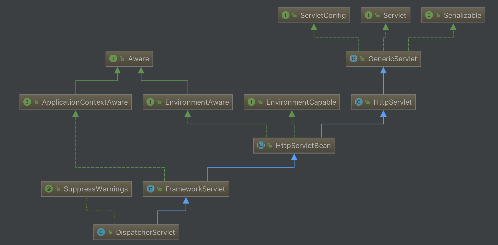

在上一篇文章[Spring与MVC(二)][1]中，我们分析了Spring MVC在启动过程中`ContextLoaderListener`和`DispatcherServlet`两个类的创建过程。

这篇文章中，我们来分析`DispatcherServlet`初始化过程，以及`DispatcherServlet`的处理请求过程。
<!-- more -->
## `DispatcherServlet`初始化过程

首先看一下`DispatcherServlet`的继承关系。`DispatcherServlet`继承自`FrameworkServlet`，`FrameworkServlet`继承自`HttpServletBean`，`HttpServeltBean`继承自Java的`HttpServlet`。



`HttpServletBean`用于将Servlet中配置的参数设置到相应的属性中。然后调用`FrameworkServlet.initServletBean`，`initServletBean`的主要工作是调用`initWebApplicationContext()`初始化Spring MVC中所使用的WebApplicationContext：

```java
protected WebApplicationContext initWebApplicationContext() {
	WebApplicationContext rootContext = WebApplicationContextUtils.getWebApplicationContext(getServletContext());
	WebApplicationContext wac = null;

	if (this.webApplicationContext != null) {
		// A context instance was injected at construction time -> use it
		wac = this.webApplicationContext;
		if (wac instanceof ConfigurableWebApplicationContext) {
			ConfigurableWebApplicationContext cwac = (ConfigurableWebApplicationContext) wac;
			if (!cwac.isActive()) {
				// The context has not yet been refreshed -> provide services such as
				// setting the parent context, setting the application context id, etc
				if (cwac.getParent() == null) {
					// The context instance was injected without an explicit parent -> set
					// the root application context (if any; may be null) as the parent
					cwac.setParent(rootContext);
				}
				configureAndRefreshWebApplicationContext(cwac);
			}
		}
	}
	if (wac == null) {
		// No context instance was injected at construction time -> see if one
		// has been registered in the servlet context. If one exists, it is assumed
		// that the parent context (if any) has already been set and that the
		// user has performed any initialization such as setting the context id
		wac = findWebApplicationContext();
	}
	if (wac == null) {
		// No context instance is defined for this servlet -> create a local one
		wac = createWebApplicationContext(rootContext);
	}

	if (!this.refreshEventReceived) {
		// Either the context is not a ConfigurableApplicationContext with refresh
		// support or the context injected at construction time had already been
		// refreshed -> trigger initial onRefresh manually here.
		onRefresh(wac);
	}

	if (this.publishContext) {
		// Publish the context as a servlet context attribute.
		String attrName = getServletContextAttributeName();
		getServletContext().setAttribute(attrName, wac);
		if (this.logger.isDebugEnabled()) {
			this.logger.debug("Published WebApplicationContext of servlet '" + getServletName() +
					"' as ServletContext attribute with name [" + attrName + "]");
		}
	}

	return wac;
}
```

首先，从ServletContext中获取WebApplicationContext。

回顾上一篇文章，在创建DispatcherServlet时，使用了我们创建的WebApplicationContext，因此这里的`this.webApplicationContext`不为空，对其进行各种配置：设置`ServletContext`、`ServletConfig`、`Namespace`、`ApplicationListener`，最后调用`refresh()`进行bean的各种初始化。其中，在最后的`finishRefresh()`方法中，会通过事件的方式通知`DispatcherServlet`初始化各个策略接口的实现类：

```java
protected void initStrategies(ApplicationContext context) {
	initMultipartResolver(context);
	initLocaleResolver(context);
	initThemeResolver(context);
	initHandlerMappings(context);	// 请求映射处理器
	initHandlerAdapters(context);
	initHandlerExceptionResolvers(context);	// 异常处理器
	initRequestToViewNameTranslator(context);
	initViewResolvers(context);	// 视图处理器
	initFlashMapManager(context);
}
```

## DispatcherServlet处理请求过程

HttpServlet提供了service方法用于处理请求，service使用了模板设计模式，在内部对于http get方法会调用`doGet`方法，http post方法调用`doPost`方法...

查看`FrameworkServlet`代码，`doGet`、`doPost`等方法调用的是`processRequest`方法，`processRequest`方法调用`DispatcherServlet.doService`执行service的任务，`doService`委托给`doDispatch`来做真正的请求分派工作：

```java
protected void doDispatch(HttpServletRequest request, HttpServletResponse response) throws Exception {
	HttpServletRequest processedRequest = request;
	HandlerExecutionChain mappedHandler = null;
	boolean multipartRequestParsed = false;

	WebAsyncManager asyncManager = WebAsyncUtils.getAsyncManager(request);

	try {
		ModelAndView mv = null;
		Exception dispatchException = null;

		try {
			processedRequest = checkMultipart(request);
			multipartRequestParsed = (processedRequest != request);

			// Determine handler for the current request.
			mappedHandler = getHandler(processedRequest);
			if (mappedHandler == null || mappedHandler.getHandler() == null) {
				noHandlerFound(processedRequest, response);
				return;
			}

			// Determine handler adapter for the current request.
			HandlerAdapter ha = getHandlerAdapter(mappedHandler.getHandler());

			// Process last-modified header, if supported by the handler.
			String method = request.getMethod();
			boolean isGet = "GET".equals(method);
			if (isGet || "HEAD".equals(method)) {
				long lastModified = ha.getLastModified(request, mappedHandler.getHandler());
				if (logger.isDebugEnabled()) {
					logger.debug("Last-Modified value for [" + getRequestUri(request) + "] is: " + lastModified);
				}
				if (new ServletWebRequest(request, response).checkNotModified(lastModified) && isGet) {
					return;
				}
			}

			if (!mappedHandler.applyPreHandle(processedRequest, response)) {
				return;
			}

			// Actually invoke the handler.
			mv = ha.handle(processedRequest, response, mappedHandler.getHandler());

			if (asyncManager.isConcurrentHandlingStarted()) {
				return;
			}

			applyDefaultViewName(processedRequest, mv);
			mappedHandler.applyPostHandle(processedRequest, response, mv);
		}
		catch (Exception ex) {
			dispatchException = ex;
		}
		catch (Throwable err) {
			// As of 4.3, we're processing Errors thrown from handler methods as well,
			// making them available for @ExceptionHandler methods and other scenarios.
			dispatchException = new NestedServletException("Handler dispatch failed", err);
		}
		processDispatchResult(processedRequest, response, mappedHandler, mv, dispatchException);
	}
	catch (Exception ex) {
		triggerAfterCompletion(processedRequest, response, mappedHandler, ex);
	}
	catch (Throwable err) {
		triggerAfterCompletion(processedRequest, response, mappedHandler,
				new NestedServletException("Handler processing failed", err));
	}
	finally {
		if (asyncManager.isConcurrentHandlingStarted()) {
			// Instead of postHandle and afterCompletion
			if (mappedHandler != null) {
				mappedHandler.applyAfterConcurrentHandlingStarted(processedRequest, response);
			}
		}
		else {
			// Clean up any resources used by a multipart request.
			if (multipartRequestParsed) {
				cleanupMultipart(processedRequest);
			}
		}
	}
}
```

首先，调用`getHandler`方法获取`HandlerExecutionChain`，其中包括了目标方法以及拦截器。然后通过handler获取`HandlerAdapter`，使用`HandlerAdapter`调用handler，得到`ModelAndView`对象。最后调用`processDispatchResult`方法渲染页面，处理前面调用抛出的异常。


[1]: /articles/Spring/Spring与MVC(二).html

