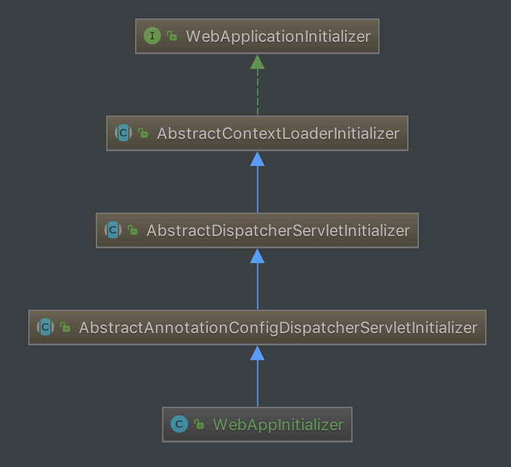

在上一篇文章[Spring与MVC(一)][1]中，我们配置了一个最基本的Web应用，这一章我们来看看这个最基本的Web应用是如何创建`DispatcherServlet`和`ContextLoaderListener`的。
<!-- more -->
## SpringServletContainerInitializer

在Servlet 3.0环境中，容器会在类路径中查找实现`javax.servlet.ServletContainerInitializer`接口的类，如果能发现的话，就会用它来配置Servlet容器。

Spring提供了这个接口的实现，名为`SpringServletContainerInitializer`，这个类反过来又会查找实现WebApplicationInitializer的类并将配置的任务交给它们来完成。Spring 3.2引入了一个便利的`WebApplicationInitializer`基础实现，也就是`AbstractAnnotationConfigDispatcherServletInitializer`。因为我们扩展了`AbstractAnnotationConfigDispatcherServletInitializer`(同时也就是实现了WebApplicationInitializer)，因此当部署到Servlet 3.0容器中的时候，容器会自动发现它，并用它来配置Servlet上下文。

`SpringServletContainerInitializer`实现了`ServletContainerInitializer`接口唯一的一个方法：`onStartup`。在该方法中，寻找所有实现了`WebApplicationInitializer`接口的配置类，然后根据`@Order`注解指定的顺序依次调用我们配置类的`onStartup`方法。

AbstractAnnotationConfigDispatcherServletInitializer的基础关系：




调用`AbstractDispatcherServletInitializer.onStartup`方法：

```java
@Override
public void onStartup(ServletContext servletContext) throws ServletException {
	super.onStartup(servletContext);
	registerDispatcherServlet(servletContext);
}
```

### 创建ContextLoaderListener

首先调用父类`AbstractContextLoaderInitializer`的`onStartup`方法：

```java
@Override
public void onStartup(ServletContext servletContext) throws ServletException {
	registerContextLoaderListener(servletContext);
}

protected void registerContextLoaderListener(ServletContext servletContext) {
	WebApplicationContext rootAppContext = createRootApplicationContext();
	if (rootAppContext != null) {
		ContextLoaderListener listener = new ContextLoaderListener(rootAppContext);
		listener.setContextInitializers(getRootApplicationContextInitializers());
		servletContext.addListener(listener);
	}
	else {
		logger.debug("No ContextLoaderListener registered, as " +
				"createRootApplicationContext() did not return an application context");
	}
}
```

首先调用`AbstractAnnotationConfigDispatcherServletInitializer.createRootApplicationContext`创建一个`AnnotationConfigWebApplicationContext`：

```java
protected WebApplicationContext createRootApplicationContext() {
	Class<?>[] configClasses = getRootConfigClasses();
	if (!ObjectUtils.isEmpty(configClasses)) {
		AnnotationConfigWebApplicationContext rootAppContext = new AnnotationConfigWebApplicationContext();
		rootAppContext.register(configClasses);
		return rootAppContext;
	}
	else {
		return null;
	}
}
```

其中`getRootConfigClasses`方法我们在`WebAppInitializer`重写了，返回的是`RootConfig.class`。接着新建一个`AnnotationConfigWebApplicationContext`，将`RootConfig.class`注册到`AnnotationConfigWebApplicationContext`的`annotatedClasses`中。

回到`AbstractContextLoaderInitializer.registerContextLoaderListener`，创建一个`ContextLoaderListener`，将`createRootApplicationContext`返回的`AnnotationConfigWebApplicationContext`赋值给`ContextLoaderListener`的context中。

将刚才创建的`ContextLoaderListener`添加到ServletContext中。

### 创建DispatcherServlet

回到`AbstractDispatcherServletInitializer.onStartup`，创建完`ContextLoaderListener`之后，调用`registerDispatcherServlet`注册`DispatcherServlet`：

```java
protected void registerDispatcherServlet(ServletContext servletContext) {
	String servletName = getServletName();
	Assert.hasLength(servletName, "getServletName() must not return empty or null");

	WebApplicationContext servletAppContext = createServletApplicationContext();
	Assert.notNull(servletAppContext,
			"createServletApplicationContext() did not return an application " +
			"context for servlet [" + servletName + "]");

	FrameworkServlet dispatcherServlet = createDispatcherServlet(servletAppContext);
	dispatcherServlet.setContextInitializers(getServletApplicationContextInitializers());

	ServletRegistration.Dynamic registration = servletContext.addServlet(servletName, dispatcherServlet);
	Assert.notNull(registration,
			"Failed to register servlet with name '" + servletName + "'." +
			"Check if there is another servlet registered under the same name.");

	registration.setLoadOnStartup(1);
	registration.addMapping(getServletMappings());
	registration.setAsyncSupported(isAsyncSupported());

	Filter[] filters = getServletFilters();
	if (!ObjectUtils.isEmpty(filters)) {
		for (Filter filter : filters) {
			registerServletFilter(servletContext, filter);
		}
	}

	customizeRegistration(registration);
}
```

首先调用`getServletName()`方法，获取servletName，默认为"dispatcher"。

调用`AbstractAnnotationConfigDispatcherServletInitializer.createServletApplicationContext`，创建`AnnotationConfigWebApplicationContext`：

```java
protected WebApplicationContext createServletApplicationContext() {
	AnnotationConfigWebApplicationContext servletAppContext = new AnnotationConfigWebApplicationContext();
	Class<?>[] configClasses = getServletConfigClasses();
	if (!ObjectUtils.isEmpty(configClasses)) {
		servletAppContext.register(configClasses);
	}
	return servletAppContext;
}
```

首先创建`AnnotationConfigWebApplicationContext`。再调用`getServletConfigClasses`方法获取配置，该方法在`WebAppInitializer`中被重写，返回`WebConfig.class`。然后注册到`AnnotationConfigWebApplicationContext`的annotatedClasses中。

回到`AbstractDispatcherServletInitializer.registerDispatcherServlet`方法，调用`createDispatcherServlet`创建`DispatcherServlet`。

将我们创建的`DispatcherServlet`添加到servletContext中。在`registration`中添加Servlet映射，Servlet映射由我们的`WebAppInitializer`配置类指定。

获取过滤器，注册到servletContext中。

## 总结

我们可以看到在`AbstractDispatcherServletInitializer.onStartup`中：

- 通过`super.onStartup(servletContext)`方法创建`ContextLoaderListener`。`getRootConfigClasses`方法返回的带有`@Configuration`注解的类将会用来配置`ContextLoaderListener`创建的应用上下文中的bean。
- 通过`registerDispatcherServlet(servletContext)`方法创建`DispatcherServlet`。`getServletConfigClasses`方法返回的带有`@Configuration`注解的类将会用来配置`DispatcherServlet`应用上下文中的bean。

[1]: /articles/Spring/Spring与MVC(一).html


