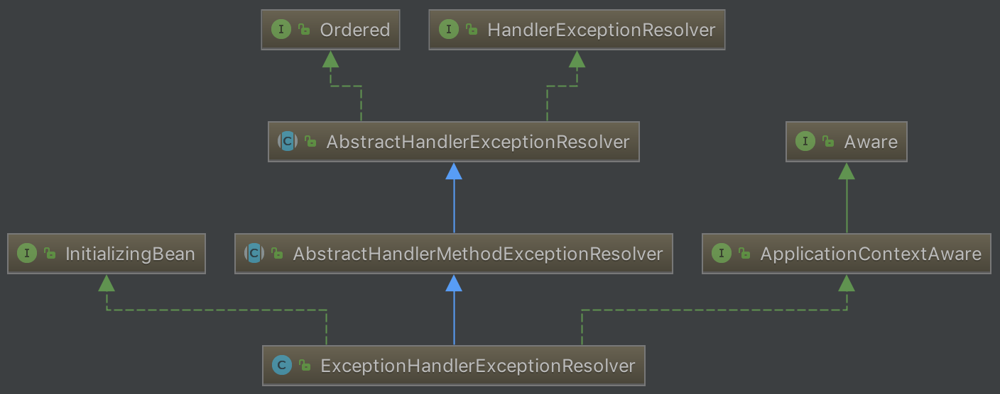

在上一篇文章[Spring与MVC(五)][1]中，我们分析了Spring MVC是如何处理方法参数以及响应返回值。在这篇文章中，我们来分析一下Spring MVC如何处理异常。

1. 程序在`DispatcherServlet.doDispatch`方法中调用`ha.handle`执行相应的函数，这时抛出异常，异常赋值给`dispatchException`。
2. 调用`processDispatchResult`方法处理捕获的异常。
<!-- more -->

## processHandlerException

在`DispatcherServlet.processDispatchResult`方法的`processHandlerException`中调用`HandlerExceptionResolverComposite.resolveException`，遍历所有的异常处理器(实现`HandlerExceptionResolver`接口)，处理异常

```java
public ModelAndView resolveException(HttpServletRequest request,
									 HttpServletResponse response,
									 Object handler,
									 Exception ex) {
	if (resolvers != null) {
		for (HandlerExceptionResolver handlerExceptionResolver : resolvers) {
			ModelAndView mav = handlerExceptionResolver.resolveException(request, response, handler, ex);
			if (mav != null) {
				return mav;
			}
		}
	}
	return null;
}
```

其中默认的异常处理器有3个：

1. ExceptionHandlerExceptionResolver
2. ResponseStatusExceptionResolver
3. DefaultHandlerExceptionResolver

如果经过这三个异常处理器处理之后得到的`ModelAndView`为null，则继续抛出异常，最后由servlet容器来处理

### DefaultHandlerExceptionResolver

继承自`AbstractHandlerExceptionResolver`，主要对一些特殊的异常进行处理，比如`NoSuchRequestHandlingMethodException`, `HttpRequestMethodNotSupportedException`, `HttpMediaTypeNotSupportedException`, `HttpMediaTypeNotAcceptableException`等

### ResponseStatusExceptionResolver

继承自`AbstractHandlerExceptionResolver`，主要在异常父类中找到`@ResponseStatus`注解，然后使用这个注解的属性进行处理

### ExceptionHandlerExceptionResolver

继承自`AbstractHandlerMethodExceptionResolver`，该类主要处理Controller中用`@ExceptionHandler`注解定义的方法，大多数异常处理都是由该类操作。

我们来看看`ExceptionHandlerExceptionResolver`在用户controller方法调用抛出异常时是如何工作的：

在`DispatcherServlet.doDispatch`方法中执行`ha.handle`调用用户的controller方法，抛出异常后被`catch`捕获，将异常赋值给`dispatchException`变量。

然后调用`processDispatchResult`方法来处理执行结果或者抛出的异常。当然这里关注的是处理抛出的异常：

```java
if (exception != null) {
	if (exception instanceof ModelAndViewDefiningException) {
		logger.debug("ModelAndViewDefiningException encountered", exception);
		mv = ((ModelAndViewDefiningException) exception).getModelAndView();
	}
	else {
		Object handler = (mappedHandler != null ? mappedHandler.getHandler() : null);
		mv = processHandlerException(request, response, handler, exception);
		errorView = (mv != null);
	}
}
```

我们看到，如果我们的异常不是`ModelAndViewDefinitionException`，则调用`processHandlerException`：遍历`handlerExceptionResolvers`，其中其中的`resolveException`遍历所有的`HandlerExceptionResolver`处理异常。

来看`ExceptionHandlerExceptionResolver`




它的`resolveException`方法在父类`AbstractHandlerExceptionResolver`中。它的主要工作是调用`doResolveException`处理异常并返回`ModelAndView`。`doResolveException`调用`doResolveHandlerMethodException`，`doResolveHandlerMethodException`在`ExceptionHandlerExceptionResolver`中实现：

1. 首先调用`getExceptionHandlerMethod`获取异常处理的方法`exceptionHandlerMethod`

	- 先获取controller方法的类型
	- 根据controller方法的类型获取处理异常的方法，具体的过程在`ExceptionHandlerMethodResolver`类的构造函数中

	```java
	public ExceptionHandlerMethodResolver(Class<?> handlerType) {
		for (Method method : MethodIntrospector.selectMethods(handlerType, EXCEPTION_HANDLER_METHODS)) {
			for (Class<? extends Throwable> exceptionType : detectExceptionMappings(method)) {
				addExceptionMapping(exceptionType, method);
			}
		}
	}
	```

	在`MethodIntrospector.selectMethods`方法中获取所有controller方法对应的异常处理方法，调用`detectExceptionMappings`获取异常处理函数的处理的异常类型，然后将异常类型与异常处理方法的键值对添加到`ExceptionHandlerMethodResolver`的`mappedMethods`中。

	- 调用`ExceptionHandlerMethodResolver.resolveMethod`方法根据异常获取异常处理方法

2. 调用`exceptionHandlerMethod`的`invokeAndHandle`方法执行异常处理方法

	执行异常处理方法的过程与执行普通的controller方法一致

回到`DispatcherServlet`的`processDispatchResult`方法，如果调用`processHandlerException`方法返回的`ModelAndView`不为null则渲染页面。


[1]: /articles/Spring/Spring与MVC(五).html

