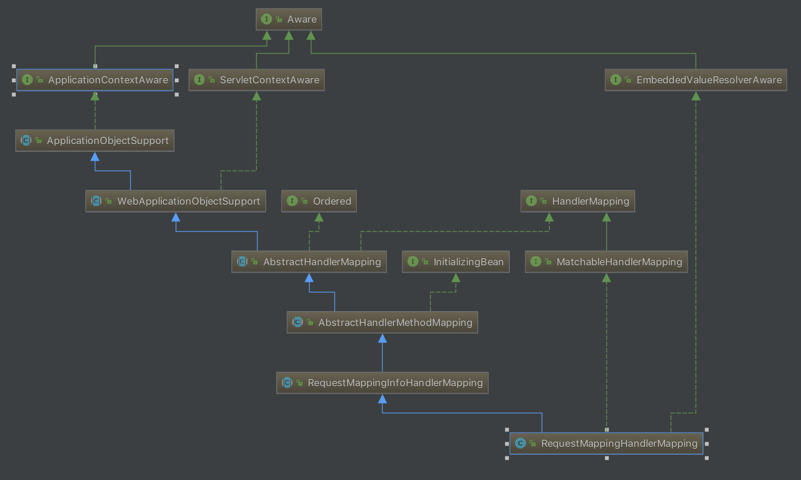

在上一篇文章[Spring与MVC(三)][1]中，我们简单地分析了`DispatcherServlet`的处理请求过程。在这篇文章中，我们详细分析一下`DispatcherServlet`在处理请求时是如何找到正确的Controller，以及执行。
<!-- more -->
## 几个重要的接口和类

### HandlerMethod

`HandlerMethod`是一个封装了方法参数、方法注解、方法返回值等众多元素的类。

它的子类`InvocableHandlerMethod`有两个重要的属性`WebDataBinderFactory`和`HandlerMethodArgumentResolverComposite`，很明显是对请求进行处理的。

`InvocableHandlerMethod`的子类`ServletInvocableHandlerMethod`有个重要的属性`HandlerMethodReturnValueHandlerComposite`，很明显是对响应进行处理的。

`ServletInvocableHandlerMethod`这个类在`HandlerAdapter`对每个请求处理过程中，都会实例化一个出来(上面提到的属性由`HandlerAdapter`进行设置)，分别对请求和返回进行处理。

### MethodParameter

`HandlerMethod`类中的parameters属性类型，是一个`MethodParameter`数组。`MethodParameter`是一个封装了方法参数具体信息的工具类，包括参数的索引位置，类型，注解，参数名等信息。

`HandlerMethod`在实例化的时候，构造函数中会初始化这个数组，这时只初始化部分数据，在`HandlerAdapter`对请求处理过程中会完善其他属性，之后交与合适的`HandlerMethodArgumentResolver`接口处理。

### RequestCondition

`RequestCondition`是SpringMVC的映射基础中的请求条件，可以进行`combine`,`compareTo`,`getMatchingCondition`操作。这个接口是映射匹配的关键接口，其中`getMatchingCondition`方法关乎是否能找到合适的映射。

### RequestMappingInfo

`RequestMappingInfo`是一个封装了各种请求映射条件并实现了`RequestCondition`接口的类。

包含各种`RequestCondition`实现类属性，`patternsCondition`、`methodsCondition`、`paramsCondition`、`headersCondition`、`consumesCondition`、`producesCondition`，分别代表http请求的路径模式、方法、参数、头部等信息。

## RequestMappingHandlerMapping



与寻找Controller关系最密切的一个类是`RequestMappingHandlerMapping`，我们首先来看一下这个类在初始化时所做的工作：

```java
protected void initHandlerMethods() {
    if (logger.isDebugEnabled()) {
        logger.debug("Looking for request mappings in application context: " + getApplicationContext());
    }
    String[] beanNames = (this.detectHandlerMethodsInAncestorContexts ?
            BeanFactoryUtils.beanNamesForTypeIncludingAncestors(getApplicationContext(), Object.class) :
            getApplicationContext().getBeanNamesForType(Object.class));

    for (String beanName : beanNames) {
        if (!beanName.startsWith(SCOPED_TARGET_NAME_PREFIX)) {
            Class<?> beanType = null;
            try {
                beanType = getApplicationContext().getType(beanName);
            }
            catch (Throwable ex) {
                // An unresolvable bean type, probably from a lazy bean - let's ignore it.
                if (logger.isDebugEnabled()) {
                    logger.debug("Could not resolve target class for bean with name '" + beanName + "'", ex);
                }
            }
            if (beanType != null && isHandler(beanType)) {
                detectHandlerMethods(beanName);
            }
        }
    }
    handlerMethodsInitialized(getHandlerMethods());
}
```

首先找出Spring容器中所有的bean。

然后遍历这些bean，调用`isHandler`方法判断这个bean是不是handler，`isHandler`判断该类的注解中是否有`@Controller`或`@RequestMapping`注解。如果这个bean是handler则调用`detectHandlerMethods`方法获取handlerMethod。

```java
protected void detectHandlerMethods(final Object handler) {
    Class<?> handlerType = (handler instanceof String ?
            getApplicationContext().getType((String) handler) : handler.getClass());
    final Class<?> userType = ClassUtils.getUserClass(handlerType);

    Map<Method, T> methods = MethodIntrospector.selectMethods(userType,
            new MethodIntrospector.MetadataLookup<T>() {
                @Override
                public T inspect(Method method) {
                    try {
                        return getMappingForMethod(method, userType);
                    }
                    catch (Throwable ex) {
                        throw new IllegalStateException("Invalid mapping on handler class [" +
                                userType.getName() + "]: " + method, ex);
                    }
                }
            });

    if (logger.isDebugEnabled()) {
        logger.debug(methods.size() + " request handler methods found on " + userType + ": " + methods);
    }
    for (Map.Entry<Method, T> entry : methods.entrySet()) {
        Method invocableMethod = AopUtils.selectInvocableMethod(entry.getKey(), userType);
        T mapping = entry.getValue();
        registerHandlerMethod(handler, invocableMethod, mapping);
    }
}
```

调用`MethodIntrospector.selectMethods`方法获取handler中所有的方法与RequestMappingInfo的映射，返回一个`Map<Method, RequestMappingInfo>`映射。其中的关键方法是`getMappingForMethod`，具体实现由子类`RequestMappingHandlerMapping`实现：

```java
protected RequestMappingInfo getMappingForMethod(Method method, Class<?> handlerType) {
    RequestMappingInfo info = createRequestMappingInfo(method);
    if (info != null) {
        RequestMappingInfo typeInfo = createRequestMappingInfo(handlerType);
        if (typeInfo != null) {
            info = typeInfo.combine(info);
        }
    }
    return info;
}
```

`getMappingForMethod`方法通过方法以及类上加的`@RequestMapping`的注释来创建`RequestMappingInfo`。创建`RequestMappingInfo`的工作由`createRequestMappingInfo`方法完成：

```java
private RequestMappingInfo createRequestMappingInfo(AnnotatedElement element) {
    RequestMapping requestMapping = AnnotatedElementUtils.findMergedAnnotation(element, RequestMapping.class);
    RequestCondition<?> condition = (element instanceof Class ?
            getCustomTypeCondition((Class<?>) element) : getCustomMethodCondition((Method) element));
    return (requestMapping != null ? createRequestMappingInfo(requestMapping, condition) : null);
}
```

回到`getMappingForMethod`方法，从method中获得`RequestMappingInfo`之后再从类中获得`RequestMappingInfo`，然后调用`combine`方法将两者结合起来返回：

```java
public RequestMappingInfo combine(RequestMappingInfo other) {
    String name = combineNames(other);
    PatternsRequestCondition patterns = this.patternsCondition.combine(other.patternsCondition);
    RequestMethodsRequestCondition methods = this.methodsCondition.combine(other.methodsCondition);
    ParamsRequestCondition params = this.paramsCondition.combine(other.paramsCondition);
    HeadersRequestCondition headers = this.headersCondition.combine(other.headersCondition);
    ConsumesRequestCondition consumes = this.consumesCondition.combine(other.consumesCondition);
    ProducesRequestCondition produces = this.producesCondition.combine(other.producesCondition);
    RequestConditionHolder custom = this.customConditionHolder.combine(other.customConditionHolder);

    return new RequestMappingInfo(name, patterns,
            methods, params, headers, consumes, produces, custom.getCondition());
}
```

我们可以看到，两个`RequestMappingInfo`的结合就是将`RequestMappingInfo`中各个元素结合起来再创建一个新的`RequestMappingInfo`返回。

回到`detectHandlerMethods`方法，获取到`Method`和`RequestMappingInfo`的映射之后。调用`registerHandlerMethod`方法注册这个映射关系，本质是在`MappingRegistry`类的`mappingLookup`中添加mapping与handlerMethod的映射关系；在`urlLoopup`中添加url与mapping的映射关系；在`registry`中添加mapping与MappingRegistration的映射关系。

## HandlerExecutionChain的获取

经过上一篇文章[Spring与MVC(三)][1]的分析，我们已经知道`DispatcherServlet.doDispatch`是真正处理请求的方法，方法中首先调用`getHandler`方法获取`HandlerExecutionChain`，其中包括了目标方法以及拦截器。下面我们来更详细地分析一下这个获取`HandlerExecutionChain`的过程。

首先来看`getHandler`：

```java
protected HandlerExecutionChain getHandler(HttpServletRequest request) throws Exception {
    for (HandlerMapping hm : this.handlerMappings) {
        if (logger.isTraceEnabled()) {
            logger.trace(
                    "Testing handler map [" + hm + "] in DispatcherServlet with name '" + getServletName() + "'");
        }
        HandlerExecutionChain handler = hm.getHandler(request);
        if (handler != null) {
            return handler;
        }
    }
    return null;
}
```

遍历当前`handlerMappings`中保存的`HandlerMapping`，与当前请求相关的是`RequestMappingHandlerMapping`，其中`getHandler`方法在`RequestMappingHandlerMapping`的父类`AbstractHandlerMapping`中：

```java
public final HandlerExecutionChain getHandler(HttpServletRequest request) throws Exception {
    Object handler = getHandlerInternal(request);
    if (handler == null) {
        handler = getDefaultHandler();
    }
    if (handler == null) {
        return null;
    }
    // Bean name or resolved handler?
    if (handler instanceof String) {
        String handlerName = (String) handler;
        handler = getApplicationContext().getBean(handlerName);
    }

    HandlerExecutionChain executionChain = getHandlerExecutionChain(handler, request);
    if (CorsUtils.isCorsRequest(request)) {
        CorsConfiguration globalConfig = this.corsConfigSource.getCorsConfiguration(request);
        CorsConfiguration handlerConfig = getCorsConfiguration(handler, request);
        CorsConfiguration config = (globalConfig != null ? globalConfig.combine(handlerConfig) : handlerConfig);
        executionChain = getCorsHandlerExecutionChain(request, executionChain, config);
    }
    return executionChain;
}
```

首先调用`getHandlerInternal`方法根据请求获取对应的处理方法(HandlerMethod)，该方法在`AbstractHandlerMapping`的子类`AbstractHandlerMethodMapping`中实现：

```java
protected HandlerMethod getHandlerInternal(HttpServletRequest request) throws Exception {
    String lookupPath = getUrlPathHelper().getLookupPathForRequest(request);
    if (logger.isDebugEnabled()) {
        logger.debug("Looking up handler method for path " + lookupPath);
    }
    this.mappingRegistry.acquireReadLock();
    try {
        HandlerMethod handlerMethod = lookupHandlerMethod(lookupPath, request);
        if (logger.isDebugEnabled()) {
            if (handlerMethod != null) {
                logger.debug("Returning handler method [" + handlerMethod + "]");
            }
            else {
                logger.debug("Did not find handler method for [" + lookupPath + "]");
            }
        }
        return (handlerMethod != null ? handlerMethod.createWithResolvedBean() : null);
    }
    finally {
        this.mappingRegistry.releaseReadLock();
    }
}
```

首先调用`getLookupPathForRequest`方法获取这个request请求的路径。

然后调用`AbstractHandlerMethodMapping.lookupHandlerMethod`方法寻找`HandlerMethod`：

```java
protected HandlerMethod lookupHandlerMethod(String lookupPath, HttpServletRequest request) throws Exception {
    List<Match> matches = new ArrayList<Match>();
    List<T> directPathMatches = this.mappingRegistry.getMappingsByUrl(lookupPath);
    if (directPathMatches != null) {
        addMatchingMappings(directPathMatches, matches, request);
    }
    if (matches.isEmpty()) {
        // No choice but to go through all mappings...
        addMatchingMappings(this.mappingRegistry.getMappings().keySet(), matches, request);
    }

    if (!matches.isEmpty()) {
        Comparator<Match> comparator = new MatchComparator(getMappingComparator(request));
        Collections.sort(matches, comparator);
        if (logger.isTraceEnabled()) {
            logger.trace("Found " + matches.size() + " matching mapping(s) for [" +
                    lookupPath + "] : " + matches);
        }
        Match bestMatch = matches.get(0);
        if (matches.size() > 1) {
            if (CorsUtils.isPreFlightRequest(request)) {
                return PREFLIGHT_AMBIGUOUS_MATCH;
            }
            Match secondBestMatch = matches.get(1);
            if (comparator.compare(bestMatch, secondBestMatch) == 0) {
                Method m1 = bestMatch.handlerMethod.getMethod();
                Method m2 = secondBestMatch.handlerMethod.getMethod();
                throw new IllegalStateException("Ambiguous handler methods mapped for HTTP path '" +
                        request.getRequestURL() + "': {" + m1 + ", " + m2 + "}");
            }
        }
        handleMatch(bestMatch.mapping, lookupPath, request);
        return bestMatch.handlerMethod;
    }
    else {
        return handleNoMatch(this.mappingRegistry.getMappings().keySet(), lookupPath, request);
    }
}
```

调用`mappingRegistry.getMappingsByUrl`从`mappingRegistry`中获取请求路径对应的`RequestMappingInfo`。

然后调用`addMatchingMappings`获取请求路径对应的`Match`列表，这个列表中包含`RequestMappingInfo`以及对应的`HandlerMethod`。

经过对其中`RequestMappingInfo`的排序，获得一个最佳的匹配(如果第一个匹配和第二个匹配是相同的话，抛出异常)，返回其中的`HandlerMethod`。

### addMatchingMappings方法

`addMatchingMappings`方法的功能就是遍历所有的请求映射关系，寻找所有匹配请求路径的方法。调用流程如下：

1. RequestMappingInfoHandlerMapping.getMatchingMapping
2. RequestMappingInfo.getMatchingConditon

`RequestMappingInfo.getMatchingConditon`方法中调用`PatternsRequestConditon.getMatchingConditon`检查请求路径与Mapping中的映射路径规则是否匹配，调用流程如下：

1. PatternsRequestCondition.getMatchingPatterns
2. PatternsRequestCondition.getMatchingPattern
3. AntPathMatcher.match

可以看到路径的匹配检查调用的是`AntPathMatcher.match`方法。


回到`getHandler`方法。通过`getHandlerInternal`方法获得请求对应的`HandlerMethod`之后，再调用`getHandlerExecutionChain`方法获得`HandlerExecutionChain`：

```java
protected HandlerExecutionChain getHandlerExecutionChain(Object handler, HttpServletRequest request) {
    HandlerExecutionChain chain = (handler instanceof HandlerExecutionChain ?
            (HandlerExecutionChain) handler : new HandlerExecutionChain(handler));

    String lookupPath = this.urlPathHelper.getLookupPathForRequest(request);
    for (HandlerInterceptor interceptor : this.adaptedInterceptors) {
        if (interceptor instanceof MappedInterceptor) {
            MappedInterceptor mappedInterceptor = (MappedInterceptor) interceptor;
            if (mappedInterceptor.matches(lookupPath, this.pathMatcher)) {
                chain.addInterceptor(mappedInterceptor.getInterceptor());
            }
        }
        else {
            chain.addInterceptor(interceptor);
        }
    }
    return chain;
}
```

可以看到`HandlerExecutionChain`中包含了`HandlerMethod`以及`HandlerInterceptor`(拦截器)列表：包含`ConversionServiceExposingInterceptor`, `ResourceUrlProviderExposingInterceptor`。

## HandlerExecutionChain的执行

回到`doDispatch`方法，调用`getHandlerAdapter`方法根据`HandlerExecutionChain`中的handler获取`HandlerAdapter`：

```java
protected HandlerAdapter getHandlerAdapter(Object handler) throws ServletException {
    for (HandlerAdapter ha : this.handlerAdapters) {
        if (logger.isTraceEnabled()) {
            logger.trace("Testing handler adapter [" + ha + "]");
        }
        if (ha.supports(handler)) {
            return ha;
        }
    }
    throw new ServletException("No adapter for handler [" + handler +
            "]: The DispatcherServlet configuration needs to include a HandlerAdapter that supports this handler");
}
```

这里的`handlerAdapters`有三个(`RequestMappingHandlerAdapter`、`HttpRequestHandlerAdapter`、`SimpleControllerHandlerAdapter`)，遍历然后判断是否支持handler(主要是通过handler的类型来判断)，这里返回的是`RequestMappingHandlerAdapter`。

回到`doDispatch`方法。在正式调用handler之前首先调用`applyPreHandle`执行拦截器的`preHandle`方法。

然后调用`HandlerAdapter.handle`方法执行handler方法。

`AbstractHandlerMethodAdapter.handle`方法委托给`RequestMappingHandlerAdapter.handleInternal`方法来执行。

`handleInternal`方法调用`RequestMappingHandler.invokeHandlerMethod`来执行handler。

`invokeHandlerMethod`方法调用`ServletInvocableHandlerMethod.invokeAndHandle`：

```java
public void invokeAndHandle(ServletWebRequest webRequest, ModelAndViewContainer mavContainer,
            Object... providedArgs) throws Exception {

    Object returnValue = invokeForRequest(webRequest, mavContainer, providedArgs);
    setResponseStatus(webRequest);

    if (returnValue == null) {
        if (isRequestNotModified(webRequest) || getResponseStatus() != null || mavContainer.isRequestHandled()) {
            mavContainer.setRequestHandled(true);
            return;
        }
    }
    else if (StringUtils.hasText(getResponseStatusReason())) {
        mavContainer.setRequestHandled(true);
        return;
    }

    mavContainer.setRequestHandled(false);
    try {
        this.returnValueHandlers.handleReturnValue(
                returnValue, getReturnValueType(returnValue), mavContainer, webRequest);
    }
    catch (Exception ex) {
        if (logger.isTraceEnabled()) {
            logger.trace(getReturnValueHandlingErrorMessage("Error handling return value", returnValue), ex);
        }
        throw ex;
    }
}
```

首先调用`invokeForRequest`执行用户定义的逻辑方法，然后调用`HandlerMethodReturnValueHandlerComposite.handleReturnValue`来处理Controller方法返回的值：

```java
public void handleReturnValue(Object returnValue, MethodParameter returnType,
        ModelAndViewContainer mavContainer, NativeWebRequest webRequest) throws Exception {

    HandlerMethodReturnValueHandler handler = selectHandler(returnValue, returnType);
    if (handler == null) {
        throw new IllegalArgumentException("Unknown return value type: " + returnType.getParameterType().getName());
    }
    handler.handleReturnValue(returnValue, returnType, mavContainer, webRequest);
}
```

首先调用`selectHandler`方法获取处理返回值的处理器(`HandlerMethodReturnValueHandler`)，对于渲染页面来说这里返回的是`ViewNameMethodReturnValueHandler`，`ViewNameMethodReturnValueHandler.handleReturnValue`方法中在mavContainer中设置viewName。

回到`RequestMappingHandlerAdapter.invokeHandlerMethod`，得到了渲染页面的名称之后，再调用`getModelAndView`方法来创建`ModelAndView`。

返回到`Dispatcher.doDispatch`方法，执行完handle方法，获得了`ModelAndView`，接着调用`applyPostHandle`执行拦截器的`postHandle`方法。最后调用`processDispatchResult`方法渲染页面或者处理异常。


[1]: /articles/Spring/Spring与MVC(三).html

