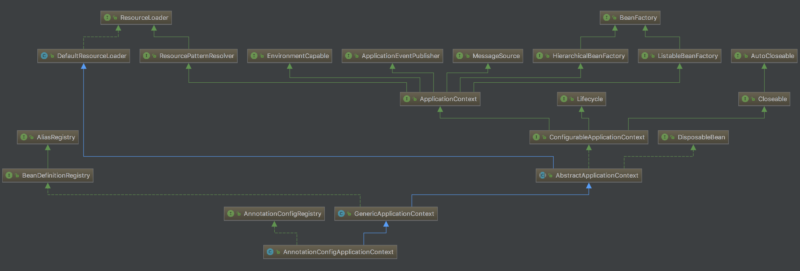
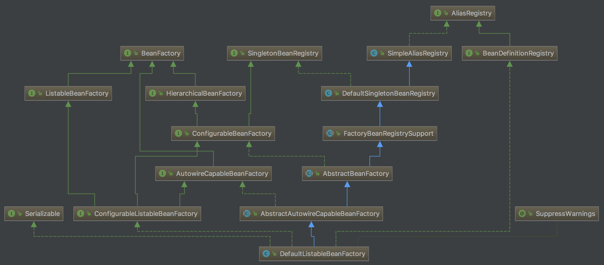

我们知道，在Spring中`BeanFactory`的地位相当高，它是各种`Bean`的工厂，提供了一系列与`Bean`交互的方法。我们用于初始化Spring的`AnnotationConfigApplicationContext`就继承它。这篇文章我们来分析一下`BeanFactory`的相关方法。
<!-- more -->
首先看一下`BeanFactory`的定义：

```java
public interface BeanFactory {
    /**
     * 用于解除FactoryBean实例的引用，区分FactoryBean和FactoryBean创建的bean。
     * 比如一个名为myJndiObject的FactoryBean，通过&myJndiObject返回的是factory，而不是factory返回的实例
     */
    String FACTORY_BEAN_PREFIX = "&";
    
    Object getBean(String name) throws BeansException;
    
    <T> T getBean(String name, Class<T> requiredType) throws BeansException;
    
    <T> T getBean(Class<T> requiredType) throws BeansException;
    
    Object getBean(String name, Object... args) throws BeansException;
    
    <T> T getBean(Class<T> requiredType, Object... args) throws BeansException;
    
    boolean containsBean(String name);
    
    boolean isSingleton(String name) throws NoSuchBeanDefinitionException;
    
    boolean isPrototype(String name) throws NoSuchBeanDefinitionException;
    
    boolean isTypeMatch(String name, ResolvableType typeToMatch) throws NoSuchBeanDefinitionException;
    
    boolean isTypeMatch(String name, Class<?> typeToMatch) throws NoSuchBeanDefinitionException;
    
    Class<?> getType(String name) throws NoSuchBeanDefinitionException;
    
    String[] getAliases(String name);
}
```

接着我们来看一下`BeanFactory`在`AnnotationConfigApplicationContext`中是如何被初始化的。

`AnnotationConfigApplicationContext`的继承关系如下：




可以看到，`AnnotationConfigApplicationContext`继承了`GenericApplicationContext`。`GenericApplicationContext`在构造函数中新建了一个`DefaultListableBeanFactory`。



后面的内容，我们来总结一下`BeanFactory`以及子类中经常用的几个方法。

## String[] getBeanNamesForType(Class<?> type, boolean includeNonSingletons, boolean allowEagerInit);

返回与给定类型(包括子类)相匹配的bean的名称，根据bean定义或FactoryBeans的getObjectType的值类判断。

注意，此方法仅反映顶级Bean。它不会检查可能与指定类型匹配的嵌套bean。

如果设置了"allowEagerInit"标志，考虑由FactoryBeans创建的对象，这意味着FactoryBeans将被初始化。如果FactoryBean创建的对象不匹配，则原始FactoryBean本身将与该类型匹配。如果未设置"allowEagerInit"，则只会检查原始FactoryBeans(不需要初始化每个FactoryBean)。

不考虑这个工厂可能参与的任何层次结构。使用BeanFactoryUtils的beanNamesForTypeIncludingAncestors也可以在祖先工厂中包含bean

注意：不会忽略通过除bean定义以外的其他方式注册的单例bean

使用此方法返回的bean名称应该尽可能始终按照后端配置中定义的顺序返回bean名称

## boolean isTypeMatch(String name, Resolvable typeToMatch)

检查给定的bean名称是否匹配指定的类型。更具体的说，检查`getBean(String)`方法返回的对象是否可以赋值给指定的目标类型。将别名翻译成相应的规范的bean名称。如果在工程实例中找不到这个bean则询问父级工厂。

## Object getBean(String name) throws BeansException

返回指定bean的实例，该实例可以是共享的或独立的

该方法允许Spring BeanFactory用作Singleton或Prototype设计模式的替代品。在Singleton bean的情况下，调用者可以保留对返回对象的引用。

## protected RootBeanDefinition getMergedLocalBeanDefinition(String beanName) throws BeansException

如果指定的bean对应一个子bean定义，则遍历父bean的定义返回一个合并的RootBeanDefinition。

## void registerBeanDefinition(String beanName, BeanDefinition beanDefinition) throws BeanDefinitionStoreException

注册一个新的bean definition。必须支持RootBeanDefinition和ChildBeanDefinition

## void addBeanPostProcessor(BeanPostProcessor beanPostProcessor)

增加一个新的BeanPostProcessor，新增的BeanPostProcessor会应用于这个beanFactory创建的bean。这个方法在factory构造的时候调用。

此处提交的Post-processors会按照注册的顺序来调用。任何通过实现`Ordered`接口来表达顺序的方式会被忽略。

注意，任何自动检测的post-processors（如ApplicationContext中的bean）将始终在以编程方式注册后应用。

## void registerResolvableDependency(Class<?> dependencyType, Object autowiredValue)

注册一个具有相应自动装载值的特殊依赖类型。

用于factory或者context引用，这些引用应该是可以自动装载的，但不在工厂中定义为bean。比如将ApplicationContext类型的依赖解析为bean所在的ApplicationContext实例

## void registerSingleton(String beanName, Object singletonObject)

在给定的bean名称下，将给定的现有对象注册为单例。

给定的实例应该被完全初始化；注册器不会执行任何初始化回调（特别是，它不会调用InitializingBean的afterPropertiesSet方法）。给定的实例也不会收到任何销毁回调（如DisposableBean）的销毁方法。

在完整BeanFactory中运行时：如果你的bean应该接收初始化和/或销毁回调，则应该注册一个bean定义而不是现有的实例。

该方法通常在注册器构造期间调用，但也可以用于单例的运行时注册。因此，注册器实现应该同步单例的访问；如果它支持BeanFactory对单例的懒惰初始化，它将不得不这样做（同步单例的访问）。

## public String[] getBeanDefinitionNames()

## BeanDefinition getBeanDefinition(String beanName)

## Object getSingleton(String beanName)

在已注册的单例列表中寻找给定名称的单例并返回。

只检查已经实例化的单例，而不会返回beanDefinition尚未初始化的的单例对象。

这个方法的主要目的是访问手动注册的单例(详见`registerSingleton(java.lang.String, java.lang.Object)`)。也可以用来访问一个bean definition定义的单例。

注意：这个方法不知道FactoryBean前缀或者别名。在获取单例实例前你需要先解析bean的正规名称。

## protected Object getObjectForBeanInstance(Object beanInstance, String name, String beanName, RootBeanDefinition mbd)

返回给定bean实例的对象，如果是FactoryBean则返回它创建的对象，否则返回bean实例本身

## BeanFactory getParentBeanFactory()

返回父级bean factory，如果没有则返回null

## protected void markBeanAsCreated(String beanName)

将指定的bean标记为已创建(或者即将被创建)。这允许bean工厂优化其缓存以重复创建指定的bean

## registerDependentBean


## Object getSingleton(String beanName, ObjectFactory<?> singletonFactory)

如果指定bean名称的bean已经被注册为单例则直接返回，否则创建并注册一个新的单例。

## protected abstract Object createBean(String beanName, RootBeanDefinition mbd, Object[] args) throws BeanCreationException

使用给定的merged bean definition和参数创建一个bean实例。如果bean definition是一个子类定义，则将其与父类定义合并。所有的bean检索方法都委托给这个方法来创建实际的bean。

## protected void addSingleton(String beanName, Object singletonObject)

将给定的单例对象添加到factory的单例缓存中。

## protected Object resolveBeforeInstantiation(String beanName, RootBeanDefinition mbd)

在bean初始化前调用`BeanPostProcessor`的`postProcessBeforeInstantiation`。如果调用`postProcessBeforeInstantiation`方法之后返回了一个非null的bean，则马上调用`BeanPostProcessor`的`postProcessAfterInitialization`方法。最后返回这个bean

## protected Class<?> determineTargetType(String beanName, RootBeanDefinition mbd, Class<?>... typesToMatch)

确定给定bean定义的目标类型

## protected Object doCreateBean(final String beanName, final RootBeanDefinition mbd, final Object[] args) throws BeanCreationException

真正创建规定的bean。在调用这个方法之前，所有的前置工作都已经完成了。

## protected BeanWrapper createBeanInstance(String beanName, RootBeanDefinition mbd, Object[] args)

为特定的bean创建一个新的实例，使用恰当的实例化策略：工程方法，构造函数自动装配，简单实例化

## protected void populateBean(String beanName, RootBeanDefinition mbd, BeanWrapper bw)

使用bean definition中的属性值来填充bean实例

## protected Object initializeBean(final String beanName, final Object bean, RootBeanDefinition mbd)

初始化给定的bean实例。包括调用factory的回调，以及init方法和bean post processor

## protected Class<?> resolveBeanClass(final RootBeanDefinition mbd, String beanName, final Class<?>... typesToMatch) throws CannotLoadBeanClassException

为给定的bean definition解析bean class，将bean class名称解析成类引用，保存解析后的类以供之后的使用。

## protected BeanWrapper instantiateUsingFactoryMethod(String beanName, RootBeanDefinition mbd, Object[] explicitArgs)

使用一个指定的工厂方法来实例化bean。如果mbd参数指定一个类而不是factoryBean，或者使用依赖注入配置的工厂对象本身的实例变量，则该方法可能是静态的。

## protected BeanWrapper autowireConstructor(String beanName, RootBeanDefinition mbd, Constructor<?>[] ctors, Object[] explicitArgs)

自动注入构造函数。

如果指定了显式的构造函数参数值，也应用它。将所有剩余的参数与bean工厂中的bean进行匹配

这对应于构造器注入：在这种模式下，Spring bean工厂能够托管期望基于构造器的依赖关系解析的组件。

## protected BeanWrapper instantiateBean(final String beanName, final RootBeanDefinition mbd)

使用默认的构造器实例化给定的bean

## protected void autowireByName(String beanName, AbstractBeanDefinition mbd, BeanWrapper bw, MutablePropertyValues pvs)

如果是根据名称来自动装配的，则使用本方法来填充缺失的属性值。

## protected void autowireByType(String beanName, AbstractBeanDefinition mbd, BeanWrapper bw, MutablePropertyValues pvs)

如果是根据类型来自动装配的，则使用本方法来填充缺失的属性值。

## protected void applyPropertyValues(String beanName, BeanDefinition mbd, BeanWrapper bw, PropertyValues pvs)

应用给定的属性值，将任何运行时引用解析到bean factory的其他bean中。必须使用深层复制，所以不会永久修改此属性。

## protected void invokeInitMethods(String beanName, final Object bean, RootBeanDefinition mbd) throws Throwable

这个时候所有的属性值都已经被设置了，该方法让bean有机会做出反应，并且有机会了解它拥有的bean工厂。这意味着需要检查bean是否实现了`InitializingBean`，或者自定义了一个init方法，如果有则调用必要的回调函数。

## protected void registerDisposableBeanIfNecessary(String beanName, Object bean, RootBeanDefinition mbd)

将给定的bean添加到此工厂中的一次性bean列表中，注册其DisposableBean接口和/或在工厂关闭时调用的销毁方法。只适用于单例

## protected Map<String, Object> findAutowireCandidates(String beanName, Class<?> requiredType, DependencyDescriptor descriptor)

寻找匹配所需要类型的bean实例。在给特定bean自动注入依赖时调用

## protected boolean isAutowireCandidate(String beanName, DependencyDescriptor descriptor, AutowireCandidateResolver resolver)

确定指定的bean定义是否有资格作为autowire候选者被注入到声明匹配类型依赖关系的其他bean中

