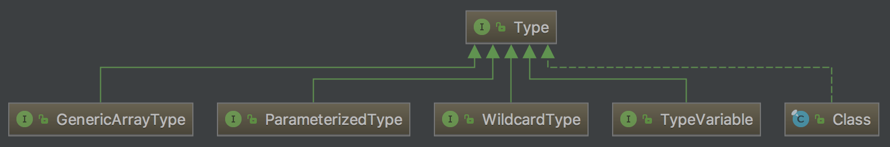

ResolvableType是Spring4提供的新的特性。它封装了Java类型，提供对父类，接口和通用参数的访问，提供最终解析为类的能力。

在jdk中，Type接口代表一种类型，所有的具体类型都需要实现这个接口。
<!-- more -->


从上图可以看出，Java语法中的类型可以分为5大类：

- 组件类型为参数化类型或类型变量的数组
- 参数化类型
- 通配符表达式类型
- 类型变量
- 所有定义的Class（每个类都是一个具体的类型）

除Class类以外的4个接口是jdk1.5以后出现的，因为单纯的Class类无法描述泛型信息

可以通过一段程序来直观看一下这5大类到底是什么：

```java
public class TypeDemo<T> {
    /**
     * GenericArrayType：组件类型为类型变量的数组
     */
    public T[] a;
    /**
     * GenericArrayType：组件类型为参数化类型的数组
     */
    public List<?>[] b;
    /**
     * ParameterizedType：参数化类型
     * List<? extends Object>携带的"? extedns Object"
     * 即通配符表达式，也就是WildcardType
     */
    public List<? extends Object> c;
    /**
     * Class：普通类型
     */
    public List d;
    /**
     * TypeVariable：类型变量
     */
    public T e;

    public static void main(String[] args) throws NoSuchFieldException {
        Field field;
        Type type;

        field = TypeDemo.class.getDeclaredField("a");
        type = field.getGenericType();
        System.out.println("type of a: " + type.getClass());
        System.out.println("typename of a: " + type.getTypeName());
        if (type instanceof GenericArrayType) {
            GenericArrayType genericArrayType = (GenericArrayType) type;
            Type t = genericArrayType.getGenericComponentType();
            System.out.println("type of a's component: " + t.getClass());
        }
        System.out.println("");

        field = TypeDemo.class.getDeclaredField("b");
        type = field.getGenericType();
        System.out.println("type of b: " + type.getClass());
        System.out.println("typename of b: " + type.getTypeName());
        if (type instanceof GenericArrayType) {
            GenericArrayType genericArrayType = (GenericArrayType) type;
            Type t = genericArrayType.getGenericComponentType();
            System.out.println("type of b's component: " + t.getClass());
        }
        System.out.println("");

        field = TypeDemo.class.getDeclaredField("c");
        type = field.getGenericType();
        System.out.println("type of c: " + type.getClass());
        System.out.println("typename of c: " + type.getTypeName());
        if (type instanceof ParameterizedType) {
            ParameterizedType parameterizedType = (ParameterizedType) type;
            Type[] actualTypeArguments = parameterizedType.getActualTypeArguments();
            for (Type actualTypeArg : actualTypeArguments) {
                System.out.println("type of c's component: " + actualTypeArg.getClass());
            }
        }
        System.out.println("");

        field = TypeDemo.class.getDeclaredField("d");
        type = field.getGenericType();
        System.out.println("type of d: " + type.getClass());
        System.out.println("typename of d: " + type.getTypeName());
        System.out.println("");

        field = TypeDemo.class.getDeclaredField("e");
        type = field.getGenericType();
        System.out.println("type of e: " + type.getClass());
        System.out.println("typename of e: " + type.getTypeName());

    }
}
```

输出结果为:

```
type of a: class sun.reflect.generics.reflectiveObjects.GenericArrayTypeImpl
typename of a: T[]
type of a's component: class sun.reflect.generics.reflectiveObjects.TypeVariableImpl

type of b: class sun.reflect.generics.reflectiveObjects.GenericArrayTypeImpl
typename of b: java.util.List<?>[]
type of b's component: class sun.reflect.generics.reflectiveObjects.ParameterizedTypeImpl

type of c: class sun.reflect.generics.reflectiveObjects.ParameterizedTypeImpl
typename of c: java.util.List<?>
type of c's component: class sun.reflect.generics.reflectiveObjects.WildcardTypeImpl

type of d: class java.lang.Class
typename of d: java.util.List

type of e: class sun.reflect.generics.reflectiveObjects.TypeVariableImpl
typename of e: T
```

随着泛型的使用越来越多，获取泛型实际类型信息的需求也会出现，如果使用原生API，需要很多步才能获取到泛型。比如：

```java
ParameterizedType parameterizedType = (ParameterizedType) ABService.class.getGenericInterfaces()[0];
Type genericType = parameterizedType.getActualTypeArguments()[1];
```

Spring提供的ResolvableType API，提供了更加简单易用的泛型操作支持：

```java
ResolvableType resolvableType = ResolvableType.forClass(ABService.class);
Type t = resolvableType.as(Service.class).getGeneric(1).resolve();
```

## ResolvableType详解

### 类型的泛型信息

假设我们的类定义如下：

```java
public interface Service<N, M> {
}

public class ABService implements Service<A, B> {
}

public class CDService implements Service<C, D> {
}
```
如下得到类的ResolvableType，然后得到泛型参数第一个位置的类型信息:

```java
ResolvableType resolvableType = ResolvableType.forClass(ABService.class);
resolvableType.as(Service.class).getGeneric(1).resolve();
```

通过`getGeneric()`（泛型参数索引）得到某个位置的泛型，`resolve()`把实际泛型参数解析出来

### 字段级别的泛型信息

假设我们的测试类如下：

```java
public class GenericInjectTest {
    private Service<A, B> abService;
    private Service<C, D> cdService;
    private List<List<String>> list;
    private Map<String, Map<String, Integer>> map;
    private List<String>[] array;

    private HashMap<String, List<String>> method() {
        return null;
    }

    public GenericInjectTest(List<List<String>> list, Map<String, Map<String, Integer>> map) {

    }
}
```

如下得到字段级别的ResolvableType:

```java
resolvableType = ResolvableType.forField(ReflectionUtils.findField(GenericInjectTest.class, "cdService"));
// 得到Service<C, D>第0个位置上的泛型实参类型，即C
resolvableType.getGeneric(0).resolve();
```

比如`List<List<String>> list`是一种嵌套的泛型用例，我们可以通过如下操作获取嵌套的String类型:

```java
resolvableType = ResolvableType.forField(ReflectionUtils.findField(GenericInjectTest.class, "list"));
resolvableType.getGeneric(0).getGeneric(0).resolve();
// 更简单的写法
resolvableType.getGeneric(0, 0).resolve();
```

比如`Map<String, Map<String, Integer>> map`我们想得到Integer，可以使用：

```java
resolvableType = ResolvableType.forField(ReflectionUtils.findField(GenericInjectTest.class, "map"));
resolvableType.getGeneric(1).getGeneric(1).resolve();
// 更简单的写法
resolvableType.getGeneric(1, 1).resolve();
```

### 方法返回值的泛型信息

得到method方法的返回值`HashMap<String, List<String>> method()`，然后获得Map中List中的String泛型实参:

```java
resolvableType = ResolvableType.forMethodReturnType(ReflectionUtils.findMethod(GenericInjectTest.class, "method"));
resolvableType.getGeneric(1, 0).resolve();
```

### 构造器参数的泛型信息

如下可以获得构造器第1个参数(`Map<String, Map<String, Integer>>`)中的Integer：

```java
resolvableType = ResolvableType.forConstructorParameter(ClassUtils.getConstructorIfAvailable(GenericInjectTest.class, List.class, Map.class), 1);
resolvableType.getGeneric(1, 0).resolve();
```

### 数组组件类型的泛型信息

对于`List<String>[] array`，如下获取List的泛型实参String：

```java
resolvableType = ResolvableType.forField(ReflectionUtils.findField(GenericInjectTest.class, "array"));
resolvableType.isArray();    // 判断是否是数组
resolvableType.getComponentType().getGeneric(0).resolve();
```

### 自定义泛型类型

```java
// 相当于创建一个List<String>类型
resolvableType = ResolvableType.forClassWithGenerics(List.class, String.class);
// 相当于创建一个List<String>[]类型数组
resolvableType = ResolvableType.forArrayComponent(resolvableType);
// 获得List<String>中String的类型信息
resolvableType.getComponentType().getGeneric(0).resolve();
```

### 泛型等价比较

如下创建一个`List<Integer>[]`数组和一个`List<String>[]`数组比较，将返回false

```java
ResolvableType resolvableType1 = ResolvableType.forClassWithGenerics(List.class, Integer.class);
ResolvableType resolvableType2 = ResolvableType.forClassWithGenerics(List.class, String.class);
resolvableType1.isAssignableFrom(resolvableType2);
```

## Spring中的泛型注入

// TODO

> https://my.oschina.net/lixin91/blog/677109
> http://jinnianshilongnian.iteye.com/blog/1993608
> http://blog.csdn.net/zbw18297786698/article/details/73441623
> https://clarkdo.js.org/java/spring/2014/07/03/9/


