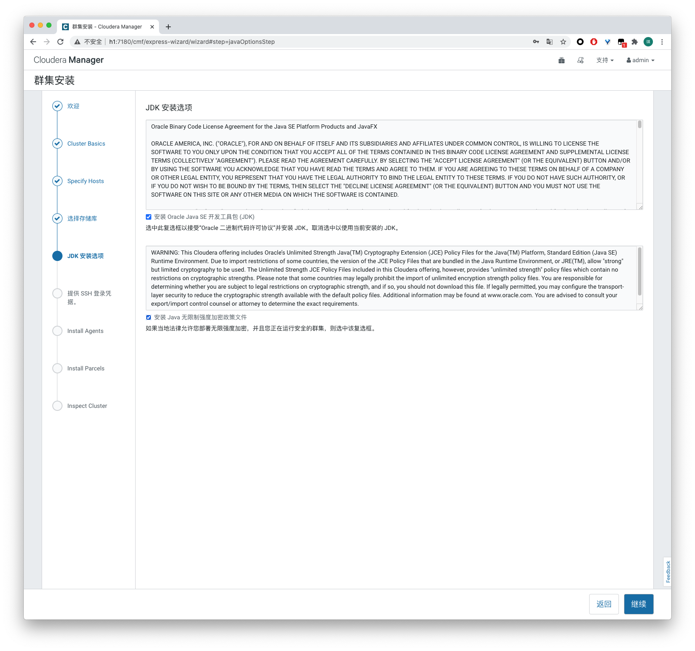

安装hadoop是一件比较麻烦的事情，特别是在需要安装的组件特别多、安装的主机特别多的情况下（例如几百台）。Cloudera公司提供了一个名为Cloudera Manager的工具，这个工具主要的功能有3个：集群自动化安装部署、集群监控、集群运维。

<!-- more -->

# 安装前的准备工作

## 准备3台机器

提前准备3台机器，操作系统为ubuntu 18.04。为了方便使用，在hosts文件中配置3台机器的ip：

`sudo vim /etc/hosts`

添加以下内容：

```
10.0.110.101 h1
10.0.110.102 h2
10.0.110.103 h3
```

## 设置root用户密码

```
sudo passwd root
```

允许使用root用户登录ssh：

```
sudo vim /etc/ssh/sshd_config
```

添加：`PermitRootLogin yes`

## 切换阿里源

```
sudo vim /etc/apt/sources.list
```

替换为：

```
deb http://mirrors.aliyun.com/ubuntu/ bionic main restricted universe multiverse
deb http://mirrors.aliyun.com/ubuntu/ bionic-security main restricted universe multiverse
deb http://mirrors.aliyun.com/ubuntu/ bionic-updates main restricted universe multiverse
deb http://mirrors.aliyun.com/ubuntu/ bionic-proposed main restricted universe multiverse
deb http://mirrors.aliyun.com/ubuntu/ bionic-backports main restricted universe multiverse
deb-src http://mirrors.aliyun.com/ubuntu/ bionic main restricted universe multiverse
deb-src http://mirrors.aliyun.com/ubuntu/ bionic-security main restricted universe multiverse
deb-src http://mirrors.aliyun.com/ubuntu/ bionic-updates main restricted universe multiverse
deb-src http://mirrors.aliyun.com/ubuntu/ bionic-proposed main restricted universe multiverse
deb-src http://mirrors.aliyun.com/ubuntu/ bionic-backports main restricted universe multiverse
```

## 安装JDK

JDK需要在3台机器上安装：

```
sudo apt-get install openjdk-8-jdk
```

## 安装mysql

mysql只需要在h1机器上安装即可

```
sudo apt-get install -yq mysql-server mysql-client libmysqlclient-dev libmysql-java
```

查看原始用户的信息：

```
sudo cat /etc/mysql/debian.cnf

# Automatically generated for Debian scripts. DO NOT TOUCH!
[client]
host     = localhost
user     = debian-sys-maint
password = Uvqpha8PHlwtsfXz
socket   = /var/run/mysqld/mysqld.sock
[mysql_upgrade]
host     = localhost
user     = debian-sys-maint
password = Uvqpha8PHlwtsfXz
socket   = /var/run/mysqld/mysqld.sock
```

使用`debian-sys-maint`用户以及密码登录mysql。

修改root用户的密码：

```
update mysql.user set authentication_string=password('123456') where user='root';
update mysql.user set plugin="mysql_native_password";
flush privileges;
```

允许root用户远程连接：

```
sudo nano /etc/mysql/mysql.conf.d/mysqld.cnf
```

将`bind-address=127.0.0.1`改成`bind-address=0.0.0.0`

设置root用户的连接权限：

```
GRANT ALL PRIVILEGES ON *.* TO 'root'@'%' IDENTIFIED BY '123456' WITH GRANT OPTION;
FLUSH PRIVILEGES;
```

## 安装ntp服务

CDH要求集群中的每台机器上配置网络时间协议（NTP）进行时间同步：

1. 安装ntp

```
sudo apt-get install ntp
```

2. 修改配置文件

`sudo vim /etc/ntp.conf`

添加以下的配置

```
server 0.pool.ntp.org
server 1.pool.ntp.org
server 2.pool.ntp.org
```

3. 重启ntp服务

`sudo service ntp restart`

4. 设置ntp服务开机自启

`sudo systemctl enable ntp`

## 设置时区

1. 执行`tzselect`，选择北京时间
2. 复制配置文件到`/etc`目录下:`sudo cp /usr/share/zoneinfo/Asia/Shanghai /etc/localtime`

## 禁用交换分区

```
sudo sysctl vm.swappiness=1
echo 'vm.swappiness=1' | sudo tee -a /etc/sysctl.conf
```

# 安装Cloudera Manager

Cloudera Manager提供3种安装方式：

- 第一种使用`cloudera-manager-installer.bin`安装程序来在线安装。
- 第二种使用`rpm`、`yum`、`apt-get`命令的方式来在线安装。
- 第三种使用`tarball`的方式离线安装

第一种方式是最方便的，就像安装一个客户端软件一下就可以。但是和第二种方式一样都属于在线安装，安装过程需要访问国外网站，整个过程非常慢，容易安装失败。

采用`tarball`的方式需要将安装包手动传到集群的每一台机器，安装起来比较繁琐。我们最终采用在线与离线两种安装方式的混搭：搭建本地源的方式来在线安装从而避开国外网站访问的限制。

## 本地源的搭建

1. 下载cm6的安装包

从[https://archive.cloudera.com/cm6/6.3.1/repo-as-tarball/](https://archive.cloudera.com/cm6/6.3.1/repo-as-tarball/)中下载`cm6.3.1-ubuntu1804.tar.gz`


2. 解压之后上传到局域网的某个nginx静态服务器中，路径为`/cm6/6.3.1/ubuntu1804/apt/`。如下图所示，如果可以正常访问，那么本地源就搞定了。


3. 每个节点都需要配置Cloudera Manager的离线源：

`sudo vim /etc/apt/sources.list.d/cloudera-manager.list`

添加本地源：

`deb [arch=amd64] http://10.0.102.99/cm6/6.3.1/ubuntu1804/apt/ bionic-cm6 contrib`

下载`archive.key`文件

`wget http://10.0.102.99/cm6/6.3.1/ubuntu1804/apt/archive.key`

添加`archive.key`文件，并更新源

```
sudo apt-key add archive.key
sudo apt-get update
```

## 安装Cloudera Manager包

在master节点中执行：

`sudo apt-get install cloudera-manager-daemons cloudera-manager-server cloudera-manager-agent`

在slave节点中执行：

`sudo apt-get install cloudera-manager-daemons cloudera-manager-agent`

## 设置数据库

### 创建CDH依赖的数据库以及用户

```
-- 创建数据库
-- Cloudera Manager Server
CREATE DATABASE scm DEFAULT CHARACTER SET utf8 DEFAULT COLLATE utf8_general_ci;
-- Activity Monitor
CREATE DATABASE amon DEFAULT CHARACTER SET utf8 DEFAULT COLLATE utf8_general_ci;
-- Reports Manager
CREATE DATABASE rman DEFAULT CHARACTER SET utf8 DEFAULT COLLATE utf8_general_ci;
-- Hue
CREATE DATABASE hue DEFAULT CHARACTER SET utf8 DEFAULT COLLATE utf8_general_ci;
-- Hive Metastore Server
CREATE DATABASE hive DEFAULT CHARACTER SET utf8 DEFAULT COLLATE utf8_general_ci;
-- Sentry Server
CREATE DATABASE sentry DEFAULT CHARACTER SET utf8 DEFAULT COLLATE utf8_general_ci;
-- Cloudera Navigator Audit Server
CREATE DATABASE nav DEFAULT CHARACTER SET utf8 DEFAULT COLLATE utf8_general_ci;
-- Cloudera Navigator Metadata Server
CREATE DATABASE navms DEFAULT CHARACTER SET utf8 DEFAULT COLLATE utf8_general_ci;
-- Oozie
CREATE DATABASE oozie DEFAULT CHARACTER SET utf8 DEFAULT COLLATE utf8_general_ci;
 
#创建用户并授权
GRANT ALL ON scm.* TO 'scm'@'%' IDENTIFIED BY 'scm123456';
GRANT ALL ON amon.* TO 'amon'@'%' IDENTIFIED BY 'amon123456';
GRANT ALL ON rman.* TO 'rman'@'%' IDENTIFIED BY 'rman123456';
GRANT ALL ON hue.* TO 'hue'@'%' IDENTIFIED BY 'hue123456';
GRANT ALL ON hive.* TO 'hive'@'%' IDENTIFIED BY 'hive123456';
GRANT ALL ON sentry.* TO 'sentry'@'%' IDENTIFIED BY 'sentry123456';
GRANT ALL ON nav.* TO 'nav'@'%' IDENTIFIED BY 'nav123456';
GRANT ALL ON navms.* TO 'navms'@'%' IDENTIFIED BY 'navms123456';
GRANT ALL ON oozie.* TO 'oozie'@'%' IDENTIFIED BY 'oozie123456';
```

### 设置Cloudera Manager数据库

```
cd /opt/cloudera/cm/schema/
sudo ./scm_prepare_database.sh mysql scm scm scm123456
sudo ./scm_prepare_database.sh mysql amon amon amon123456
sudo ./scm_prepare_database.sh mysql hue hue hue123456
sudo ./scm_prepare_database.sh mysql nav nav nav123456
sudo ./scm_prepare_database.sh mysql navms navms navms123456
sudo ./scm_prepare_database.sh mysql oozie oozie oozie123456
sudo ./scm_prepare_database.sh mysql rman rman rman123456
sudo ./scm_prepare_database.sh mysql sentry sentry sentry123456
```

## 下载CDH的parcels包

[https://archive.cloudera.com/cdh6/6.3.2/parcels/](https://archive.cloudera.com/cdh6/6.3.2/parcels/)


将CDH的parcels包下载到master节点的指定位置，执行：

```
cd /opt/cloudera/parcel-repo
wget https://archive.cloudera.com/cdh6/6.3.2/parcels/CDH-6.3.2-1.cdh6.3.2.p0.1605554-bionic.parcel
wget https://archive.cloudera.com/cdh6/6.3.2/parcels/CDH-6.3.2-1.cdh6.3.2.p0.1605554-bionic.parcel.sha1
wget https://archive.cloudera.com/cdh6/6.3.2/parcels/CDH-6.3.2-1.cdh6.3.2.p0.1605554-bionic.parcel.sha256
wget https://archive.cloudera.com/cdh6/6.3.2/parcels/manifest.json
mv CDH-6.3.2-1.cdh6.3.2.p0.1605554-bionic.parcel.sha1 CDH-6.3.2-1.cdh6.3.2.p0.1605554-bionic.parcel.sha
```

注意要将`CDH-6.3.2-1.cdh6.3.2.p0.1605554-bionic.parcel.sha1`文件重命名为`CDH-6.3.2-1.cdh6.3.2.p0.1605554-bionic.parcel.sha`。

## 启动服务

master节点执行：`sudo service cloudera-scm-server start`

slave节点执行：`sudo service cloudera-scm-agent start`

## 配置Cloudera Manager

访问`http://h1:7180/`来配置Cloudera Manager

1. 设置集群名称


2. 向集群中添加机器


3. 选择存储库


4. 安装JDK




5. 添加集群中机器的用户名密码


6. 配置集群中所有机器


7. 在集群中安装CDH


8. 检查整个集群


选择`I understand the riks, let me continue with cluster setup`。

9. 选择安装的服务


10. 耐心等待整个集群服务安装成功


11. 服务全部启动成功


## 测试hadoop

```
sudo -u hdfs hadoop jar /opt/cloudera/parcels/CDH-6.3.2-1.cdh6.3.2.p0.1605554/lib/hadoop-mapreduce/hadoop-mapreduce-examples.jar pi 100 100
```

在yarn的监控页面我们看到任务正在运行。


成功运行说明我们的hadoop已经安装成功了。


