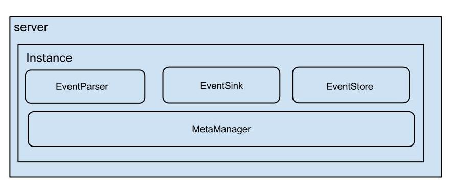

本文介绍canal的一个核心类`CanalServerWithNetty`以及与client之间的交互。

<!-- more -->

canal的架构如下图所示：



server代表一个canal运行实例，对应一个jvm。instance对应于一个数据队列。1个server可以对应多个instance。

server是最外层的服务类，它的核心接口为`CanalServer`，其中有2个实现类：`CanalServerWithNetty`、`CanalServerWithEmbedded`。

`CanalServerWithEmbedded`是直接与`CanalInstance`打交道的server。可以直接在应用中嵌入`CanalServerWithEmbedded`，这样我们就可以直接读取binlog信息，如此一来同步binlog信息的效率会更高。但是对于使用者的技术要求比较高。所以一般我们不会直接使用`CanalServerWithEmbedded`。我们在前文[canal——代码初读][1]说到过`canal 1.1.x`版本之后，canal原生支持kafka消息投递，原理就是canal加入了一个`CanalMQStarter`，在`CanalMQStarter`中直接使用`CanalServerWithEmbedded`读取binlog信息，然后发送到mq中。

在之前的版本中（1.1.x版本之后也可以指定`canal.serverMode`为`tcp`）canal会启动一个`CanalServerWithNetty`来与canal client进行通信，所有的canal client的请求统一由`CanalServerWithNetty`接受，之后`CanalServerWithNetty`会将客户端请求派给`CanalServerWithEmbedded`进行真正的处理。`CanalServerWithEmbedded`内部维护了多个canal instance，每个canal instance伪装成不同的mysql实例的slave，而`CanalServerWithEmbedded`会根据客户端请求携带的destination参数确定要由哪一个canal instance为期提供服务。

# CanalServerWithNetty

## 新建

`CanalServerWithNetty`类中包含以下变量：

```java
private CanalServerWithEmbedded embeddedServer;
private String                  ip;
private int                     port;
private Channel                 serverChannel = null;
private ServerBootstrap         bootstrap     = null;
private ChannelGroup            childGroups   = null;
```

其中`embeddedServer`是内嵌的server，最终的请求将委派给`embeddedServer`进行处理。`ip`和`port`是netty监听的网络ip和端口。`Channel`、`ServerBootstrap`、`ChannelGroup`是netty的配置。

`CanalServerWithNetty`是单例，调用`instance()`方法获取实例。在构造函数中设置`embeddedServer`、`childGroups`。

## 启动

`CanalServerWithNetty`在`start()`方法中启动netty服务：

1. 如果`embeddedServer`没有启动则先调用`start()`方法启动`CanalServerWithEmbedded`
2. 新建`ServerBootstrap`
3. 设置netty的参数`child.keepAlive`为`true`，`child.tcpNoDelay`为`true`
4. 加入pipeline：`FixedHeaderFrameDecoder`、`HandshakeInitializationHandler`、`ClientAuthenticationHandler`、`SessionHandler`

其中`FixedHeaderFrameDecoder`用于解析header头信息。

`HandshakeInitializationHandler`用于向client发送握手信息。

`ClientAuthenticationHandler`用户认证client身份，认证成功后向pipeline加入`IdleStateHandler`和`IdleStateAwareChannelHandler`用于发送心跳保持连接。

`SessionHandler`用于真正的处理客户端请求，下面我们来分析`SessionHandler`

### SessionHandler

netty接收到请求后，核心的处理逻辑都在`SessionHandler`中，我们来看它的`messageReceived`方法。

首先判断消息类型，将请求委派给`embeddedServer`处理。一共有5中类型：

- SUBSCRIPTION：客户端订阅请求，调用`embeddedServer.subscribe`方法
- UNSUBSCRIPTION：客户端取消订阅请求，调用`embeddedServer.unsubscribe`方法
- GET：获取binlog请求，调用`embeddedServer.getWithoutAck`方法
- CLIENTACK：客户端消费成功ack请求，调用`embeddedServer.ack`方法
- CLIENTROLLBACK：客户端消费失败回滚请求，调用`embeddedServer.rollback`方法

embeddedServer的相关方法在[canal——binlog消费位点的控制][2]中已经有所介绍，这里不再赘述。

# client

前面我们介绍了`CanalServerWithNetty`。它使用netty启动一个服务端，接收并在`SessionHandler`类中处理客户端的请求，根据不同的消息类型将请求委派给`CanalServerWithEmbedded`来处理。

接下来我们来介绍与`CanalServerWithNetty`交互的客户端。

首先介绍client的运行步骤：

- 新建`CanalConnector`
- 调用`CanalConnector.connect`方法连接服务端
- 调用`CanalConnector.subscribe`方法向服务端注册客户端信息
- 接着循环调用`CanalConnector.getWithoutAck`方法获取binlog数据。如果消费成功调用`CanalConnector.ack`方法确认数据，否则调用`CanalConnector.rollback`方法回滚数据

`CanalConnector`有两个实现类：`SimpleCanalConnector`、`ClusterCanalConnector`。

## SimpleCanalConnector

`SimpleCanalConnector`是执行与server交互的最终类，`ClusterCanalConnector`的功能其实也是委托给`SimpleCanalConnector`完成，因此我们首先介绍`SimpleCanalConnector`。

`connect`方法调用`doConnect`方法执行连接操作。客户端对网络的操作没有使用netty，而是直接使用了jdk nio方法。其步骤如下：

1. 与服务端建立连接
2. 接收并验证服务端返回的握手信息
3. 向服务端发送客户端的验证信息
4. 接收并验证服务端返回的应答信息

如果前面的步骤完成并验证成功，则客户端与服务端的连接建立成功。

`subscribe`方法向服务端发送`SUBSCRIPTION`类型的数据包，其中包含`destination`、`clientId`、`filter`信息。接收并验证服务端返回的应答信息

`getWithoutAck`方法向服务端发送`GET`类型的数据包，其中包含`autoAck`、`destination`、`clientId`、`fetchSize`、`timeout`、`unit`信息。接收服务端的信息，将其转换成`Message`并返回。

`ack`方法向服务端发送`CLIENTACK`类型的数据包，其中包含`destination`、`clientId`、`batchId`信息

`rollback`方法向服务端发送`CLIENTROLLBACK`类型的数据包，其中包含`destination`、`clientId`、`batchId`信息

## ClusterCanalConnector

`ClusterCanalConnector`是集群版本connector实现，自带故障转移功能。它会监听zookeeper，如果server发生了故障，可以自动重新连接新的server。

### CanalNodeAccessStrategy

首先介绍一下`CanalNodeAccessStrategy`，这是一个集群节点访问控制接口：

```java
public interface CanalNodeAccessStrategy {
    /**
     * 返回当前运行的server节点
     */
    SocketAddress currentNode();
    /**
     * 挑选一个server节点
     */
    SocketAddress nextNode();
}
```

它有了两个实现类：`SimpleNodeAccessStrategy`、`ClusterNodeAccessStrategy`。

如果我们在创建`CanalConnector`时指定了所有的canal server，则使用`SimpleNodeAccessStrategy`。`SimpleNodeAccessStrategy`比较简单，就是从新建时指定的server列表中挑选server。

如果我们在创建`CanalConnector`时指定了zookeeper的地址，则使用`ClusterNodeAccessStrategy`。`ClusterNodeAccessStrategy`会从zookeeper中读取server列表，然后从server列表中挑选server。

`ClusterNodeAccessStrategy`在新建时会创建两个zookeeper的监听：

```java
childListener = new IZkChildListener() {
    public void handleChildChange(String parentPath, List<String> currentChilds) throws Exception {
        initClusters(currentChilds);
    }
};

dataListener = new IZkDataListener() {
    public void handleDataDeleted(String dataPath) throws Exception {
        runningAddress = null;
    }
    public void handleDataChange(String dataPath, Object data) throws Exception {
        initRunning(data);
    }
};
```

其中`childListener`监听zookeeper的`/otter/canal/destinations/{destination}/cluster`目录，如果目录下的数据有变动说明canal server有变动，这个时候调用`initClusters`方法重新读取server列表。

`dataListener`监听zookeeper的`/otter/canal/destinations/{destination}/running`节点，如果这个节点的数据有变动说明正在运行的server发生了切换，这个时候调用`initRunning`方法获取正在运行的server节点。

### ClusterCanalConnector建立连接

回到`ClusterCanalConnector`，来看新建`ClusterCanalConnector`的连接建立过程：

1. 新建`SimpleCanalConnector`
2. 设置超时时间
3. 设置filter
4. 如果`accessStrategy`是`ClusterNodeAccessStrategy`类，则调用`setZkClientx`方法设置zookeeper地址
5. 调用`connect()`方法与服务端建立连接

唯一需要关注的是第4步，`setZkClientx`方法：

```java
public void setZkClientx(ZkClientx zkClientx) {
    this.zkClientx = zkClientx;
    initClientRunningMonitor(this.clientIdentity);
}
```

`setZkClientx`方法处理保存zookeeper的地址，还调用`initClientRunningMonitor`方法初始化client运行时监视器`ClientRunningMonitor`。

#### ClientRunningMonitor

`ClientRunningMonitor`的作用是监听客户端的运行。其在`SimpleCanalConnector`的`initClientRunningMonitor`被创建：

```java
private synchronized void initClientRunningMonitor(ClientIdentity clientIdentity) {
    if (zkClientx != null && clientIdentity != null && runningMonitor == null) {
        ClientRunningData clientData = new ClientRunningData();
        clientData.setClientId(clientIdentity.getClientId());
        clientData.setAddress(AddressUtils.getHostIp());

        runningMonitor = new ClientRunningMonitor();
        runningMonitor.setDestination(clientIdentity.getDestination());
        runningMonitor.setZkClient(zkClientx);
        runningMonitor.setClientData(clientData);
        runningMonitor.setListener(new ClientRunningListener() {

            public InetSocketAddress processActiveEnter() {
                InetSocketAddress address = doConnect();
                mutex.set(true);
                if (filter != null) { // 如果存在条件，说明是自动切换，基于上一次的条件订阅一次
                    subscribe(filter);
                }

                if (rollbackOnConnect) {
                    rollback();
                }

                return address;
            }

            public void processActiveExit() {
                mutex.set(false);
                doDisconnnect();
            }

        });
    }
}
```

新建`ClientRunningMonitor`时，分别设置了`clientData`、`destination`、`zkClientx`以及一个回调方法。

`SimpleCanalConnector`在建立连接时调用`ClientRunningMonitor`的`start()`方法来启动。

`ClientRunningMonitor`的启动过程分为两步：

第一步：在zookeeper的`/otter/canal/destinations/{destination}/{clientId}/running`节点上设置监听：

```java
dataListener = new IZkDataListener() {

    public void handleDataChange(String dataPath, Object data) throws Exception {
        MDC.put("destination", destination);
        ClientRunningData runningData = JsonUtils.unmarshalFromByte((byte[]) data, ClientRunningData.class);
        if (!isMine(runningData.getAddress())) {
            mutex.set(false);
        }

        if (!runningData.isActive() && isMine(runningData.getAddress())) { // 说明出现了主动释放的操作，并且本机之前是active
            release = true;
            releaseRunning();// 彻底释放mainstem
        }

        activeData = (ClientRunningData) runningData;
    }

    public void handleDataDeleted(String dataPath) throws Exception {
        MDC.put("destination", destination);
        mutex.set(false);
        // 触发一下退出,可能是人为干预的释放操作或者网络闪断引起的session expired timeout
        processActiveExit();
        if (!release && activeData != null && isMine(activeData.getAddress())) {
            // 如果上一次active的状态就是本机，则即时触发一下active抢占
            initRunning();
        } else {
            // 否则就是等待delayTime，避免因网络瞬端或者zk异常，导致出现频繁的切换操作
            delayExector.schedule(new Runnable() {

                public void run() {
                    initRunning();
                }
            }, delayTime, TimeUnit.SECONDS);
        }
    }

};
```

如果`/otter/canal/destinations/{destination}/{clientId}/running`节点数据被删除：

1. 调用`processActiveExit()`断开当前client的连接
2. 如果上一次active的client就是本机，调用`initRunning`方法开始运行本机的client。`initRunning`方法会调用`processActiveEnter()`方法建立与server的连接
3. 否则等待一定时间再调用`initRunning`方法开始运行本机的client。

如果`/otter/canal/destinations/{destination}/{clientId}/running`节点数据发生了变化：

1. 读取节点的数据
2. 如果数据显示本机的client状态变成了非active，说明出现了主动释放的操作。调用`releaseRunning`方法释放本机的连接。`releaseRunning`方法会调用`processActiveExit()`断开当前client的连接

第二步：调用`initRunning`方法开始运行本机的client。

# 总结

本文我们介绍了`CanalServerWithNetty`以及server与从client的交互。

对于`CanalServerWithNetty`来说，它的功能是使用netty启动一个server，接收请求，通过判断请求消息的类型委托给`CanalServerWithEmbedded`来处理，并将处理完的数据返回给client。

对于client来说，我们介绍了两个`CanalConnector`的实现类：`SimpleCanalConnector`、`ClusterCanalConnector`。

`CanalConnector`承担了建立连接、订阅客户端、获取binlog数据、确认batchId、回滚batchId的功能。

其中`SimpleCanalConnector`实现类完成了这一系列的功能，而`ClusterCanalConnector`在`SimpleCanalConnector`的基础上通过监听zookeeper增加了故障转移的功能。


[1]: /articles/canal/canal——代码初读.html
[2]: /articles/canal/canal——binlog消费位点的控制.html

> http://www.tianshouzhi.com/api/tutorials/canal/382
> https://github.com/alibaba/canal/wiki/Introduction

