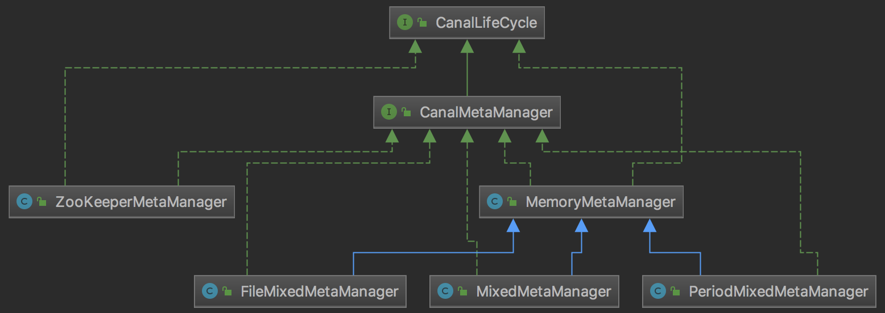

canal是一个订阅消费模式的服务，于是其消费位点的控制就非常重要，在正常情况或者重启canal之后都要保证不重复消费同一个位点，也不能漏掉某一个位点。本文我们来看看canal是如何控制消费位点的。

<!-- more -->

首先我们来分析客户端是如何工作，前文[canal——代码初读][1]我们分析过`CanalMQStarter`的启动过程会为每个destination都新建一个`CanalMQRunnable`，在不同的线程中来执行`CanalMQRunnable`。`CanalMQRunnable`的执行调用`CanalMQStarter`的`worker`方法。数据的消费与传输都在这个`worker`方法中执行。

# CanalMQStarter.work

首先是一个准备过程：

1. 新建ClientIdentity，作为client的标识
2. 从`canalServer`（`CanalServerWithEmbedded`）中获取instance
3. 新建`CanalDestination`，这个类保存了mq的配置信息
4. 调用`canalServer.subscribe`向`CanalServerWithEmbedded`中注册client的信息

    1. 调用`checkStart`确保destination对应的instance已经启动
    2. 获取instance中保存的`CanalMetaManager`，`CanalMetaManager`是meta信息的管理器，其中保存着关键的position信息
    3. 判断`CanalMetaManager`是否已经启动，如果没有启动则调用`start()`方法启动`CanalMetaManager。`正常情况下`CanalMetaManager`在instance启动时已经被启动了。
    4. 调用`CanalMetaManager`的`subscribe`方法在`CanalMetaManager`中增加订阅信息
    5. 调用`CanalMetaManager`的`getCursor`方法获取当前订阅binlog的位置信息
    6. 如果position为null，说明之前没有记录position信息：
    
        1. 从`CanalEventStore`中获取保存的第一条数据的position信息
        2. 如果`CanalEventStore`中保存的position信息不为null，调用`CanalMetaManager`的`updateCursor`方法更新`CanalMetaManager`中保存的position信息

    7. 调用`CanalInstance`的`subscribeChange`方法，通知`CanalInstance`订阅关系变化

        1. 如果`identity`中设置的`filter`过滤条件不为空，则将其设置到`eventParser`中

前面的准备过程基本就是一个向`CanalMetaManager`注册客户端并处理消费位点的工作。

接下来是循环读取数据的过程：

1. 调用`CanalServerWithEmbedded`的`getWithoutAck`方法获取binlog消息。

    `getWithoutAck`方法一次获取一批（batch）的binlog，canal会为这批binlog生成一个唯一的batchId。客户端如果消费成功，则调用ack方法对这个批次的数据进行确认。如果失败的话，可以调用rollback方法进行回滚。客户端可以连续多次调用`getWithoutAck`方法来获取binlog，在ack的时候，需要按照获取到binlog的先后顺序进行ack。如果后面获取的binlog被ack了，那么之前没有ack的binlog消息也会自动被ack。

    注意`getWithoutAck`方法中有一个`synchronized (canalInstance)`代码，即虽然`destination`可以对应多个客户端，但是每个客户端不能并发获取binlog消息。

    1. 调用`CanalMetaManager`的`getLastestBatch`方法获取到该`clientIdentity`消费的最新的位置，保存在`PositionRange`中。这是为了确定从哪个位置开始继续消费binlog。
    2. 从`CanalEventStore`中读取数据，保存在`events`中：

        1. 如果`PositionRange`不为null，从`CanalEventStore`中获取`PositionRange`开始位置之后的数据
        2. 如果`PositionRange`为null，说明是ack后第一次获取数据：

            1. 调用`CanalMetaManager`的`getCursor(ClientIdentity clientIdentity)`方法获取cursor游标`start`。如果`start`为null，调用`CanalEventStore`的`getFirstPosition`方法获取`CanalEventStore`中保存的第一条数据
            2. 从`CanalEventStore`中获取`start`之后的数据

    3. 将`events`包装成`Message`返回：

        1. 如果`events`为空，返回空的`Message`，batchId设置为`-1`。
        2. 如果`events`不为空，调用`CanalMetaManager`的`addBatch`方法记录`PositionRange`，返回一个唯一的batchId。将`events`做相应转换之后包装成`Message`返回。
    
    根据位置从`CanalEventStore`中获取binlog数据，为了尽量提高效率，一般一次获取一批binlog，而不是获取一条。这个批次的大小（batchSize）由客户端指定。同时客户端可以指定超时时间，在超时时间内，如果获取到了batchSize的binlog，会立即返回。如果超时了还没有获取到batchSize指定的binlog个数，也会立即返回。特别的，如果没有设置超时时间，没有获取到binlog也会立即返回。
    
    在`CanalMetaManager`中记录这个批次的binlog消息。`CanalMetaManager`会为获取到的这个批次的binlog生成一个唯一的batchId。batchId是递增的，如果binlog信息为空，则直接把batchId设置为`-1`。

2. 如果`message`不为空，将数据发送到mq中

    1. 如果发送成功，调用`CanalServerWithEmbedded`的`ack`方法确认小于batchId的消息已经被消费。

        1. 调用`CanalMetaManager`的`removeBatch`删除batchId表示的`PositionRange`数据
        2. 调用`CanalMetaManager`的`updateCursor`方法更新cursor
        3. 调用`CanalEventStore`的`ack`方法删除经过确认的数据

    2. 如果发送失败，调用`CanalServerWithEmbedded`的`rollback`方法回滚batchId表示的数据

        1. 调用`CanalMetaManager`的`removeBatch`删除batchId表示的`PositionRange`数据
        2. 调用`CanalEventStore`的`rollback`方法回滚到指定的位置

下面我们来分析其中涉及到的细节。

# CanalMetaManager

从前面的分析中，消费位点控制最关键的是`CanalMetaManager`类。`CanalMetaManager`主要用于记录客户端获取的未ack的`PositionRange`日志信息（开始位置、结束位置、ack位置以及对应的batchId），实现重试功能，保证数据传输的可靠性。提供如下功能：

- 订阅行为处理：记录`destination`和`ClientIdentity`的对应关系
- 未ack日志记录行为处理：通过`MemoryClientIdentityBatch`来实现获取指定batchId、最新或者第一个未ack日志的`PositionRange`。
- 添加、获取未ack的日志记录：通过从eventstore中获取指定数量的event的`PositionRange`后（并不保存数据信息），添加到`CanalMetaManager`中，并通过唯一batchId进行绑定，支持通过batchId获取未ack日志记录的功能。
- 删除已经ack日志记录的行为：通过batchId删除已经ack过的日志记录。注意：ack和rollback必须按照分发处理的顺序处理，即只能ack当前最小的batchId。不然容易出现丢数据的问题。
- 获取、清空所有未处理ack日志：获取和清空`MemoryClientIdentityBatch`中的记录
- 更新最近被ack的日志文件位置：从`PositionRange`中获取应该ack的`Position`位置，进行更新到cursor游标中

下面我们来分析`CanalMetaManager`类。



如上图所示，`CanalMetaManager`是一个接口，其中有5个实现类。canal是如何来选择实现类的呢？前文[canal——代码初读][1]我们提到过canal的实例是通过Spring来生成的，生成实例配置的时候会指定`xml`文件，Spring就是通过这个`xml`文件来生成实例。

默认可以选择以下几种`xml`文件，后面写上了它选择的`CanalMetaManager`实现类：

- spring/default-instance.xml：PeriodMixedMetaManager
- spring/file-instance.xml：FileMixedMetaManager
- spring/group-instance.xml：MemoryMetaManager
- spring/memory-instance.xml：MemoryMetaManager

可以看到不同的`xml`配置文件，选择的`CanalMetaManager`实现类是不同的。其中最为重要的是`MemoryMetaManager`，其中几个实现类也是基于它实现的。

下面我们来分析`MemoryMetaManager`类。

## MemoryMetaManager

如名称所示，`MemoryMetaManager`将日志消费位点信息记录在内存中。

它有3个变量：

```java
protected Map<String, List<ClientIdentity>>              destinations;
protected Map<ClientIdentity, MemoryClientIdentityBatch> batches;
protected Map<ClientIdentity, Position>                  cursors;
```

`destinations`中保存的是每个destination对应的客户端（从中可以看出针对一个destination可以启动多个客户端）

`batches`中保存的是客户端消费的log位置范围

`cursors`中保存的是客户端应答后的log位置

下面说明一下其中涉及的类：

- `ClientIdentity`：

    客户端的标识。其中保存着以下3个字段：
    
    ```java
    private String            destination;
    private short             clientId;
    private String            filter;
    ```
    
    `clientId`默认为`1001`
    
- `MemoryClientIdentityBatch`：

    客户端消费的批量数据。其中保存着以下3个字段：
    
    ```java
    private ClientIdentity           clientIdentity;
    private Map<Long, PositionRange> batches          = new MapMaker().makeMap();
    private AtomicLong               atomicMaxBatchId = new AtomicLong(1);
    ```
    
    `batches`中保存着batchId和`PositionRange`的对应关系。`PositionRange`中保存日志的开始位置、结束位置和ack位置。
    
    `atomicMaxBatchId`记录最大的batchId。

- `Position`：

    `Position`是一个抽象类，其实现类`LogPosition`用于标识数据库日志位置。
    
    其中保存着一下2个字段：
    
    ```java
    private LogIdentity       identity;
    private EntryPosition     postion;
    ```
    
    `LogIdentity`是数据库日志标识。保存着canal server的`slaveId`和`sourceAddress`信息
    
    `EntryPosition`是数据库对象标识。保存着`included`、`journalName`、`position`、`serverId`、`gtid`、`timestamp`信息
    
下面来分析`MemoryMetaManager`的几个方法：

### subscribe相关的方法

subscribe相关的方法有如下4个，具体代码略

```java
/**
 * 增加一个 client订阅 <br/>
 * 如果 client已经存在，则不做任何修改
 */
void subscribe(ClientIdentity clientIdentity) throws CanalMetaManagerException;

/**
 * 判断是否订阅
 */
boolean hasSubscribe(ClientIdentity clientIdentity) throws CanalMetaManagerException;

/**
 * 取消client订阅
 */
void unsubscribe(ClientIdentity clientIdentity) throws CanalMetaManagerException;

/**
 * 根据指定的destination列出当前所有的clientIdentity信息
 */
List<ClientIdentity> listAllSubscribeInfo(String destination) throws CanalMetaManagerException;
```

主要的功能就是围绕`destinations`变量，在`ClientIdentity`列表中增减数据。本质上就是在`destinations`中记录`ClientIdentity`数据，来表示客户端正在订阅数据。删除订阅则是删除`destinations`中的`ClientIdentity`数据。

### cursor相关的方法

cursor相关的方法有如下2个，具体代码略

```java
/**
 * 获取 cursor 游标
 */
Position getCursor(ClientIdentity clientIdentity) throws CanalMetaManagerException;

/**
 * 更新 cursor 游标
 */
void updateCursor(ClientIdentity clientIdentity, Position position) throws CanalMetaManagerException;
```

cursor相关的方法也是简单地围绕`cursors`记录`ClientIdentity`对应的`Position`信息。

### batch相关的方法

batch相关的方法有如下8个，具体代码略

```java
/**
 * 获得该client最新的一个位置
 */
PositionRange getFirstBatch(ClientIdentity clientIdentity) throws CanalMetaManagerException;

/**
 * 获得该clientId最新的一个位置
 */
PositionRange getLastestBatch(ClientIdentity clientIdentity) throws CanalMetaManagerException;

/**
 * 为 client 产生一个唯一、递增的id
 */
Long addBatch(ClientIdentity clientIdentity, PositionRange positionRange) throws CanalMetaManagerException;

/**
 * 指定batchId，插入batch数据
 */
void addBatch(ClientIdentity clientIdentity, PositionRange positionRange, Long batchId) throws CanalMetaManagerException;

/**
 * 根据唯一messageId，查找对应的数据起始信息
 */
PositionRange getBatch(ClientIdentity clientIdentity, Long batchId) throws CanalMetaManagerException;

/**
 * 对一个batch的确认
 */
PositionRange removeBatch(ClientIdentity clientIdentity, Long batchId) throws CanalMetaManagerException;

/**
 * 查询当前的所有batch信息
 */
Map<Long, PositionRange> listAllBatchs(ClientIdentity clientIdentity) throws CanalMetaManagerException;

/**
 * 清除对应的batch信息
 */
void clearAllBatchs(ClientIdentity clientIdentity) throws CanalMetaManagerException;
```

这些方法获取`batches`中保存的`MemoryClientIdentityBatch`，调用`MemoryClientIdentityBatch`类中的相应方法：

```java
public synchronized void addPositionRange(PositionRange positionRange, Long batchId) {
    updateMaxId(batchId);
    batches.put(batchId, positionRange);
}

public synchronized Long addPositionRange(PositionRange positionRange) {
    Long batchId = atomicMaxBatchId.getAndIncrement();
    batches.put(batchId, positionRange);
    return batchId;
}

public synchronized PositionRange removePositionRange(Long batchId) {
    if (batches.containsKey(batchId)) {
        Long minBatchId = Collections.min(batches.keySet());
        if (!minBatchId.equals(batchId)) {
            // 检查一下提交的ack/rollback，必须按batchId分出去的顺序提交，否则容易出现丢数据
            throw new CanalMetaManagerException(String.format("batchId:%d is not the firstly:%d",
                batchId,
                minBatchId));
        }
        return batches.remove(batchId);
    } else {
        return null;
    }
}

public synchronized PositionRange getPositionRange(Long batchId) {
    return batches.get(batchId);
}

public synchronized PositionRange getLastestPositionRange() {
    if (batches.size() == 0) {
        return null;
    } else {
        Long batchId = Collections.max(batches.keySet());
        return batches.get(batchId);
    }
}

public synchronized PositionRange getFirstPositionRange() {
    if (batches.size() == 0) {
        return null;
    } else {
        Long batchId = Collections.min(batches.keySet());
        return batches.get(batchId);
    }
}

public synchronized Map<Long, PositionRange> listAllPositionRange() {
    Set<Long> batchIdSets = batches.keySet();
    List<Long> batchIds = Lists.newArrayList(batchIdSets);
    Collections.sort(Lists.newArrayList(batchIds));

    return Maps.newHashMap(batches);
}

public synchronized void clearPositionRanges() {
    batches.clear();
}

private synchronized void updateMaxId(Long batchId) {
    if (atomicMaxBatchId.get() < batchId + 1) {
        atomicMaxBatchId.set(batchId + 1);
    }
}
```

可以看到，`MemoryClientIdentityBatch`中方法就是围绕着`batches`变量对`PositionRange`进行增删改查。

## PeriodMixedMetaManager

我们再来看看`PeriodMixedMetaManager`，它是`default-instance.xml`中定义的`CanalMetaManager`实现。

它和`MemoryMetaManager`的主要区别就是增加了一个定时任务：

```java
updateCursorTasks = Collections.synchronizedSet(new HashSet<ClientIdentity>());

// 启动定时工作任务
executor.scheduleAtFixedRate(new Runnable() {

    public void run() {
        List<ClientIdentity> tasks = new ArrayList<ClientIdentity>(updateCursorTasks);
        for (ClientIdentity clientIdentity : tasks) {
            try {
                // 定时将内存中的最新值刷到zookeeper中，多次变更只刷一次
                zooKeeperMetaManager.updateCursor(clientIdentity, getCursor(clientIdentity));
                updateCursorTasks.remove(clientIdentity);
            } catch (Throwable e) {
                // ignore
                logger.error("period update" + clientIdentity.toString() + " curosr failed!", e);
            }
        }
    }
}, period, period, TimeUnit.MILLISECONDS);
```

该定时任务的主要功能就是获取内存中保存的`cursor`数据，将其保存到zookeeper中。当canal重启之后能获得之前已经处理过的`cursor`数据，canal就可以从这个位置接下去获取新的数据。

更新`cursor`的操作在`updateCursor`方法中触发：

```java
public void updateCursor(ClientIdentity clientIdentity, Position position) throws CanalMetaManagerException {
    super.updateCursor(clientIdentity, position);
    updateCursorTasks.add(clientIdentity);// 添加到任务队列中进行触发
}
```

## FileMixedMetaManager

再来看看`FileMixedMetaManager`，它是`file-instance.xml`中定义的`CanalMetaManager`实现。

它和`PeriodMixedMetaManager`的主要区别就是`PeriodMixedMetaManager`是将`cursor`数据写到zookeeper，而`FileMixedMetaManager`是将`cursor`数据写到文件中，文件名为`meta.dat`。这种机制主要适合单机部署canal的时候使用。

```java
updateCursorTasks = Collections.synchronizedSet(new HashSet<ClientIdentity>());

// 启动定时工作任务
executor.scheduleAtFixedRate(new Runnable() {

    public void run() {
        List<ClientIdentity> tasks = new ArrayList<ClientIdentity>(updateCursorTasks);
        for (ClientIdentity clientIdentity : tasks) {
            MDC.put("destination", String.valueOf(clientIdentity.getDestination()));
            try {
                // 定时将内存中的最新值刷到file中，多次变更只刷一次
                if (logger.isInfoEnabled()) {
                    LogPosition cursor = (LogPosition) getCursor(clientIdentity);
                    logger.info("clientId:{} cursor:[{},{},{},{},{}] address[{}]", new Object[] {
                            clientIdentity.getClientId(), cursor.getPostion().getJournalName(),
                            cursor.getPostion().getPosition(), cursor.getPostion().getTimestamp(),
                            cursor.getPostion().getServerId(), cursor.getPostion().getGtid(),
                            cursor.getIdentity().getSourceAddress().toString() });
                }
                flushDataToFile(clientIdentity.getDestination());
                updateCursorTasks.remove(clientIdentity);
            } catch (Throwable e) {
                // ignore
                logger.error("period update" + clientIdentity.toString() + " curosr failed!", e);
            }
        }
    }
},
    period,
    period,
    TimeUnit.MILLISECONDS);
```

# 总结

canal在`CanalMetaManager`中管理binlog消费位点。它的消费流程可以总结为以下几个步骤：

1. 获取读取binlog的开始位置。这个开始位置依次从3个地方获取：最近的batch数据、cursor游标、`CanalEventStore`中保存的第一条数据
2. 从`CanalEventStore`中获取这个上面开始位置之后的一批binlog数据，保存到`CanalMetaManager`的batch中，返回一个唯一的batchId
3. 数据消费成功后，调用ack方法确认batchId表示的一批数据。否则调用rollback回滚batchId表示的数据


[1]: /articles/canal/canal——代码初读.html


> https://github.com/alibaba/canal/wiki/AdminGuide
> https://blog.csdn.net/CWeeYii/article/details/78536374
> http://www.tianshouzhi.com/api/tutorials/canal/382

