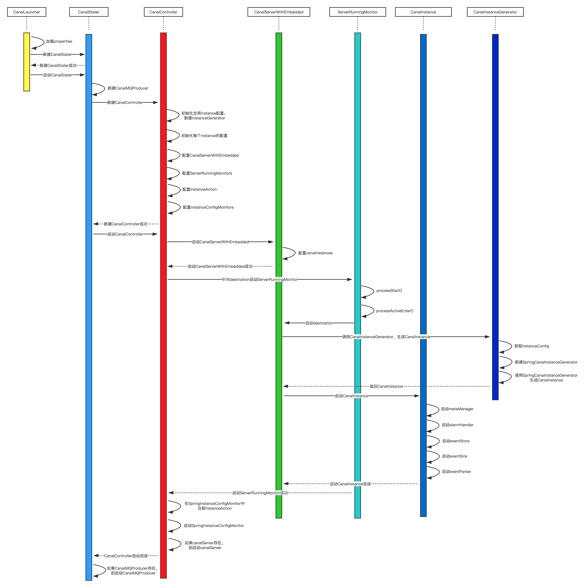

[canal](https://github.com/alibaba/canal)是阿里巴巴开发的，用于解析数据库日志的工具，提供增量数据订阅和消费。目前主要支持mysql。

canal的原理并不复杂：模拟mysql slave协议，将自己伪装为slave，收到log之后进行解析然后发送给应用程序。参考：[canal产品介绍](download/canal/media/canal产品介绍.pptx)

canal在我们公司的主要用途是同步mysql数据到ElasticSearch。目前需要基于canal做二次开发，因此需要熟悉canal的源码。本文是对canal源码的初读。

<!-- more -->

采用的源码版本是`canal 1.1.x`，它与之前版本最大的不同就是原生支持kafka消息投递。这样我们就不再需要启动canal client来读取数据并投递到kafka中。

# 启动流程

canal的入口函数是`CanalLauncher`的`main`方法，我们来跟踪代码的执行流程。

1. 加载`canal.properties`。如果指定了`canal.conf`则使用指定的配置，否则使用默认的`canal.properties`文件。
2. 新建`CanalStater`并启动
    
    1. 判断`canal.serverMode`，如果为`kafka`则新建`CanalKafkaProducer`。设置`canal.withoutNetty`为true，以及用户定义的`canal.destinations`
    2. 新建`CanalController`

        1. 调用`initGlobalConfig`方法初始化全局参数设置

            1. 获取并设置`mode`，默认为`SPRING`
            2. 获取并设置`lazy`，默认为`false`
            3. 获取并设置`managerAddress`，默认为null
            4. 获取并设置`springXml`，默认为`classpath:spring/file-instance.xml`
            5. 创建`instanceGenerator`，实例生成器。用于根据`destination`生成实例

        2. 调用`initInstanceConfig`初始化实例配置

            1. 获取`canal.destinations`配置
            2. 将`canal.destinations`以`,`分割
            3. 针对每个destination：

                1. 调用`parseInstanceConfig`方法解析destination的配置。与初始化全局参数设置类似，这里根据具体的destination配置`mode`、`lazy`、`managerAddress`、`springXml`
                2. 将解析得到的destination配置保存在`instanceConfigs`
        
        3. 如果配置了`canal.socketChannel`，设置`canal.socketChannel`属性
        4. 如果存在的话，分别设置`canal.instance.rds.accesskey`和`canal.instance.rds.secretkey`属性
        5. 获取`cid`、`ip`、`port`属性
        6. 获取`embededCanalServer`，并设置`instanceGenerator`。`embededCanalServer`的类型为`CanalServerWithEmbedded`
        7. 获取并设置`embededCanalServer`的`metricsPort`
        8. 如果`canal.withoutNetty`为null或者`false`，创建`canalServer`并配置`ip`和`port`。
        9. 如果`ip`属性为空，配置本机ip
        10. 获取`canal.zkServers`，zookeeper的地址

            1. 如果`canal.zkServers`不为空，在zookeeper中创建`/otter/canal/destinations`和`/otter/canal/cluster`目录

        11. 创建服务器运行信息`ServerRunningData`
        12. 将`ServerRunningData`设置在服务器运行监控`ServerRunningMonitors`中。在`ServerRunningMonitors`中设置每个destination的运行监控器`ServerRunningMonitor`
        13. 获取`canal.auto.scan`属性，默认为`true`

            1. 创建`InstanceAction`，实例执行器。其中定义了实例启动、停止、重启3个操作
            2. 创建`InstanceConfigMonitor`，实例配置监视器。

    3. 调用`start()`方法启动`CanalController`

        1. 在zookeeper中创建canal服务器的path，path为`/otter/canal/cluster/{ip}:{port}`
        2. 在zookeeper中创建状态变化的监听器
        3. 调用`start()`方法启动`embededCanalServer`

            1. 加载并初始化`CanalMetricsService`
            2. 创建`canalInstances`

        4. 遍历各个instance

            1. 调用`ServerRunningMonitor.start()`方法启动每个destination的`ServerRunningMonitor`

                1. 调用`processStart()`方法。在zookeeper中新建`/otter/canal/destinations/{name}/cluster/{ip}:{port}`目录，并监听zookeeper状态的修改
                2. 监听zookeeper中`/otter/canal/destinations/{name}/running`目录的变动
                3. 调用`initRunning()`方法

                    1. 在zookeeper的``/otter/canal/destinations/{name}/running``目录中增加正在运行的canal服务器信息
                    2. 调用`processActiveEnter`方法触发destination对应的canal实例（CanalInstance）开始执行

            2. 为每个destination注册`InstanceAction`

        5. 启动实例配置的监听器`InstanceConfigMonitor`
        6. 如果`canalServer`不为null，则调用`start()`方法启动`canalServer`。如果没有指定mq模式，则会启动`canalServer`。`canalServer`是使用Netty写的服务端，接收用户连接，发送数据。

    4. 设置设置退出时执行的钩子线程`shutdownThread`
    5. 如果`canalMQProducer`不为null，新建并启动`CanalMQStarter`

        1. 设置mq的属性
        2. 为每个destination新建一个`CanalMQRunnable`并启动

## 启动流程总结

canal的简易时序图如下所示（第一次画时序图，欢迎指正）：

从时序图可以看出`CanalController`是canal启动过程中处于中心调用位置的类，负责初始化各种配置并启动`CanalServerWithEmbedded`。

`CanalServerWithEmbedded`可以看成是一个canal实例的管理容器，其中有一个`Map<String, CanalInstance> canalInstances`变量保存所有的canal实例，负责各个canal实例(`CanalInstance`)的启动。

`CanalInstance`是真正执行mysql日志解析的类。用户配置了多少个`destinations`，就会启动多少个`CanalInstance`。每个`CanalInstance`会连接mysql，dump binlog，然后将数据交给`parser`解析，`sink`过滤，`store`存储。接下来，我们来分析`CanalInstance`的执行。

# CanalInstance

通过前面的启动流程知道，`CanalInstance`的启动流程如下：

1. CanalLauncher.main()
2. CanalStater.start()
3. CanalController.start()
4. ServerRunningMonitor.start()
5. ServerRunningMonitor.initRunning()
6. ServerRunningMonitor.processActiveEnter()
7. CanalServerWithEmbedded.start(final String destination)

`CanalServerWithEmbedded.start(final String destination)`方法负责具体destination的启动：

1. 从`canalInstances`中获取destination对应的`CanalInstance`

    `canalInstances`是一个Map，如果其中不存在对应destination的`CanalInstance`，调用`CanalInstanceGenerator.generate(String destination)`生成`CanalInstance`

    1. 从`instanceConfigs`中获取相应destination的配置
    2. 默认通过Spring生成Instance。

        1. 创建`SpringCanalInstanceGenerator`
        2. 调用`getBeanFactory(String springXml)`根据spring配置文件生成Spring Context。Spring Context中生成了几个重要的Bean：`instance`（Canal实例）、`eventParser`（解析）、`eventSink`（过滤）、`eventStore`（存储）、`metaManager`（元数据管理）、`alarmHandler`（报警）
        3. 调用`generate(String destination)`方法从Spring Context中获取destination对应的`CanalInstance`。`CanalInstance`的实际类为`CanalInstanceWithSpring`。

2. 调用`CanalInstance.start()`方法启动Instance

    按先后顺序分别启动`metaManager`（`FileMixedMetaManager`）、`alarmHandler`（`LogAlarmHandler`）、`eventStore`（`MemoryEventStoreWithBuffer`）、`eventSink`（`EntryEventSink`）、`eventParser`（`RdsBinlogEventParserProxy`）。

## CanalEventParser

`CanalEventParser`在`CanalInstance`启动时被启动。`CanalEventParser`的实际类是`RdsBinlogEventParserProxy`，其真正的`start()`方法处于父类`AbstractEventParser`中。启动过程完成以下三件事：

1. 配置`EventTransactionBuffer`
2. 构建`BinlogParser`
3. 新建`ParseThread`（binlog解析线程）并启动

### binlog解析线程的执行

1. 创建Mysql连接
2. 为Mysql连接启动一个心跳
3. 调用`preDump`方法执行dump前的准备工作

    1. 调用`connect()`方法连接mysql
    2. 验证Mysql中配置的binlog-format是否能被支持
    3. 验证Mysql中配置的binlog-image是否能被支持

4. 调用`connect()`方法连接mysql
5. 获取`serverId`
6. 调用`findStartPosition`方法获取binlog的开始位置
7. 调用`processTableMeta`方法回滚到指定位点
8. 调用`reconnect()`方法重新链接，因为在找position过程中可能有状态，需要断开后重建
9. 调用`MysqlConnection.dump`方法dump数据

    1. 向mysql发送更新设置的请求
    2. 获取binlog的checksum信息
    3. 向mysql注册slave信息
    4. 向mysql发送dump binlog的请求
    5. 接下去循环读取binlog，存储在`LogBuffer`中
    
        调用`MultiStageCoprocessor.publish`投递数据

        `MultiStageCoprocessor`的实际类为`MysqlMultiStageCoprocessor`。

        `MysqlMultiStageCoprocessor`中维护着一个`disruptorMsgBuffer`。`disruptorMsgBuffer`的类是`RingBuffer`，这是一个无锁队列。存储在`LogBuffer`中的binlog数据被投递到`disruptorMsgBuffer`中。

        `MysqlMultiStageCoprocessor`针对解析器提供一个多阶段协同的处理。`LogBuffer`被投递到`disruptorMsgBuffer`之后分为3个阶段被处理：

        1. 事件基本解析 (单线程，事件类型、DDL解析构造TableMeta、维护位点信息)，调用`SimpleParserStage.onEvent`处理
        2. 事件深度解析 (多线程, DML事件数据的完整解析)，调用`DmlParserStage.onEvent`处理
        3. 投递到store (单线程)，调用`SinkStoreStage.onEvent`处理

        `SinkStoreStage.onEvent`中如果`event`的Entry不为null，则将其添加到`EventTransactionBuffer`中。`EventTransactionBuffer`缓冲event队列，提供按事务刷新数据的机制。

        `EventTransactionBuffer`根据event调用`EntryEventSink`的`sink`方法，`sink`处理之后保存在`MemoryEventStoreWithBuffer`之中。

# CanalMQProducer

经过前面的分析，我们知道了binlog经过解析、过滤等步骤之后最终被保存在`MemoryEventStoreWithBuffer`之中。下面我们来分析`CanalMQProducer`的执行。

在`CanalStater`的启动过程的最后，判断`canalMQProducer`是否为null。

如果我们设置了serverMode为`kafka`或者`rocketmq`，`canalMQProducer`的对象分别为`CanalKafkaProducer`和`CanalRocketMQProducer`，此时`canalMQProducer`不为null。于是新建`CanalMQStarter`，将`canalMQProducer`作为参数传入，然后启动`CanalMQStarter`。

`CanalMQStarter`的启动过程会为每个destination都新建一个`CanalMQRunnable`，每个destination都在单独的线程中执行。

`CanalMQRunnable`执行流程如下：

1. 根据destination创建`ClientIdentity`
2. 调用`canalServer.subscribe(clientIdentity)`订阅client信息
3. 循环调用`canalServer.getWithoutAck`从canal中获取消息

    1. 获取最后获取到的数据的位置
    2. 调用`getEvents`方法获取数据。调用`MemoryEventStoreWithBuffer.get`，最终调用`MemoryEventStoreWithBuffer.doGet`方法获取保存的数据

4. 调用`canalMQProducer.send`向mq发送消息
        
# 总结

经过上面的分析，对canal的工作流程有了一个初步的印象。canal的代码模块、流程等比较清晰，可以比较方便地在其上进行定制开发。

canal的`1.1.x`版本之后我们不再需要使用client来获取canal的数据，而是可以通过配置将数据发送到mq中，简化了我们的开发工作。

> https://juejin.im/post/5c74f96a6fb9a049e4135b85

