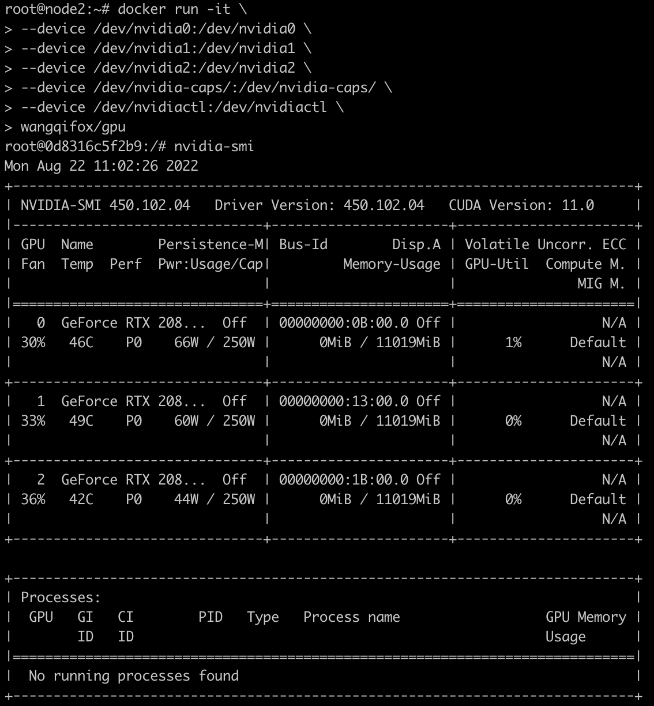
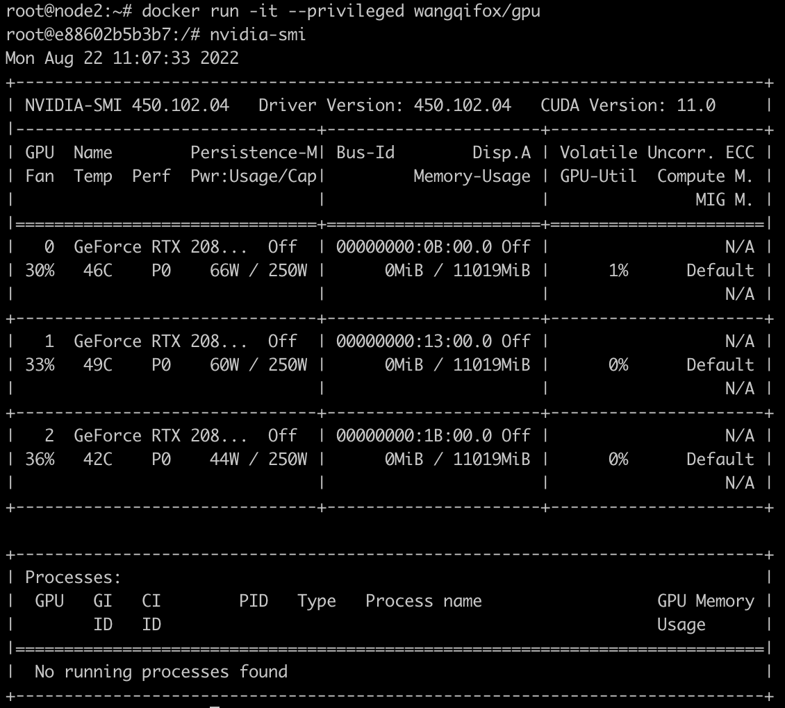
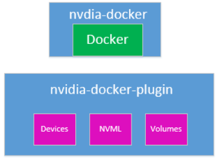
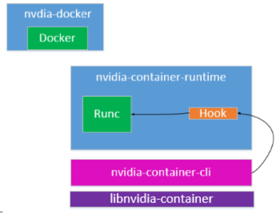
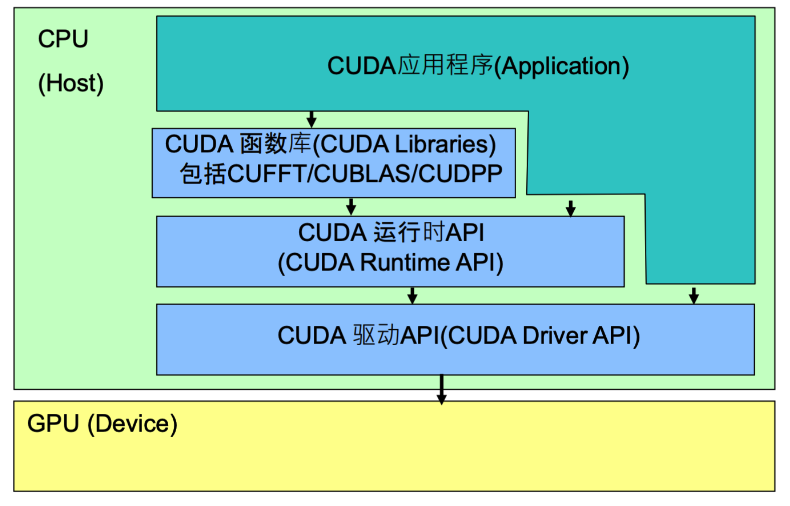
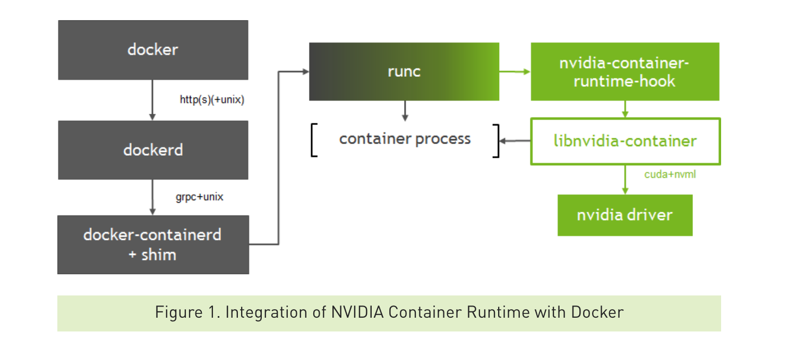

在AI的应用中，GPU是无法绕过的设备。在Docker中调用GPU是AI算法部署时必然需要考虑的问题。

<!-- more -->


在docker容器中调用gpu，根据下面的步骤。

一共分为两步：

1. 安装nvidia的gpu驱动
2. 安装nvidia-docker2，将docker的runtime配置为`nvidia-container-runtime`

# 使用nvidia-docker2

如果以下命令可以正常执行，说明docker可以正常调用gpu：

```Docker
docker run --rm --gpus all nvidia/cuda:11.0.3-base-ubuntu20.04 nvidia-smi
```

这种方式来调用gpu是官方推荐的方式。是需要安装nvidia-docker2。

# 直接挂载GPU设备

另一种方式是将gpu设备挂载到容器内部（前提是服务器已经正确安装了gpu驱动），在容器内部安装gpu需要驱动程序。

使用下面的Dockerfile来构建带gpu驱动的镜像。

```Docker
FROM ubuntu:18.04
ARG nvidia_binary_version="450.102.04"
ARG nvidia_binary="NVIDIA-Linux-x86_64-${nvidia_binary_version}.run"
RUN apt update && apt install -y wget module-init-tools kmod
RUN wget -q https://cn.download.nvidia.com/XFree86/Linux-x86_64/${nvidia_binary_version}/${nvidia_binary} \
 && chmod +x ${nvidia_binary} \
 && ./${nvidia_binary} --accept-license --ui=none --no-kernel-module --no-questions \
 && rm -rf ${nvidia_binary}
```

构建镜像：

```Bash
docker build . -t wangqifox/gpu
```


执行镜像时，将gpu相关的设备挂载到容器内部：

```Bash
docker run -it \
--device /dev/nvidia0:/dev/nvidia0 \
--device /dev/nvidia1:/dev/nvidia1 \
--device /dev/nvidia2:/dev/nvidia2 \
--device /dev/nvidia-caps/:/dev/nvidia-caps/ \
--device /dev/nvidiactl:/dev/nvidiactl \
wangqifox/gpu
```

这样在容器内部就可以看到gpu了：



# 使用特权模式使用GPU

当然也可以使用特权模式来运行容器，通过特权模式容器具备了最高权限因此可以访问到宿主机中的gpu设备。特权模式不推荐在生产环境中使用：

```Bash
docker run -it --privileged wangqifox/gpu
```



实际上，`nvidia-docker`也是采用挂载gpu设备、库文件、可执行文件的方式达到在容器中使用gpu的目的。

`nvidia-container-runtime`封装了`runc`，在容器启动之前会调用`pre-start hook`，这个`hook`会调用`nvidia-container-cli`，`nvidia-container-cli`会分析出需要映射的GPU设备、库文件、可执行文件，在容器启动后挂载到容器内部，达到配置好GPU环境的目的。



在nvidia-docker2中nvidia-docker命令行被简化，以shell脚本的形式进行了封装，nvidia-docker-plugin被废弃，改为通过在docker runc中添加hook的方式进行。将对UVM、NVML、devices等的管理提出来形成了libnvidia-container库。



安装驱动之后`/dev/nvida-uvm`设备不存在，参考[https://docs.nvidia.com/cuda/cuda-installation-guide-linux/index.html#runfile-verifications](https://docs.nvidia.com/cuda/cuda-installation-guide-linux/index.html#runfile-verifications)。创建脚本，并设为开机启动：

```Bash
#!/bin/bash

/sbin/modprobe nvidia

if [ "$?" -eq 0 ]; then
  # Count the number of NVIDIA controllers found.
  NVDEVS=`lspci | grep -i NVIDIA`
  N3D=`echo "$NVDEVS" | grep "3D controller" | wc -l`
  NVGA=`echo "$NVDEVS" | grep "VGA compatible controller" | wc -l`

  N=`expr $N3D + $NVGA - 1`
  for i in `seq 0 $N`; do
    mknod -m 666 /dev/nvidia$i c 195 $i
  done

  mknod -m 666 /dev/nvidiactl c 195 255

else
  exit 1
fi

/sbin/modprobe nvidia-uvm

if [ "$?" -eq 0 ]; then
  # Find out the major device number used by the nvidia-uvm driver
  D=`grep nvidia-uvm /proc/devices | awk '{print $1}'`

  mknod -m 666 /dev/nvidia-uvm c $D 0
else
  exit 1
fi
```

> https://github.com/NVIDIA/nvidia-docker/issues/871
> https://gitlab.com/nvidia/container-images/driver/-/blob/master/ubuntu18.04/Dockerfile
> https://www.cnblogs.com/oolo/p/11679733.html
> http://www.uml.org.cn/yunjisuan/201901092.asp
> https://cloud.tencent.com/developer/article/1496697
> https://maple.link/2020/03/29/手动挂载Nvidia显卡到docker容器中/
> https://xigang.github.io/2018/11/08/nvidia-container-runtime/


# 《NVIDIA Docker CUDA容器化原理分析》摘录

CUDA是由NVIDIA推出的通用并行计算架构，通过一些CUDA库提供了一系列API供应用程序调用。开发者可调用这些API充分利用GPU来处理图像，视频解码等。

CUDA API体系包括：CUDA函数库（CUDA Libraries），CUDA运行时API（CUDA Runtime API），CUDA驱动API（CUDA Driver API），结构图如下：



CUDA Driver API：GPU设备的抽象层，通过提供一系列接口来操作GPU设备，性能最好，但编程难度高，一般不会使用该方式开发应用程序。

CUDA Runtime API：对CUDA Driver API进行了一定的封装，调用该类API可简化编程过程，降低开发难度。

CUDA Libraries：是对CUDA Runtime API更高一层的封装，通常是一些成熟的高效函数库，开发者也可以自己封装一些函数库便于使用

应用程序可调用CUDA Libraries或者CUDA Runtime API来实现功能，当调用CUDA Libraries时，CUDA Libraries会调用相应的CUDA Runtime API，CUDA Runtime API再调用CUDA Driver API，CUDA API再操作GPU设备。

CUDA容器化的目标就是要能让应用程序可以在容器内调用CUDA API来操作GPU，因此需要实现：

1. 在容器内应用程序可调用CUDA Runtime API和CUDA Libraries
2. 在容器内能使用CUDA Driver相关库。因为CUDA Runtime API其实就是CUDA Driver API的封装，底层还是要调用到CUDA Driver API
3. 在容器内可操作GPU设备

要在容器内操作GPU设备，需要将GPU设备挂载到容器里，Docker可通过`—device`挂载需要操作的设备，或者直接使用特权模式（不推荐）。

NVIDIA Docker是通过注入一个`prestart`的hook到容器中，在容器自定义命令启动前就将GPU设备挂载到容器中。至于要挂载哪些GPU，可通过`NVIDIA_VISIBLE_DEVICES`环境变量控制。

挂载GPU设备到容器后，还要在容器内可调用CUDA API。CUDA Runtime API和CUDA Libraries通常跟应用程序一起打包到镜像里，而CUDA Driver API是在宿主机里，需要将其挂载到容器里才能被使用。 NVIDIA Docker挂载CUDA Driver库文件到容器的方式和挂载GPU设备一样，都是在runtime hook里实现的。


接下来分析NVIDIA Docker中是如何实现将GPU Device和CUDA Driver挂载到容器中的。

NVIDIA Docker分两个版本，1.0版本通过docker volume将CUDA Driver挂载到容器里，应用程序要操作GPU，需要在`LD_LIBRARY_PATH`环境变量中配置CUDA Driver库所在路径。

2.0版本通过修改docker的runtime实现GPU设备和CUDA Driver挂载：

```Bash
root@gpu1:~# cat /etc/docker/daemon.json
{
  "bip": "169.254.32.1/28",
  "bridge": "",
  "debug": false,
  "exec-opts": [],
  "exec-root": "",
  "graph": "/var/lib/docker",
  "group": "",
  "hosts": [
    "unix:///var/run/docker.sock"
  ],
  "insecure-registries": ["harbor-service:8888"],
  "default-runtime": "nvidia",
  "runtimes": {
        "nvidia": {
            "path": "/usr/bin/nvidia-container-runtime",
            "runtimeArgs": []
        }
  },
  "ip-forward": true,
  "ip-masq": true,
  "iptables": true,
  "ipv6": false,
  "labels": [],
  "live-restore": true,
  "log-driver": "json-file",
  "log-level": "warn",
  "log-opts": {
    "max-file": "10",
    "max-size": "100m"
  },
  "max-concurrent-downloads": 10,
  "registry-mirrors": [],
  "selinux-enabled": false,
  "storage-driver": "overlay2",
  "storage-opts": [
    "overlay2.override_kernel_check=true"
  ]
}
```


nvidia-container-runtime实现如下：



nvidia-container-runtime其实就是在runc基础上多实现了nvidia-container-runtime-hook，该hook是在容器启动后（Namespace已创建完成），容器自定义命令（Entrypoint）启动前执行。当检测到`NVIDIA_VISIBLE_DEVICES`环境变量时，会调用libnvidia-container挂载GPU Device和CUDA Driver。如果没有检测到`NVIDIA_VISIBLE_DEVICES`就会执行默认的runc。

libnvidia-container采用linux c `mount --bind`功能将CUDA Driver libraries/Binaries一个个挂载到容器里，而不是将整个目录挂载到容器中。

通过以下方式启动容器：

```Bash
docker run -it --gpus all nvidia/cuda:11.0.3-base-ubuntu20.04 bash
```

执行mount命令，查看挂载情况。可以看到名为`libnvidiaXXX.so`的库文件以及`nvidia-smi`命令挂载到容器中，

```Bash
root@4650d9e9e22f:/# mount
overlay on / type overlay (rw,relatime,lowerdir=/var/lib/docker/overlay2/l/6YBE4ZX4NGMONKMFZMASZV343I:/var/lib/docker/overlay2/l/A6RGELI6F35E4TG5RJTW6UXTTX:/var/lib/docker/overlay2/l/62QEWWC3BDCKHNSV3HBU7EDCH4:/var/lib/docker/overlay2/l/IFG64BM3OB5VUSJ5PELUQMS6TD:/var/lib/docker/overlay2/l/7GWWE2UM3NHIQAEWOQPI7R7S3L:/var/lib/docker/overlay2/l/724X2FTJMIPCUSKK6TYJK2MG7D,upperdir=/var/lib/docker/overlay2/82b5256918b12a4da4c4f4ab53f8f20115c6f07934bed38235a9e172e37734b2/diff,workdir=/var/lib/docker/overlay2/82b5256918b12a4da4c4f4ab53f8f20115c6f07934bed38235a9e172e37734b2/work)
proc on /proc type proc (rw,nosuid,nodev,noexec,relatime)
tmpfs on /dev type tmpfs (rw,nosuid,size=65536k,mode=755)
devpts on /dev/pts type devpts (rw,nosuid,noexec,relatime,gid=5,mode=620,ptmxmode=666)
sysfs on /sys type sysfs (ro,nosuid,nodev,noexec,relatime)
tmpfs on /sys/fs/cgroup type tmpfs (rw,nosuid,nodev,noexec,relatime,mode=755)
cgroup on /sys/fs/cgroup/systemd type cgroup (ro,nosuid,nodev,noexec,relatime,xattr,name=systemd)
cgroup on /sys/fs/cgroup/devices type cgroup (ro,nosuid,nodev,noexec,relatime,devices)
cgroup on /sys/fs/cgroup/cpu,cpuacct type cgroup (ro,nosuid,nodev,noexec,relatime,cpu,cpuacct)
cgroup on /sys/fs/cgroup/perf_event type cgroup (ro,nosuid,nodev,noexec,relatime,perf_event)
cgroup on /sys/fs/cgroup/rdma type cgroup (ro,nosuid,nodev,noexec,relatime,rdma)
cgroup on /sys/fs/cgroup/hugetlb type cgroup (ro,nosuid,nodev,noexec,relatime,hugetlb)
cgroup on /sys/fs/cgroup/memory type cgroup (ro,nosuid,nodev,noexec,relatime,memory)
cgroup on /sys/fs/cgroup/freezer type cgroup (ro,nosuid,nodev,noexec,relatime,freezer)
cgroup on /sys/fs/cgroup/pids type cgroup (ro,nosuid,nodev,noexec,relatime,pids)
cgroup on /sys/fs/cgroup/cpuset type cgroup (ro,nosuid,nodev,noexec,relatime,cpuset)
cgroup on /sys/fs/cgroup/net_cls,net_prio type cgroup (ro,nosuid,nodev,noexec,relatime,net_cls,net_prio)
cgroup on /sys/fs/cgroup/blkio type cgroup (ro,nosuid,nodev,noexec,relatime,blkio)
mqueue on /dev/mqueue type mqueue (rw,nosuid,nodev,noexec,relatime)
shm on /dev/shm type tmpfs (rw,nosuid,nodev,noexec,relatime,size=65536k)
/dev/nvme0n1p2 on /etc/resolv.conf type ext4 (rw,relatime,data=ordered)
/dev/nvme0n1p2 on /etc/hostname type ext4 (rw,relatime,data=ordered)
/dev/nvme0n1p2 on /etc/hosts type ext4 (rw,relatime,data=ordered)
tmpfs on /proc/driver/nvidia type tmpfs (rw,nosuid,nodev,noexec,relatime,mode=555)
/dev/nvme0n1p2 on /usr/bin/nvidia-smi type ext4 (ro,nosuid,nodev,relatime,data=ordered)
/dev/nvme0n1p2 on /usr/bin/nvidia-debugdump type ext4 (ro,nosuid,nodev,relatime,data=ordered)
/dev/nvme0n1p2 on /usr/bin/nvidia-persistenced type ext4 (ro,nosuid,nodev,relatime,data=ordered)
/dev/nvme0n1p2 on /usr/bin/nvidia-cuda-mps-control type ext4 (ro,nosuid,nodev,relatime,data=ordered)
/dev/nvme0n1p2 on /usr/bin/nvidia-cuda-mps-server type ext4 (ro,nosuid,nodev,relatime,data=ordered)
/dev/nvme0n1p2 on /usr/lib/x86_64-linux-gnu/libnvidia-ml.so.470.129.06 type ext4 (ro,nosuid,nodev,relatime,data=ordered)
/dev/nvme0n1p2 on /usr/lib/x86_64-linux-gnu/libnvidia-cfg.so.470.129.06 type ext4 (ro,nosuid,nodev,relatime,data=ordered)
/dev/nvme0n1p2 on /usr/lib/x86_64-linux-gnu/libcuda.so.470.129.06 type ext4 (ro,nosuid,nodev,relatime,data=ordered)
/dev/nvme0n1p2 on /usr/lib/x86_64-linux-gnu/libnvidia-opencl.so.470.129.06 type ext4 (ro,nosuid,nodev,relatime,data=ordered)
/dev/nvme0n1p2 on /usr/lib/x86_64-linux-gnu/libnvidia-ptxjitcompiler.so.470.129.06 type ext4 (ro,nosuid,nodev,relatime,data=ordered)
/dev/nvme0n1p2 on /usr/lib/x86_64-linux-gnu/libnvidia-allocator.so.470.129.06 type ext4 (ro,nosuid,nodev,relatime,data=ordered)
/dev/nvme0n1p2 on /usr/lib/x86_64-linux-gnu/libnvidia-compiler.so.470.129.06 type ext4 (ro,nosuid,nodev,relatime,data=ordered)
overlay on /usr/lib/x86_64-linux-gnu/libcuda.so.450.172.01 type overlay (ro,nosuid,nodev,relatime,lowerdir=/var/lib/docker/overlay2/l/6YBE4ZX4NGMONKMFZMASZV343I:/var/lib/docker/overlay2/l/A6RGELI6F35E4TG5RJTW6UXTTX:/var/lib/docker/overlay2/l/62QEWWC3BDCKHNSV3HBU7EDCH4:/var/lib/docker/overlay2/l/IFG64BM3OB5VUSJ5PELUQMS6TD:/var/lib/docker/overlay2/l/7GWWE2UM3NHIQAEWOQPI7R7S3L:/var/lib/docker/overlay2/l/724X2FTJMIPCUSKK6TYJK2MG7D,upperdir=/var/lib/docker/overlay2/82b5256918b12a4da4c4f4ab53f8f20115c6f07934bed38235a9e172e37734b2/diff,workdir=/var/lib/docker/overlay2/82b5256918b12a4da4c4f4ab53f8f20115c6f07934bed38235a9e172e37734b2/work)
overlay on /usr/lib/x86_64-linux-gnu/libnvidia-ptxjitcompiler.so.450.172.01 type overlay (ro,nosuid,nodev,relatime,lowerdir=/var/lib/docker/overlay2/l/6YBE4ZX4NGMONKMFZMASZV343I:/var/lib/docker/overlay2/l/A6RGELI6F35E4TG5RJTW6UXTTX:/var/lib/docker/overlay2/l/62QEWWC3BDCKHNSV3HBU7EDCH4:/var/lib/docker/overlay2/l/IFG64BM3OB5VUSJ5PELUQMS6TD:/var/lib/docker/overlay2/l/7GWWE2UM3NHIQAEWOQPI7R7S3L:/var/lib/docker/overlay2/l/724X2FTJMIPCUSKK6TYJK2MG7D,upperdir=/var/lib/docker/overlay2/82b5256918b12a4da4c4f4ab53f8f20115c6f07934bed38235a9e172e37734b2/diff,workdir=/var/lib/docker/overlay2/82b5256918b12a4da4c4f4ab53f8f20115c6f07934bed38235a9e172e37734b2/work)
/dev/nvme0n1p2 on /usr/lib/firmware/nvidia/470.129.06/gsp.bin type ext4 (ro,nosuid,nodev,relatime,data=ordered)
tmpfs on /run/nvidia-persistenced/socket type tmpfs (rw,nosuid,nodev,noexec,relatime,size=1620136k,mode=755)
udev on /dev/nvidiactl type devtmpfs (ro,nosuid,noexec,relatime,size=8084308k,nr_inodes=2021077,mode=755)
udev on /dev/nvidia-uvm type devtmpfs (ro,nosuid,noexec,relatime,size=8084308k,nr_inodes=2021077,mode=755)
udev on /dev/nvidia-uvm-tools type devtmpfs (ro,nosuid,noexec,relatime,size=8084308k,nr_inodes=2021077,mode=755)
udev on /dev/nvidia0 type devtmpfs (ro,nosuid,noexec,relatime,size=8084308k,nr_inodes=2021077,mode=755)
proc on /proc/driver/nvidia/gpus/0000:01:00.0 type proc (ro,nosuid,nodev,noexec,relatime)
devpts on /dev/console type devpts (rw,nosuid,noexec,relatime,gid=5,mode=620,ptmxmode=666)
proc on /proc/bus type proc (ro,nosuid,nodev,noexec,relatime)
proc on /proc/fs type proc (ro,nosuid,nodev,noexec,relatime)
proc on /proc/irq type proc (ro,nosuid,nodev,noexec,relatime)
proc on /proc/sys type proc (ro,nosuid,nodev,noexec,relatime)
proc on /proc/sysrq-trigger type proc (ro,nosuid,nodev,noexec,relatime)
tmpfs on /proc/acpi type tmpfs (ro,relatime)
tmpfs on /proc/kcore type tmpfs (rw,nosuid,size=65536k,mode=755)
tmpfs on /proc/keys type tmpfs (rw,nosuid,size=65536k,mode=755)
tmpfs on /proc/timer_list type tmpfs (rw,nosuid,size=65536k,mode=755)
tmpfs on /proc/sched_debug type tmpfs (rw,nosuid,size=65536k,mode=755)
tmpfs on /proc/scsi type tmpfs (ro,relatime)
tmpfs on /sys/firmware type tmpfs (ro,relatime)
```


```Bash
root@4650d9e9e22f:/# env
NVIDIA_VISIBLE_DEVICES=all
HOSTNAME=4650d9e9e22f
NVIDIA_REQUIRE_CUDA=cuda>=11.0 brand=tesla,driver>=418,driver<419 brand=tesla,driver>=440,driver<441 driver>=450
PWD=/
NVIDIA_DRIVER_CAPABILITIES=compute,utility
NV_CUDA_CUDART_VERSION=11.0.221-1
HOME=/root
LS_COLORS=rs=0:di=01;34:ln=01;36:mh=00:pi=40;33:so=01;35:do=01;35:bd=40;33;01:cd=40;33;01:or=40;31;01:mi=00:su=37;41:sg=30;43:ca=30;41:tw=30;42:ow=34;42:st=37;44:ex=01;32:*.tar=01;31:*.tgz=01;31:*.arc=01;31:*.arj=01;31:*.taz=01;31:*.lha=01;31:*.lz4=01;31:*.lzh=01;31:*.lzma=01;31:*.tlz=01;31:*.txz=01;31:*.tzo=01;31:*.t7z=01;31:*.zip=01;31:*.z=01;31:*.dz=01;31:*.gz=01;31:*.lrz=01;31:*.lz=01;31:*.lzo=01;31:*.xz=01;31:*.zst=01;31:*.tzst=01;31:*.bz2=01;31:*.bz=01;31:*.tbz=01;31:*.tbz2=01;31:*.tz=01;31:*.deb=01;31:*.rpm=01;31:*.jar=01;31:*.war=01;31:*.ear=01;31:*.sar=01;31:*.rar=01;31:*.alz=01;31:*.ace=01;31:*.zoo=01;31:*.cpio=01;31:*.7z=01;31:*.rz=01;31:*.cab=01;31:*.wim=01;31:*.swm=01;31:*.dwm=01;31:*.esd=01;31:*.jpg=01;35:*.jpeg=01;35:*.mjpg=01;35:*.mjpeg=01;35:*.gif=01;35:*.bmp=01;35:*.pbm=01;35:*.pgm=01;35:*.ppm=01;35:*.tga=01;35:*.xbm=01;35:*.xpm=01;35:*.tif=01;35:*.tiff=01;35:*.png=01;35:*.svg=01;35:*.svgz=01;35:*.mng=01;35:*.pcx=01;35:*.mov=01;35:*.mpg=01;35:*.mpeg=01;35:*.m2v=01;35:*.mkv=01;35:*.webm=01;35:*.ogm=01;35:*.mp4=01;35:*.m4v=01;35:*.mp4v=01;35:*.vob=01;35:*.qt=01;35:*.nuv=01;35:*.wmv=01;35:*.asf=01;35:*.rm=01;35:*.rmvb=01;35:*.flc=01;35:*.avi=01;35:*.fli=01;35:*.flv=01;35:*.gl=01;35:*.dl=01;35:*.xcf=01;35:*.xwd=01;35:*.yuv=01;35:*.cgm=01;35:*.emf=01;35:*.ogv=01;35:*.ogx=01;35:*.aac=00;36:*.au=00;36:*.flac=00;36:*.m4a=00;36:*.mid=00;36:*.midi=00;36:*.mka=00;36:*.mp3=00;36:*.mpc=00;36:*.ogg=00;36:*.ra=00;36:*.wav=00;36:*.oga=00;36:*.opus=00;36:*.spx=00;36:*.xspf=00;36:
CUDA_VERSION=11.0.3
TERM=xterm
SHLVL=1
NVARCH=x86_64
NV_CUDA_COMPAT_PACKAGE=cuda-compat-11-0
LD_LIBRARY_PATH=/usr/local/nvidia/lib:/usr/local/nvidia/lib64
PATH=/usr/local/nvidia/bin:/usr/local/cuda/bin:/usr/local/sbin:/usr/local/bin:/usr/sbin:/usr/bin:/sbin:/bin
_=/usr/bin/env
```

