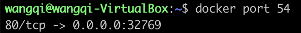

docker默认提供了4种网络模型，供容器启动的时候选择。分别为none、host、container、bridge。本文是这四种网络模型的学习记录。

<!-- more -->

## none模式

none模式顾名思义，就是不对容器做网络配置。容易有自己的network namespace，但是没有做任何的网络配置。选择这种模式，一般是用户对网络有自己特殊的需求，不希望docker预设值太多的东西。

## host模式

host模式下，docker不会为容器创建单独的网络namespace，而是共享主机的network namespace，也就是说：容器可以直接访问主机上所有的网络信息。

使用host模式：启动容器的命令行添加`--net=host`参数：

`docker run -d --name=busybox --net=host busybox top`

一般来说，使用`host`模式是因为容器需要直接使用主机的网络。比如在容器中启动`tcpdump`来抓取主机上的网络报文。

这种模式最大的缺点是：容器都是直接共享主机网络空间的，如果出现任何的网络冲突都会出错，比如在这个模式下无法启动两个都监听在80端口的容器。

## container模式

container模式下，一个容器直接使用另外一个已经存在容器的网络配置：IP信息和网络端口等所有网络相关的信息都是共享的。但是，这两个容器的计算和存储资源还是隔离的。

举个例子：

执行`docker run -d --name=web1 -p 80:80 nginx`启动`web1`容器。接着启动另外一个nginx容器，使用`--net`参数让新建的容器使用`web1`的网络：`docker run -d --name=web2 --net=container:web1 -p 8080:8080 nginx`。

结果是启动`web2`容器的时候docker会报错。这是因为端口转发不能和container模式一起使用，这是出于安全和权限控制的角度来考虑的。否则，一个正在运行的容器网络配置可以被任意一个容器修改，这是很危险的行为。因此，我们只能在运行`web1`的时候就指定好所有要映射出来的端口。

```
docker run -d --name=web1 -p 80:80 -p 8080:8080 nginx
docker run -d --name=web2 --net=container:web1 nginx
```

## bridge模型

bridge是docker默认的网络模型。启动容器时如果不指定网络模型，默认就使用bridge模型。在这种模型下，容器内部可以透明地访问外部的网络。下面来学习一下它的原理。

默认情况下，docker会在host机器上新创建一个`docker0`的bridge：可以把它想象成一个虚拟的交换机，所有的容器都是连到这台交换机上面的。docker会从私有网络中选择一段地址来管理容器，比如`172.17.0.1/16`。

通过`ip addr`命令可以查看主机上面所有的网络接口：


### 容器时怎么连接到外面的网络的 

`docker0`连接了容器和主机网络。


如上图所示，容器通过`docker0`与外部网络通信。每创建一个容器，docker会新建一对interface，这对interface最大的特性是：从一个地方进去的网络报文都能在另外一个接口被接受，就像水管的两头。一个接口命名为`eth0`，分配给容器内部；另外一个接口命名为`veth**`这样的形式，显示在host机器上，连接到`docker0`。总结一下就是：docker会在机器上自己维护一个网络，并通过`docker0`这个虚拟交换机和主机本身的网络连接在一起。

运行一个busybox容器：


通过`brctl`命令（管理虚拟网桥的命令，可以使用`apt-get install bridge-utils`安装）可以看到`docker0`上新连接了一个interface：`vethc1c2caa`。通过`ip`命令查看它的详细信息:


它有mac地址（因为虚拟交换机需要mac地址才能转发报文），但并没有ip地址，只是被连接到`docker0`而已，ip地址只存在与容器里面。

进入容器内部，看一下另一个interface：


在容器内部是`eth0`，并且有一个`172.16.0.2/16`的ip地址，就是前面`docker0`管理的网段。这个网络在主机上不可见，因为它在自己的network namespace里面：


找到容器在主机上的Pid，就能看到它的所有namespace。

容器内部的路由是这样的：


默认的路由会发送到`172.17.0.1`也就是`docker0`的地址，然后`docker0`通过主机的`eth0`发送出去。前提是主机配置了自动转发网络报文。


下面是报文发送到外面的具体步骤：

1. 容器内部发送一条报文，查看路由规则，默认转发到`172.17.0.1`（如果是同一个网段，会直接把源地址标记为`172.17.0.2`进行发送）
2. 通过`eth0`发送的报文，会在`vethXXX`被接收，因为它直接连在`docker0`上，所以默认路由到`docker0`
3. 这个时候报文已经来到了主机上，查询主机的路由表，发现报文应该通过`eth0`从默认网关发送出去，那么报文就被转发给`eth0`。
4. 匹配机器上的iptables，发现有一条`-A POSTROUTING -s 172.17.0.0/16 ! -o docker0 -j MASQUERADE`，也就是SNAT规则，那么linux内核会修改IP源地址为eth0的地址，维护一条NAT规则记录，然后把报文转发出去。

#### 路由表详解

来看一下当前主机上的路由表：


各列字段说明：

| 列 | 含义 |
| --- | --- |
| Destination | 目标网络或目标主机。Destination为default(`0.0.0.0`)时，表示这个是默认网关，所有数据都发到这个网关 |
| Gateway | 网关地址，`0.0.0.0`表示当前记录对应的Destination跟本机在同一个网段，通信时不需要经过网关 |
| Genmask | Destination字段的网络掩码，Destination是主机时需要设置为`255.255.255.255`，是默认路由时会设置为`0.0.0.0` |
| Flags | 标记 |
| Metric | 路由距离，到达指定网络所需的中转数，是大型局域网和广域网设置所必需的。（不在Linux内核中使用） |
| Ref | 路由项引用次数（不在Linux内核中使用） |
| Use | 此路由项被路由软件查找的次数 |
| Iface | 网卡名字，例如`eth0` |

Flags含义：

| Flags | 含义 |
| --- | --- |
| U | 路由时活动的 |
| H | 目标是个主机 |
| G | 需要经过网关 |
| R | 恢复动态路由产生的表项 |
| D | 由路由的后台程序动态地安装 |
| M | 由路由的后台程序修改 |
| ! | 拒绝路由 |

Linux内核的路由种类：

- 主机路由。路由表中指向单个IP地址或主机名的路由记录，其`Flags`字段为`H`
- 网络路由。主机可以到达的网络
- 默认路由。当目标主机的IP地址或网络不在路由表中时，数据包就被发送到默认路由（默认网关）上。默认路由的`Destination`是`default`或`0.0.0.0`

#### docker相关的iptables

安装完docker之后，主机上默认的iptables配置如下所示（使用`iptables-save`命令显示当前的配置）：

```
# Generated by iptables-save v1.6.1 on Fri Jun 28 15:50:00 2019
*nat
:PREROUTING ACCEPT [681:86602]
:INPUT ACCEPT [577:81403]
:OUTPUT ACCEPT [99:7294]
:POSTROUTING ACCEPT [99:7294]
:DOCKER - [0:0]
-A PREROUTING -m addrtype --dst-type LOCAL -j DOCKER
-A OUTPUT ! -d 127.0.0.0/8 -m addrtype --dst-type LOCAL -j DOCKER
-A POSTROUTING -s 172.17.0.0/16 ! -o docker0 -j MASQUERADE
-A DOCKER -i docker0 -j RETURN
COMMIT
# Completed on Fri Jun 28 15:50:00 2019
# Generated by iptables-save v1.6.1 on Fri Jun 28 15:50:00 2019
*filter
:INPUT ACCEPT [5748:1612048]
:FORWARD DROP [0:0]
:OUTPUT ACCEPT [1742:187999]
:DOCKER - [0:0]
:DOCKER-ISOLATION-STAGE-1 - [0:0]
:DOCKER-ISOLATION-STAGE-2 - [0:0]
:DOCKER-USER - [0:0]
-A FORWARD -j DOCKER-USER
-A FORWARD -j DOCKER-ISOLATION-STAGE-1
-A FORWARD -o docker0 -m conntrack --ctstate RELATED,ESTABLISHED -j ACCEPT
-A FORWARD -o docker0 -j DOCKER
-A FORWARD -i docker0 ! -o docker0 -j ACCEPT
-A FORWARD -i docker0 -o docker0 -j ACCEPT
-A DOCKER-ISOLATION-STAGE-1 -i docker0 ! -o docker0 -j DOCKER-ISOLATION-STAGE-2
-A DOCKER-ISOLATION-STAGE-1 -j RETURN
-A DOCKER-ISOLATION-STAGE-2 -o docker0 -j DROP
-A DOCKER-ISOLATION-STAGE-2 -j RETURN
-A DOCKER-USER -j RETURN
COMMIT
# Completed on Fri Jun 28 15:50:00 2019
```

docker创建了4个自定义链：

- DOCKER
- DOCKER-ISOLATION-STAGE-1
- DOCKER-ISOLATION-STAGE-2
- DOCKER-USER

**DOCKER**

与`DOCKER`链相关的匹配规则如下：

```
*nat
-A PREROUTING -m addrtype --dst-type LOCAL -j DOCKER
-A OUTPUT ! -d 127.0.0.0/8 -m addrtype --dst-type LOCAL -j DOCKER
*filter
-A FORWARD -o docker0 -j DOCKER
```

首先涉及到`addrtype`匹配模块，对报文的地址类型进行匹配。常见的地址类型有：`LOCAL`（本地地址，指本地一切地址含：`127.0.0.1`回环地址）、`UNICAST`（单播地址）、`MULTICAST`（组播地址）、`BROADCAST`（广播地址）。

`-A PREROUTING -m addrtype --dst-type LOCAL -j DOCKER`是`PREROUTING`链中的规则，表示：如果这个数据包的目的地址是LOCAL地址，使用`DOCKER`自定义链来处理

`-A OUTPUT ! -d 127.0.0.0/8 -m addrtype --dst-type LOCAL -j DOCKER`是`OUTPUT`链中的规则，表示：如果这个数据包的目的地址是非127的LOCAL地址，使用`DOCKER`自定义链来处理

`-A FORWARD -o docker0 -j DOCKER`是`FORWARD`链中的规则，表示：如果这个数据包是通过`docker0`这个接口转发的，使用`DOCKER`自定义链来处理

默认情况下`DOCKER`自定义链只定义了如下一条规则：

```
*nat
-A DOCKER -i docker0 -j RETURN
```

这条规则表示：如果数据包是通过`docker0`接口进入本机的，执行`RETURN`操作。

`RETURN`表示返回上一层继续匹配。包匹配的顺序是：子链->父链->缺省的策略。具体地说，就是若包在子链中遇到了`RETURN`，则返回父链的下一条规则继续进行条件的比较（以上面的规则举例，在`PREROUTING`中进入`DOCKER`自定义链，`DOCKER`链执行`RETURN`操作，于是数据包返回`PREROUTING`继续匹配下一条规则），若是在父链（或称主链，比如`INPUT`）中遇到了`RETURN`就要被缺省的策略（一般是ACCEPT或DROP）操作了。

**DOCKER-ISOLATION-STAGE-1**

与`DOCKER-ISOLATION-STAGE-1`自定义链相关的规则如下：

```
*filter
-A FORWARD -j DOCKER-ISOLATION-STAGE-1
-A DOCKER-ISOLATION-STAGE-1 -i docker0 ! -o docker0 -j DOCKER-ISOLATION-STAGE-2
-A DOCKER-ISOLATION-STAGE-1 -j RETURN
```

`-A FORWARD -j DOCKER-ISOLATION-STAGE-1`表示所有经过`FORWARD`链转发的数据包都要经过`DOCKER-ISOLATION-STAGE-1`的过滤。

`-A DOCKER-ISOLATION-STAGE-1 -i docker0 ! -o docker0 -j DOCKER-ISOLATION-STAGE-2`表示源接口是`docker0`但是目标接口不是`docker0`的数据包进入`DOCKER-ISOLATION-STAGE-2`链中进一步处理。

`-A DOCKER-ISOLATION-STAGE-1 -j RETURN`表示从`DOCKER-ISOLATION-STAGE-1`链中返回。

**DOCKER-ISOLATION-STAGE-2**

与`DOCKER-ISOLATION-STAGE-2`自定义链相关的规则如下：

```
*filter
-A DOCKER-ISOLATION-STAGE-1 -i docker0 ! -o docker0 -j DOCKER-ISOLATION-STAGE-2
-A DOCKER-ISOLATION-STAGE-2 -o docker0 -j DROP
-A DOCKER-ISOLATION-STAGE-2 -j RETURN
```

其中`-A DOCKER-ISOLATION-STAGE-2 -o docker0 -j DROP`表示如果数据包的目标接口是`docker0`，直接丢弃。

**DOCKER-USER**

与`DOCKER-USER`自定义链相关的规则如下：

```
*filter
-A FORWARD -j DOCKER-USER
-A DOCKER-USER -j RETURN
```

`-A FORWARD -j DOCKER-USER`表示所有经过`FORWARD`链转发的数据包都要经过`DOCKER-USER`的过滤。

除了以上4个自定义链，docker还创建了以下规则：

```
*nat
-A POSTROUTING -s 172.17.0.0/16 ! -o docker0 -j MASQUERADE
*filter
-A FORWARD -o docker0 -m conntrack --ctstate RELATED,ESTABLISHED -j ACCEPT
-A FORWARD -i docker0 ! -o docker0 -j ACCEPT
-A FORWARD -i docker0 -o docker0 -j ACCEPT
```

`-A POSTROUTING -s 172.17.0.0/16 ! -o docker0 -j MASQUERADE`是一个SNAT规则，它表示：如果`172.17.0.0/16`网段的数据包经过非`docker0`的接口发送出去的时候会进行网络地址转换。这个规则保证了在docker容器内部可以访问外网。

`-A FORWARD -o docker0 -m conntrack --ctstate RELATED,ESTABLISHED -j ACCEPT`表示接受转发的目标接口是`docker0`，且状态为`RELATED`、`ESTABLISHED`的数据包。

`-A FORWARD -i docker0 ! -o docker0 -j ACCEPT`表示接受源接口为`docker0`且目标接口不为`docker0`的数据包。

`-A FORWARD -i docker0 -o docker0 -j ACCEPT`表示接受源接口为`docker0`且目标接口为`docker0`的数据包。

### 怎么访问容器提供的服务

经过上面对iptables规则的分析，我们知道docker容器内部可以访问外部的网络，但是外部无法访问内部的网络。

如果容器要对外提供服务，我们可以使用**端口映射**，让主机进行报文的转发。

如图所示，我们来创建一个nginx容器：


上面的`-P`参数就是告诉docker要把容器暴露的端口映射到主机上。通过`docker container ls`可以看到将主机的`32769`端口映射到容器的`80`端口。也可以通过`docker port`命令查看：



下面是运行nginx容器之后的iptables配置：


我们看到多了下面几条配置：

```
*nat
-A POSTROUTING -s 172.17.0.2/32 -d 172.17.0.2/32 -p tcp -m tcp --dport 80 -j MASQUERADE
-A DOCKER ! -i docker0 -p tcp -m tcp --dport 32769 -j DNAT --to-destination 172.17.0.2:80
*filter
-A DOCKER -d 172.17.0.2/32 ! -i docker0 -o docker0 -p tcp -m tcp --dport 80 -j ACCEPT
```

`-A POSTROUTING -s 172.17.0.2/32 -d 172.17.0.2/32 -p tcp -m tcp --dport 80 -j MASQUERADE`表示源地址为`172.17.0.2`，目标地址为`172.17.0.2`，且目标端口为`80`的数据包，经过地址转换。

`-A DOCKER ! -i docker0 -p tcp -m tcp --dport 32769 -j DNAT --to-destination 172.17.0.2:80`表示来自非`docker0`接口且目标端口为`32769`的数据包经过地址转换发送到`172.17.0.2:80`地址。

`-A DOCKER -d 172.17.0.2/32 ! -i docker0 -o docker0 -p tcp -m tcp --dport 80 -j ACCEPT`表示接受来自外部网络发往`172.17.0.2:80`地址的数据。

### 主机上容器之间的通信

主机上有这么一条路由规则：

`172.17.0.0/16 dev docker0 proto kernel scope link src 172.17.0.1`

`docker0`就是一台交换机，它记录了上面连接所有的容器ip和mac地址的对应关系。

当发现报文是自己管理的网段时，`docker0`直接把报文转发到对应ip连接的`vethXXX`接口，然后容器里的`eth0`就看到报文了。


> https://cizixs.com/2016/06/12/docker-network-modes-explained/
> https://cizixs.com/2016/06/01/docker-default-network/
> http://www.zsythink.net/archives/tag/iptables/
> https://blog.csdn.net/kikajack/article/details/80457841
> http://blog.codecp.org/2016/01/18/Docker手动修改Iptables添加端口映射/
> https://www.frozentux.net/iptables-tutorial/cn/iptables-tutorial-cn-1.1.19.html