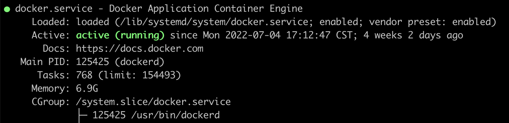

Docker创建任务数量是有限制的，某些场景下需要增加任务数量。

<!-- more -->

执行systemctl status docker命令，发现docker可以创建的任务是有限制的：



即下面的`Tasks: 768 (limit: 154493)` 限制。

可以修改`/lib/systemd/system/docker.service`文件，删除`TasksMax=infinity`前面的`#`号。

重启docker：

```Bash
systemctl daemon-reload
systemctl restart docker

```


> https://zhangguanzhang.github.io/2021/09/16/read-containerd-con-reset/