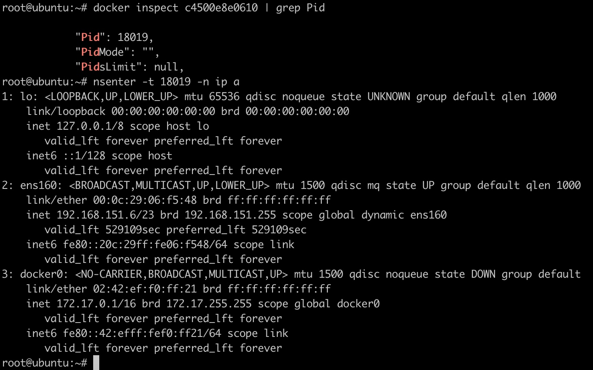
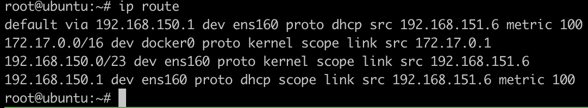
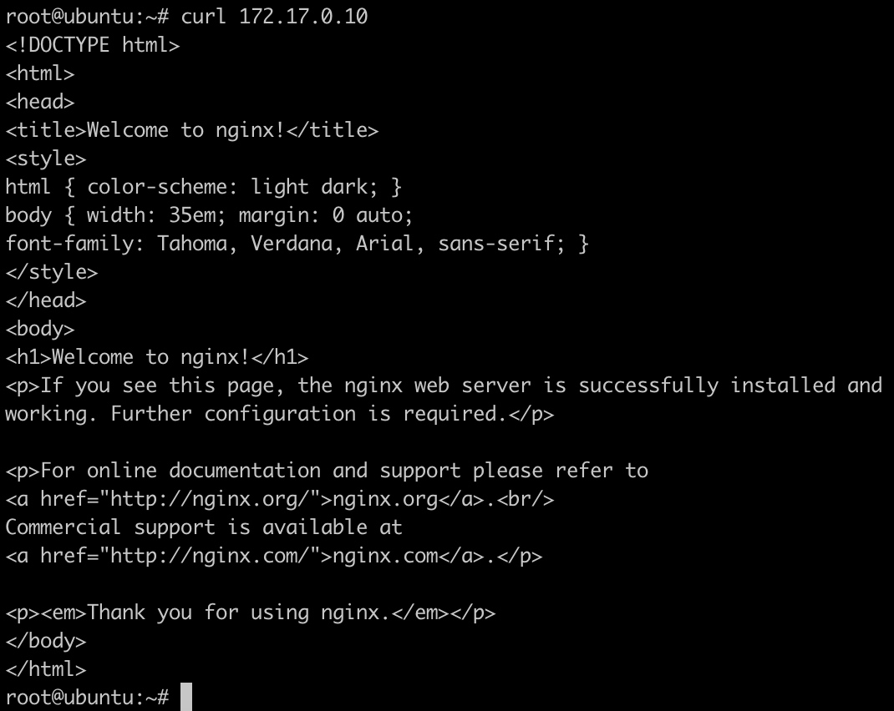

容器技术在解决什么问题？

随着应用架构朝着微服务演进，为了提高单台服务器的使用效率，需要把多个（几十、几百）微服务部署在一台服务器上，于是面临服务之间隔离的问题。

首先发展的是虚拟化技术，一台物理机切成多个虚拟机，再把服务部署在虚拟机中。这个时候如果为每个应用程序分配一个虚拟机，耗费的资源相当多。如果每个虚拟机上运行多个微服务又会发生依赖库版本的问题。

容器技术出现之后，这些问题得以更好地解决。

<!-- more -->


## Docker基础

容器：基于Linux内核的namespace、cgroup、union fs等技术，对进程进行封装隔离，属于操作系统层面的虚拟化技术。

Docker：在容器的基础上，进行了进一步的封装，从文件系统、网络互联到进程隔离等等，极大地简化了容器的创建和维护，相比于虚拟机技术更为轻便、快捷。


对比：

|特性|虚拟机|容器|
|-|-|-|
|隔离程度|硬件级别的进程隔离|操作系统级别的进程隔离|
|操作系统|每个虚拟机运行独立的操作系统|每个容器共享操作系统|
|启动时间|分钟级启动时间|秒级启动时间|
|镜像大小|一般GB|一般MB|
|性能|弱于原生程序|接近原生程序|
|单机支持|一般几十个虚拟机|上千个容器|

## Docker使用

### 安装

参考官方文档：

[https://docs.docker.com/engine/install/ubuntu/](https://docs.docker.com/engine/install/ubuntu/)

### 操作

执行`docker`命令，可以看到docker的操作命令。

- 启动容器：`docker run`
    - -it 交互
    - -d 后台运行
    - -p 端口映射
    - -v 磁盘挂载
- 停止容器：`docker stop`
- 启动已停止的容器：`docker start`
- 查看容器进程：`docker ps`
- 查看容器细节：`docker inspect <containerId>`
- 进入容器：`docker attach`
- 拷贝文件至容器内：`docker cp file1 <containerId>:/file-to-path`

### demo

运行centos：

```Bash
docker run -it centos bash
```

运行`cat /etc/redhat-release`命令，可以看到在centos里面


命令背后隐藏的步骤：

1. 查看本地是否存在centos镜像，不存在则运行`docker pull`去docker-hub官方镜像仓库拉取镜像，镜像本质上是一个包含一些描述文件的`tar`包。
2. docker解压tar包，把解压之后的文件作为进程的rootfs，然后启动进程。

测试资源约束：

```Bash
docker run -it --rm --cpu-period=100000 --cpu-quota=20000 ubuntu baschdocker run -it --rm --cpu-period=100000 --cpu-quota=20000 ubuntu bash
```

执行stress命令，测试占用cpu资源：

```Bash
stress -c 1
```

## 容器技术原理

### Namespace

Namespace是一种由Linux内核直接提供的全局资源封装，是内核针对进程设计的访问隔离机制。进程在一个独立的 Linux 名称空间中朝系统看去，会觉得自己仿佛就是这方天地的主人，拥有这台 Linux 主机上的一切资源，不仅文件系统是独立的，还有着独立的 PID 编号（譬如拥有自己的 0 号进程，即系统初始化的进程）、UID/GID 编号（譬如拥有自己独立的 root 用户）、网络（譬如完全独立的 IP 地址、网络栈、防火墙等设置）

Namespace有如下种类：

|分类|说明|系统调用参数|
|-|-|-|
|Mount|隔离挂载点|CLONE_NEWNS|
|UTS|隔离主机名和NIS|CLONE_NEWUTS|
|IPC|隔离进程间通信资源|CLONE_NEWIPC|
|PID|隔离进程ID|CLONE_NEWPID|
|Network|隔离网络相关的系统资源（网络设备、协议栈、路由表、防火墙规则、端口等等）|CLONE_NEWNET|
|User|隔离用户和用户组|CLONE_NEWUSER|


和namespace相关的系统调用只有三个：

clone：创建一个新的进程并把它放到新的namespace中

```Bash
int clone (int (*__fn) (void *__arg), void *__child_stack,
      int __flags, void *__arg, ...)

flags:
指定一个或者多个上面的CLONE_NEW*（当然也可以包含跟namespace无关的flags），
这样就会创建一个或多个新的不同类型的namespace，
并把新创建的子进程加入新创建的这些namespace中。

```

setns：将当前进程加入到已有的namespace中

```Bash
int setns (int __fd, int __nstype)

fd：
指向 /proc/[pid]/ns 目录里相应namespace对应的文件，
表示要加入哪个namespace

nstype：
指定namespace的类型（上面的任意一个CLONE_NEW*）：
1. 如果当前进程不能根据fd得到它的类型，如fd由其他进程创建，
并通过UNIX domain socket传给当前进程，
那么就需要通过nstype来指定fd指向的namespace的类型
2. 如果进程能根据fd得到namespace类型，比如这个fd是由当前进程打开的，
那么nstype设置为0即可
```

unshare：使当前进程退出指定类型的namespace，并加入到新创建的namespace（相当于创建并加入新的namespace）

```Bash
int unshare (int __flags)

flags：
指定一个或者多个上面的CLONE_NEW*，
这样当前进程就退出了当前指定类型的namespace并加入到新创建的namespace
```

clone和unshare的区别

clone和unshare的功能都是创建并加入新的namespace，它们的区别是：

- unshare是使当前进程加入新的namespace
- clone是创建一个新的子进程，然后让子进程加入新的namespace，而当前进程保持不变

#### demo

```C++
#include <sys/types.h>
#include <sys/wait.h>
#include <sys/mount.h>
#include <stdio.h>
#include <sched.h>
#include <signal.h>
#include <unistd.h>
#include <stdlib.h>

#define STACK_SIZE (1024 * 1024)
static char container_stack[STACK_SIZE];

char* const container_args[] = {
    "/bin/bash",
    NULL
};

int container_main(void* arg) {
    printf("Container [%5d] - inside the container!\n", getpid());
    // 设置hostname
    sethostname("container", 10);
    // 重新mount proc文件系统到/proc下
    mount("proc", "/proc", "proc", 0, NULL);
    execv(container_args[0], container_args);
    printf("Something's wrong!\n");
    return 1;
}

int main() {
    printf("Parent [%5d] - start a container!\n", getpid());
    int container_pid = clone(container_main, container_stack + STACK_SIZE, 
        CLONE_NEWUTS | CLONE_NEWPID | CLONE_NEWNS | SIGCHLD, NULL);
    printf("Parent - container pid [%5d]!\n", container_pid);
    
    waitpid(container_pid, NULL, 0);
    printf("Parent - container stopped!\n");
    mount("proc", "/proc", "proc", 0, NULL);
    return 0;
}


```

执行demo程序，可以看到在容器内部获得的pid为1，并且看到的hostname也是我们自己设置的`container`


执行top命令，在容器进程内只能看到两个进程


### Cgroup

Linux Cgroup全称是Linux Control Group，是Linux内核的一个功能，用来限制一个进程组的资源（如CPU、内存、磁盘输入输出、网络带宽等）。这个项目最早由Google在2006年发起，在2007年合并到2.6.24版的内核中。

Linux Cgroup 可​​​让​​​您​​​为​​​系​​​统​​​中​​​所​​​运​​​行​​​任​​​务​​​（进​​​程​​​）的​​​用​​​户​​​定​​​义​​​组​​​群​​​分​​​配​​​资​​​源​​​ — 比​​​如​​​ CPU 时​​​间​​​、​​​系​​​统​​​内​​​存​​​、​​​网​​​络​​​带​​​宽​​​或​​​者​​​这​​​些​​​资​​​源​​​的​​​组​​​合​​​。​​​您​​​可​​​以​​​监​​​控​​​您​​​配​​​置​​​的​​​ cgroup，拒​​​绝​​​ cgroup 访​​​问​​​某​​​些​​​资​​​源​​​，甚​​​至​​​在​​​运​​​行​​​的​​​系​​​统​​​中​​​动​​​态​​​配​​​置​​​您​​​的​​​ cgroup。

Linux把Cgroup实现成了一个file system，使用mount命令查看Cgroup目录：


可以看到，在`/sys/fs`下有一个cgroup目录，这个目录下还有很多子目录，比如：cpu，cpuset，memory，blkio......，这些都是cgroup的子系统，分别用于不同的目录：

- blkio：设置限制每个块设备的输入输出控制。例如：磁盘、光盘、USB等等。
- cpu：使用调度程序为cgroup任务提供CPU的访问。
- cpuacct：产生cgroup任务的CPU资源报告。
- cpuset：如果是多核心的CPU，这个子系统会为cgroup任务分配单独的CPU和内存。
- devices：允许或拒绝cgroup任务对设备的访问。
- freezer：暂停和恢复cgroup任务。
- memory：设置每个cgroup的内存限制以及产生内存资源报告。
- net_cls：标记每个网络包以供cgroup方便使用。
- pid：进程标识子系统。

#### CPU限制

写一个非常吃cpu的程序：

```C++
int main() {
    int i = 0;
    for (;;) i++;
    return 0;
}

```

运行deadloop，发现CPU被干到了100%


然后，在/sys/fs/cgroup/cpu目录下创建一个名为（名字不重要）hi的目录


系统会自动在该目录下创建需要的文件:

- cpu.shares：能获得CPU使用时间的相对值。
- cpu.cfs_period_us：用来配置时间周期长度，单位为us（微秒）。
- cpu.cfs_quota_us：用来配置当前cgroup在cfs_period_us时间内最多能使用的CPU时间数，单位为us（微秒）。
- cpu.stat：cgroup内的进程使用的CPU时间统计
    - nr_periods：经过cpu.cfs_period_us的时间周期数量
    - nr_throttled：在经过的周期内，有多少次因为进程在指定的时间周期内用光了配额时间和收到限制。
    - throttled_time：cgroup中的进程被限制使用CPU的总用时，单位是ns（纳秒）


在cpu.cfs_quota_us中设置cpu限制，将当前deadloop的PID（15814）写入cgroup：

```C++
echo 31720 >> tasks
echo 20000 > cpu.cfs_quota_us
```


设置之后，在top中看到cpu的利用立马下降到20%


#### 内存限制

写一个内存分配的例子：

```C++
#include <stdio.h>
#include <stdlib.h>
#include <string.h>
#include <sys/types.h>
#include <unistd.h>

int main() {
    int size = 0;
    int chunk_size = 512;
    void *p = NULL;
    while (1) {
        if ((p = malloc(chunk_size)) == NULL) {
            printf("out of memory!!\n");
            break;
        }
        memset(p, 1, chunk_size);
        size += chunk_size;
        printf("[%d] - memory is allocated [%8d] bytes \n", getpid(), size);
        sleep(1);
    }

    return 0;
}

```

然后，在`/sys/fs/cgroup/memory`目录下创建一个名为（名字不重要）`hi`的目录


系统会自动在该目录下创建需要的文件：

- memory.usage_in_bytes：cgroup下进程使用的内存，包含cgroup及其子cgroup下的进程使用的内存
- memory.max_usage_in_bytes：cgroup下进程使用内存的最大值，包含子cgroup的内存使用量
- memory.limit_in_bytes：设置cgroup下进程最多能使用的内存。如果设置为-1，表示对该cgroup的内存使用不做限制
- memory.soft_limit_in_bytes：这个限制并不会组织进程使用超过限额的内存，只是在系统内存足够时，会优先回收超过限制的内存，使之向限定值靠拢
- memory.oom_control：设置是否在cgroup中使用OOM（out of memory）Killer，默认是使用。当属于该cgroup的进程使用的内存超过最大的限定值时，会立刻被OOM Killer处理

执行alloc程序，在cgroup中配置内存限制：

```C++
echo 64k > memory.limit_in_bytes
echo 16321 > tasks
```


一段时间之后，alloc进程会因为内存问题被kill掉。


### Union FS

Union FS（联合文件系统）是一种分层、轻量级并且高性能的文件系统。特点如下：

- 将不同目录挂载到同一个虚拟文件系统下
- 支持为每一个成员目录设定readonly、readwrite、whiteout权限
- 文件系统分层，对readonly权限的branch可以逻辑上进行修改（增量地，不影响readonly部分）
- 通常Union FS有两个用途，一方面可以将多个disk挂到同一个目录下，另一个更常用的就是将一个readonly的branch和一个writeable的branch联合在一起。

#### 容器存储驱动

|存储驱动|优点|缺点|应用场景|
|-|-|-|-|
|AUFS|Docker 最早支持的驱动类型，稳定性高|并未进入主线的内核，因此只能在有限的场合下使用。另外在实现上具有多层结构，在层比较多的场景下，做写时复制有时会需要比较长的时间|少I/O的场景|
|OverlayFS|并入主线内核，可以在目前几乎所有发行版本上使用，实现上只有两层，因此性能比AUFS高|写时复制机制需要复制整个文件，而不能只针对修改部分进行复制，因此对大文件操作会需要比较长的时间。|少I/O的场景|
|Device Mapper|并入主线内核，针对块操作，性能比较高。修改文件时只需要复制修改的块，效率高|不同容器之间不能共享缓存。|I/O密集场景|
|BtrFS|并入主线内核，虽然是文件级操作系统，但是可以对块进行操作|需要消耗比较多的内存，稳定性相对比较差|需要支持snapshot等比较特殊的场景|
|ZFS|不同的容器之间可以共享缓存，多个容器访问相同的文件能够共享一个单一的Page Cache。|在频繁写操作的场景下，会产生比较严重的磁盘碎片。需要消耗比较多的内存，另外稳定性相对比较差|容器高密度部署的场景|


#### OverlayFS


OverlayFS是一种与AUFS类似的联合文件系统，同样属于文件级的存储驱动，包含了最初的Overlay和更新更稳定的Overlay2。

OverlayFS文件系统主要有三个角色，lowerdir、upperdir、merged。lowerdir是只读层，用户不能修改这个层的文件；upperdir是可读写层，用户能够修改这个层的文件；merged是合并层，把lowerdir层和upperdir层的文件合并展示。

示例：

```Bash
mkdir lower upper work merged

echo "lower" > lower/文件1
echo "lower" > lower/文件2
echo "lower" > lower/文件3
echo "upper" > upper/文件2
echo "upper" > upper/文件4

mount -t overlay overlay -o lowerdir=lower,upperdir=upper,workdir=work merged
```


## 容器标准

- Open Container Initiative(OCI)
    - 轻量级开放式管理组织（项目）
- OCI主要定义两个规范
    - Runtime Specification
        - 文件系统包如何解压至硬盘，供运行时运行
    - Image Specification
        - 如何通过构建系统打包，生成镜像清单（Manifest）、文件系统序列化文件、镜像配置。


## Docker引擎架构

初始架构：


Docker首次发布时，Docker引擎由两个核心组件构成：LXC和Docker daemon

Docker daomon是单一的二进制文件，包含诸如Docker客户端、Docker API、容器运行时，镜像构建等。

LXC提供了对诸如命名空间（Namespace）和控制组（Cgroup）等基础工具的操作能力。

架构演进：

1 替换LXC

为了降低普通用户综合使用namespaces、cgroups这些低级特性的门槛，2008年Linux Kernel 2.6.24内核刚刚开始提供cgroups的同一时间，发布了名为Linux容器（LinuX Containers，LXC）的系统级虚拟化功能。

首先，LXC基于Linux，阻碍了docker跨平台的发展。其次，核心组件依赖LXC，会给docker带来风险，甚至影响其发展。

因此，Docker公司开发了名为Libcontainer的自研工具，用于替代LXC。Libcontainer的目标是成为与平台无关的工具，可基于不同内核为Docker上层提供必要的容器交互功能。

2 拆分daemon

随着时间的推移，大而全的Docker daemon进程带来了越来越多的问题，难于变更、运行缓慢。Docker公司开始拆解daemon，并将其模块化。


### runc

runc是OCI容器运行时规范的参考实现。Docker公司参与了规范的制定以及runc的开发。runc实质上是一个轻量级的、针对Libcontainer进行了包装的命令行交互工具。

runc只有一个作用——创建容器。

### containerd

containerd负责管理容器的生命周期——start|stop|pause|rm...

containerd 是由 Docker 公司开发的，并捐献给了云原生计算基金会（Cloud Native Computing Foundation, CNCF）

### shim

shim是实现无daemon容器（用于将运行中的容器与daemon解耦，以便进行daemon升级等操作）不可或缺的工具。

前面提到，containerd指挥runc来创建新容器。事实上，每次创建容器时它都会fork一个新的runc实例。不过，一旦容器创建完毕，对应的runc进程就会退出。因此，即使运行上百个容器，也无需保持上百个运行中的runc实例。

一旦容器进程的父进程runc退出，相关联的containerd-shim进程就会成为容器的父进程。作为容器的父进程，shim的部分职责如下：

- 保持所有的STDIN和STDOUT流是开启状态，从而当daemon重启的时候，容器不会因为管道的关闭而终止。
- 将容器的退出状态反馈给daemon

### daemon

随着越来越多的功能从daemon中拆解出来并被模块化，daemon的主要功能包括镜像管理、镜像构建、REST API、身份验证、安全、核心网络以及编排。


pid为1的进程为init（systemd），这个进程是系统的第一个进程，又叫超级进程，也叫根进程。它负责产生其他所有用户进程。

## Docker镜像

Dockerfile示例：

```Bash
FROM harbor-service:8888/iva/jdk:8u331
# APP_PATH包路径
ARG APP_PATH=/opt

ARG IVA_ADMIN_APP=${IVA_ADMIN_APP}

ENV XMX=512m

COPY k8sConfig $APP_PATH/config
COPY conf/application.yml $APP_PATH/
COPY conf/Dockerfile /opt/debDockerFile/

COPY video-platform/. /opt/iva/video-platform/
COPY alarm-handler/. /opt/iva/alarm/handler/

COPY ${IVA_ADMIN_APP} $APP_PATH/admin.jar

WORKDIR $APP_PATH
ENTRYPOINT java -server -Dim4java.useGM=true -Xmx$XMX -XX:+UseG1GC -Duser.timezone=Asia/Shanghai -Dfile.encoding=UTF-8 -Dkubernetes.enable=true -Xdebug -agentlib:jdwp=transport=dt_socket,server=y,suspend=n,address=8000 -jar admin.jar --server.port=18080 
EXPOSE 18080

```

Dockerfile常用指令：

- FROM：选择基础镜像
- LABELS：按标签组织项目
- RUN：执行命令
- CMD：容器镜像中包含应用的运行命令，需要带参数
- EXPOSE：发布端口
- ENV：设置环境变量
- ADD：从源地址（文件，目录或者URL）复制文件到目标路径
- COPY：从源地址（文件，目录）复制文件到目标路径
- ENTRYPOINT：定义可以执行的容器镜像入口命令
- VOLUME：将指定目录定义为外挂存储卷
- USER：切换运行镜像的用户和用户组
- WORKDIR：等价于cd，切换工作目录
- ARG：定义参数


打包镜像并上传到私服：

```Bash
docker build --build-arg IVA_ADMIN_APP -t admin .
docker tag admin harbor-service:8888/iva/admin
docker push harbor-service:8888/iva/admin
```


### 构建上下文（Build Context）

- 当运行docker build命令时，当前工作目录被称为构建上下文。
- docker build默认查找当前目录的Dockerfile作为构建输入，也可以通过`-f`指定Dockerfile：`docker build -f ./Dockerfile`
- 当docker build运行时，首先会把构建上下文传输给docker daemon。把没用的文件包含在构建上下文时，会导致传输时间长，构建需要的资源多，构建出的镜像大等问题。
- 因此需要确保构建上下文清晰，比如创建一个专门的目录放置Dockerfile，并在目录中运行docker build

### Build Cache

构建容器镜像时，Docker依次读取Dockerfile中的指令，并按顺序依次执行构建指令。

Docker读取指令后，会先判断缓存中是否有可用的已存镜像，只有镜像不存在时才会重新构建

- 通常Docker简单判断Dockerfile中的指令与镜像
- 针对ADD和COPY指令，Docker判断该镜像层每一个文件的内容并生成一个checksum，与现存镜像比较时，Docker比较的是二者的checksum
- 其他指令，比如RUN apt-get -y update，Docker简单比较与现存镜像中的指令字符串是否一致
- 当某一层cache失效之后，所有层级的cache均一并失效，后续指令都重新构建镜像


## Docker网络

docker默认提供了4种网络模型，分别为none、host、container、bridge。

#### none

把容器放入独立的网络namespace，但是不做任何网络配置。用户可以自己来配置网络。

```Bash
docker run -itd --net=none ubuntu bash
```


### host

docker不为容器创建单独的网络namespace，而是共享主机的网络namespace。也就是说，容器可以直接访问主机上所有的网络信息。

```Bash
docker run -itd --net=host ubuntu bash
```



### container

在该模式下，一个容器重用其他容器的网络配置。

```Bash
docker run -itd --name=c1 ubuntu bash
docker run -itd --name=c2 --net=container:c1 ubuntu bash
```


### bridge

参考：[https://www.zsythink.net/archives/4409](https://www.zsythink.net/archives/4409)

bridge是docker默认的网络模型。

先创建两个容器：

```Bash
docker run -itd --name=c1 ubuntu bash
docker run -itd --name=c2 ubuntu bash
```

查看主机上的网络接口：


Docker在每台主机上创建一个名为docker0的网桥，然后通过veth pair来连接容器。


容器通过`docker0`与外部网络通信。每创建一个容器，docker就会新建一对interface，这对interface最大的特性是：从一个地方进去的网络报文都能在另外一个接口被接受。一个接口命名为`eth0`，分配给容器内部；另外一个接口命名为`veth**`这样的形式，显示在host机器上，连接到`docker0`。

一个容器被创建后，容器内的网卡接口eth0和一个虚拟网卡接口veth连接在一起，我们可以把上图的veth理解成docker0虚拟交换机上的一个网线插口，我们把网线的一头插在容器eth0口上，把网线的另一头插在veth口上，从而连接了容器和docker0，容器从docker0上获取了一个`172.17.0.0/16`段的IP，并且把网关指向docker0（即`172.17.0.1`）。

由于两个容器在同一个网段同一个交换机下，所以它们之间可以直接通过`172.17.0.X`的IP进行通讯，由于docker0也是宿主机上的一个网络设备，所以我们也可以直接在宿主机上ping通test1和test2。

#### 自定义桥网络

使用默认的docker0网桥，我们无法对容器指定固定的IP地址，除非自己创建一个新的虚拟交换机。但容器使用我们自己创建的交换机和对应的网段时，才支持对容器指定固定的IP地址。

我们可以使用`docker network`命令，对docker网络资源进行管理。使用ls命令查看docker默认创建的网络：


docker默认创建了三个网络，三个网络分别使用了不同的网络驱动类型。

docker0就是默认网络bridge使用的虚拟交换机，`docker0`就是一个桥设备，虽然`bridge`网络名为`bridge`，使用的驱动类型也是`bridge`，使用的虚拟交换机也是一个桥设备，但是，它并不是传统意义上的“桥接”网络，它本质上是一个nat网络，因为它会借助iptables进行SNAT或者DNAT，所以，它是一个nat网络，而非桥接网络。

如果我们想要创建一个类似默认网络的桥网络，可以参考以下命令：

```Bash
docker network create test_net -d bridge -o com.docker.network.bridge.name=test_bridge --subnet "172.18.0.0/16" --gateway "172.18.0.1"
```

创建一个名为test_net的网络，使用bridge驱动，此网络使用的虚拟交换机名为test_bridge（即创建的桥设备名），网段为`172.18.0.0/16`，网关为`172.18.0.1`。


使用brctl命令，查看桥设备列表，会发现多了一个test_bridge桥。


桥网络创建完毕后，就可以让容器使用这个网络了，我们可以在创建容器时，使用`--network`选项，指定容器所接入的网络。

```Bash
docker run -itd --name test3 --network test_net alpine
```


在默认`bridge`网络下，不支持为容器指定固定的IP地址，只有在自定义的网络下，才支持为容器指定IP，使用非默认的桥网络时，我们可以使用`--ip`选项，为容器指定IP地址，示例如下

```Bash
docker run -itd --name test4 --network test_net --ip 172.18.0.44 alpine
```


#### **容器发送报文到外部的步骤**

1 查看路由规则，默认转发到`172.17.0.1`（如果是同一个网段，会直接把源地址标记为`172.17.0.2`进行发送）


2 容器通过`eth0`发送的报文，会被`veth***`接收，因为它直接在`docker0`上，所以被`docker0`接收

3 这是时候报文已经来到了主机上，查询主机的路由表，发现报文应该通过`ens160`从默认网关发送出去。于是报文被转发给`ens160`。



4 匹配主机上的iptables，发现有一条-A POSTROUTING -s 172.17.0.0/16 ! -o docker0 -j MASQUERADE，也就是SNAT规则。当报文源地址段为172.17.0.0/16时，去往非docker0的网络接口时，会自动SNAT成对应网络的IP。


#### **外部访问容器内的服务**

如果容器要对外提供服务，需要将容器内部的端口映射到主机中，让主机进行报文的转发。

```Bash
docker run -d -p 8080:80 nginx
```

运行nginx容器之后的iptables配置如下：


多了下面几条配置：

```Bash
*filter
-A DOCKER -d 172.17.0.4/32 ! -i docker0 -o docker0 -p tcp -m tcp --dport 80 -j ACCEPT
*nat
-A POSTROUTING -s 172.17.0.4/32 -d 172.17.0.4/32 -p tcp -m tcp --dport 80 -j MASQUERADE
-A DOCKER ! -i docker0 -p tcp -m tcp --dport 8080 -j DNAT --to-destination 172.17.0.4:80

```

`-A DOCKER -d 172.17.0.4/32 ! -i docker0 -o docker0 -p tcp -m tcp --dport 80 -j ACCEPT`表示接受来自外部网络发往`172.17.0.4:80`地址的数据

`-A POSTROUTING -s 172.17.0.4/32 -d 172.17.0.4/32 -p tcp -m tcp --dport 80 -j MASQUERADE`表示源地址为`172.17.0.4`，目标地址为`172.17.0.4`，且目标端口为`80`的数据包，经过地址转换。

`-A DOCKER ! -i docker0 -p tcp -m tcp --dport 8080 -j DNAT --to-destination 172.17.0.4:80`表示来自非`docker0`接口且目标端口为`8080`的数据包经过地址转换发送到`172.17.0.4:80`地址。


####  相同docker网络**之间容器的通信**

主机上有这么一条路由规则：

```Bash
172.17.0.0/16 dev docker0 proto kernel scope link src 172.17.0.1
```

`docker0`是一台虚拟的交换机，它记录了上面连接的容器ip和mac地址的对应关系。当发现报文是自己管理的网段时，`docker0`直接把报文转发到对应ip连接的`veth***`接口，然后容器里的`eth0`就看到报文了。


#### 不同docker网络之间容器的通信

目前我们创建了4个容器：

test1和test2接入了默认的bridge网络

test3和test4接入了test_net网路


如果此时进入容器test1，在容器test1中去ping容器test3，会发现是ping不通的。


也就是说，默认的bridge网络和test_net网络是不通的。原因是docker会生成对应的iptables规则，阻断了默认网络和自定义桥网络之间的通讯。


问题出现在`DOCKER-ISOLATION-STAGE-1`和`DOCKER-ISOLATION-STAGE-2`两个自定义链上。

当默认bridge网络和test_net通讯时，是跨网络的通讯，iptables在FORWARD链中对网络间的报文进行过滤，报文进入FORWARD后，所有报文先经过DOCKER-USER链过滤一遍，如果用户想要设置docker的iptables规则控制网络间的行为，可以在DOCKER-USER链中设置，默认此链中没有任何限制，直接RETURN返回：

```Bash
-A DOCKER-USER -j RETURN
```

接着向下匹配，之后进入DOCKER-ISOLATION-STAGE-1链，链中的规则如下

```Bash
-A DOCKER-ISOLATION-STAGE-1 -i test_bridge ! -o test_bridge -j DOCKER-ISOLATION-STAGE-2
-A DOCKER-ISOLATION-STAGE-1 -i docker0 ! -o docker0 -j DOCKER-ISOLATION-STAGE-2
-A DOCKER-ISOLATION-STAGE-1 -j RETURN
```

从test_bridge来，去往非test_bridge网络的报文需要进入DOCKER-ISOLATION-STAGE-2链。

从docker0来，去往非docker0网络的报文需要进入DOCKER-ISOLATION-STAGE-2链。

其他网络报文直接返回。

当我们使用docker0中的容器和test_bridge中的容器相互ping时，正好命中上述规则。接着查看DOCKER-ISOLATION-STAGE-2的规则：

```Bash
-A DOCKER-ISOLATION-STAGE-2 -o test_bridge -j DROP
-A DOCKER-ISOLATION-STAGE-2 -o docker0 -j DROP
-A DOCKER-ISOLATION-STAGE-2 -j RETURN
```

可以看到，如果网络包的目标是test_bridge或者docker0，网络包都会被DROP。所以我们无法从docker0中去ping通test_bridge，反之亦然。

## 网络demo

与其他namespace需要自己写C代码调用系统API才能创建network namespace不同，network namespace的增删改查功能已经集成到Linux 的ip工具的netns子命令中。

`ip netns add netns1`：创建一个名为netns1的network namespace。当ip命令创建了一个network namespace时，系统会在`/var/run/netns`的路径下面生成一个挂载点。挂载点的作用一方面是方便对namespace的管理，另一方面是使namespace即使没有进程运行也能继续存在。

`ip netns list`：查看network namespace。如果按照这种方式去主机上查看docker创建的network namespace，会发现是空的，原因是docker创建network namespace之后会删除掉`/var/run/netns`路径下的挂载点，所以没法用ip netns命令去查看。

`ip netns exec netns1 ip link list`：进入netns1中执行网络查询命令。

`ip netns delete netns1`：删除network namespace。


**手动在容器中添加网络设备**

启动一个不做网络配置的容器（网络模式为none）：

```Bash
docker run --network=none -d nginx
```

获取容器的Pid：

```Bash
docker inspect 516ad8638206 | grep Pid
            "Pid": 20533,
            "PidMode": "",
            "PidsLimit": null,
```


查看该容器的网络配置：

```Bash
export pid=20533
nsenter -t $pid -n ip a
```


关联网络namespace

```Bash
mkdir -p /var/run/netns
ln -s /proc/$pid/ns/net /var/run/netns/$pid
ip netns list
```


创建veth pair

```Bash
ip link add A type veth peer name B
```

配置A

```Bash
brctl addif docker0 A # 把A插到docker0中
ip link set A up      # 启动A
```


配置B

```Bash
SETIP=172.17.0.10
SETMASK=16
GATEWAY=172.17.0.1

ip link set B netns $pid # 把B设置到namespace中
ip netns exec $pid ip link set dev B name eth0    # 设置B在namespace中的设备名称
ip netns exec $pid ip link set eth0 up            # 启动设备B
ip netns exec $pid ip addr add $SETIP/$SETMASK dev eth0    # 设置设备B的ip地址
ip netns exec $pid ip route add default via $GATEWAY       # 设置默认路由
```

配置完之后，容器内部可以看到多出一张网卡：


通过容器ip来访问容器:



好玩的东西：

100行实现docker：[https://github.com/p8952/bocker](https://github.com/p8952/bocker)


> https://coolshell.cn/articles/17998.html
> http://c.biancheng.net/view/3137.html
> http://icyfenix.cn/immutable-infrastructure/container/history.html
> https://blog.wangqi.love/articles/docker/docker%E7%BD%91%E7%BB%9C%E6%A8%A1%E5%9E%8B%E5%AD%A6%E4%B9%A0.html
> https://juejin.cn/post/6844903725929250824
> https://coolshell.cn/articles/17010.html
> https://jishuin.proginn.com/p/763bfbd6252f
> https://segmentfault.com/a/1190000009732550