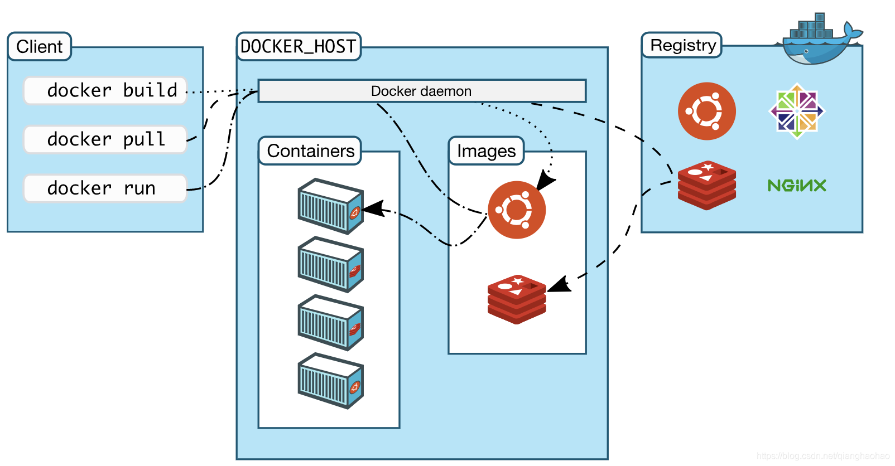

Docker构建上下文是理解Docker构建过程的关键。

<!-- more -->

## 对Docker构建上下文的理解误区

我们都知道，构建一个 Docker 镜像非常简单，大家一般都会这么做（当然这么做是完全正确的）：

1. 跳到 Dockerfile 所在目录;
2. 执行 `docker build` 构建命令:

```Bash
docker build -t <imageName:imageTag> .
```

通过上面的工作流，很容易形成这样的理解误区：

- `docker build` 后面的 `.` 为 Dockerfile 所在的目录；
- Dockerfile 文件名 必须为 Dockerfile；

其实上面这种理解是错误的，要想准确理解其含义，首先我们需要先了解下 Docker 的架构和 `docker build` 的工作原理。

## 理解 Docker 的架构

Docker 是一个典型的 C/S 架构的应用，分为 Docker 客户端（即平时敲的 docker 命令） Docker 服务端（dockerd 守护进程）。

Docker 客户端通过 REST API 和服务端进行交互，docker 客户端每发送一条指令，底层都会转化成 REST API 调用的形式发送给服务端，服务端处理客户端发送的请求并给出响应。

Docker 镜像的构建、容器创建、容器运行等工作都是 Docker 服务端来完成的，Docker 客户端只是承担发送指令的角色。

Docker 客户端和服务端可以在同一个宿主机，也可以在不同的宿主机，如果在同一个宿主机的话，Docker 客户端默认通过 UNIX 套接字(`/var/run/docker.sock`)和服务端通信。



## 理解 docker build 的工作原理

理解了 Docker 的架构就很容易理解 `docker build` 构建镜像的工作原理了。docker build 构建镜像的流程大概如下：

- 执行 docker build -t imageName:imageTag . 
- Docker 客户端会将构建命令后面指定的路径(.)下的所有文件打包成一个 tar 包，发送给 Docker 服务端
- Docker 服务端收到客户端发送的 tar 包，然后解压，根据 Dockerfile 里面的指令进行镜像的分层构建

## 正确理解 Docker 构建上下文

了解了 Docker 的架构和镜像构建的工作原理后，Docker 构建上下文也就容易理解了。Docker 构建上下文就是 Docker 客户端上传给服务端的 tar 文件解压后的内容，也即 `docker build` 命令行后面指定路径下的文件。

Docker 镜像的构建是在远程服务端进行的，所以客户端需要把构建所需要的文件传输给服务端。服务端以客户端发送的文件为上下文，也就是说 Dockerfile 中指令的工作目录就是服务端解压客户端传输的 tar 包的路径。

关于 `docker build` 指令的几点重要的说明：

1. 如果构建镜像时没有明确指定 Dockerfile，那么 Docker 客户端默认在构建镜像时指定的上下文路径下找名字为 Dockerfile 的构建文件
2. Dockerfile 可以不在构建上下文路径下，此时需要构建时通过 -f 参数明确指定使用哪个构建文件，并且名称可以自己任意命名。

下面通过具体的实例来理解下:

首先创建一个简单的 demo 工程，工程结构如下：

```Bash
helloworld-app
├── Dockerfile
└── docker
    ├── app-1.0-SNAPSHOT.jar
    ├── hello.txt
    └── html
        └── index.html

```

Dockerfile 内容：

```Bash
FROM busybox
COPY hello.txt .
COPY html/index.html .

```

实践1：直接进入 helloworld-app 目录进行镜像构建，以 docker 目录为构建上下文：

```Bash
$ docker build -t hello-app:1.0 docker
unable to prepare context: unable to evaluate symlinks in Dockerfile path: lstat /Users/haohao/opensource/helloworld-app/docker/Dockerfile: no such file or directory

```

可以看出默认 docker 客户端从 docker 构建上下文路径下找名字为 Dockerfile 的构建文件。

实践2：明确指定 Dockerfile 文件进行镜像构建，还是以 docker 目录为构建上下文：

```Bash
$ docker build -f Dockerfile -t hello-app:1.0 docker                                                                                 
Sending build context to Docker daemon  96.61MB
Step 1/3 : FROM busybox
 ---> d8233ab899d4
Step 2/3 : COPY hello.txt .
 ---> 3305fc373120
Step 3/3 : COPY html/index.html .
 ---> efdefc4e6eb2
Successfully built efdefc4e6eb2
Successfully tagged hello-app:1.0

```

从输出结果可以得知：

- 构建镜像时客户端会先给服务端发送构建上下路径下的内容（即 docker 目录下的文件）；
- Dockerfile 可以不在构建上下文路径下；
- Dockerfile 中指令的工作目录是服务端解压客户端传输的 tar 包的路径；

实践3：以当前目录为构建上下文路径：

```Bash
$ ls
Dockerfile docker
$ docker build -t hello-app:2.0 .
Sending build context to Docker daemon  96.62MB
Step 1/3 : FROM busybox
 ---> d8233ab899d4
Step 2/3 : COPY hello.txt .
COPY failed: stat /var/lib/docker/tmp/docker-builder375982663/hello.txt: no such file or directory

```

可以看出：

- 镜像构建上下文路径并不是 Dockerfile 文件所在的路径；
- Dockerfile 中指令的工作目录是服务端解压客户端传输的 tar 包的路径，因为 COPY 指令失败了，意味着当前目录并没有 hello.txt 文件；

