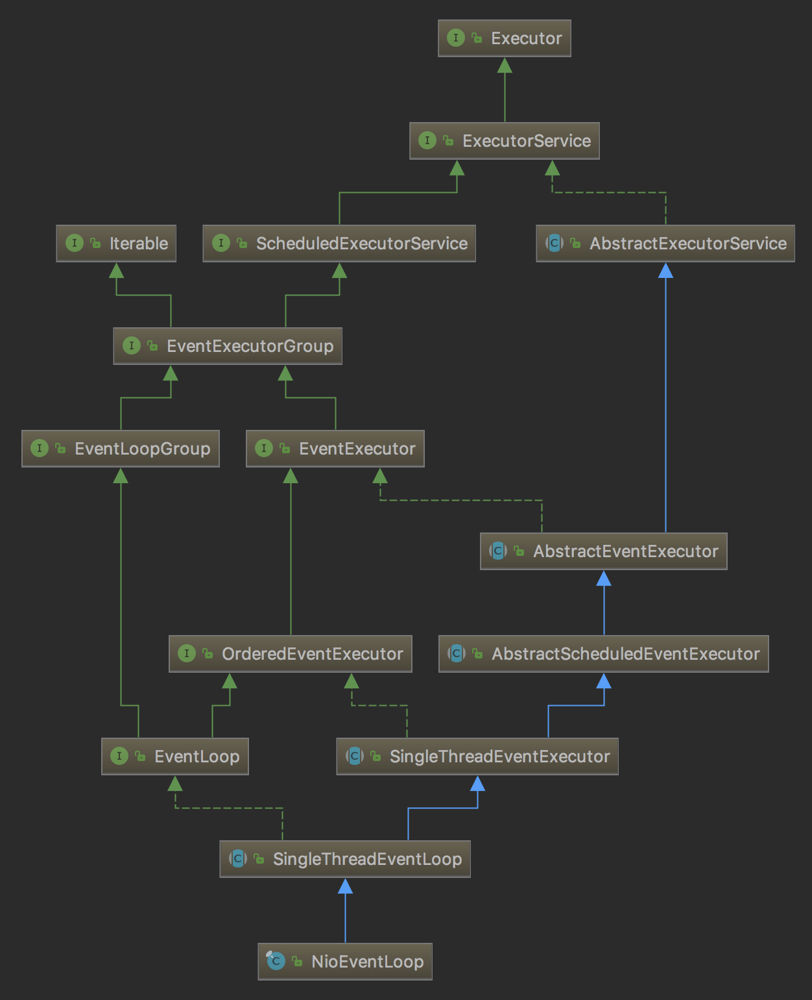
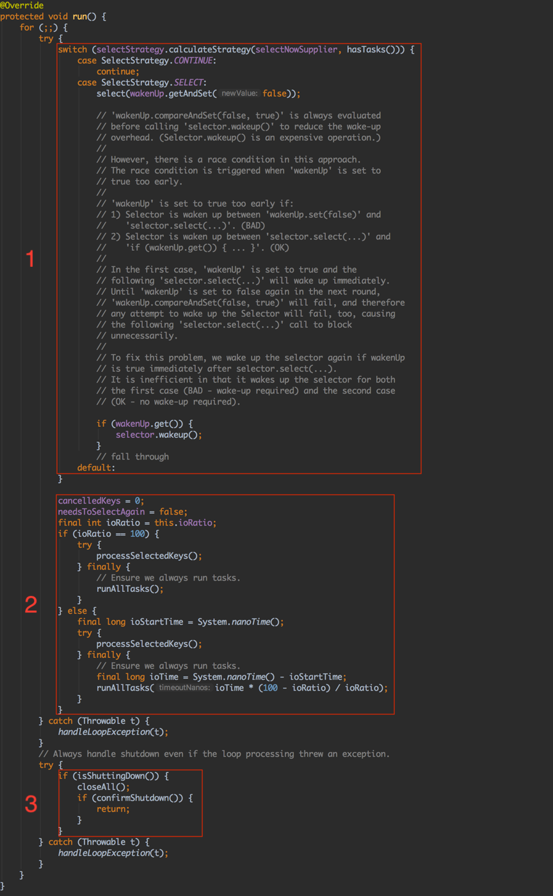
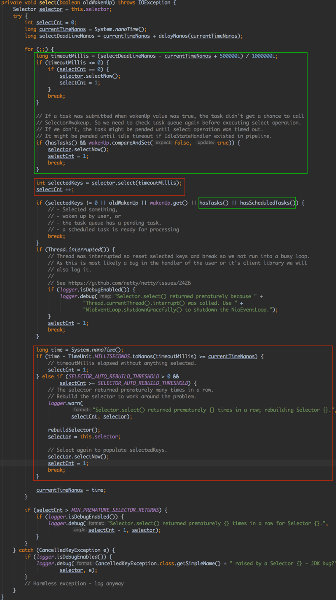
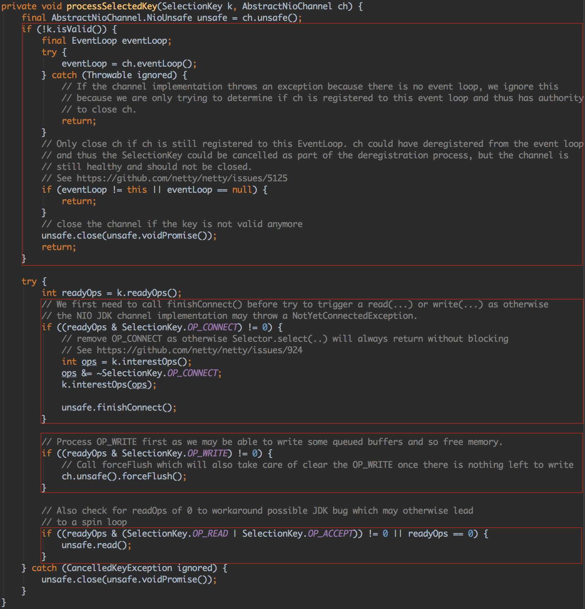
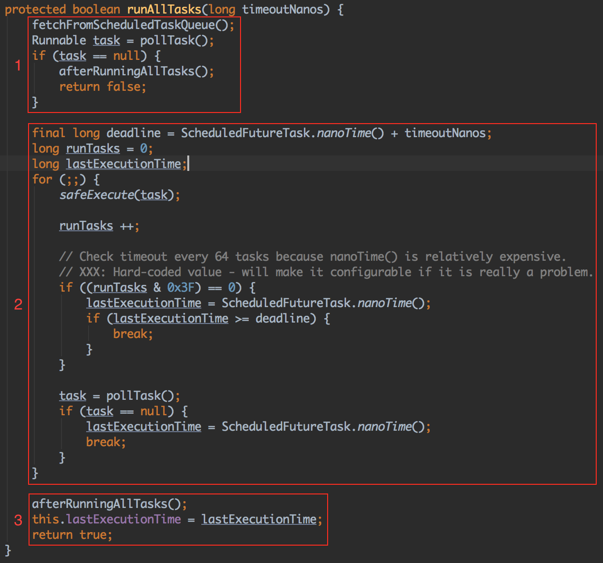

本篇文章我们来分析`NioEventLoop`的功能。

<!-- more -->

`NioEventLoop`是一个单线程的线程池，由`EventLoopGroup`维护。以`NioEventLoopGroup`为例，在它的父类`MultithreadEventExecutorGroup`中持有一个`NioEventLoop`的数组，执行任务时可以选择一个`NioEventLoop`，在`NioEventLoop`的线程中来异步执行任务。

继承关系如下所示：



# 新建

## MultithreadEventExecutorGroup

以`NioEventLoopGroup`为例，在其父类`MultithreadEventExecutorGroup`的构造函数中调用`newChild`方法新建`NioEventLoop`。

```java
protected MultithreadEventExecutorGroup(int nThreads, Executor executor,
                                        EventExecutorChooserFactory chooserFactory, Object... args) {
    if (nThreads <= 0) {
        throw new IllegalArgumentException(String.format("nThreads: %d (expected: > 0)", nThreads));
    }

    if (executor == null) {
        executor = new ThreadPerTaskExecutor(newDefaultThreadFactory());
    }

    children = new EventExecutor[nThreads];

    for (int i = 0; i < nThreads; i ++) {
        boolean success = false;
        try {
            children[i] = newChild(executor, args);
            success = true;
        } catch (Exception e) {
            // TODO: Think about if this is a good exception type
            throw new IllegalStateException("failed to create a child event loop", e);
        } finally {
            if (!success) {
                for (int j = 0; j < i; j ++) {
                    children[j].shutdownGracefully();
                }

                for (int j = 0; j < i; j ++) {
                    EventExecutor e = children[j];
                    try {
                        while (!e.isTerminated()) {
                            e.awaitTermination(Integer.MAX_VALUE, TimeUnit.SECONDS);
                        }
                    } catch (InterruptedException interrupted) {
                        // Let the caller handle the interruption.
                        Thread.currentThread().interrupt();
                        break;
                    }
                }
            }
        }
    }

    chooser = chooserFactory.newChooser(children);

    final FutureListener<Object> terminationListener = new FutureListener<Object>() {
        @Override
        public void operationComplete(Future<Object> future) throws Exception {
            if (terminatedChildren.incrementAndGet() == children.length) {
                terminationFuture.setSuccess(null);
            }
        }
    };

    for (EventExecutor e: children) {
        e.terminationFuture().addListener(terminationListener);
    }

    Set<EventExecutor> childrenSet = new LinkedHashSet<EventExecutor>(children.length);
    Collections.addAll(childrenSet, children);
    readonlyChildren = Collections.unmodifiableSet(childrenSet);
}
```

`NioEventLoop`在`MultithreadEventExecutorGroup`的构造函数中被创建，如果不指定`NioEventLoop`的数量，默认情况下会创建两倍的CPU核数的`NioEventLoop`。下面是`MultithreadEventExecutorGroup`构造函数的执行流程：

1. 首先创建`ThreadPerTaskExecutor`，它是线程执行器，负责创建`NioEventLoop`对应的底层线程
2. 通过for循环调用`newChild`方法创建`NioEventLoop`的对象数组
3. 调用`chooserFactory.newChooser`创建线程选择器，线程选择器的作用是为每个新连接分配`NioEventLoop`线程

### ThreadPerTaskExecutor

`ThreadPerTaskExecutor`执行的作用是每次执行任务的时候都会创建一个线程实体。

`NioEventLoop`线程命名规则为`nioEventLoop-{poolId}-{xx}`。`{poolId}`表示线程池id，`{xx}`表示`NioEventLoopGroup`下的第几个`NioEventLoop`。

### newChild()

`newChild()`方法如下：

```java
@Override
protected EventLoop newChild(Executor executor, Object... args) throws Exception {
    return new NioEventLoop(this, executor, (SelectorProvider) args[0],
        ((SelectStrategyFactory) args[1]).newSelectStrategy(), (RejectedExecutionHandler) args[2]);
}
```

调用`NioEventLoop`的构造函数新建`NioEventLoop`。

### newChooser()

`chooser`的作用是为了给新连接绑定对应的`NioEventLoop`。

判断线程池中线程的数量，如果是2的幂则创建`PowerOfTwoEventExecutorChooser`，否则创建`GenericEventExecutorChooser`。

## NioEventLoop

`NioEventLoop`的构造函数如下：

```java
NioEventLoop(NioEventLoopGroup parent, Executor executor, SelectorProvider selectorProvider,
             SelectStrategy strategy, RejectedExecutionHandler rejectedExecutionHandler) {
    super(parent, executor, false, DEFAULT_MAX_PENDING_TASKS, rejectedExecutionHandler);
    if (selectorProvider == null) {
        throw new NullPointerException("selectorProvider");
    }
    if (strategy == null) {
        throw new NullPointerException("selectStrategy");
    }
    provider = selectorProvider;
    final SelectorTuple selectorTuple = openSelector();
    selector = selectorTuple.selector;
    unwrappedSelector = selectorTuple.unwrappedSelector;
    selectStrategy = strategy;
}
```

- `parent`：前面我们新建的`NioEventLoopGroup`
- `executor`：`MultithreadEventExecutorGroup`构造函数中新建的`ThreadPerTaskExecutor`
- `selectorProvider`：`NioEventLoopGroup`构造函数中调用`SelectorProvider.provider()`返回的`SelectorProvider`
- `strategy`：`NioEventLoopGroup`构造函数中给定的`DefaultSelectStrategyFactory`
- `rejectedExecutionHandler`：`NioEventLoopGroup`构造函数中给定的`RejectedExecutionHandler`。该接口有一个唯一的接口方法`rejected`，当尝试去添加一个任务到`SingleThreadEventExecutor`中，但是由于容量的限制添加失败了，那么此时该方法就会被调用。

`final SelectorTuple selectorTuple = openSelector();`开启`Selector`，构造`SelectorTuple`实例，`SelectorTuple`是一个封装了原始`selector`对象和封装后`selector`对象（即`SelectedSelectionKeySetSelector`对象）的类：

```java
private static final class SelectorTuple {
    final Selector unwrappedSelector;
    final Selector selector;
    ...
}
```

这里，成员变量`unwrappedSelector`就是通过`SelectorProvider.provider().openSelector()`开启的`Selector`；而成员变量`selector`则是一个`SelectedSelectionKeySetSelector`对象。

`SelectedSelectionKeySetSelector`中持有`unwrappedSelector`，并作为`unwrappedSelector`的代理类，提供`Selector`所需要的方法，而`Selector`相关的操作底层实际都是由`unwrappedSelector`来完成的，只是在操作中增加了对`selectionKeys`进行相应的设置。

`SelectedSelectionKeySetSelector`中除了持有`unwrappedSelector`实例外还持有一个`SelectedSelectionKeySet`对象。该对象是Netty提供的一个代替`Selector`的`selectedKeys`对象。`openSelector()`方法中通过反射机制将程序构建的`SelectedSelectionKeySet`对象给设置到了`Selector`内部的`selectedKeys`、`publicSelectedKeys`属性。这使`Selector`中所有对`selectedKeys`、`publicSelectedKeys`的操作实际上就是对`SelectedSelectionKeySet`的操作。

`SelectedSelectionKeySet`类主要通过成员变量`SelectionKey[]`数组来维护被选择的`SelectionKeys`，并将扩容操作简单地简化为**newCapacity为oldCapacity的2倍**来实现。同时不再支持`remove`、`contains`、`iterator`方法。并添加了`reset`方法来对`SelectionKey[]`数组进行重置。

`SelectedSelectionKeySetSelector`在每次`select`操作的时候，都会先将`selectedKeys`进行清除（`reset`）操作。

# 启动

当`NioEventLoop`新建完成之后，其线程并没有开始执行，只有当有任务被添加到该线程池中，其中的线程才开始执行。

添加任务的操作在其父类`SingleThreadEventExecutor`的`execute`方法中完成：

```java
public void execute(Runnable task) {
    if (task == null) {
        throw new NullPointerException("task");
    }

    boolean inEventLoop = inEventLoop();
    addTask(task);
    if (!inEventLoop) {
        startThread();
        if (isShutdown() && removeTask(task)) {
            reject();
        }
    }

    if (!addTaskWakesUp && wakesUpForTask(task)) {
        wakeup(inEventLoop);
    }
}
```

步骤如下：

1. 将任务`task`加入任务队列`taskQueue`中
2. 调用`inEventLoop()`方法判断当前线程是否是`NioEventLoop`的线程
3. 如果`inEventLoop()`方法返回`false`，表示当前event loop并没有启动，此时调用`startThread()`方法创建线程。创建线程的动作由前面创建的`ThreadPerTaskExecutor`线程执行器调用其`execute()`方法完成。`execute()`方法会创建一个`FastThreadLocalThread`，然后调用`start()`方法进行启动，启动的时候会执行`Runnable`里面的`run()`方法。

    `run()`方法中主要有以下两步：
    
    1. 调用`thread = Thread.currentThread()`保存当前的线程，这个线程其实就是线程执行器创建的`FastThreadLocalThread`
    2. 调用`NioEventLoop.run()`方法，`run()`方法是驱动`netty`运转的核心方法。

4. 满足条件时，触发`wakeup()`方法

# 执行

当`NioEventLoop`启动之后，就会在其`run()`方法中循环执行，`run()`方法是`NioEventLoop`的核心。

`run()`方法有一个无限的`for`循环，循环里主要有三件事：

1. 调用`select()`方法轮询注册到`Selector`上的io事件
2. 调用`processSelectedKeys()`方法处理io事件
3. 调用`runAllTasks()`方法异步处理外部线程添加到`taskQueue`中的任务



`run()`方法的大循环主要完成下面几件事：

1. 根据当前`NioEventLoop`中是否有待完成的任务得出select策略，进行相应的select操作
2. 处理select操作得到的已经准备好处理的IO事件，以及处理提交到当前`EventLoop`的任务（包括定时和周期任务）
3. 如果`NioEventLoop`所在线程执行了关闭操作，则执行相关的关闭操作处理。

## 判断select策略

调用`DefaultSelectStrategy`的`calculateStrategy(IntSupplier selectSupplier, boolean hasTasks)`方法判断select策略。

```java
// io.netty.channel.DefaultSelectStrategy#calculateStrategy
public int calculateStrategy(IntSupplier selectSupplier, boolean hasTasks) throws Exception {
    return hasTasks ? selectSupplier.get() : SelectStrategy.SELECT;
}

// io.netty.channel.nio.NioEventLoop#selectNowSupplier
private final IntSupplier selectNowSupplier = new IntSupplier() {
    @Override
    public int get() throws Exception {
        return selectNow();
    }
};

// io.netty.channel.nio.NioEventLoop#selectNow
int selectNow() throws IOException {
    try {
        return selector.selectNow();
    } finally {
        // restore wakeup state if needed
        if (wakenUp.get()) {
            selector.wakeup();
        }
    }
}

// io.netty.channel.nio.SelectedSelectionKeySetSelector#selectNow
public int selectNow() throws IOException {
    selectionKeys.reset();
    return delegate.selectNow();
}

// io.netty.channel.nio.SelectedSelectionKeySetSelector#wakeup
public Selector wakeup() {
    return delegate.wakeup();
}
```

`selectSupplier`是经过封装的selector（即`SelectedSelectionKeySetSelector`），`hasTasks`是调用`hasTask()`方法的返回值，`hasTask()`用于判断`taskQueue`或`tailTasks`是否有任务。

`calculateStrategy`方法的选择策略是：

- 如果当前的`EventLoop`中有待处理的任务，那么会调用`selectSupplier.get()`方法，最终会调用`Selector.selectNow()`方法，返回就绪通道的数量，并清空`selectionKeys`。
- 如果当前的`EventLoop`没有待处理的任务，那么返回`SelectStrategy.SELECT`（`-1`）。

如果`calculateStrategy`方法返回值大于0，则说明有就绪的IO事件待处理，跳出switch代码块，进入流程2。否则如果返回的是`SelectStrategy.SELECT`，执行`select(wakenUp.getAndSet(false))`：以CAS的方式获得`wakenUp`当前的标识，并将`wakenUp`设置为`false`。将`wakenUp`作为参数传入`select(boolean oldWakenUp)`方法中。

## select()

`select`方法除了检查就绪通道以外，还有一个很重要的事，就是解决`epoll bug`问题。`epoll bug`会导致`Selector`空轮询，IO线程CPU使用率100%，严重影响系统的安全性和可靠性。

Netty的解决策略是：

1. 根据该BUG的特征，首先侦测该BUG是否发生
2. 将问题Selector上注册的Channel转移到新建的Selector上
3. 老的问题Selector关闭，使用新建的Selector替换



红色框中的代码是对`epoll bug`的解决。

`time - TimeUnit.MILLISECONDS.toNanos(timeoutMillis) >= currentTimeNanos`为`false`，即`time - TimeUnit.MILLISECONDS.toNanos(timeoutMillis) < currentTimeNanos`的意思是`int selectedKeys = selector.select(timeoutMillis)`在`timeoutMillis`时间到期前就返回了，并且`selectedKeys == 0`。这意味着selector进行了一次空轮询，即发生了`epoll bug`。`Selector`不管有无感兴趣的时间发生，`select()`方法总是不阻塞就返回，这会导致CPU的利用率达到100%。

`SELECTOR_AUTO_REBUILD_THRESHOLD`默认为`512`，也就是当`Selector`连续执行了`512`空轮询后，Netty就会进行`Selector`的重建操作，即`rebuildSelector()`操作。

绿色框中的代码主要说明了，当有定时/周期性任务即将到达执行时间（<0.5ms），或者`NioEventLoop`的线程收到了新提交的任务等待被处理，或者有定时/周期性任务到达了可处理状态等待被处理，那么则退出`select`方法转而去执行任务。这也说明了Netty总是会尽最大努力去保证任务队列中的任务以及定时/周期性任务能得到及时的处理。

```java
long currentTimeNanos = System.nanoTime();
long selectDeadLineNanos = currentTimeNanos + delayNanos(currentTimeNanos);

long timeoutMillis = (selectDeadLineNanos - currentTimeNanos + 500000L) / 1000000L;
if (timeoutMillis <= 0) {
    if (selectCnt == 0) {
        selector.selectNow();
        selectCnt = 1;
    }
    break;
}
```

该段代码会计算`scheduledTaskQueue`中是否有即将要执行的任务，即在`0.5ms`内就可执行的`scheduledTask`，如果有则退出`select`方法转而去执行任务。

`delayNanos`方法会返回最近一个待执行的定时/周期性任务还差多少纳秒就可以执行的时间差（若`scheduledTaskQueue`为空，也就是没有任务的定时/周期性任务，则返回1秒）。因此`selectDeadLineNanos`就表示最近一个待执行的定时/周期性任务的可执行时间。

`selectDeadLineNanos - currentTimeNanos`就表示：最近一个待执行的定时/周期性任务还差多少纳秒就可以执行的时间差。如果`(selectDeadLineNanos - currentTimeNanos + 0.5ms) / 1ms <= 0`表示`selectDeadLineNanos - currentTimeNanos < 0.5ms`，即`scheduledTaskQueue`中在0.5ms内有可执行的任务，于是退出`select`方法。

```java
if (hasTasks() && wakenUp.compareAndSet(false, true)) {
    selector.selectNow();
    selectCnt = 1;
    break;
}
```

在了解上面代码的用意之前，我们先来看下任务提交时的一下细节：

```java
public void execute(Runnable task) {
    if (task == null) {
        throw new NullPointerException("task");
    }

    boolean inEventLoop = inEventLoop();
    addTask(task);
    if (!inEventLoop) {
        startThread();
        if (isShutdown() && removeTask(task)) {
            reject();
        }
    }

    if (!addTaskWakesUp && wakesUpForTask(task)) {
        wakeup(inEventLoop);
    }
}
```

当满足下面4个条件时，在有任务提交至`EventLoop`后会触发Selector的`wakeup()`方法：

1. 成员变量`addTaskWakesUp`为`false`。这里，在构造`NioEventLoop`对象时，通过构造方法传进的参数`addTaskWakesUp`正是`false`，它会赋值给变量`addTaskWakesUp`。因此该条件满足。
2. 提交上来的任务不是一个`NonWakeupRunnable`任务

```java
@Override
protected boolean wakesUpForTask(Runnable task) {
    return !(task instanceof NonWakeupRunnable);
}
```

3. 执行提交任务的线程不是EventLoop所在线程
4. 当`wakenUp`成员变量当前的值为`false`

```java
protected void wakeup(boolean inEventLoop) {
    if (!inEventLoop && wakenUp.compareAndSet(false, true)) {
        selector.wakeup();
    }
}
```

只有同时满足上面4个条件的情况下，`Selector`的`wakeup()`方法才会得以调用。

现在，我们再来说明这段代码块的用意：

```java
if (hasTasks() && wakenUp.compareAndSet(false, true)) {
    selector.selectNow();
    selectCnt = 1;
    break;
}
```

如果一个任务在`wakenUp`值为`true`的情况下被提交上来，那么这个任务将没有机会去调用`Selector.wakeup()`。所以我们需要去再次检测任务中是否有待执行的任务，在执行`Selector.select`操作之前。如果我们不这么做，那么任务队列中的任务将等待直到`Selector.select`操作超时。如果`ChannelPipeline`中存在`IdleStateHandler`，那么`IdleStateHandler`处理器可能会被挂起直到空闲超时。

这段代码在每次要执行`Selector.select(long timeout)`之前我们会进行一个判断。如果`hasTask()`为`true`，即发现当前有任务待处理时，`wakenUp.compareAndSet(false, true)`会返回`true`，因为在每次调用当前这个`select`方法时，都会将`wakeUp`标识设置为`false`（`wakenUp.getAndSet(false)`这句代码）。而此时`wakenUp`已经被置位为`true`了，在此之后有任务提交至`EventLoop`，那么是无法触发`Selector.wakeup()`的。所以如果当前有待处理的任务，就不会进行下面的`Selector.select(long timeout)`操作，而是退出`select`方法，继而去处理任务。

因为如果不这么做的话，如果当前`NioEventLoop`线程上已经有任务提交上来，这会使得这些任务可能会需要等待`Selector.select(long timeout)`操作超时后才能得以执行。再者，假设我们的`ChannelPipeline`中存在一个`IdleStateHandler`，那么就可能导致因为`Selector.select(long timeout)`操作的`timeout`比`IdleStateHandler`设置的`idle timeout`长，而导致`IdleSateHandler`不能对空闲超时做出及时的处理。

同时，我们注意，在执行`break`退出`select`方法前，会执行`selector.selectNow()`，该方法不会阻塞，它会立即返回，同时它会抵消`Selector.wakeup()`操作带来的影响。

所以，如果有非`NioEventLoop`线程提交一个任务上来，那么这个线程会执行`selector.wakeup()`方法，那么`NioEventLoop`在`if (hasTasks() && wakenUp.compareAndSet(false, true))`的后半个条件会返回`false`，程序会执行到`int selectedKeys = selector.select(timeoutMillis)`，但是此时`select`不会阻塞，而是直接返回，因为前面已经先执行了`selector.wakeup()`。

因为提交任务的线程是非`NioEventLoop`线程，所以也可能是由`NioEventLoop`线程成功执行了`if (hasTasks() && wakenUp.compareAndSet(false, true))`，退出了`select`方法转而去执行任务队列中的任务。注意，这时提交任务的非`NioEventLoop`线程就不会执行`selector.wakeup`。

```java
if (selectedKeys != 0 || oldWakenUp || wakenUp.get() || hasTasks() || hasScheduledTasks()) {
    // - Selected something,
    // - waken up by user, or
    // - the task queue has a pending task.
    // - a scheduled task is ready for processing
    break;
}
```

同时，除了在每次`Selector.select(long timeout)`操作前进行任务队列的检测外，在每次`Selector.select(long timeout)`操作后也会检测任务队列是否已经有提交上来的任务待处理，以及是否有定时或周期性任务准备好被执行。如果有，也不会继续`epoll bug`的检测，转而去执行待处理的任务。

如果检测到发生了`epoll bug`，调用`rebuildSelector()`进行`Selector`的重构操作。重构操作流程如下：

1. 调用`openSelector()`先构造一个新的`SelectorTupe`。
2. 然后，遍历`oldSelector`中的所有`SelectionKey`，依次判断其有效性，如果有效则将其重新注册到新的`Selector`上，并将旧的`SelectionKey`执行`cancel`操作，进行相关的数据清理，以便最后`oldSelector`好进行关闭。
3. 在将所有的`SelectionKey`数据移至新的`Selector`后，将`newSelectorTuple`的`selector`和`unwrappedSelector`赋值给相应的成员属性。
4. 最后，调用`oldSelector.close()`关闭旧的`Selector`以进行资源的释放。

## 处理IO事件

判断完`select`策略之后，接着处理`select`操作得到的已经准备好处理的IO事件，以及处理提交到当前`EventLoop`的任务（包括定时和周期任务）。

```java
cancelledKeys = 0;
needsToSelectAgain = false;
final int ioRatio = this.ioRatio;
if (ioRatio == 100) {
    try {
        processSelectedKeys();
    } finally {
        // Ensure we always run tasks.
        runAllTasks();
    }
} else {
    final long ioStartTime = System.nanoTime();
    try {
        processSelectedKeys();
    } finally {
        // Ensure we always run tasks.
        final long ioTime = System.nanoTime() - ioStartTime;
        runAllTasks(ioTime * (100 - ioRatio) / ioRatio);
    }
}
```

1. 首先将成员变量`cancelledKeys`和`needsToSelectAgain`重置，即`cancelledKeys`置为0，`needsToSelectAgain`置为`false`
2. 成员变量`ioRatio`的默认值为`50`。`ioRatio`是在事件循环中用于处理IO操作时间的百分比。默认为50%。也就是说，在事件循环中默认情况下用于处理IO操作的时间和用于处理任务的时间百分比都是50%。
3. 调用`processSelectedKeys()`处理`Selector.select`操作返回的待处理的IO事件
4. 调用`runAllTasks`处理任务队列中的任务以及定时/周期性任务

### processSelectedKeys()

`processSelectedKeys()`方法依次取出准备好被处理的`SelectionKey`，并对相应的待处理IO事件进行处理。

```java
private void processSelectedKeys() {
    if (selectedKeys != null) {
        processSelectedKeysOptimized();
    } else {
        processSelectedKeysPlain(selector.selectedKeys());
    }
}

private void processSelectedKeysOptimized() {
    for (int i = 0; i < selectedKeys.size; ++i) {
        final SelectionKey k = selectedKeys.keys[i];
        // null out entry in the array to allow to have it GC'ed once the Channel close
        // See https://github.com/netty/netty/issues/2363
        selectedKeys.keys[i] = null;

        final Object a = k.attachment();

        if (a instanceof AbstractNioChannel) {
            processSelectedKey(k, (AbstractNioChannel) a);
        } else {
            @SuppressWarnings("unchecked")
            NioTask<SelectableChannel> task = (NioTask<SelectableChannel>) a;
            processSelectedKey(k, task);
        }

        if (needsToSelectAgain) {
            // null out entries in the array to allow to have it GC'ed once the Channel close
            // See https://github.com/netty/netty/issues/2363
            selectedKeys.reset(i + 1);

            selectAgain();
            i = -1;
        }
    }
}
```

`selectedKeys.keys[i] = null`操作相当于我们在NIO编程中在处理已经触发的感兴趣的事件时，要将处理过的事件从`selectedKeys`集合中移除的步骤。

在将`ServerSocketChannel`注册到`Selector`的时候，是会将其对应的`NioServerSocketChannel`作为附加属性设置到`SelectionKey`中。所以这里从`k.attachment()`获取到的`Object`对象实际就是`NioServerSocketChannel`，而`NioServerSocketChannel`就是一个`AbstractNioChannel`的实现类。



首先检查当前的`SelectionKey`是否有效（仅当`SelectionKey`从`Selector`上注销的时候，该`SelectionKey`会为无效状态），如果无效的话：

1. 获取该`SelectionKey`所关联的`Channel`所注册的`EventLoop`，如果获取`Channel`的`EventLoop`失败，则忽略错误直接返回。因为我们只处理注册到`EventLoop`上的`Channel`且有权去关闭这个`Channel`
2. 如果获取到的`EventLoop`不是当前的执行线程所绑定的`EventLoop`，或者获取到的`EventLoop`为null，则直接返回。因为我们只关注依然注册在当前执行线程所绑定的`EventLoop`上的`Channel`。`Channel`可能已经从当前的`EventLoop`上注销，并且它的`SelectionKey`可能已经被取消了，作为在注销处理流程的一部分。当然如果`Channel`仍然健康的被注册在当前的`EventLoop`上，则需要去关闭它
3. 当能正确获取到`EventLoop`，且该`EventLoop`非空并为当前执行线程所绑定的`EventLoop`，则说明`Channel`依旧注册去当前的`EventLoop`上，那么执行关闭操作，来关闭相应的连接，释放相应的资源

如果`SelectionKey`是有效的，获取`readyOps`。

当`SelectionKey.OP_CONNECT`事件就绪时：

1. 将`SelectionKey.OP_CONNECT`事件从`SelectionKey`所感兴趣的事件中移除，这样`Selector`就不会再去监听该连接的`SelectionKey.OP_CONNECT`事件了。而`SelectionKey.OP_CONNECT`连接事件是只需要处理一次的事件，一旦连接建立完成，就可以进行读、写操作了
2. 调用`unsafe.finishConnect()`方法，该方法会调用`SocketChannel.finishConnect()`来标识连接的完成，如果我们不调用该方法，就去调用`read/write`方法，则会抛出`NotYetConnectedException`异常。在此之后，触发`ChannelActive`事件，该事件会在该`Channel`的`ChannelPipeline`中传播。


### runAllTasks()

`runAllTasks()`方法处理任务队列中的任务以及定时/周期性任务。

将`runAllTasks()`方法写在`finally`块中，这是为了确保即便处理`SelectedKeys`出现了异常，也要确保任务中的队列总能得到执行的机会。



#### 步骤1

获取系统启动到当前的时间内已经过期的定时任务（即，延迟的时间已经满足或者定时执行任务的时间已经满足的任务）放入到`taskQueue`中。从`taskQueue`中获取任务，如果`taskQueue`已经没有任务了，则依次执行`tailTasks`队列里的所有任务。

`fetchFromScheduledTaskQueue`方法获取过期的定时任务放入到`taskQueue`中：

```java
private boolean fetchFromScheduledTaskQueue() {
    long nanoTime = AbstractScheduledEventExecutor.nanoTime();
    Runnable scheduledTask  = pollScheduledTask(nanoTime);
    while (scheduledTask != null) {
        if (!taskQueue.offer(scheduledTask)) {
            // No space left in the task queue add it back to the scheduledTaskQueue so we pick it up again.
            scheduledTaskQueue().add((ScheduledFutureTask<?>) scheduledTask);
            return false;
        }
        scheduledTask  = pollScheduledTask(nanoTime);
    }
    return true;
}
```

1. 获取从系统启动到当前系统的时间间隔
2. 从`scheduledTaskQueue`中获取在该时间间隔内已经过期的任务（即延迟周期或定时周期已经到时间的任务），将这些任务放入到taskQueue中
3. 如果`taskQueue`满了，无法添加新的任务（`taskQueue`队列的容量限制最大为2048），则将其重新放回到`scheduledTaskQueue`

默认情况下，`taskQueue`是一个`MpscUnboundedArrayQueue`实例

`pollScheduledTask`方法根据给定的`nanoTime`返回已经准备好被执行的`Runnable`。必须使用`AbstractScheduledEventExecutor.nanoTime()`方法来检索正确的`nanoTime`：

```java
protected final Runnable pollScheduledTask(long nanoTime) {
    assert inEventLoop();

    Queue<ScheduledFutureTask<?>> scheduledTaskQueue = this.scheduledTaskQueue;
    ScheduledFutureTask<?> scheduledTask = scheduledTaskQueue == null ? null : scheduledTaskQueue.peek();
    if (scheduledTask == null) {
        return null;
    }

    if (scheduledTask.deadlineNanos() <= nanoTime) {
        scheduledTaskQueue.remove();
        return scheduledTask;
    }
    return null;
}
```

`scheduledTaskQueue`是一个`PriorityQueue`实例，它根据任务的`deadlineNanos`属性的升序来维护一个任务队列，每次`peek`能返回最先该被执行的定时任务。`deadlineNanos`表示系统启动到该任务应该被执行的时间点的时间差。如果`scheduledTask.deadlineNanos() <= nanoTime`则说明该任务的执行时间已经到了，因此将其从`scheduledTaskQueue`移除，然后通过该方法返回后放入到taskQueue中等待被执行。

因此，可知每次执行`taskQueue`前，`taskQueue`中除了有用户自定义提交的任务，系统逻辑流程提交至该`NioEventLoop`的任务，还有用户自定义或者系统设置的已经达到运行时间点的定时/周期性任务会一并放入到`taskQueue`中，而`taskQueue`的初始化容量为1024，最大长度限制为2048，也就是一次事件循环最多只能处理2048个任务。

`afterRunningAllTasks()`方法会依次执行`tailQueue`中的任务，`tailTasks`中是用户自定义的一些列在本次事件循环遍历结束后会执行的任务，你可以通过类似以下的方式来添加`tailTask`：

```java
((NioEventLoop)ctx.channel().eventLoop()).executeAfterEventLoopIteration(() -> {
    // add some task to execute after eventLoop iteration
});
```

#### 步骤2

通过`系统启动到当前的时间差`+`可用于执行任务的时间`=`系统启动到可用于执行任务时间的时间段(deadline)`。从`taskQueue`中依次取出任务，如果`task`为`null`则说明已经没有待执行的任务，那么退出for循环。否则，同步执行`task`，每执行64个任务后，就计算`系统启动到当前的时间`是否大于等于`deadline`，如果是则说明已经超过了分配给任务执行的时间，此时就不会继续执行`taskQueue`中的任务了。

```java
protected static void safeExecute(Runnable task) {
    try {
        task.run();
    } catch (Throwable t) {
        logger.warn("A task raised an exception. Task: {}", task, t);
    }
}
```

`safeExecute()`方法调用`task`的`run`方法来同步执行任务：

```java
if ((runTasks & 0x3F) == 0) {
    lastExecutionTime = ScheduledFutureTask.nanoTime();
    if (lastExecutionTime >= deadline) {
        break;
    }
}
```

63的16进制表示为`0x3f`（二进制表示为`0011 1111`），当已经执行的任务数量小于64时，其与`0x3f`的位与操作会大于0，当其等于64（64的16进制表示为`0x40`，二进制表示为`0100 0000`）时，`runTasks & 0x3f`的结果为0。所以是每执行64个任务后就进行一次时间的判断，以保证执行任务队列的任务不会严重的超出我们所设定的时间。

#### 步骤3

依次执行`tailTasks`队列里的所有任务。赋值全部属性`lastExecutionTime`为最后一个任务执行完后的时间。

# 总结

- `NioEventLoop`创建

    用户代码创建`NioEventLoopGroup`的时候`NioEventLoop`被创建，默认不传参数的时候会创建两倍的CPU核数的`NioEventLoop`。每个`NioEventLoopGroup`都会有一个`chooser`进行现场的分配，`chooser`也会根据`NioEventLoop`的个数做一定程度的优化。`NioEventLoop`的创建的时候会创建一个`Selector`和一个定时任务队列。在创建`Selector`的时候netty会通过反射的方式用数组实现来替换掉`Selector`里面的两个`hashset`数据结构。
    
- `NioEventLoop`启动

    `NioEventLoop`在首次调用`execute`方法的时候启动线程，这个线程是一个`FastThreadLocalThread`。启动线程之后，netty会将启动完成的线程保存到成员变量`thread`中，这样就能在执行逻辑过程中判断当前线程是否在`NioEventLoop`中。
    
- `NioEventLoop`执行逻辑

    `NioEventLoop`执行逻辑在`run`方法里。主要包括三个过程：
    
    1. 检测IO事件。
    2. 处理IO事件。
    3. 执行任务队列。


> https://www.jianshu.com/p/3f6e997efd27

