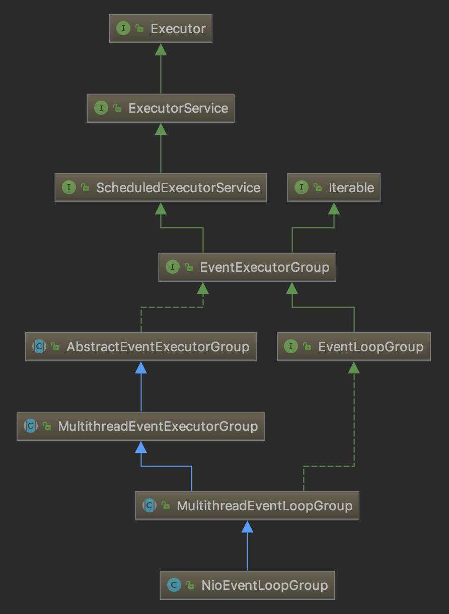

本篇文章我们来分析Netty服务端与客户端的启动过程。

<!-- more -->

# 服务端启动过程

如果我们要使用Netty来开发一个服务，大体上我们的代码会如下所示：

```java
public class NettyServer {
    public static void main(String[] args) throws InterruptedException {
        final int port = 6789;
        EventLoopGroup bossGroup = new NioEventLoopGroup(1);
        EventLoopGroup workerGroup = new NioEventLoopGroup();
        ServerBootstrap bootstrap = new ServerBootstrap();
        try {
            bootstrap
                    .group(bossGroup, workerGroup)
                    .channel(NioServerSocketChannel.class)
                    .localAddress(port)
                    .childHandler(new NettyServerFilter());

            ChannelFuture f = bootstrap.bind().sync();
            f.channel().closeFuture().sync();
        } finally {
            bossGroup.shutdownGracefully();
            bossGroup.shutdownGracefully();
        }
    }
}
```

主要分为以下3步：

1. 初始化`EventLoopGroup`
2. 配置`ServerBootstrap`
3. 创建并绑定`Channel`

## 初始化EventLoopGroup

`EventLoopGroup`本质上来说可以看成是一个线程池。以`NioEventLoopGroup`为例，它的继承关系如下图所示：



`NioEventLoopGroup`继承`MultithreadEventLoopGroup`，它在实例化过程中会调用`MultithreadEventLoopGroup`的构造函数：

```java
protected MultithreadEventLoopGroup(int nThreads, Executor executor, Object... args) {
    super(nThreads == 0 ? DEFAULT_EVENT_LOOP_THREADS : nThreads, executor, args);
}

DEFAULT_EVENT_LOOP_THREADS = Math.max(1, SystemPropertyUtil.getInt(
                "io.netty.eventLoopThreads", NettyRuntime.availableProcessors() * 2));
```

如果我们没有指定线程数，默认维护逻辑处理器核数2倍的线程。

`MultithreadEventExecutorGroup`中维护了一个`EventExecutor[] children`，`EventExecutor`是用于实际处理的线程，数组大小为前面指定的线程数。

`EventExecutor`由`NioEventLoopGroup`的`newChild`方法建立，实际的类型为`NioEventLoop`：

```java
protected EventLoop newChild(Executor executor, Object... args) throws Exception {
    return new NioEventLoop(this, executor, (SelectorProvider) args[0],
        ((SelectStrategyFactory) args[1]).newSelectStrategy(), (RejectedExecutionHandler) args[2]);
}
```

`NioEventLoop`是一个单线程的线程池，核心方法是`run()`方法，一旦线程启动，就会不间断地查询任务队列`taskQueue`，将`taskQueue`中的任务按顺序取出并执行。关于`NioEventLoop`的内容我们在后面详细分析。

`MultithreadEventExecutorGroup`中维护了一个`EventExecutorChooserFactory.EventExecutorChooser chooser`，它是一个`EventExecutor`的选择器，负责从`children`中选择一个`EventExecutor`。根据`children`数组大小的不同，从`PowerOfTwoEventExecutorChooser`、`GenericEventExecutorChooser`选择不同的实例。在`children`中轮询选择`EventExecutor`。

## 配置ServerBootstrap

`ServerBootstrap`用于引导创建服务端`Channel`。

1. 调用`ServerBootstrap`中的`public ServerBootstrap group(EventLoopGroup parentGroup, EventLoopGroup childGroup)`方法设置线程池。其中`parentGroup`是用于处理连接请求的group（即acceptor），`childGroup`是用于处理事件的group（即client）。

2. 调用`AbstractBootstrap`中的`public B channel(Class<? extends C> channelClass)`方法设置channel的类型。

3. 配置服务端监听的端口

4. 调用`ServerBootstrap`中的`public ServerBootstrap childHandler(ChannelHandler childHandler)`方法配置消息处理器，由`childHandler`持有。

## 创建并绑定服务端Channel

调用`AbstractBootstrap`的`public ChannelFuture bind()`方法来创建并绑定服务端`Channel`，详细的操作在`doBind()`方法中，主要的步骤有两步：

1. 调用`initAndRegister`初始化并注册服务端`Channel`
2. 调用`doBind0`绑定服务端`Channel`

### 初始化并注册服务端Channel

初始化并注册服务端`Channel`的工作在`AbstractBootstrap.initAndRegister`方法中完成，它有以下几个步骤。

#### 创建服务端Channel

首先调用`channelFactory`的`newChannel()`方法创建服务端`Channel`。前面我们设置了`Channel`的类型为`NioServerSocketChannel`，因此这里会根据`Channel`的类型通过反射的方式新建`Channel`。`NioServerSocketChannel`的构造过程如下：

1. 调用`newSocket()`方法，通过JDK的`SelectorProvider.openServerSocketChannel()`方法来创建`ServerSocketChannel`。
2. 新建`NioServerSocketChannelConfig`，里面保存tcp参数等数据
3. 调用父类`AbstractNioChannel`的构造方法。传入刚刚创建`ServerSocketChannel`，将这个`ServerSocketChannel`保存在变量`ch`中，之后可以通过`javaChannel()`方法来获取这个`ServerSocketChannel`。调用`ServerSocketChannel.configureBlocking()`方法将`ServerSocketChannel`设置成非阻塞模式。
4. 调用父类`AbstractChannel`的构造方法，创建`id`、`unsafe`、`pipeline`。

#### 初始化服务端Channel

接着调用`ServerBootstrap.init`方法初始化新建的`Channel`：

1. 设置channel的`ChannelOptions`和`ChannelAttrs`
2. 设置channel的`ChildOptions`和`ChildAttrs`
3. 调用`Channel.pipeline()`方法获取`ChannelPipeline pipeline`。`pipeline`在`AbstractChannel`中维护，类型为`DefaultChannelPipeline`。`ChannelPipeline`用于维护`ChannelHandler`，`ChannelHandler`保存在`DefaultChannelHandlerContext`，以链表的形式保存在`DefaultChannelPipeline`。
4. 在pipeline中添加一个`ChannelInitializer`，`ChannelInitializer`在管道注册完成之后，往管道中添加一个`ServerBootstrapAcceptor`（继承`ChannelInboundHandler`），它持有对`childGroup`（`bossGroup`）和`childHandler`（`NettyServerFilter`）的引用，这个处理器的功能就是为`accept`的新连接分配线程。

#### 注册selector

最后调用`config().group().register(channel)`注册selector。获取`group`（这里的`group`是我们前面设置的`bossGroup`），调用`MultithreadEventLoopGroup.register`方法注册`Channel`。

1. 调用`next()`方法选择一个线程（`EventLoop`）。因为前面选择的是bossGroup，因此这里的`EventLoop`选择的是bossGroup中的`EventLoop`。
2. 然后调用`SingleThreadEventLoop.register`方法。

    `register`方法调用`promise.channel().unsafe().register(this, promise)`注册`Channel`。`unsafe()`返回的是`NioMessageUnsafe`。
    
3. 最终调用的是`AbstractUnsafe.register0`方法。

    1. 调用前面新建的`ServerSocketChannel`的`doRegister`方法，将selector注册到jdk的channel上，将当前`NioServerSocketChannel`作为attachment。
    2. 调用`pipeline.invokeHandlerAddedIfNeeded()`，初始化`Channel`。
    3. 调用`pipeline.fireChannelRegistered()`，传播注册成功事件

### 绑定服务端Channel

调用`AbstractBootstrap.doBind0`方法，在channel的线程池中绑定地址。

`Channel`的绑定调用`AbstractChannel.bind`来完成，其中的调用关系如下：

1. AbstractChannel.bind
2. DefaultChannelPipeline.bind
3. AbstractChannelHandlerContext.bind
4. AbstractChannelHandlerContext.invokeBind
5. DefaultChannelPipeline.bind
6. AbstractUnsafe.bind
7. NioServerSocketChannel.doBind

    最终调用的是`NioServerSocketChannel.doBind`方法，其中调用底层的jdk的channel来绑定地址
    
8. pipeline.fireChannelActive()，传播`channelActive`事件
    
    最后调用`HeadContext.channelActive`方法
    
    1. 调用`ctx.fireChannelActive()`传播`active`事件
    2. 这一步很重要，调用`DefaultChannelPipeline.HeadContext.readIfIsAutoRead()`，最后调用`AbstractNioChannel.doBeginRead()`方法在`SelectionKey`中注册`accept`事件

## 总结

1. 首先调用`newChannel()`创建服务端的`channel`，这个过程实际上是调用JDK底层的API来创建JDK的`channel`，然后netty将其包装成自己的服务端`channel`，同时会创建一些基本的组件绑定在此`channel`上，比如`pipeline`。
2. 然后调用`init()`方法初始化服务端`channel`，这个过程最重要的是为服务端`channel`添加一个连接处理器。
3. 随后调用`register()`方法注册`Selector`，这个过程中netty将JDK底层的`channel`注册到事件轮询器`Selector`中，并把netty的服务端`channel`作为一个`attachment`绑定到对应的JDK底层`channel`中。
4. 最后调用`doBind()`方法，调用JDK底层的API实现对本地端口的监听。绑定成功之后，netty会重新向`Selector`注册一个`accept`事件，注册完成后netty就可以接收新的连接了。

# 客户端启动过程

下面来看看客户端的启动过程。代码如下：

```java
public class NettyClient {
    public static String host = "127.0.0.1";
    public static int port = 6789;

    public static void main(String[] args) throws InterruptedException, ExecutionException {
        EventLoopGroup group = new NioEventLoopGroup();
        try {
            Bootstrap bootstrap = new Bootstrap();
            bootstrap
                    .group(group)
                    .channel(NioSocketChannel.class)
                    .remoteAddress(host, port)
                    .handler(new NettyClientFilter());

            ChannelFuture channelFuture = bootstrap.connect().sync();
            Channel ch = channelFuture.channel();
            ch.writeAndFlush("Hello Netty\r\n");
            ch.closeFuture().sync();
        } finally {
            group.shutdownGracefully();
        }
    }
}
```

客户端代码与服务端代码的差异主要在于两点：

1. 使用`Bootstrap`而不是`ServerBootstrap`来配置参数，引导创建`Channel`
2. 调用`Bootstrap`的`connect`方法建立连接

`connect`方法中首先新建并注册`Channel`，这个过程和服务端差不多，只是初始化`Channel`的时候在pipeline中添加的是自定义的handler，而服务端则是添加了一个`ServerBootstrapAcceptor`。

然后调用`Channel`的`connect`方法，在`ChannelPipeline`的`connect`方法中调用`AbstractNioUnsafe.connect`方法，最终调用的是`SocketChannel.connect`方法建立连接。返回连接的结果，如果没有立即连上，在`selectKey`上设置`OP_CONNECT`事件。


