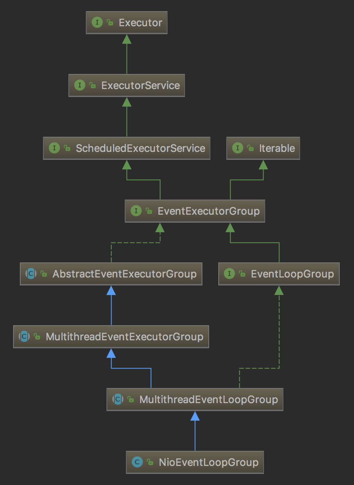

本篇文章我们来分析Netty服务端的启动过程。

<!-- more -->

如果我们要使用Netty来开发一个服务，大体上我们的代码会如下所示：

```java
public class NettyServer {
    public static void main(String[] args) throws InterruptedException {
        final int port = 6789;
        EventLoopGroup bossGroup = new NioEventLoopGroup(1);
        EventLoopGroup workerGroup = new NioEventLoopGroup();
        ServerBootstrap bootstrap = new ServerBootstrap();
        try {
            bootstrap
                    .group(bossGroup, workerGroup)
                    .channel(NioServerSocketChannel.class)
                    .localAddress(port)
                    .childHandler(new NettyServerFilter());

            ChannelFuture f = bootstrap.bind().sync();
            f.channel().closeFuture().sync();
        } finally {
            bossGroup.shutdownGracefully();
            bossGroup.shutdownGracefully();
        }
    }
}
```

主要分为以下3步：

1. 初始化`EventLoopGroup`
2. 配置`ServerBootstrap`
3. 创建并绑定`Channel`

# 初始化EventLoopGroup

`EventLoopGroup`本质上来说可以看成是一个线程池。以`NioEventLoopGroup`为例，它的继承关系如下图所示：



`NioEventLoopGroup`继承`MultithreadEventLoopGroup`，它在实例化过程中会调用`MultithreadEventLoopGroup`的构造函数：

```java
protected MultithreadEventLoopGroup(int nThreads, Executor executor, Object... args) {
    super(nThreads == 0 ? DEFAULT_EVENT_LOOP_THREADS : nThreads, executor, args);
}

DEFAULT_EVENT_LOOP_THREADS = Math.max(1, SystemPropertyUtil.getInt(
                "io.netty.eventLoopThreads", NettyRuntime.availableProcessors() * 2));
```

如果我们没有指定线程数，默认维护逻辑处理器核数2倍的线程。

`MultithreadEventExecutorGroup`中维护了一个`EventExecutor[] children`，`EventExecutor`是用于实际处理的线程，数组大小为前面指定的线程数。

`EventExecutor`由`NioEventLoopGroup`的`newChild`方法建立，实际的类型为`NioEventLoop`：

```java
protected EventLoop newChild(Executor executor, Object... args) throws Exception {
    return new NioEventLoop(this, executor, (SelectorProvider) args[0],
        ((SelectStrategyFactory) args[1]).newSelectStrategy(), (RejectedExecutionHandler) args[2]);
}
```

`MultithreadEventExecutorGroup`中维护了一个`EventExecutorChooserFactory.EventExecutorChooser chooser`，它是一个`EventExecutor`的选择器，负责从`children`中选择一个`EventExecutor`。根据`children`数组大小的不同，从`PowerOfTwoEventExecutorChooser`、`GenericEventExecutorChooser`选择不同的实例。在`children`中轮询选择`EventExecutor`。

# 配置ServerBootstrap

`ServerBootstrap`用于引导创建`Channel`。

1. 调用`ServerBootstrap`中的`public ServerBootstrap group(EventLoopGroup parentGroup, EventLoopGroup childGroup)`方法设置线程池。其中`parentGroup`是用于处理连接请求的group（即acceptor），`childGroup`是用于处理事件的group（即client）。

2. 调用`AbstractBootstrap`中的`public B channel(Class<? extends C> channelClass)`方法设置channel的类型，。

3. 配置服务端监听的端口

4. 调用`ServerBootstrap`中的`public ServerBootstrap childHandler(ChannelHandler childHandler)`方法配置消息处理器，由`childHandler`持有。

# 创建并绑定Channel

调用`AbstractBootstrap`的`public ChannelFuture bind()`方法来创建并绑定`Channel`，详细的操作在`doBind()`方法中，主要的步骤有两步：

1. 调用`initAndRegister`创建`Channel`
2. 调用`doBind0`绑定`Channel`

## 创建Channel

创建`Channel`的工作在`AbstractBootstrap.initAndRegister`方法中完成，它有以下几个步骤。

1. 首先调用`channelFactory`的`newChannel()`方法创建`Channel`。前面我们设置了`Channel`的类型为`NioServerSocketChannel`，因此这里会根据`Channel`的类型通过反射的方式新建`Channel`。

2. 接着调用`ServerBootstrap.init`方法初始化新建的`Channel`：

    1. 设置channel的`attr`和`options`
    2. 调用`Channel.pipeline()`方法获取`ChannelPipeline pipeline`。`pipeline`在`AbstractChannel`中维护，类型为`DefaultChannelPipeline`。`ChannelPipeline`用于维护`ChannelHandler`，`ChannelHandler`保存在`DefaultChannelHandlerContext`，以链表的形式保存在`DefaultChannelPipeline`。
    3. 在pipeline中添加一个`ChannelInitializer`，`ChannelInitializer`在管道注册完成之后，往管道中添加一个`ServerBootstrapAcceptor`（继承`ChannelInboundHandler`），它持有对`childGroup`和`childHandler`的引用。

3. 获取`group`（这里的`group`是我们前面设置的`bossGroup`），调用`MultithreadEventLoopGroup.register`方法注册`Channel`。

    1. 调用`next()`方法选择一个线程（`EventLoop`）
    2. 然后调用`SingleThreadEventLoop.register`方法
    3. 最终调用的是`AbstractUnsafe.register`方法。在`SelectableChannel`中注册`Selector`

## 绑定Channel

调用`AbstractBootstrap.doBind0`方法，在channel的线程池中绑定地址。

`Channel`的绑定调用`AbstractChannel.bind`来完成，其中的调用关系如下：

1. AbstractChannel.bind
2. DefaultChannelPipeline.bind
3. AbstractChannelHandlerContext.bind
4. AbstractChannelHandlerContext.invokeBind
5. DefaultChannelPipeline.bind
6. AbstractUnsafe.bind
7. NioServerSocketChannel.doBind

可以看到，最终调用的是`NioServerSocketChannel.doBind`方法，其中调用`ServerSocketChannel.bind`方法来完成实际的绑定。


