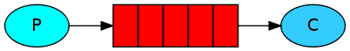

# 消息队列的历史

了解一件事情的来龙去脉，将不会对他感到神秘。让我们来看看消息队列(Message Queue)这项技术的发展历史。

Message Queue的需求由来已久，80年代最早在金融交易中，高盛等公司采用Teknekron公司的产品，当时的Message queueing软件叫做：the information bus(TIB)。TIB被电信和通讯公司采用，路途社收购了Teknekron公司。之后，IBM开发了MQSeries，微软开发了Microsoft Message Queue(MSMQ)。这些商业MQ供应商的问题是产商锁定，价格高昂。2001年，Java Message queueing试图解决锁定和交互性的问题，但对应用来说反而更加麻烦了。

于是2004年，摩根大通和iMatrix开始着手Advanced Message Queuing Protocal(AMQP)开放标准的开发。2006年，AMQP规范发布。2007年，Rabbit技术公司基于AMQP标准开发的RabbitMQ 1.0发布。

RabbitMQ采用Erlang语言开发。Erlang语言由Ericson设计，专门为开发concurrent和distribution系统的一种语言，在电信领域使用广泛。OTP(Open Telecom Platform)作为Erlang语言的一部分，包含了很多基于Erlang开发的中间件/库/工具，如mnesia/SASL，极大方便了Erlang应用的开发。OTP就类似于Python语言中众多的module，用户借助这些module可以很方便的开发应用。
<!--more-->
## AMQP messaging中的基本概念

- Broker：接收和分发消息的应用，RabbitMQ Server就是Message Broker
- Virtual host：出于多组合和安全因素设计的，把AMQP的基本组件划分到一个虚拟的分组中，类似于网络中的namespace概念。当多个不同的用户使用同一个RabbitMQ Server提供的服务时，可以划分出多个vhost，每个用户在自己的vhost创建exchange/queue等。
- Connection：publisher/consumer和broker之间的TCP连接。断开连接只会在client端进行，Broker不会断开连接，除非出现网络故障或broker服务出现问题。
- Channel：如果每一次访问RabbitMQ都建立一个Connection，在消息量大的时候建立TCP Connection的开销将是巨大的，效率也比较低。Channel是在connection内部建立的逻辑连接，如果应用程序支持多线程，通常每个thread创建单独的channel进行通讯，AMQP method包含了channel id帮助客户端和message broker识别channel，所以channel之间是完全隔离的。Channel作为轻量级的Connection极大减少了操作系统建立TCP connection的开销。
- Exchange：message到达broker的第一站，根据分发规则，匹配查询表中的routing key，分发消息到queue中去。常用的类型有direct(point-to-point), topic(publish-subscribe), fanout(multicast)。
- Queue：消息最终被送到这里等待consumer取走。一个message可以被同时拷贝到多个queue中。
- Binding：exchange和queue之间的虚拟连接，binding中可以包含routing key。Binding信息被保存到exchange中的查询表中，用于message的分发依据。
- Message：消息由有效载荷(playload)和标签(label)组成。其中有效载荷即传输的数据。
- Routing Key：Message发送给Exchange时，message将拥有一个routing key（默认为空），exchange根据这个routing key将message发送到匹配的queue中。
- Binding Key：queue需要通过binding key（默认为空）绑定到exchange上，exchange将message的routing key与所绑定queue的binding key进行匹配，正确匹配的message将发送到queue中。routing key偏向生成的概念，而binding key偏向消费的概念。
- Consumer：连接到服务器，并订阅到queue上，服务器将message发送给一个订阅的/监听的Consumer，Consumer只能接收到message的一部分：有效载荷(payload)。

# rabbitMQ

## ConnectionFactory、Connection、Channel

Connection是RabbitMQ的socket链接，它封装了socket协议相关部分逻辑。

ConnectionFactory为Connection的制造工厂

Channel是我们与RabbitMQ打交道的最重要的一个接口，我们大部分的业务操作是在Channel这个接口中完成的，包括定义Queue、定义Exchange、绑定Queue与Exchange、发布消息等。

## Queue

Queue是RabbitMQ的内部对象，用于存储消息。

RabbitMQ中的消息都只能存储在Queue中，生产者生产消息并最终投递到Queue中，消费者可以从Queue中获取消息并消费。

多个消费者可以订阅同一个Queue，这时Queue中的消息会被平均分摊给多个消费者进行处理，而不是每个消费者都收到所有的消息并处理

## Message acknowledgment

在实际应用中，可能会发生消费者收到Queue中的消息，但没有处理完成就宕机(或出现其他意外)的情况，这种情况下就可能会导致消息丢失。为了避免这种情况发生，我们可以要求消费者在消费完消息后发送一个回执给RabbitMQ，RabbitMQ收到消息回执(Message acknowledgment)后才将消息从Queue中移除；如果RabbitMQ没有收到回执并检测到消息者的RabbitMQ连接断开，则RabbitMQ会将该消息发送给其他消费者(如果存在多个消费者)进行处理。这里不存在timeout概念，一个消费者处理消息时间再长也不会导致该消息被发送给其他消费者，除非它的RabbitMQ连接断开。

这里会产生另外一个问题，如果我们的开发人员在处理完业务逻辑后，忘记发送回执给RabbitMQ，这将会导致严重的bug——Queue中堆积的消息会越来越多，消费者重启后会重复消费并重复执行业务逻辑

## Message durability

如果我们希望即使在RabbitMQ服务重启的情况下，也不会丢失消息，我们可以将Queue与Message都设置为可持久化的(durable)，这样可以保证绝大部分情况下我们的RabbitMQ消息不会丢失。但依然解决不了小概率丢失事件的发生(比如RabbitMQ服务器已经接收到生产者的消息，但还没来得及持久化该消息时RabbitMQ服务器就断电了)，如果我们需要对这种小概率事件也要管理起来，那么我们要用到事务。

## Prefetch count

前面我们讲到如果有多个消息者同时订阅同一个Queue中的消息，Queue中的消息会被平摊给多个消费者。这时如果每个消息的处理时间不同，就有可能会导致某些消费者一直在忙，而另外一些消费者很快就处理完手头工作并一直空闲的情况。我们可以通过设置prefetchCount来限制Queue每次发送给每个消费者的消息树，比如我们设置prefetchCount=1，则Queue每次给每个消费者发送一条消息；消费者处理完这条消息后Queue会再给该消费者发送一条消息。

## Exchange

在上一节我们看到生产者将消息投递到Queue中，实际上这在RabbitMQ中这种事情永远都不会发生。实际的情况是，生产者将消息发送到Exchange，由Exchange将消息路由到一个或多个Queue中(或者丢弃)。

Exchange是按照什么逻辑将消息路由到Queue的？这个将在Binding一节介绍。
RabbitMQ中的Exchange有四种类型，不同的类型有着不同的路由策略，这将在Exchange Types一节介绍

## routing key

生产者在将消息发送给Exchange的时候，一般会指定一个routing key，来指定这个消息的路由规则，而这个routing key需要与Exchange Type及binding key联合使用才能最终生效。

在Exchange Type与binding key固定的情况下(在正常使用时一般这些内容都是固定配置好的)，我们的生产者就可以再发送消息给Exchange时，通过指定routing key来决定消息流向哪里。

RabbitMQ为routing key设定的长度限制255bytes

## Binding

RabbitMQ中通过Binding将Exchange与Queue关联起来，这样RabbitMQ就知道如何正确地将路由指定的Queue了。

## Binding key

在绑定(Binding)Exchange与Queue的同时，一般会指定一个binding key；消费者将消息发送给Exchange时，一般会指定一个routing key；当binding key与routing key相匹配时，消息将会被路由到对应的Queue中。这个将在Exchange Types章节会列举实际的例子加以说明。

在绑定多个Queue到同一个Exchange的时候，这些Binding允许使用相同的binding key。

binding key并不是在所有情况下都生效，它依赖于Exchange Type，比如fanout类型的Exchange就会无视binding key，而是将消息路由到所有绑定到该Exchange的Queue

## Exchange Types

RabbitMQ常用的Exchange Type有fanout、direct、topic、headers这四种（AMQP规范里还提到两种Exchange Type，分别为system与自定义，这里不予描述）

### fanout

fanout类型的Exchange路由规则非常简单，它会把所有消息发送到该Exchange的消息路由到所有与它绑定的Queue中

上图中，生产者(P)发送到Exchange(X)的所有消息都会路由到图中的两个Queue，并最终被两个消费者(C1与C2)消费。

### direct

direct类型的Exchange路由规则也很简单，它会把消息路由到那些binding key与routing key完全匹配的Queue中。

以上图的配置为例，我们以routingKey = "error"发送消息到Exchange，则消息会路由到Queue1（amqp.gen-S9b...，这是由RabbitMQ自动生成的Queue名称）和Queue2（amqp.gen-Agl...）；如果我们以routingKey = "info"或routingKey = "warning"来发送消息，则消息只会路由到Queue2。如果我们以其他routingKey发送消息，则消息不会路由到这两个Queue中。

### topic

前面讲到direct类型的Exchange路由规则是完全匹配binding key与routing key，但这种严格的匹配方法在很多情况下不能满足实际业务需求。topic类型的Exchange在匹配规则上进行了扩展，它与direct类型的Exchange相似，也是将消息路由到binding key与routing key相匹配的Queue中，但这里的匹配规则有些不同，它约定：

- routing key为一个句点号"`.`"分隔的字符串，如"stock.usd.nyse"、"nyse.vmw"、"quick.orange.rabbit"
- binding key与routing key一样也是句点号"`.`"分隔的字符串
- binding key中可以存在两种特殊字符"`*`"与"`#`"，用于做模糊匹配，其中"`*`"用于匹配一个单词，"`#`"用于匹配多个单词(可以是零个)

以上图中的配置为例，routingKey = "quick.orange.rabbit"的消息会同时路由到Q1与Q2，routingKey = "lazy.orange.fox"的消息会路由到Q1与Q2，routingKey = "lazy.brown.fox"的消息会路由到Q2，routingKey = "lazy.pink.rabbit"的消息会路由到Q2（只会投递给Q2一次，虽然这个routingKey与Q2的两个bindingKey都匹配）；routingKey = "quick.brown.fox"、routingKey = "orange"、routingKey = "quick.orange.male.rabbit"的消息将会被丢弃，因为它们没有匹配任何bindingKey。

### headers

headers类型的Exchange不依赖于routing key与binding key的匹配规则来路由消息，而是根据发送的消息内容中的headers属性进行匹配。

在绑定Queue与Exchange时指定一组键值对；当消息发送到Exchange时，RabbitMQ会取到该消息的headers(也是一个键值对的形式)，对比其中的键值对是否完全匹配Queue与Exchange绑定时指定的键值对；如果完全匹配则消息会路由到该Queue，否则不会路由到该Queue。

## RPC

MQ本身是基于异步的消息处理，前面的示例中所有的生产者将消息发送到RabbitMQ后不会知道消费者处理成功或者失败(甚至连有没有消费者来处理这条消息都不知道)。

但实际的应用场景中，我们很可能需要一些同步处理，需要同步等待服务端将我的消息处理完成后再进行下一步处理。这相当于RPC。在RabbitMQ中也支持RPC。

RabbitMQ中实现RPC的机制是：

- 客户端发送请求(消息)时，在消息的属性(MessageProperties)中设置两个值replyTo(一个Queue名称，用于告诉服务器处理完成后将通过我的消息发送到这个Queue中)和correlationId(此次请求的标识号，服务器处理完成后需要将此属性返还，客户端将根据这个id了解哪条请求被成功执行了或执行失败)
- 服务器端收到消息并处理
- 服务器端处理完消息后，将生产一条应答消息到replyTo指定的Queue，同时带上correlationId属性
- 客户端之前已订阅replyTo指定的Queue，从中收到服务器的应答消息后，根据其中的correlationId属性分析哪条请求被执行了，根据执行结果进行后续业务处理

> https://www.cnblogs.com/frankyou/p/5283539.html
> https://blog.csdn.net/whycold/article/details/41119807
> https://www.jianshu.com/p/25816ae3d8db

