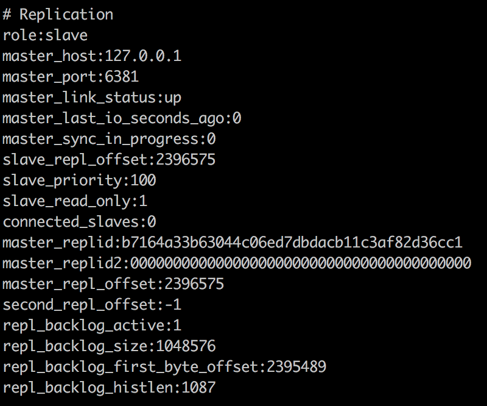

Redis单机模式会受到单机性能、单机容量、稳定性等的限制。因此在生产环境，一般会使用多机的方式来保证应用的稳定。Redis的多机模式有以下三种：

1. 主从复制模式
2. 哨兵模式
3. 集群模式

<!-- more -->

下文来详细描述一下三种模式的使用。

# 主从复制模式

Redis的复制功能是支持多个数据库之间的数据同步。一类是主数据库(master)一类是从数据库(slave)，主数据库可以进行读写操作，当发生写操作的时候自动将数据同步到从数据库，而从数据库一般是只读的，并接收主数据库同步过来的数据，一个主数据库可以有多个从数据库，而一个从数据库只能有一个主数据库。

通过Redis的复制功能可以很好的实现数据库的读写分离，提高服务器的负载能力。主数据库主要进行写操作，而从数据库负责读操作。

我们在同一台机器的不同端口启动Redis来模拟多机的情况：

```
主节点：127.0.0.1 6380
从节点：127.0.0.1 6381
```

主从复制模式有两种配置方式：

- 手动修改配置文件

修改从节点中Redis配置文件中的slaveof属性
    


启动两个redis实例，查看redis的info信息


可以看到，6380现在master节点，而6381是slave节点。

如下图所示，在主节点上写入数据会同步到从节点中：


- 动态设置

通过`redis-cli`连接到从节点服务器，执行下面命令即可：

```
slaveof 127.0.0.1 6380
```

## 注意事项

如果你使用主从复制，那么要确保你的master激活了持久化，或者确保它不会再宕掉后自动重启。因为slave是master的完整备份，因此如果master通过了一个空数据集重启，slave也会被清掉。

在配置Redis复制功能的时候如果主数据库设置了密码，需要在从数据的配置文件中通过`masterauth`参数设置主数据库的密码，这样从数据库在连接主数据库时就会自动使用auth命令认证了。相当于做了一个免密码登录。

## Java客户端的使用

Jedis客户端无法直接使用Redis的主从模式来进行读写分离，需要指定两个Jedis实例来分别控制读写。因此不是非常方便。

Redisson客户端可以配置主从模式从而实现读写分离，示例如下：

```java
public class Demo {
    Logger logger = LoggerFactory.getLogger(Demo.class);

    private static RedissonClient instance;
    
    public Demo() {
        Config config = new Config();
        config.useMasterSlaveServers()
                .setMasterAddress("redis://127.0.0.1:6380")
                .addSlaveAddress("redis://127.0.0.1:6381");
        instance = Redisson.create(config);
    }

    @Test
    public void test01() throws InterruptedException {
        String key = "test";
        RBucket<String> myObj = instance.getBucket(key);
        if (myObj != null) {
            myObj.delete();
        }
        myObj.set("hello world");
        // 断点停在这里，然后down掉master，不影响读取
        logger.info(myObj.get());
        // 恢复master，down掉slave，不影响写入
        myObj.set("new Value");
        // 再恢复slave，down掉master，可正常读取
        logger.info(myObj.get());
        // master已down掉，无法写入
        myObj.set("can not write to master");
        // 恢复master，down掉slave，无法读取
        logger.info(myObj.get());

        instance.shutdown();
    }
}
```

set操作时，至少要有一台可连接的master，get操作时，至少要有一台可连接的slave。

# 哨兵模式(Sentinel)

从生产角度看，单纯的主从复制模式作用有限。在没有其他监控机制的前提下，无论是master或slave挂掉，都需要手动干预才能保证读/写继续正常工作，理想情况下master挂掉，最好slave能自动(无需人工干预)选出一台充当master继续服务。

这就是这一节要说的哨兵模式。

Sentinel（哨兵）是Redis的高可用性（high availability）解决方案：由一个或多个Sentinel实例组成的Sentinel系统可以监视任意多个主服务器，以及这些主服务器属下的所有从服务器，并在被监视的主服务器进入下线状态时，自动将下线主服务器属下的某个从服务器升级为新的主服务器，然后由新的主服务器代替已下线的主服务器继续处理命令请求。

注意：在使用sentinel监控主从节点的时候，从节点需要是使用动态方式配置的，如果直接修改配置文件，后期sentinel实现故障转移的时候会出问题。

- 主观下线状态。

    在默认情况下，Sentinel会以每秒一次的频率向所有与它创建了命令连接的实例（包括主服务器、从服务器、其他Sentinel在内）发送PING命令，并通过实例返回的PING命令回复来判断实例是否在线。
    
    Sentinel配置文件中的`down-after-milliseconds`选项指定了Sentinel判断实例进入主观下线所需的时间长度：如果一个实例在`down-after-milliseconds`毫秒内，连续向Sentinel返回无效回复，那么Sentinel会修改这个实例所对应的实例结构，在结构的flags属性中打开`SRI_S_DOWN`标识，依次来表示这个实例已经进入主观下线状态。
    
- 客观下线状态。

    当Sentinel将一个主服务器判断为主观下线之后，为了确认这个主服务器是否真的下线了，它会向同样监视这一主服务器的其他Sentinel进行询问，看它们是否也任务主服务器已经进入了下线状态（可以是主观下线或者客观下线）。当Sentinel从其他Sentinel那里接收到足够数量的已下线判断之后，Sentinel就会将从服务器判断为客观下线，并对主服务器执行故障转移操作。

## Sentinel的配置

使用前文主从复制的配置，加上三个sentinel的实例：

```
主节点：127.0.0.1 6380
从节点：127.0.0.1 6381
sentinel_1：127.0.0.1 26380
sentinel_2：127.0.0.1 26381
sentinel_3：127.0.0.1 26382
```

`redis-sentinel.conf`文件配置如下，因为在同一台机器上运行，因此三个实例的端口需要不一样：

```
# sentinel实例运行的端口
port 26380
# sentinel需要监控的master信息：<mastername> <masterIP> <masterPort> <quorum>
# <quorum>为需要判定客观下线所需的主观下线sentinel个数，这个参数不可以大于sentinel个数
sentinel monitor mymaster 127.0.0.1 6381 1
# 授权密码，在安全的环境中可以不设置
sentinel auth-pass mymaster 123456
# master被当前sentinel实例认为失效的间隔时间
sentinel down-after-milliseconds mymaster 30000
# 当新master产生时，同时进行slaveof到新master并进行同步复制的slave个数
# 在slave执行slaveof与同步时，将会终止客户端请求
# 此值较大，意味着集群终止客户端请求的时间总和较大
# 此值较小，意味着集群在故障转移期间，多个slave向客户端提供服务时仍然使用旧数据
sentinel parallel-syncs mymaster 1
# failover过期时间，当failover开始后，在此时间内仍然没有触发任何failover操作，当前sentinel将会认为此次failover失败
sentinel failover-timeout mymaster 180000
```

## 启动sentinel

输入以下命令启动sentinel

```
redis-sentinel redis-sentinel.conf
```

三个实例启动后的输出如下（如果想要使sentinel在后台运行，只需要在配置文件中加入`daemonize yes`）：


可以看到每个sentinel实例监控了master和slave，以及另外两台sentinel实例。

## 故障转移

初始情况下，`127.0.0.1:6380`是master，`127.0.0.1:6380`是slave，如下图所示：


此时我们关闭master，经过`down-after-milliseconds`时间后（默认30秒），sentinel会监控到master失效，并将slave提升为master。


当多个sentinel都判断master下线时，master则被判断为可观下线，监视这个下线master的各个sentinel会进行协商，选举出一个领头sentinel，并由领头sentinel对下线master执行故障转移操作：

1. 在已下线master属下的所有slave中，挑选一个状态良好、数据完整的slave，然后向这个slave发送`SLAVEOF no one`命令，将这个slave转换为master。
2. 当新的master出现之后，领头sentinel下一步要做的就是，让已下线master属下的所有slave去复制新的master。这一动作可以通过向slave发送`SLAVEOF`命令来实现。
3. 将已下线的master设置为新的master的slave。因为旧的master已经下线，所以这种设置是保存在旧master对应的实例结构里面，当旧master重新上线时，sentinel就会向它发送`SLAVEOF`命令，让它成为新master的slave


可以看到`127.0.0.1:6380`被转换为master。

如果将`127.0.0.1:6381`重新上线，`127.0.0.1:6380`会被设置为`127.0.0.1:6381`的slave。




## Java客户端的使用

Jedis客户端的使用：

```java
public class JedisDemo {
    Logger logger = LoggerFactory.getLogger(JedisDemo.class);

    private JedisSentinelPool pool;

    public JedisDemo() {
        HashSet<String> sentinels = new HashSet<>();
        sentinels.add("127.0.0.1:26380");
        sentinels.add("127.0.0.1:26381");
        sentinels.add("127.0.0.1:26382");

        JedisPoolConfig poolConfig = new JedisPoolConfig();

        pool = new JedisSentinelPool("mymaster", sentinels, poolConfig);
        HostAndPort currentHostMaster = pool.getCurrentHostMaster();
        logger.info("{}:{}", currentHostMaster.getHost(), currentHostMaster.getPort());
    }

    @Test
    public void test01() {
        Jedis resource = pool.getResource();
        logger.info(resource.get("test"));
        resource.close();
    }
}
```

Redisson客户端的使用

```java
public class Demo {
    Logger logger = LoggerFactory.getLogger(Demo.class);

    private static RedissonClient instance;

    public Demo() {
        Config config = new Config();
        config.useSentinelServers()
                .setMasterName("mymaster")
                .addSentinelAddress("redis://127.0.0.1:26380")
                .addSentinelAddress("redis://127.0.0.1:26381")
                .addSentinelAddress("redis://127.0.0.1:26382");
        instance = Redisson.create(config);
    }
}
```

# 集群模式

Redis集群是Redis提供的分布式数据库方案。集群通过分片(sharding)的方式来保存数据库中的键值对：集群的整个数据库被分为16384个槽(slot)，数据库中的每个键都属于这16384个槽的其中一个，集群中的每个节点可以处理0个或最多16384个槽。

当数据库中的16384个槽都有节点在处理时，集群处于上线状态；相反的，如果数据库中有任何一个槽没有得到处理，那么集群处于下线状态。

集群使用公式`CRC16(key) & 16383`来计算给定键key属于哪个槽。`CRC16(key)`语句用于计算键key的`CRC16`校验和，而`& 16383`语句则用于计算出一个介于0至16383之间的整数作为键key的槽号。

集群中的每个节点都有1个至N个复制品，其中一个主节点，其余的为从节点，如果主节点下线了，集群就会把这个主节点的一个从节点设置为新的主节点，继续工作。这样集群就不会因为一个主节点的下线而无法正常工作。如果某一个主节点和它所有的从节点都下线的话，Redis集群就会停止工作了。

Redis集群不保证数据的强一致性，在特定的情况下，Redis集群会丢失已经被执行过的写命令。使用异步复制是Redis集群可能会丢失写命令的其中一个原因，有时候由于网络原因，如果网络断开时间太长，Redis集群就会启用新的主节点，之前发给主节点的数据就会丢失。

## 集群配置

要让集群正常工作至少需要三个主节点，我们这里在一台机器上创建6个实例来演示集群配置，实际生产环境中需要每个节点一台主机。

```
127.0.0.1 6380
127.0.0.1 6381
127.0.0.1 6382
127.0.0.1 6383
127.0.0.1 6384
127.0.0.1 6385
```

每个节点的配置如下，因为在同一台机器上运行，因此6个实例的端口需要不一样：

```
#daemonize yes
port 6380
cluster-enabled yes
cluster-config-file nodes.conf
cluster-node-timeout 5000
```

文件中的`cluster-enabled`选项用于开启实例的集群模式，而`cluster-conf-file`选项则设定了保存节点配置文件的路径，默认值为`nodes.conf`。节点配置文件无需人为修改，它由Redis集群在启动时创建，并在有需要时自动进行更新。

通过`redis-server redis.conf`命令分别启动6个实例。

现在我们已经有了6个正在运行中的Redis实例，接下来我们需要使用这些实例来创建集群，并为每个节点编写配置文件。通过使用Redis集群命令行工具`redis-trib`，编写节点配置文件的工作可以非常容易地完成。`redis-trib`位于Redis源码的src文件中，它是一个Ruby程序，这个程序通过向实例发送特殊命令来完成创建新集群，检查集群，或者对集群进行重新分片(reshared)等工作。

```
./redis-trib.rb create --replicas 1 127.0.0.1:6380 127.0.0.1:6381 127.0.0.1:6382 127.0.0.1:6383 127.0.0.1:6384 127.0.0.1:6385
```

这个命令在这里用于创建一个新的集群，选项`--replicas 1`表示我们希望为集群中的每个主节点创建一个从节点，之后跟着的其他参数则是这个集群实例的地址列表。


如上图所示，`redis-trib`会打印一份预想中的配置给你看，如果觉得没问题的话，就可以输入`yes`，`redis-trib`就会将这份配置应用到集群当中，让各个节点开始互相通讯。


到此，我们的集群就搭建成功了。

使用命令`redis-cli -c -p 6380`进入命令行。

使用`cluster nodes`命令查看所有的节点信息：


`cluster nodes`命令的输出看起来有点复杂，它的含义如下：

- 节点ID
- IP:端口
- 标志：master, slave, myself, fail ...
- 如果是从节点，这里是它的从节点NODE ID
- 集群最近一次向节点发送PING命令之后，过去了多长时间还没接到回复
- 节点最近一次返回PONG回复的时间
- 节点的配置纪元(configuration epoch)
- 本节点的网络连接情况：例如connected
- 节点目前包含的槽：例如`127.0.0.1:6380`目前包含号码为0至5460的哈希槽

在集群中存入键值：


可以看到，test键计算得到的槽(slot)值是6918，因此被保存在`127.0.0.1:6381`节点中。

## 集群添加节点

根据添加节点类型的不同，有两种方法来添加新节点：

- 主节点：如果添加的是主节点，那么我们需要创建一个空节点，然后将某些哈希槽移动到这个空节点里面
- 从节点：如果添加的是从节点，我们也需要创建一个空节点，然后把这个新节点设置成集群中某个主节点的复制品

### 添加节点

首先我们启动一个新节点`127.0.0.1:6386`，配置与之前节点的一致。


执行以下命令，将这个新节点添加到集群中

```
./redis-trib.rb add-node 127.0.0.1:6386 127.0.0.1:6380
```

使用`addnode`命令来添加节点，第一个参数是新节点的地址，第二个参数是任意一个已经存在的节点的IP和端口。

结果如图所示：


查看刚才新增的节点：


新节点现在已经连接上了集群，成为集群的一份子，并且可以对客户端的命令请求进行转向了，但是和其他主节点相比，新节点还有两点区别：

- 新节点没有包含任何数据，因为它没有包含任何哈希槽
- 尽管新节点没有包含任何哈希槽，但它仍然是一个主节点，所以在集群需要将某个从节点升级为新的主节点时，这个新节点不会被选中。

### 将新增节点变成从节点

有两种方法添加到从节点，可以像添加主节点一样使用`redis-trib`命令，也可以像下面的例子一样使用`--slave`选项：

```
./redis-trib.rb add-node --slave 127.0.0.1:6386 127.0.0.1:6380
```

此处的命令和添加一个主节点命令类似。此处并没有指定添加的这个从节点的主节点，这种情况下系统会在集群主节点中随机选取一个作为这个从节点的主节点。

你可以通过下面的命令指定主节点：

```
./redis-trib.rb add-node --slave --master-id ece3542747477d7147d13725d17a246c89aeb38f 127.0.0.1:6386 127.0.0.1:6380
```

也可以使用`CLUSTER REPLICATE`命令添加从节点

例如，要给主节点`127.0.0.1:6381`添加一个从节点，该节点的ID是`ece3542747477d7147d13725d17a246c89aeb38f`。我们只需要在`127.0.0.1:6386`节点上执行以下命令:

```
cluster replicate ece3542747477d7147d13725d17a246c89aeb38f
```


查看节点状态：


可以看到`127.0.0.1:6381`节点现在有了两个从节点。

### 将新增节点变成主节点

使用`redis-trib`程序，将集群中的某些哈希槽移动到新节点里面，这个新节点就称为真正的主节点了。

执行以下命令对集群中的哈希槽进行移动：

```
./redis-trib.rb reshard 127.0.0.1:6380
```


命令执行后，系统会提示我们要移动多少哈希槽，这里输入1000

然后还需要制定把这些哈希槽转移到哪个节点上，这里输入我们刚刚新增的`127.0.0.1:6386`节点ID

然后需要我们指定转移哪几个哈希槽，输入`all`表示从所有主节点中随机转移，凑够1000个哈希槽


然后再输入`yes`，redis集群就开始分配哈希槽。


至此，一个新的主节点就添加完成了，执行命令查看现在的集群中节点的状态


可以看到`127.0.0.1:6386`节点分配了`0-332 5461-5794 10923-11255`段的哈希槽

## 集群删除节点

### 删除主节点

如果删除的节点是主节点，这里我们删除`127.0.0.1:6386`节点，这个节点有1000个哈希槽

首先要把节点中的哈希槽转移到其他节点中，执行下面命令：

```
./redis-trib.rb reshard 127.0.0.1:6386
```

系统会提示我们要移动多少哈希槽，这里移动1000个，因为`127.0.0.1:6386`节点有1000个哈希槽。

然后系统提示我们输入要接收这些哈希槽的节点ID，这里使用`127.0.0.1:6380`的节点ID

然后要我们选择从哪些节点中转出哈希槽，这里一定要输入`127.0.0.1:6386`这个节点的ID

最后输入`done`表示输入完毕。


哈希槽转移完毕后，使用下面的命令把这个节点删除

```
./redis-trib.rb del-node 127.0.0.1:6380 dbd2ede12873806917e210dd5015eaacf0d3c2eb
```


### 删除从节点

如果节点是从节点，直接删除即可

```
./redis-trib.rb del-node 127.0.0.1:6380 dbd2ede12873806917e210dd5015eaacf0d3c2eb
```


## 测试故障转移

要触发一次故障转移，最简单的办法就是令集群中的某个主节点进入下线状态。

首先列出所有的节点：


通过命令得知，`127.0.0.1:6380`、`127.0.0.1:6381`、`127.0.0.1:6382`都是主节点，然后我们通过向`127.0.0.1:6382`节点发送`DEBUB SEGFAULT`命令，让这个主节点崩溃。

让我们在使用`cluster nodes`命令，查看集群在执行故障转移操作之后，节点的分布情况


可以看到，`127.0.0.1:6382`节点已经断开连接了，原本`127.0.0.1:6382`节点的从节点`127.0.0.1:6385`现在成为了主节点。

现在让我们再次启动`127.0.0.1:6382`节点，可以看到重启之后`127.0.0.1:6382`变成了`127.0.0.1:6385`节点的从节点。


## Java客户端使用

Jedis客户端的使用：

```java
public class JedisDemo {
    Logger logger = LoggerFactory.getLogger(JedisDemo.class);

    @Test
    public void test() {
        HashSet<HostAndPort> nodes = new HashSet<>();
        nodes.add(new HostAndPort("127.0.0.1", 6380));
        nodes.add(new HostAndPort("127.0.0.1", 6381));
        nodes.add(new HostAndPort("127.0.0.1", 6382));
        nodes.add(new HostAndPort("127.0.0.1", 6383));
        nodes.add(new HostAndPort("127.0.0.1", 6384));
        nodes.add(new HostAndPort("127.0.0.1", 6385));

        JedisPoolConfig poolConfig = new JedisPoolConfig();
        JedisCluster jedisCluster = new JedisCluster(nodes, poolConfig);
        logger.info(jedisCluster.get("test"));
    }
}
```

Redisson客户端的使用

```java
public class Demo {
    Logger logger = LoggerFactory.getLogger(Demo.class);

    private static RedissonClient instance;

    public Demo() {
        Config config = new Config();
        config.useClusterServers()
                .setScanInterval(2000)
                .addNodeAddress("redis://127.0.0.1:6380")
                .addNodeAddress("redis://127.0.0.1:6381")
                .addNodeAddress("redis://127.0.0.1:6382")
                .addNodeAddress("redis://127.0.0.1:6383")
                .addNodeAddress("redis://127.0.0.1:6384")
                .addNodeAddress("redis://127.0.0.1:6385");
        instance = Redisson.create(config);
    }
}
```


> https://blog.csdn.net/u011204847/article/details/51307044
> https://www.cnblogs.com/yjmyzz/p/4106142.html
> https://blog.csdn.net/moyu_2012/article/details/47856949
> https://www.jianshu.com/p/afb678794a0e
> http://www.redis.cn/topics/cluster-tutorial.html


