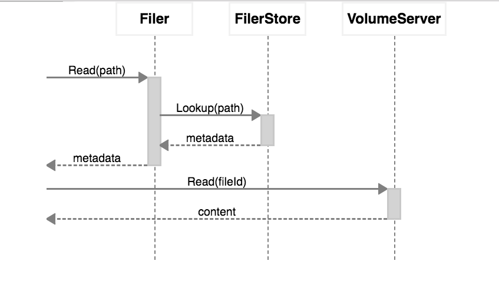

seaweedfs（github: [https://github.com/chrislusf/seaweedfs](https://github.com/chrislusf/seaweedfs)）是一个非常轻巧、易用的分布式文件系统。当我们考虑自己来搭建分布式文件服务的时候，seaweedfs是一个不错的选择。本文记录seaweedfs的搭建与简单使用过程。

<!-- more -->

seaweedfs有两大特性：存储数以十亿记的文件，访问文件迅速。

之所以它能达到这两个特性，是因为所有文件的元数据(`metadata`)不存储在`master`节点，而是分散存储在`volume`（逻辑卷，存储数据的逻辑结构）中，`master`节点只保存`volume`信息。这样一来，`master`节点的查询压力就被分散到`volume`节点了。

每个文件的元数据占用40个字节的空间，绝大多数情况下一个节点的所有元数据都可以加载到内存中，这样每次读文件只需要读一次磁盘。

# 安装

从`github`中获取seaweedfs对应操作系统的可执行文件`weed`。

执行`./weed -h`查看seaweedfs的各种指令。指令说明：

| 指令 | 说明 |
|----|----|
| benchmark | 测试seaweedfs的文件读写性能 |
| backup | 将volume备份到本地 |
| compact | 压缩volume文件 |
| filer.copy | 将一个或多个文件复制到filer目录下 |
| fix | 发生崩溃时修复索引文件 |
| filer.replicate | 将文件的修改复制到另一个目标 |
| server | 启动master服务、volume服务、filter和s3服务 |
| master | 启动master服务 |
| filer | 启动filer服务，指向一个或者多个master服务 |
| s3 | 启动s3服务，前提是启动filer服务 |
| upload | 上传一个或多个文件 |
| download | 根据文件id下载文件 |
| scaffold | 生成基本的配置文件 |
| shell | 执行可交互的管理指令 |
| version | 打印seaweedfs的版本 |
| volume | 启动volume服务 |
| export | 列出或者输出volume中的文件 |
| mount | 将filer挂载成一个目录 |
| webdav | 启动webdav服务，前提是启动filer服务 |

## master

执行`./weed master -h`查看`master`服务的参数：

| 参数 | 说明 |
|----|----|
| -cpuprofile | 输出cpu使用的统计信息 |
| -defaultReplication | 默认的副本类型（默认为`000`），具体见下文 |
| -disableHttp | 关闭http接口，只使用gRPC来访问 |
| -garbageThreshold | 回收空间的阈值（默认为`0.3`） |
| -ip | master服务的ip地址，默认为`localhost` |
| -ip.bind | 服务绑定的ip地址，默认为`0.0.0.0` |
| -mdir | 存储元数据的目录，默认为`/tmp` |
| -memprofile | 输出内存使用的统计信息 |
| -metrics.address | 性能指标统计工具的地址，seaweedfs使用prometheus来存储性能统计信息 |
| -metrics.intervalSeconds | 性能统计信息推送的间隔时间 |
| -peers | 所有的master节点列表。比如`127.0.0.1:9093,127.0.0.1:9094` |
| -port | master服务监听的端口，默认为`9333` |
| -pulseSeconds | 心跳的间隔时间，默认为`5秒` |
| -volumePreallocate | 为volumes预分配空间 |
| -volumeSizeLimitMB | 停止向超出大小限制的volume写入数据，默认为`30000` |
| -whiteList | ip白名单，只有在白名单中的ip才拥有写入权限 |

执行以下命令启动master服务

```
./weed master -mdir="/vagrant_data/seaweedfs_data/node1" -ip=10.0.20.46
```

## volume

执行`./weed volume -h`查看`master`服务的参数：

| 参数 | 说明 |
|----|----|
| -compactionMBps | 限制后台压缩以及拷贝的速度 |
| -cpuprofile | 输出cpu使用的统计信息 |
| -dataCenter | volume服务的数据中心名称 |
| -dir | 存储数据文件的目录，默认`/tmp` |
| -idleTimeout | 闲置的连接时间，默认`30秒` |
| -images.fix.orientation | 上传时调整图片文件的方向 |
| -index | 选择索引存储类型。可选`memory leveldb leveldbMedium leveldbLarge`，默认为`memory`。选择`memory`索引的存取比较快，但是volume的启动比较慢，因为启动时需要将文件的索引加载到内存中。如果选择`leveldb`索引的存取会稍微变慢一点，但是volume的启动会快很多 |
| -ip | volume服务的ip地址 |
| -ip.bind | volume服务绑定的ip地址 |
| -max | volume的最大数量，默认为7 |
| -memprofile | 输出内存使用的统计信息 |
| -mserver | master服务，以逗号分隔 |
| -port | http服务的监听端口，默认`8080` |
| -port.public | 公共服务的端口 |
| -publicUrl | 公共服务的地址 |
| -pulseSeconds | 心跳的间隔时间，必须小于master的设置。默认`5秒` |
| -rack | volume服务的机架名称 |
| -read.redirect | 重定向 |
| -whiteList | ip白名单，只有在白名单中的ip才拥有写入权限 |

在`10.0.20.80`服务器上执行：

```
./weed volume -max=100 -mserver="10.0.20.46:9333" -ip=10.0.20.80 -ip.bind=0.0.0.0 -dir="/vagrant_data/seaweedfs_data/node2"
```

在`10.0.20.83`服务器上执行：

```
./weed volume -max=100 -mserver="10.0.20.46:9333" -ip=10.0.20.83 -ip.bind=0.0.0.0 -dir="/vagrant_data/seaweedfs_data/node3"
```

启动两个volume服务。

# 文件存取

启动完master和volume服务之后，我们就可以使用seaweedfs来保存和访问文件了。

## 文件存储

首先获取一个文件id，以及volume服务的url：

```
> curl http://10.0.20.46:9333/dir/assign
{"fid":"6,0170f9280b","url":"10.0.20.80:8080","publicUrl":"10.0.20.80:8080","count":1}
```

然后根据url和fid来上传文件：

```
> curl -F file=@/Users/wangqi/Downloads/1.png http://10.0.20.80:8080/6,0170f9280b
{"name":"1.png","size":1918025,"eTag":"7b3e1eb2"}
```

可以通过该url来删除文件：

```
> curl -X DELETE http://10.0.20.80:8080/6,0170f9280b
```

## 文件id

通过`/dir/assign`可以获取文件id，比如`6,0170f9280b`。

文件id分为3个部分。

逗号左边的数字`6`表示volume id。

逗号右边的`01`表示file key。剩下的`70f9280b`表示file cookie。

volume id是一个32位无符号整型。file key是一个64为无符号整型。file cookie是一个32位无符号整型，用来防止文件url被猜到。

如果要保存成字符串的话，需要`8+1+16+8`一共`33`个字节。

## 文件访问

首先要根据volume id查询访问volume的url：

```
> curl "http://10.0.20.46:9333/dir/lookup?volumeId=6"
{"volumeId":"6","locations":[{"url":"10.0.20.80:8080","publicUrl":"10.0.20.80:8080"}]}
```

有了publicUrl之后，可以通过url：`http://10.0.20.80:8080/6,0170f9280b`来访问该文件。

# filer服务

前面我们看到，对文件的存取是基于文件id来实现的。保存文件时需要先分配一个文件id，然后上传文件到该id下，访问文件也是通过该id来访问。这和我们对于文件系统的印象有很大的区别。一般提到文件系统，总是会有目录，以及保存在目录中的文件。为了使用我们熟悉的这种方式来存取文件，我们需要启动`filer`服务。

`filer`是一个在seaweedfs之上的服务，它保存路径与文件id的映射关系，最终还是使用文件id来访问文件。

首先需要创建`filer`服务的配置文件，运行`weed scaffold -config=filer`来查看配置文件的示例。

`filer`配置包括`recursive_delete`（是否递归删除），以及存储方式的选择。`filer`服务支持多种数据库来保存路径与文件id的映射关系，包括：`leveldb2`、`mysql`、`postgres`、`cassandra`、`redis`、`redis_cluster`、`etcd`、`tikv`。

简单起见，可以使用`leveldb2`。创建`filer.toml`文件，写入以下内容：

```
[leveldb2]
enabled = true
dir = "."
```

然后执行以下命令启动`filer`服务：

```
./weed filer -master="10.0.20.46:9333" -ip=10.0.20.46
```

启动`filer`服务之后，可以通过以下命令上传文件，访问文件，删除文件：

```
# 上传文件，读取文件
curl -F file=@/Users/wangqi/Downloads/t.txt http://10.0.20.46:8888/text/
curl "http://10.0.20.46:8888/text/t.txt"

# 以新的名称重命名上传后的文件
curl -F file=@/Users/wangqi/Downloads/t.txt http://10.0.20.46:8888/text/new.txt
curl "http://10.0.20.46:8888/text/new.txt"

# 列表展示目录中的文件
visit "http://10.0.20.46:8888/path/to/sources/"

# 筛选目录中的文件
visit "http://10.0.20.46:8888/path/to/sources/?lastFileName=abc.txt&limit=50"

# 删除文件
curl -X DELETE "http://10.0.20.46:8888/text/new.txt"
```

## filer原理

filer服务和master服务保持一个长连接，获取并保存volume的信息。这样就不用每次请求都去查询volume的信息。

对于读操作有以下步骤：

1. 从数据库中查询路径的元数据
2. 从volume服务中读取文件内容并发送给请求

如下图所示：



对于写操作有以下步骤：

1. 客户端将文件传输给filer
2. filer将文件上传到volume服务，大文件被分成多个块
3. filer将元数据和块的元数据信息写到数据库中

## 文件操作的复杂度

- 获取文件：对于LSM树或者B树来说，复杂度为`O(logN)`（N为已存在的条目），对于Redis复杂度是`O(1)`
- 列出目录：对于LSM树或者B树来说，是一个遍历的过程，对于Redis复杂度是`O(1)`
- 添加文件：父目录如果不存在则首先创建父目录信息，然后创建文件条目
- 文件重命名：文件重命名是一个`O(1)`的操作，删除老的元数据然后插入新的元数据，不需要修改volume中保存的文件内容
- 目录重命名：目录重命名是一个`O(N)`的操作（N为目录下文件与目录的数量），需要修改所有这些记录的元数据，不需要修改volume中保存的文件内容

## 挂载目录

借助`weed mount`命令，seaweedfs可以方便地挂载到本地，可以像普通文件一样操作其中的文件。

命令如下：

```
./weed mount -filer=10.0.20.46:8888 -dir=/some/existing/dir -filer.path=/
```

# 副本策略

为了保证数据的安全，seaweedfs支持副本机制。seaweedfs的副本机制是volume层面，而不是文件层面的。这意味着不同的节点存在相同的volume，其中的文件也是相同的。

前面我们看到volume启动时可以通过`-dataCenter`和`-rack`指定数据中心和机架。seaweedfs的副本机制就是通过在不同的数据中心和机架创建相同的volume来实现的。

在master启动时可以指定副本的策略：

```
./weed master -defaultReplication=001
```

副本策略是`xyz`形式的数字，其含义如下：

| 列 | 含义 |
|---|---|
| x | 在其他数据中心的副本数量 |
| y | 在相同数据中心，其他机架的副本数量 |
| z | 在相同机架，不同服务器的副本数量 |

`x,y,z`分别可以是`0,1,2`，因此有9种副本类型组合。每种副本类型都创建了`x+y+z+1`个文件。

# 安全措施

因为seaweedfs是一个分布式系统，因此volume服务器会有非法访问、修改的风险。因此需要安全措施来保证数据不被篡改。

下面列举了不同服务的安全措施：

| 服务 | 服务类型 | 措施 |
|---|---|---|
| master | gRPC | 通过TLS保证安全性 |
| volume | gRPC | 通过TLS保证安全性 |
| filer | gRPC | 通过TLS保证安全性 |
| master | http | 通过`weed master -disableHttp`禁止http操作，只允许gRPC操作 |
| filer | http | 通过`weed filer -disableHttp`禁止http操作，只允许gRPC操作 |
| volume | http write | 在master和volume服务的`security.toml`配置中添加`jwt.signing.key` |
| volume | http read | 没有安全措施，但是url不容易被猜到 |

## security.toml配置

从[https://github.com/square/certstrap](https://github.com/square/certstrap)中下载并编译`certstrap`。

然后执行以下命令生成私钥文件和证书文件:

```
certstrap init --common-name "SeaweedFS CA"
certstrap request-cert --common-name volume01
certstrap request-cert --common-name master01
certstrap request-cert --common-name filer01
certstrap request-cert --common-name client01
certstrap sign --CA "SeaweedFS CA" volume01
certstrap sign --CA "SeaweedFS CA" master01
certstrap sign --CA "SeaweedFS CA" filer01
certstrap sign --CA "SeaweedFS CA" client01
```

创建安全性配置文件`security.toml`，内容如下：

```
# Put this file to one of the location, with descending priority
#    ./security.toml
#    $HOME/.seaweedfs/security.toml
#    /etc/seaweedfs/security.toml
# this file is read by master, volume server, and filer

# the jwt signing key is read by master and volume server.
# a jwt defaults to expire after 10 seconds.
[jwt.signing]
key = "blahblahblahblah"
# expires_after_seconds = 10           # seconds

# jwt for read is only supported with master+volume setup. Filer does not support this mode.
[jwt.signing.read]
key = ""
expires_after_seconds = 10           # seconds

# all grpc tls authentications are mutual
# the values for the following ca, cert, and key are paths to the PERM files.
# the host name is not checked, so the PERM files can be shared.
[grpc]
ca = "/vagrant_data/certstrap/out/SeaweedFS_CA.crt"

[grpc.volume]
cert = "/vagrant_data/certstrap/out/volume01.crt"
key  = "/vagrant_data/certstrap/out/volume01.key"

[grpc.master]
cert = "/vagrant_data/certstrap/out/master01.crt"
key  = "/vagrant_data/certstrap/out/master01.key"

[grpc.filer]
cert = "/vagrant_data/certstrap/out/filer01.crt"
key  = "/vagrant_data/certstrap/out/filer01.key"

# use this for any place needs a grpc client
# i.e., "weed backup|benchmark|filer.copy|filer.replicate|mount|s3|upload"
[grpc.client]
cert = "/vagrant_data/certstrap/out/client01.crt"
key  = "/vagrant_data/certstrap/out/client01.key"


# volume server https options
# Note: work in progress!
#     this does not work with other clients, e.g., "weed filer|mount" etc, yet.
[https.client]
enabled = true
[https.volume]
cert = ""
key  = ""
```

启动master服务：

```
./weed master -disableHttp -mdir="/vagrant_data/seaweedfs_data/node1" -ip=10.0.20.46
```

启动volume服务：

```
./weed volume -max=100 -mserver="10.0.20.46:9333" -ip=10.0.20.80 -ip.bind=0.0.0.0 -dir="/vagrant_data/seaweedfs_data/node2"
./weed volume -max=100 -mserver="10.0.20.46:9333" -ip=10.0.20.83 -ip.bind=0.0.0.0 -dir="/vagrant_data/seaweedfs_data/node3"
```

启动filer服务：

```
./weed filer -master="10.0.20.46:9333" -ip=10.0.20.46
```


