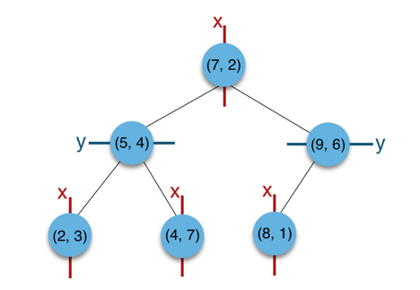
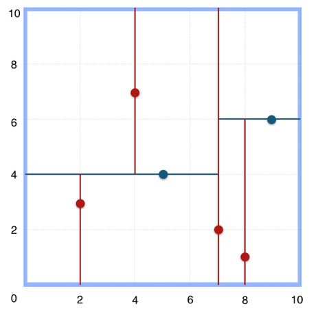
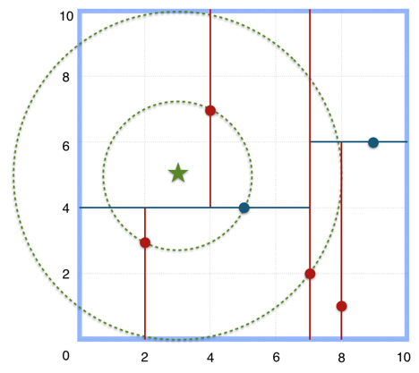
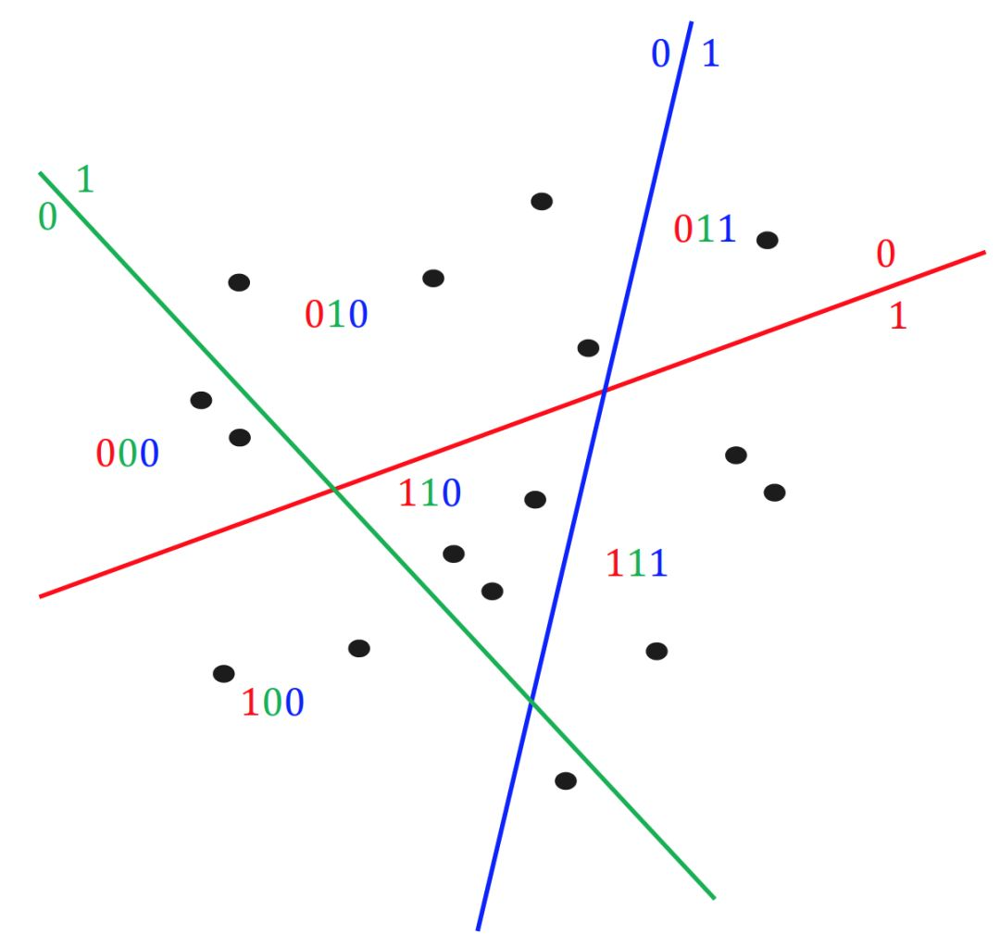
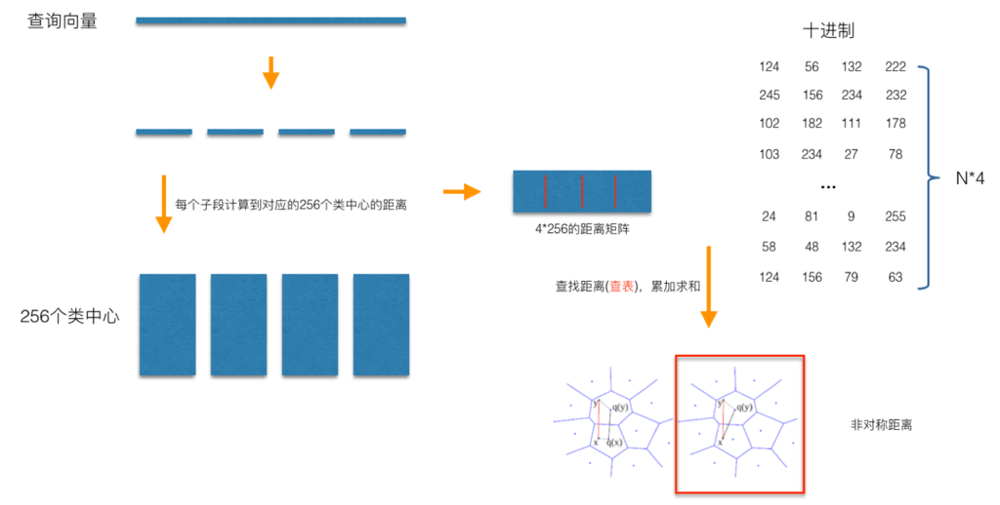
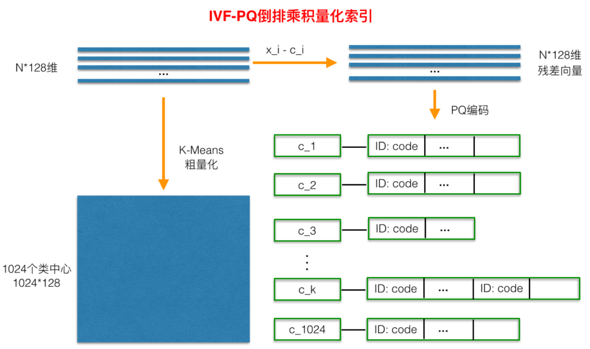

之前的文章[基于faiss的分布式特征向量搜索系统][1]介绍了我们是如何基于faiss来开发分布式的向量检索系统，[Elasticsearch——向量检索][2]介绍了`Elasticsearch`自带的向量检索功能（有诸多限制以及性能问题）。

这些文章基本都没有涉及底层的向量检索算法，本文我简单整理了当前常用的向量检索底层算法。

<!-- more -->

## 向量检索的基本概念

向量检索就是给定一个向量，从大数据量的向量库中找到与该向量最相似的K个向量。

如何判定两个向量的相似性？常用的有欧式距离以及余弦相似度。

欧式距离表示欧几里得空间中两点间的直线距离，值越小说明距离越近。其计算公式如下：

余弦相似度通过测量两个向量的夹角的余弦值来度量它们之间的相似性。0度角的余弦值为1，而其他任何角度的余弦值都不大于1；并且其最小值是-1。从而两个向量之间的角度的余弦值确定两个向量是否大致指向相同的方向。余弦相似度计算公式如下：

向量的检索算法分为两大类：一类是Brute Force算法，即暴力检索（对比向量库中的每一条向量）；另一类是ANN算法，意思是近似K近邻，性能更高，但是会损失一些召回率。

## Brute Force算法

`Brute Force`算法顾名思义就是暴力比对每一条向量的距离，`Elasticsearch`中提供的向量检索功能底层使用的就是`Brute Force`算法。

## ANN算法

Brute Force算法随着数据的增长，时间复杂度也是线性增长。由于向量检索通常会面临高维度向量、海量数据的场景，在这类场景中使用`Brute Force`算法响应时间会非常久。如果需要更快的响应时间，就必须损失一些召回率。

ANN的意思就是近似K近邻，不一定会召回全部的最近点，这是一种性能和功能的权衡。暴力检索的召回，是ANN算法召回率的上限，也就是说，不存在一种完美的向量索引方法，使得`top@1`的召回率能够达到暴力检索的召回率，只能不断地逼近。

`Brute Force`搜索的方式是在全空间进行搜索，为了加快查找的速度，几乎所有的ANN方法都是通过对全空间分割，将其分割成很多小的子空间，在搜索的时候，通过某种方式，快速锁定某一(几)个子空间，然后在该(几个)子空间里做遍历。可以看到，正是因为缩减了遍历的空间大小范围，从而使得ANN算法能够处理大规模数据的索引。

### KDTree算法

KDTree算法采用树这种数据结构的方法来表达对全空间的划分。下图是KD树对全空间的划分过程，以及用树这种数据结构来表达的一个过程。

KD树选择从哪一维度进行开始划分的标准，采用的是求每一个维度的方差，然后选择方差最大的那个维度开始划分。为何要选择方差作为维度划分选取的标准？我们知道，方差的大小可以反映数据的波动性。方差大表示数据波动性越大，选择方差最大作为划分空间标准的好处在于，可以使得所需的划分面数目最小，反映到树的数据结构上，可以使得我们构建的KD树的树深度尽可能小。

以二维平面点`(x,y)`的集合`(2,3),(5,4),(9,6),(4,7),(8,1),(7,2)`为例构建树：

- 构建根节点时，x维度上面的方差较大，如上点集合在x维从小到大排序为`(2,3)，(4,7)，(5,4)，(7,2)，(8,1)，(9,6)`，其中值为`(7,2)`。
- `(2,3)，(4,7)，(5,4)`挂在`(7,2)`节点的左子树，`(8,1)，(9,6)`挂在`(7,2)`节点的右子树。
- 构建`(7,2)`节点的左子树时，点集合`(2,3)，(4,7)，(5,4)`此时的切分维度为`y`，中值为`(5,4)`作为分割平面，`(2,3)`挂在其左子树，`(4,7)`挂在其右子树。
- 构建`(7,2)`节点的右子树时，点集合`(8,1)，(9,6)`此时的切分维度也为`y`，中值为`(9,6)`作为分割平面，`(8,1)`挂在其左子树。

上述的构建过程结合下图可以看出，构建一个KDTree即是将一个二维平面逐步划分的过程。

搜索`(3,5)`的最近邻：

- 首先从根节点`(7,2)`出发，将当前最近邻设为`(7,2)`，对该KDTree作深度优先遍历。以`(3,5)`为圆心，其到`(7,2)`的距离为半径画圆（多维空间为超球面），可以看出`(8,1)`右侧的区域与该圆不相交，所以`(8,1)`的右子树全部忽略。
- 接着走到`(7,2)`左子树根节点`(5,4)`，与原最近邻对比距离后，更新当前最近邻为`(5,4)`。以`(3,5)`为圆心，其到`(5,4)`的距离为半径画圆，发现`(7,2)`右侧的区域与该圆不相交，忽略改厕所有节点，这样`(7,2)`的整个右子树被标记为已忽略。
- 遍历完`(5,4)`的左右叶子节点，发现与当前最优距离相等，不更新最近邻。所以`(3,5)`的最近邻为`(5,4)`。

KDTree的查询复杂度为`O(kn^((k-1)/k))`，`k`表示维度，`n`表示数据量。说明`k`越大，复杂度越接近线性，所以它并不适合高维向量召回

### LSH算法

`Local Sensitive Hashing`，局部敏感哈希，我们可以把向量通过平面分割做hash。如下图所示，`0`表示点在平面的左侧，`1`表示点在平面的右侧，然后对向量进行多册hash，可以看到hash值相同的点都比较靠近，所以在hash之后，我们只需要计算hash值类似的向量，就能较准确地召回`topK`。

下面是一些需要重点理解的知识：

1. 局部敏感是啥意思？

当一个函数（或者更准确的说，哈希函数家族）具有如下属性的时候，我们说该哈希函数是局部敏感的：相似的样本点对比相远的样本点对更容易发生碰撞。

2. 用哈希为什么可以加速查找？

对于`Brute Force`搜索，需要遍历数据集中的所有点，而使用哈希，我们首先找到查询样本落入在哪个cell（即所谓的桶）中，如果空间的划分是在我们想要的相似性度量下进行分割的，则查询样本的最近邻将极有可能落在查询样本的cell中，如此我们只需要在当前的cell中遍历比较，而不用在所有的数据集中进行遍历。

3. 为什么要用多表哈希？

对于单表哈希，当哈希函数数目`K`取得太大，查询样本与其对应的最近邻落入同一个桶中的可能性会变得很微弱，针对这个问题，我们可以重复这个过程`L`次，从而增加最近邻的召回率。这个重复`L`次的过程，可以转化为构建`L`个哈希表，这样在给定查询样本时，我们可以找到`L`个哈希桶（每个表找到一个哈希桶），然后我们在这`L`个哈希表中进行遍历。这个过程相当于构建了`K*L`个哈希函数（注意是相当，不要做等价理解）。

4. 多表哈希中哈希函数数目`K`和哈希表数目`L`如何选取？

哈希函数数目`K`如果设置得过小，会导致每一个哈希桶中容纳了太多的数据点，从而增加了查询响应的时间；而当`K`设置得过大时，会使得落入每个哈希桶中的数据点变小，而为了增加召回率，我们需要增加`L`以便构建更多的哈希表，但是哈希表数目的增加会导致更多的内存消耗，并且也使得我们需要计算更多的哈希函数，同样会增加查询相应时间。通过选取合理的`K`和`L`，我们可以获得比线性扫描极大的性能提升。

### 乘积量化

乘积量化（`Product Quantization`，`PQ`）是一种非常经典实用的矢量量化索引方法，在工业界向量索引中已得到广泛的应用，并作为主要的向量索引方法，在`Faiss`中有非常高效的实现。乘积量化的核心思想是分段（划分子空间）和聚类，或者说具体应用到ANN近似最近邻搜索上，`KMeans`是`PQ`乘积量化子空间数目为1的特例。

矢量量化方法，即`Vector Quantization`，其具体定义为：将一个向量空间中的点用其中一个有限子集来进行编码的过程。

`PQ`乘积量化生成码本和量化的过程可以用如下图示来说明：

在训练阶段，针对N个训练样本，假设样本维度为128维，我们将其切分为4个子空间，则每一个子空间的维度为32维，然后我们在每一个子空间中，对子向量采用`KMeans`对其进行聚类（图中示意聚成256类），这样每一个子空间都能得到一个码本。这样训练样本的每个子段，都可以用子空间的聚类中心来近似，对应的编码即为类中心的ID。如图所示，通过这样一种编码方式，训练样本仅使用很短的一个编码得以表示，从而达到量化的目的。对于待编码的样本，将它进行相同的切分，然后在各个子空间里逐一找到距离它们最近的类中心，然后用类中心的id来表示它们，即完成了待编码样本的编码。

正如前面所说的，在矢量量化编码中，关键是码本的建立和码字的搜索算法，在上面，我们得到了建立的码本以及量化编码的方式。剩下的重点就是查询样本与dataset中的样本距离如何计算的问题了。

在查询阶段，`PQ`同样在计算查询样本与dataset中各个样本的距离，只不过这种距离的计算转化为间接近似的方法而获得。`PQ`乘积量化方法在计算距离的时候，有两种距离计算方式，一种是对称距离，另外一种是非对称距离。非对称距离的损失小（也就是更接近真实距离），实际中也经常采用这种距离计算方式。下面过程示意的是查询样本来到时，以非对称距离的方式（红框标识出来的部分）计算到dataset样本间的计算示意：

具体地，查询向量来到时，按训练样本生成码本的过程，将其同样分成相同的子段，然后在每个子空间中，计算子段到该子空间中所有聚类中心的距离，如图中所示，可以得到`4*256`个距离，这里为便于后面的理解说明，可以把这些算好的距离称作距离表。在计算库中某个样本到查询向量的距离时，比如编码为`(124,56,132,222)`这个样本到查询向量的距离时，我们分别到距离表中取各个子段对应的距离即可，比如编码为`124`这个子段，在第1个算出的256个距离里面把编号为`124`的那个距离取出来就可，所有子段对应的距离取出来后，将这些子段的距离求和相加，即得到该样本到查询样本间的非对称距离。所有距离算好后，排序后即得到我们最终想要的结果。

从上面这个过程可以很清楚地看出`PQ`乘积量化能够加速索引的原理：即将全样本的距离计算，转化为到子空间类中心的距离计算。比如上面所举的例子，原本`brute-force search`的方式计算距离的次数随样本数目N成线性增长，但是经过`PQ`编码后，对于耗时的距离计算，只要计算`4*256`次，几乎可以忽略此时间的消耗。另外，从上图也可以看出，对特征进行编码后，可以用一个相对比较短的编码来表示样本，自然对于内存的消耗要大大小于`brute-force search`的方式。

在某些特殊的场合，我们总是希望获得精确的距离，而不是近似的距离，并且我们总是喜欢获取向量间的余弦相似度（余弦相似度距离范围在`[-1,1]`之间，便于设置固定的阈值），针对这种场景，可以针对`PQ`乘积量化得到的前`top@K`做一个`brute-force search`的排序。

#### 倒排乘积量化

倒排乘积量化(`IVFPQ`)是`PQ`乘积量化的更进一步加速版。其加速的本质逃不开在最前面强调的加速原理：`brute-force`搜索的方式是在全空间进行搜索，为了加快查找的速度，几乎所有的ANN方法都是通过对全空间分割，将其分割成很多小的子空间，在搜索的时候，通过某种方式，快速锁定在某一（几）个子空间，然后在该（几个）子空间里做遍历。在上一小节可以看出，`PQ`乘积量化计算距离的时候，距离虽然已经预先算好了，但是对于每个样本到查询样本的距离，还是得老老实实挨个去求和相加计算距离。但是，实际上我们感兴趣的是那些跟查询样本相近的样本（姑且称这样的区域为感兴趣区域），也就是说老老实实挨个相加其实做了很多的无用功，如果能够通过某种手段快速将全局遍历锁定为感兴趣区域，则可以舍去不必要的全局计算以及排序。倒排PQ乘积量化的”倒排“，正是这样一种思想的体现，在具体实施手段上，采用的是通过聚类的方式实现感兴趣区域的快速定位，在倒排PQ乘积量化中，聚类可以说应用得淋漓尽致。

在`PQ`乘积量化之前，增加了一个粗量化过程。具体地，先对N个训练样本采用`KMeans`进行聚类，这里聚类的数目一般设置得不应过大，一般设置1024差不多，这种可以以比较快的速度完成聚类过程。得到聚类中心后，针对每一个样本`x_i`，找到其距离最近的类中心`c_i`后，两者相减得到样本`x_i`的残差向量(`x_i - c_i`)，后面剩下的过程，就是针对(`x_i - c_i`)的`PQ`乘积量化过程，此过程不再赘述。

在查询的时候，通过相同的粗量化，可以快速定位到查询向量属于哪个`c_i`（即在哪一个感兴趣区域），然后在该感兴趣区域按上面所述的`PQ`乘积量化距离计算方式计算距离。

### HNSW

图索引量化是一种将图引入向量索引的方法。从检索的召回率来评估，基于图的索引方法要优于目前其他一些主流ANN搜索方法，比如乘积量化方法、哈希方法等。虽然乘积量化方法的召回率不如`HNSW`，但由于乘积量化方法具备内存耗用更小、数据动态增删更灵活等特性，使得在工业检索系统中，在对召回率要求不是特别高的场景下，乘积量化方法在工业界，仍然是使用得较多的一种索引方法。

基于图索引的ANN方法由于数据在插入索引的时候，需要计算（部分）数据间的近邻关系，因而需要实时获取到到数据的原始特征，几乎所有基于图ANN的方法在处理该问题的时候，都是直接将原始特征加载在内存（索引）里，从而造成对内存使用过大。

`Hierarchical Navigable Small World Graphs`(`HNSW`)是一种基于图索引的方法。通过采用层状结构，将边按特征半径进行分层，使每个顶点在所有层中平均度数变为常数，从而将NSW的计算复杂度由多重对数(Polylogarithmic)复杂度降到了对数(logarithmic)复杂度。

[1]: /articles/Java/基于faiss的分布式特征向量搜索系统.html
[2]: /articles/ElasticSearch/Elasticsearch——向量检索.html

> https://mp.weixin.qq.com/s?__biz=MzUzMzU5Mjc1Nw==&mid=2247485678&idx=1&sn=6d79c6a7b3eea2dac4e8d2e93f9abd16&chksm=faa0e734cdd76e22d574acd3e7178eb3a9bf0b2fa0b7e7871b527abdad6176cb2b93f581f972&scene=27#wechat_redirect
> https://blog.csdn.net/richard9006/article/details/90058465
> https://zh.wikipedia.org/wiki/欧几里得距离
> https://zh.wikipedia.org/wiki/余弦相似性
> https://yongyuan.name/blog/vector-ann-search.html
> https://yongyuan.name/blog/ann-search.html
> https://yongyuan.name/blog/cbir-technique-summary.html
> https://yongyuan.name/blog/index-billion-deep-descriptors.html
> https://yongyuan.name/blog/opq-and-hnsw.html
> https://elasticsearch.cn/uploads/slides/20191210/78fb9e9c515dcd008f8e80c928c1cf32.pdf
> 