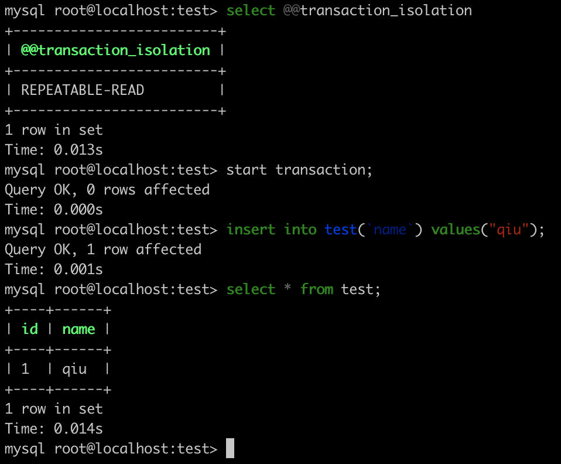
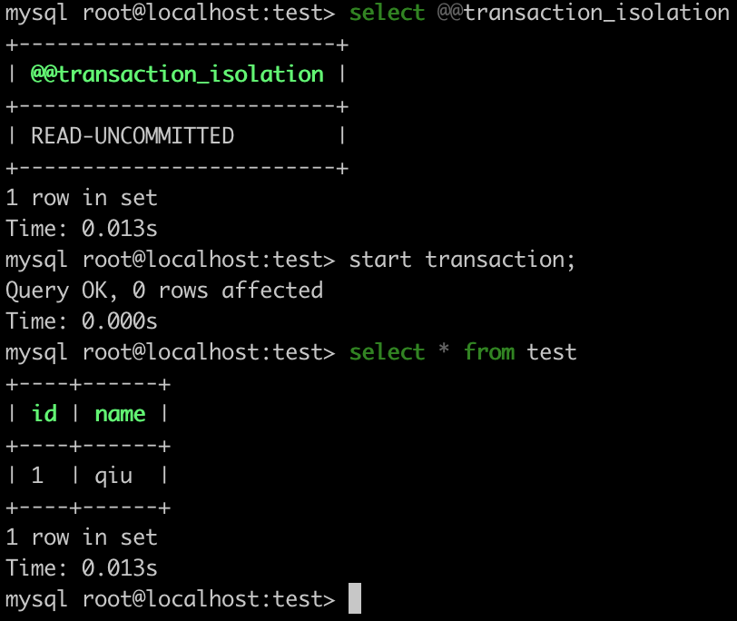
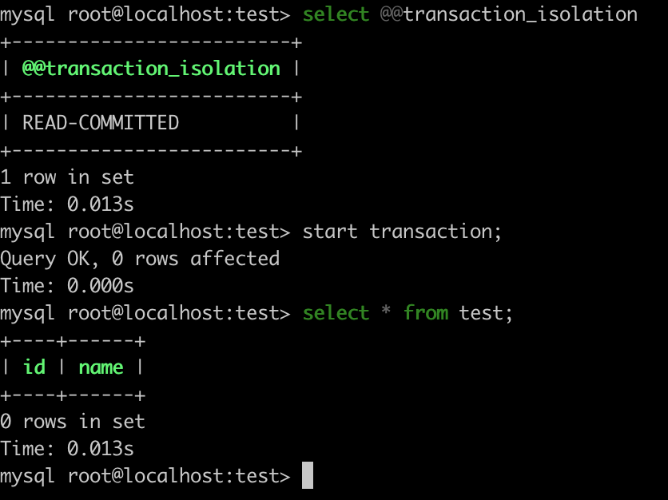
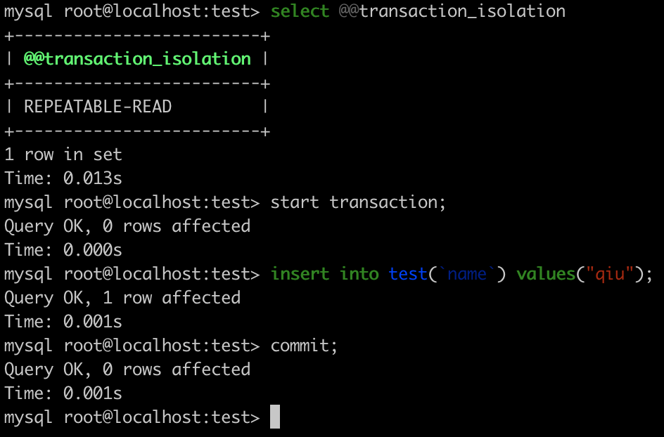
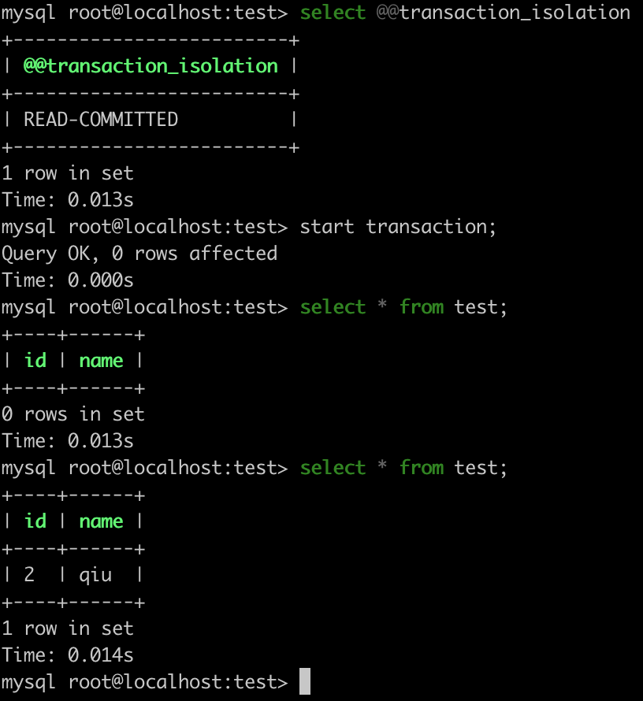

## Mysql隔离级别查看

查看会话隔离级别

```
select @@transaction_isolation
select @@session.transaction_isolation
```

查看系统隔离级别

```
select @@global.transaction_isolation
```

## Mysql隔离级别修改

Mysql默认的隔离级别是可重复读（repeatable read）。

可以在`my.inf`文件中修改默认的隔离级别：

```
transaction-isolation = {READ-UNCOMMITTED | READ-COMMITTED | REPEATABLE-READ | SERIALIZABLE}
```

也可以使用`SET TRANSACTION`语句改变单个会话或者所有新连接的隔离级别，语法如下：

```
SET [SESSION | GLOBAL] TRANSACTION ISOLATION LEVEL {READ UNCOMMITTED | READ COMMITTED | REPEATABLE READ | SERIALIZABLE}
```

## 四种隔离级别


|隔离级别|脏读|不可重复读|幻读|
|---|---|---|---|
|读未提交（read uncommitted）|可能|可能|可能|
|读已提交（read committed）|不可能|可能|可能|
|可重复读（repeatable read）|不可能|不可能|可能|
|可串行化（serializable）|不可能|不可能|不可能|

## 示例

新建一个表：

```
CREATE TABLE `test` (
  `id` bigint unsigned NOT NULL AUTO_INCREMENT COMMENT 'id',
  `name` varchar(50) NOT NULL DEFAULT '' COMMENT '名字',
  PRIMARY KEY (`id`)
) ENGINE=InnoDB DEFAULT CHARSET=utf8mb4 COMMENT='测试';
```

### read uncommitted级别出现脏读

当一个事务修改了数据且未提交，另一个事务可以读到这个未被提交的数据。

事务1：



事务2：



可以看到，事务2能够读到事务1未提交的数据。

### read committed级别出现不可重复读

在同一个事务内，多次读取同一个数据，此时事务还没有完成。另一个事务在前一个事务两次读取之间修改了数据并提交，导致前一个事务读到的数据不一样，因此称为不可重复读。

事务1（事务内第一次读）



事务2



事务1（事务内第二次读）



可以看到，由于事务2修改了数据，导致事务1两次读到的数据不一致。

### repeatable read级别的可重复读

事务1（事务内第一次读）


事务2


事务1（事务内第二次读）


可以看到，尽管事务2插入了新的数据，但是在事务1中两次读到的数据是一致的。

### repeatable read级别出现的幻读

幻读现象1：

```
session1:                                                   session2:
mysql> select @@global.tx_isolation, @@tx_isolation;
+-----------------------+-----------------+
| @@global.tx_isolation | @@tx_isolation  |
+-----------------------+-----------------+
| REPEATABLE-READ       | REPEATABLE-READ |
+-----------------------+-----------------+
1 row in set, 2 warnings (0.00 sec)
                                                            mysql> start transaction;     
                                                            Query OK, 0 rows affected (0.00 sec)

mysql> start transaction;                             
Query OK, 0 rows affected (0.00 sec)

mysql> select * from test;
Empty set (0.00 sec)

                                                            mysql> insert into test (`id`, `name`) values (1, "hi~~~");
                                                            Query OK, 1 row affected (0.00 sec)

mysql> select * from test;
Empty set (0.00 sec)

                                                            mysql> commit;
                                                            Query OK, 0 rows affected (0.01 sec)

mysql> select * from test;
Empty set (0.00 sec)

mysql> insert into test (`id`, `name`) values (1, "hello");
ERROR 1062 (23000): Duplicate entry '1' for key 'PRIMARY'
//what fuck ？？？刚刚查询，告诉我没有数据。等我插入的时候就告诉我主键冲突了。此乃幻读现象
```

幻读现象2：

```
session1：                               session2：
mysql> start transaction;
Query OK, 0 rows affected (0.01 sec)

                                       mysql> start transaction;
                                       Query OK, 0 rows affected (0.01 sec)

mysql> select * from test;
+----+-------+
| id | name  |
+----+-------+
|  1 | hi~~~ |
+----+-------+
1 row in set (0.00 sec)

                                      mysql> insert into test (`id`, `name`) values (2, "hello~~");
                                      Query OK, 1 row affected (0.01 sec)

mysql> select * from test;
+----+-------+
| id | name  |
+----+-------+
|  1 | hi~~~ |
+----+-------+
1 row in set (0.04 sec)

                                      mysql> commit;
                                      Query OK, 0 rows affected (0.00 sec)

mysql> select * from test;
+----+-------+
| id | name  |
+----+-------+
|  1 | hi~~~ |
+----+-------+
1 row in set (0.00 sec)

mysql> update test set name = "up";
Query OK, 2 rows affected (0.01 sec)
Rows matched: 2  Changed: 2  Warnings: 0
//what fuck ？？？刚出查询不是只有一条数据吗？怎么更新了两条。此乃幻读现象

mysql> select * from test;
+----+------+
| id | name |
+----+------+
|  1 | up   |
|  2 | up   |
+----+------+
2 rows in set (0.00 sec)
```

### 加锁

通过加锁来防止幻读

```
session1：                                               session2:

mysql> start transaction;
Query OK, 0 rows affected (0.00 sec)

                                                        mysql> start transaction;
                                                        Query OK, 0 rows affected (0.00 sec)

//加锁锁住了 id <= 1 的范围
mysql> select * from test where id <= 1 for update;
+----+------+
| id | name |
+----+------+
|  1 | up   |
+----+------+
1 row in set (0.18 sec)
                                                        //id 不在锁内，允许插入
                                                        mysql> insert into test (`id`, `name`) values (3, "lock");
                                                        Query OK, 1 row affected (0.15 sec)

mysql> select * from test;
+----+------+
| id | name |
+----+------+
|  1 | up   |
|  2 | up   |
+----+------+
2 rows in set (0.01 sec)
                                                        //id = 1 已经加了写锁，事务等待锁释放
                                                        mysql> insert into test(`id`, `name`) values (1, "lock");
                                                        ERROR 1205 (HY000): Lock wait timeout exceeded; try restarting transaction

mysql> select * from test;
+----+------+
| id | name |
+----+------+
|  1 | up   |
|  2 | up   |
+----+------+
2 rows in set (0.00 sec)

                                                        mysql> commit;
                                                        Query OK, 0 rows affected (0.00 sec)

mysql> select * from test;
+----+------+
| id | name |
+----+------+
|  1 | up   |
|  2 | up   |
+----+------+
2 rows in set (0.00 sec)

mysql> commit;
Query OK, 0 rows affected (0.00 sec)

mysql> select * from test;
+----+------+
| id | name |
+----+------+
|  1 | up   |
|  2 | up   |
|  3 | lock |  ------------session2 插入的数据
+----+------+
4 rows in set (0.00 sec)
```

通过加锁读来获得其他事务提交的结果

```
session1：                               session2:
mysql> start transaction;
Query OK, 0 rows affected (0.00 sec)

                                        mysql> start transaction;
                                        Query OK, 0 rows affected (0.00 sec)

mysql> select * from test;
+----+------+
| id | name |
+----+------+
|  1 | up   |
+----+------+
4 rows in set (0.01 sec)

                                        mysql> insert into test (`id`, `name`) values (7, "hello");
                                        Query OK, 1 row affected (0.00 sec)

                                        mysql> commit;
                                        Query OK, 0 rows affected (0.08 sec)


mysql> select * from test;
+----+------+
| id | name |
+----+------+
|  1 | up   |
+----+------+
4 rows in set (0.00 sec)

mysql> select * from test;
+----+------+
| id | name |
+----+------+
|  1 | up   |
+----+------+
4 rows in set (0.00 sec)

//读到了 session2 提交的数据
mysql> select * from test lock in share mode;
+----+-------+
| id | name  |
+----+-------+
|  1 | up    |
|  7 | hello |
+----+-------+
5 rows in set (0.00 sec)

//读到了 session2 提交的数据
mysql> select * from test for update;
+----+-------+
| id | name  |
+----+-------+
|  1 | up    |
|  7 | hello |
+----+-------+
5 rows in set (0.00 sec)

//读不到 session2 提交的数据
mysql> select * from test;
+----+------+
| id | name |
+----+------+
|  1 | up   |
+----+------+
4 rows in set (0.00 sec)
```


> https://juejin.im/post/5c88d74af265da2d8d6a1c58