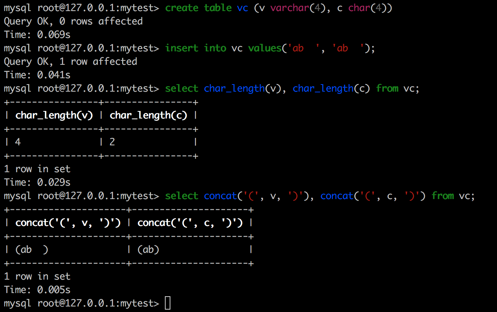

今天在回顾mysql数据类型的时候关注了一下两个常用类型char和varchar。发现网上的博客绝大多数要么一知半解要么干脆是错误的，这里我根据mysql的官方文档来整理一下char有varchar的比较。

char和varchar类型是非常相似的，区别在于存取的方式、最大长度、末尾空格的处理这三个方面。
<!-- more -->
## 存取方式

- char类型是固定长度的。比如在char(30)中放入3个字符，它实际占用的空间仍然是30个字符(实际占用的字节数根据字符集的不同而不同。如果是latin1，每个字符占用1个字节，一共是30个字节；如果是utf-8，每个字符最大占用3个字节，一共是90个字节)。
- varchar类型是可变长度的，它在真实数据的前面添加额外的1个或者2个字节，表示真实数据的字节数。如果数据不大于255个字节则额外的数据为1个字节，如果大于255个字节则需要2个额外字节。比如在varchar(30)中放入3个字符，它实际占用的空间为1字节+3字符(实际占用的字节数根据字符集的不同而不同。如果是latin1，每个字符占用1个字节，一共是4个字节；如果是utf-8，每个字符最大占用3个字节，一共是10个字节)。

## 最大长度

- char的最大长度为255个字符。char的最大长度受到最大行大小的限制(65535字节)。如果整个行没有达到65535的限制，则char的长度可以定义为255，它实际占用的字节数根据字符集的不同而不同。如果是latin1，每个字符占用1个字节，一共是255个字节；如果是utf-8，每个字符最大占用3个字节，一共是`255 * 3 = 765`个字节。
- varchar的最大长度为65535个字符。varchar的最大长度受到最大行大小的限制(65535字节)。因此varchar可以定义的最大长度受字符集的影响很大。如果是latin1，每个字符占用1个字节，则最大可定义的长度为65533，因为需要额外2个字节表示真实字节数。如果是utf-8，每个字符占用3个字节，则最大可定义的长度为21844，这样最大占用的字节数为`21844 * 3 + 2 = 65534`。

## 末尾空格的处理

### 存取

- char类型存储的时候会忽略掉末尾的空格。这是因为当char保存的字符数不足其最大字符数时，在字符串的末尾填充空格以达到char的长度，因此它获取字符串的时候会截掉最后的空格。
- varchar类型存储的时候会保留末尾的空格。

### 比较

char与varchar类型一样，进行字符串比较时会忽略末尾的空格。但是`like`不属于比较操作。

## 严格和非严格模式下char和varchar的比较

- 如果在char和varchar中插入超出列最大长度的字符串（超出最大长度的范围全是空格）。不管在哪种模式，varchar会截断空格然后产生一个warning；char会截断空格，没有任何warning。
- 在char和varchar中插入超出列最大长度的字符串（超出最大长度的范围中不全是空格）。如果是严格模式，char和varchar都会产生一个error而不是warning。如果是非严格模式，char和varchar都会截断字符串然后产生一个warning

**在InnoDB中，如果固定长度的字段大于等于768字节，会将它转变成可变长度的字段，将其存储在off-page中。如果字符集字符的最大大小大于3个字节比如utf8mb4，char(255)就会超过768字节**

> https://dev.mysql.com/doc/refman/5.7/en/char.html

