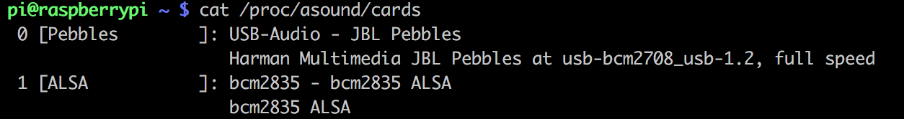

家里有个JBL Pebbles音箱，原本是给家里的台式机用的，不过随着台式机的使用频率越来越低，音箱也处于常年闲置的状态。

这几天重新折腾树莓派，想着将音箱用到树莓派中，打造一个支持airplay的无线音箱。
<!-- more -->
## 确保音箱正常工作

1. 将USB音箱插入树莓派
2. 查看音箱是否被识别

```
cat /proc/asound/cards
```

3. 切换声卡

修改`/etc/modprobe.d/alsa-base.conf`文件

将`options snd-usb-audio index=-2`注释

4. 重启树莓派
5. 查看声卡是否切换成功

```
cat /proc/asound/cards
```



可以看到声卡切换成功

## 安装airplay支持软件Shairport

在安装Shairport之前，修改`/usr/share/alsa/alsa.conf`文件

将

```
pcm.front cards.pcm.front
```

修改为

```
pcm.front cards.pcm.default
```

Shairplay是一个可以把树莓派变成Airplay接收器的软件。它会模拟一个Airplay终端，这样你就可以选择它作为iTune、iPad或iPhone的音频输出。

### 依赖模块

首先安装一系列依赖模块：

```
sudo apt-get install libao-dev libssl-dev git avahi-utils libwww-perl
sudo apt-get install libcrypt-openssl-rsa-perl libio-socket-inet6-perl libmodule-build-perl
```

### 编译shairport

从github中获取最新的shairplay版本并编译安装

```
git clone https://github.com/abrasive/shairport.git
cd shairport
make
```

### 测试airplay功能是否生效

输入`./shairport -a RaspberryPi`。

这时打开iPhone，从底部向上滑动，点击音乐，除了iPhone就可以看到一个raspberrypi的设备，点击就可以播放手机上的音乐。

### 安装shairport

输入`sudo make install`安装shairport

执行

```
sudo cp ./scripts/debian/init.d/shairport /etc/init.d/shairport
sudo cp ./scripts/debian/default/shairport /etc/default/shairport

sudo chmod +x /etc/init.d/shairport
sudo chmod +x /etc/default/shairport
```

安装shairport启动脚本


