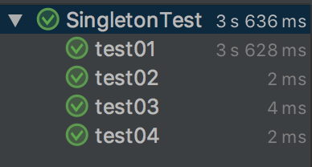

单例模式是用来保证这个类在运行期间只会被创建一个类实例。

另外，单例模式还提供了一个全局唯一访问这个类实例的访问点，就是`getInstance`方法。

对于单例模式而言，不管采用何种实现方式，它都是只关心类实例的创建问题，并不关心具体的业务功能。

<!--more-->

# 单例模式实现方式

## 懒汉式

```java
public class Singleton {
    // 4：定义一个变量来存储创建好的类实例
    // 5：因为这个变量要在静态方法中使用，所以需要加上static修饰
    private volatile static Singleton uniqueInstance = null;
    // 1：私有化构造方法，好在内部控制创建实例的数目
    private Singleton() {}
    
    // 2：定义一个方法来为客户端提供类实例
    // 3：这个方法需要定义成类方法，也就是要加static
    public static Singleton getInstance() {
        // 双重检查加锁
        // 6：判断存储实例的变量是否有值
        if (uniqueInstance == null) {
            synchronized(Singleton.class) {
                if (uniqueInstance == null) {
                    // 6.1：如果没有，就创建一个类实例，并把值赋给存储类实例的变量
                    uniqueInstance = new Singleton();
                }
            }
        }
        // 6.2：如果有值，那就直接使用
        return uniqueInstance;
    }
}
```

所谓双重检查加锁机制，指的是：并不是每次进入`getInstance`方法都需要同步，而是先不同步，进入方法过后先检查实例是否存在，如果不存在才进入下面的同步块，这是第一重检查。进入同步块过后，再次检查实例是否存在，如果不存在，就在同步的情况下创建一个实例，这是第二重检查。这样一来，就只需要同步一次了，从而减少了多次在同步情况下进行判断所浪费的时间。

双重检查加锁机制的实现会使用一个关键字`volatile`，它的意思是：被`volatile`修饰的变量的值，将不会被本地线程缓存，所有对该变量的读写都是直接操作共享内存，从而确保多个线程能正确的处理该变量。

这种实现方式既可以实现线程安全地创建实例，而又不会对性能造成太大的影响。它只是在第一次创建实例的时候同步，以后就不需要同步了，从而加快了运行速度。

由于`volatile`关键字可能会屏蔽掉虚拟机中一些必要的代码优化，所以运行效率并不是很高。因此一般建议，没有特别的需要，不要使用。也就是说，虽然可以使用“双重检查加锁”机制来实现线程安全的单例，但并不建议大量采用，可以根据情况来选用。

## 饿汉式

```java
public class Singleton {
    /**
     * static变量在类装载的时候进行初始化
     * 多个实例的static变量会共享同一块内存区域
     */
    // 4：定义一个静态变量来存储创建好的类实例，直接在这里创建类实例，只能创建一次
    private static Singleton uniqueInstance = new Singleton();
    // 1：私有化构造方法，可以再内部控制创建实例的数目
    private Singleton() {}
    // 2：定义一个方法来为客户端提供类实例
    // 3：这个方法需要定义成类方法，也就是要加static
    public static Singleton getInstance() {
        // 5：直接使用已经创建好的实例
        return uniqueInstance;
    }
}
```

饿汉式是典型的空间换时间，当类装载的时候就会创建类实例，不管你用不用，先创建出现，然后每次调用的时候，就不需要再判断了，节省了运行时间。

饿汉式是线程安全的，因为虚拟机保证只会装载一次，在装载类的时候是不会发生并发的。

## 类级内部类方式

类级内部类：

- 简单点说，类级内部类指的是，有static修饰的成员式内部类。如果没有static修饰的成员式内部类被称为对象级内部类。
- 类级内部类相当于其外部类的static成分，它的对象与外部类对象间不存在依赖关系，因此可直接创建。而对象级内部类的实例，是绑定在外部对象实例中的。
- 类级内部类中，可以定义静态的方法。在静态方法中只能够引用外部类中的静态成员方法或者成员变量。
- 类级内部类相当于其外部类的成员，只有在第一次被使用的时候才会被装载

某些情况中，JVM已经隐含地执行了同步，这些情况下不用再进行同步控制，包括：

- 由静态初始化器(在静态字段上或static{}块中的初始化器)初始化数据时
- 访问final字段时
- 在创建线程之前创建对象时
- 线程可以看见它将要处理的对象时

```java
public class Singleton {
    /**
     * 类级的内部类，也就是静态的成员式内部类，该内部类的实例与外部类的实例没有绑定关系，而且只有被调用到时才会装载，从而实现了延迟加载
     */
    private static class SingletonHolder {
        /**
         * 静态初始化器，由JVM来保证线程安全
         */
        private static Singleton instance = new Singleton();
    }
    /**
     * 私有化构造方法
     */
    private Singleton() {}
    
    public static Singleton getInstance() {
        return SingletonHolder.instance;
    }
}
```

当getInstance方法第一次被调用的时候，它第一次读取SingletonHolder.instance，导致SingletonHolder类得到初始化；而这个类在装载并被初始化的时候，会初始化它的静态域，从而创建Singleton的实例，由于是静态的域，因此只会在虚拟机装载类的时候初始化一次，并由虚拟机来保证它的线程安全性。

这个模式的优势在于，getInstance方法并没有被同步，并且只是执行一个域的访问，因此延迟初始化并没有增加任何访问成本。

## 枚举模式

单元素的枚举类型已经成为实现Singleton的最佳方法。

- Java的枚举类型实质上是功能齐全的类，因此可以有自己的属性和方法
- Java枚举类型的基本思想是通过公有的静态final域为每个枚举常量导出实例的类
- 从某个角度讲，枚举是单例的泛型化，本质上是单元素的枚举

```java
public enum Singleton {
    /**
     * 定义一个枚举的元素，它就代表了Singleton的一个实例
     */
    uniqueInstance;
    
    /**
     * 示意方法，单例可以有自己的操作
     */
    public void singletonOperation() {
        // 功能处理
    }
}
```

使用枚举来实现单实例控制会更加简洁，而且无偿地提供了序列化的机制，并由JVM从根本上提供保障，绝对防止多次实例化，是更简洁、高效、安全的实现单例的方式。

# 四种单例实现方式的性能比较

前面在介绍懒汉式单例实现方式的时候，说过因为`volatile`关键字的引入，双重检查加锁机制的性能不高。

现在我们来比较一下这四种单例实现方式的性能。

测试代码如下：

```java
public class SingletonTest {
    @Test
    public void test01() {
        for (int i = 0; i < 100000; i++) {
            for (int j = 0; j < 100000; j++) {
                Singleton1 singleton1 = Singleton1.getInstance();
            }
        }
    }

    @Test
    public void test02() {
        for (int i = 0; i < 100000; i++) {
            for (int j = 0; j < 100000; j++) {
                Singleton2 singleton2 = Singleton2.getInstance();
            }
        }
    }

    @Test
    public void test03() {
        for (int i = 0; i < 100000; i++) {
            for (int j = 0; j < 100000; j++) {
                Singleton3 singleton3 = Singleton3.getInstance();
            }
        }
    }

    @Test
    public void test04() {
        for (int i = 0; i < 100000; i++) {
            for (int j = 0; j < 100000; j++) {
                Singleton4 singleton4 = Singleton4.uniqueInstance;
            }
        }
    }
}
```

其中`Singleton1`、`Singleton2`、`Singleton3`、`Singleton4`分别对应懒汉式、饿汉式、类级内部类、枚举模式。

执行的时间如下：



可以看到懒汉式的性能相对来说差很多，另外三个实现方式的性能相差不大。不过也应该看到，这种性能的差异是相对的，正常使用过程中，应该影响不大。


> 研磨设计模式


